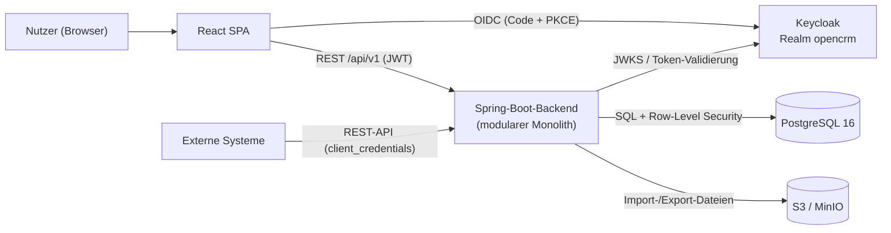

# OpenCRM

**Mandantenfähiges CRM-System für den Vertrieb — Konzept & Architektur**

| | |
|---|---|
| Status | In Umsetzung — M1–M3-Funktionsumfang implementiert (siehe [Roadmap](docs/12-roadmap.md)) |
| Stand | 2026-07-16 |
| Verantwortlich | Lead Architecture |

## Was ist OpenCRM?

OpenCRM ist ein mandantenfähiges CRM-System, mit dem Vertriebsorganisationen Leads erfassen, qualifizieren und gezielt einzelnen Verkäufern zuweisen, Verkaufschancen über konfigurierbare Pipelines bis zum Abschluss führen und die Performance ihrer Verkäufer über ein Dashboard auswerten. Mehrere Kunden-Organisationen (Mandanten) teilen sich eine Plattform bei strikter Datentrennung.

Dieses Repository enthält aktuell das vollständige **Konzept- und Architekturpaket**. Die Implementierung folgt gemäß [Roadmap](docs/12-roadmap.md).

## Kernanforderungen

1. **PostgreSQL** als zentrale Datenbank im Backend
2. **Multimandantenfähigkeit** — strikte Trennung mehrerer Kunden-Organisationen auf einer Plattform
3. **Produktkatalog** — Unterstützung verschiedener zu verkaufender Produkte inkl. Preislisten
4. **Keycloak** als Authentifizierungs- und Identitätsdienst
5. **Import & Export** — CSV/XLSX-Import, CSV/XLSX/JSON-Export, REST-API, DSGVO-Datenauskunft
6. **Dashboard** — Auswertung der Verkäufer-Performance (Umsatz, Win-Rate, Pipeline, Reaktionszeiten u. a.)
7. **Lead-Zuweisung** — manuell, per Round-Robin oder regelbasiert an unterschiedliche Verkäufer

## Architektur auf einen Blick

- **Architekturstil:** Modularer Monolith (Spring-Modulith-Schnitt) — bewusst kein Microservices-Zuschnitt in Phase 1 ([ADR-004](docs/adr/ADR-004-modularer-monolith-spring-boot.md))
- **Backend:** Java 21, Spring Boot 3.3 (Web, Security/OAuth2 Resource Server, Data JPA, Flyway, Spring Batch)
- **Datenbank:** PostgreSQL 16; Mandantentrennung über Shared Schema mit `tenant_id` + **Row-Level Security** ([ADR-002](docs/adr/ADR-002-multi-tenancy-shared-schema-rls.md))
- **Authentifizierung:** Keycloak 26, ein Realm `opencrm` mit **Organizations** je Mandant, OIDC/PKCE, JWT mit `tenant_id`-Claim ([ADR-003](docs/adr/ADR-003-keycloak-single-realm-organizations.md))
- **Frontend:** React 18 + TypeScript SPA (Vite, TanStack Query, Recharts)
- **API:** REST/JSON unter `/api/v1`, OpenAPI 3.1, RFC-9457-Fehlerformat
- **Asynchrone Jobs:** Spring Batch + PostgreSQL-Job-Tabellen für Import/Export und Dashboard-Refresh (kein Message-Broker in Phase 1, [ADR-006](docs/adr/ADR-006-import-export-mit-spring-batch.md))
- **Deployment:** Docker Compose (Entwicklung), Kubernetes + Helm (Produktion), CI/CD über GitHub Actions

## Dokumentation

| Nr. | Dokument | Inhalt |
|-----|----------|--------|
| 01 | [Vision und Anforderungen](docs/01-vision-und-anforderungen.md) | Zielbild, Personas, funktionale & nicht-funktionale Anforderungen, Glossar |
| 02 | [Systemarchitektur](docs/02-systemarchitektur.md) | Kontext- & Containerdiagramm, Modulschnitt, Tech-Stack, zentrale Abläufe |
| 03 | [Datenmodell](docs/03-datenmodell.md) | ER-Modell, Tabellenkatalog, Indizes, Beispiel-DDL inkl. RLS |
| 04 | [Multi-Tenancy-Konzept](docs/04-multi-tenancy.md) | Isolationsstrategie, RLS im Detail, Tenant-Lifecycle, Quotas, Isolationstests |
| 05 | [Authentifizierung mit Keycloak](docs/05-authentifizierung-keycloak.md) | Realm-Design, Clients, Rollen, Token, Login-Flows, JIT-Provisionierung |
| 06 | [Lead-Management und Zuweisung](docs/06-lead-management.md) | Lead-Lifecycle, manuelle / Round-Robin- / regelbasierte Zuweisung, SLA, Konvertierung |
| 07 | [Produkte und Vertriebsprozess](docs/07-produkte-und-vertriebsprozess.md) | Produktkatalog, Preisfindung, Pipelines, Opportunities, Forecast |
| 08 | [Import und Export](docs/08-import-export.md) | CSV/XLSX-Import mit Mapping & Validierung, Duplikatstrategien, Exporte, DSGVO |
| 09 | [Dashboard und Reporting](docs/09-dashboard-und-reporting.md) | KPI-Katalog, Widgets, Sichtbarkeitsregeln, materialisierte Sichten |
| 10 | [API-Design](docs/10-api-design.md) | Konventionen, Fehlerformat, Endpunkt-Katalog, OpenAPI-Auszug |
| 11 | [Deployment und Betrieb](docs/11-deployment-und-betrieb.md) | Umgebungen, Docker Compose, Kubernetes, CI/CD, Backup/DR, Monitoring, DSGVO |
| 12 | [Roadmap](docs/12-roadmap.md) | Meilensteine M1–M3, Abhängigkeiten, Risiken, Ausbaustufen |
| 13 | [Entscheidungsprotokoll](docs/13-entscheidungen.md) | Auflösung aller offenen Punkte: Produkt- und Architekturentscheidungen (E-01 ff.) |

### Architekturentscheidungen (ADRs)

Alle wesentlichen Entscheidungen sind als Architecture Decision Records dokumentiert: [docs/adr/](docs/adr/README.md)

| ADR | Entscheidung |
|-----|--------------|
| [ADR-001](docs/adr/ADR-001-postgresql-als-datenbank.md) | PostgreSQL als zentrale Datenbank |
| [ADR-002](docs/adr/ADR-002-multi-tenancy-shared-schema-rls.md) | Multi-Tenancy über Shared Schema + Row-Level Security |
| [ADR-003](docs/adr/ADR-003-keycloak-single-realm-organizations.md) | Keycloak: ein Realm mit Organizations je Mandant |
| [ADR-004](docs/adr/ADR-004-modularer-monolith-spring-boot.md) | Modularer Monolith mit Spring Boot / Java 21 |
| [ADR-005](docs/adr/ADR-005-rest-api-mit-openapi.md) | REST-API mit OpenAPI 3.1 |
| [ADR-006](docs/adr/ADR-006-import-export-mit-spring-batch.md) | Import/Export mit Spring Batch + PostgreSQL-Job-Tabellen |
| [ADR-007](docs/adr/ADR-007-frontend-react-spa.md) | Frontend als React-SPA |

## Repository-Struktur

| Verzeichnis | Inhalt |
|---|---|
| [`backend/`](backend/README.md) | Spring-Boot-Backend (modularer Monolith, Java 21) — inkl. Flyway-Migrationen und RLS-Isolationstests |
| [`infra/`](infra/docker-compose.yml) | Lokale Dev-Umgebung (PostgreSQL, Keycloak mit Realm-Import, MinIO) |
| `frontend/` | React-SPA (folgt als nächstes Inkrement in M1) |
| [`docs/`](docs/) | Konzept- und Architekturdokumentation, ADRs, Entscheidungsprotokoll |

Schnellstart für Entwickler: siehe [backend/README.md](backend/README.md).

## Leseempfehlung

- **Für den schnellen Überblick:** [01 Vision und Anforderungen](docs/01-vision-und-anforderungen.md) → [02 Systemarchitektur](docs/02-systemarchitektur.md) → [12 Roadmap](docs/12-roadmap.md)
- **Für das Umsetzungsteam:** zusätzlich 03–11 in Reihenfolge; die ADRs erklären das *Warum* hinter den Festlegungen.
