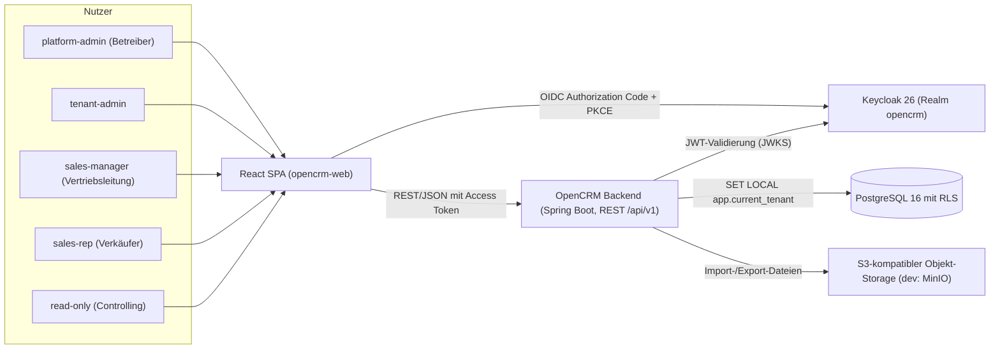

# Vision und Anforderungen

| Status | Stand | Verantwortlich |
|---|---|---|
| Entwurf | 2026-07-16 | Lead Architecture |

## Zweck

Dieses Dokument beschreibt das Zielbild von OpenCRM, die relevanten Personas sowie die funktionalen und nicht-funktionalen Anforderungen der ersten Ausbaustufe. Es bildet die fachliche Grundlage für alle weiteren Architektur- und Konzeptdokumente und stellt die Rückverfolgbarkeit zu den sieben verbindlichen Auftraggeber-Anforderungen her. Abgrenzung und Glossar schaffen ein gemeinsames Begriffsverständnis für Umsetzungsteam und Stakeholder.

## Inhaltsverzeichnis

1. [Produktvision](#1-produktvision)
2. [Auftraggeber-Anforderungen und Abdeckung](#2-auftraggeber-anforderungen-und-abdeckung)
3. [Personas](#3-personas)
4. [Funktionale Anforderungen](#4-funktionale-anforderungen)
5. [Nicht-funktionale Anforderungen](#5-nicht-funktionale-anforderungen)
6. [Abgrenzung / Out-of-Scope](#6-abgrenzung--out-of-scope)
7. [Glossar](#7-glossar)
8. [Offene Punkte](#8-offene-punkte)

## 1. Produktvision

OpenCRM ist ein mandantenfähiges CRM-System für den Vertrieb, betrieben von der JULITH GmbH als Plattform für mehrere Kunden-Organisationen. Jede Kunden-Organisation (Tenant) arbeitet strikt getrennt auf einer gemeinsamen Installation: eigener Produktkatalog, eigene Leads, Accounts, Kontakte, Verkaufschancen und Pipelines.

Der Kern des Produkts ist der Weg vom Lead zum gewonnenen Abschluss: Leads werden erfasst oder importiert, manuell, per Round-Robin oder regelbasiert einem Verkäufer zugewiesen, qualifiziert und in Account, Kontakt und Opportunity konvertiert. Opportunities werden mit Produkten aus dem Katalog bepreist und durch konfigurierbare Pipeline-Stages geführt. Ein Dashboard macht die Performance der Verkäufer messbar: Umsatz, Pipeline-Wert, Win-Rate, Lead-Conversion, Sales-Cycle, Aktivitätsvolumen und Reaktionszeit.

Technisch ist OpenCRM ein modularer Monolith (Java 21, Spring Boot 3.3) auf PostgreSQL 16 mit Row-Level Security zur Mandantentrennung, Authentifizierung über Keycloak 26 und einer React-SPA als Frontend. Details in [02-systemarchitektur.md](02-systemarchitektur.md), [04-multi-tenancy.md](04-multi-tenancy.md) und [05-authentifizierung-keycloak.md](05-authentifizierung-keycloak.md).

### Systemkontext

## 2. Auftraggeber-Anforderungen und Abdeckung

Die sieben verbindlichen Anforderungen des Auftraggebers und ihre Verfeinerung in diesem Dokument:

| Nr. | Auftraggeber-Anforderung | Abdeckung |
|---|---|---|
| A1 | Backend basiert auf PostgreSQL | NFR-12; Architektur in [02-systemarchitektur.md](02-systemarchitektur.md), Datenmodell in [03-datenmodell.md](03-datenmodell.md) |
| A2 | Multimandantenfähigkeit mit strikter Trennung | FR-01 bis FR-03, NFR-05, NFR-06; Konzept in [04-multi-tenancy.md](04-multi-tenancy.md) |
| A3 | Unterstützung verschiedener zu verkaufender Produkte | FR-26 bis FR-30; Detail in [07-produkte-und-vertriebsprozess.md](07-produkte-und-vertriebsprozess.md) |
| A4 | Authentifizierung über Keycloak | FR-04 bis FR-09; Detail in [05-authentifizierung-keycloak.md](05-authentifizierung-keycloak.md) |
| A5 | Verschiedene Import- und Exportmöglichkeiten | FR-32 bis FR-37; Detail in [08-import-export.md](08-import-export.md) |
| A6 | Dashboard zur Performance der Verkäufer | FR-38 bis FR-40; Detail in [09-dashboard-und-reporting.md](09-dashboard-und-reporting.md) |
| A7 | Leads können unterschiedlichen Verkäufern zugeteilt werden | FR-16 bis FR-25; Detail in [06-lead-management.md](06-lead-management.md) |

## 3. Personas

### 3.1 Plattform-Betreiber (Rolle: platform-admin)

Betreibt OpenCRM für alle Mandanten; typischerweise ein Mitarbeiter der JULITH GmbH aus Betrieb/Support.

- Ziele: Mandanten schnell anlegen, sperren und geordnet offboarden; Plattformzustand (Last, Fehler, Jobs) jederzeit überblicken; Betriebskosten niedrig halten.
- Schmerzpunkte: Mandantenübergreifende Datenlecks wären existenzbedrohend; manuelle Onboarding-Schritte skalieren nicht; Supportfälle ohne Audit-Trail sind kaum aufklärbar.

### 3.2 Tenant-Admin (Rolle: tenant-admin)

Verantwortet die Konfiguration eines Mandanten, z. B. IT- oder Vertriebsoperations-Verantwortlicher der Kunden-Organisation.

- Ziele: Benutzer und Teams verwalten, Pipelines, Produktkatalog, Zuweisungsregeln und Custom Fields konfigurieren; Datenbestände per Import migrieren und per Export sichern.
- Schmerzpunkte: Altdaten aus Excel/Vorsystemen sind heterogen und fehlerbehaftet; Fehlkonfigurationen dürfen den laufenden Vertrieb nicht blockieren; DSGVO-Pflichten (Auskunft, Löschung) verursachen heute manuellen Aufwand.

### 3.3 Vertriebsleiterin (Rolle: sales-manager)

Führt ein Vertriebsteam und steuert die Lead-Verteilung und den Forecast.

- Ziele: Eingehende Leads fair und schnell verteilen (manuell, Round-Robin, regelbasiert); Team-Performance und Pipeline auf einen Blick sehen; Engpässe (liegengebliebene Leads, lange Reaktionszeiten) früh erkennen.
- Schmerzpunkte: Lead-Verteilung per Zuruf ist intransparent und streitanfällig; Forecasts aus Excel sind veraltet, sobald sie fertig sind; keine belastbaren Zahlen zu Win-Rate und Sales-Cycle je Verkäufer.

### 3.4 Verkäufer (Rolle: sales-rep)

Bearbeitet zugewiesene Leads und eigene Opportunities im Tagesgeschäft.

- Ziele: Sofort sehen, welche Leads neu zugewiesen sind und welche Aufgaben fällig sind; Aktivitäten (Anruf, E-Mail, Termin, Notiz, Aufgabe) mit minimalem Aufwand erfassen; Opportunities mit Produktpositionen sauber kalkulieren.
- Schmerzpunkte: Doppelte Datenpflege in mehreren Werkzeugen; unklare Zuständigkeit bei Leads ("wem gehört der?"); eigene Zielerreichung erst am Monatsende sichtbar.

### 3.5 Controlling (Rolle: read-only)

Analysiert Vertriebskennzahlen des Mandanten ohne Schreibrechte, z. B. Controlling oder Geschäftsführung.

- Ziele: Konsistente KPIs (Umsatz, Pipeline-Wert, gewichteter Forecast, Win-Rate) über Zeiträume, Teams und Produkte auswerten; Rohdaten für eigene Analysen exportieren.
- Schmerzpunkte: Abweichende Zahlen aus verschiedenen Quellen; keine Nachvollziehbarkeit, wie Kennzahlen definiert sind; Datenexporte müssen erbeten statt selbst gezogen werden.

## 4. Funktionale Anforderungen

Priorisierung nach MoSCoW: Muss (Phase 1 zwingend), Soll (Phase 1 geplant, verhandelbar), Kann (nachziehbar). Modulnamen entsprechen dem Modulschnitt in [02-systemarchitektur.md](02-systemarchitektur.md).

### 4.1 Mandanten (Modul tenant)

| ID | Titel | Beschreibung | Priorität | Modul |
|---|---|---|---|---|
| FR-01 | Mandantenverwaltung und Lebenszyklus | platform-admin legt Mandanten an (name, slug, plan, default_currency) und steuert den Lebenszyklus über tenants.status (ACTIVE, SUSPENDED, OFFBOARDING). SUSPENDED blockiert Logins der Mandanten-Nutzer, OFFBOARDING leitet den geordneten Datenexport und die Löschung ein. | Muss | tenant |
| FR-02 | Strikte Datentrennung je Mandant | Kein Nutzer sieht oder ändert Daten fremder Mandanten. Durchsetzung über tenant_id-Spalte und PostgreSQL Row-Level Security auf allen mandantenbezogenen Tabellen; der Tenant-Kontext stammt ausschließlich aus dem validierten JWT-Claim tenant_id. Ausnahme sind definierte Betriebsfunktionen des platform-admin. | Muss | tenant |
| FR-03 | Mandantenkonfiguration | tenant-admin konfiguriert je Mandant: Default-Währung (ISO 4217), Default-Team als Fallback der Lead-Zuweisung sowie das Flag, ob Selbstzuweisung (Claim) erlaubt ist. | Soll | tenant |

### 4.2 Identität und Zugriff (Modul identity)

| ID | Titel | Beschreibung | Priorität | Modul |
|---|---|---|---|---|
| FR-04 | Login über Keycloak | Anmeldung ausschließlich über Keycloak (Realm opencrm, eine Keycloak Organization je Mandant), SPA-Login per Authorization Code Flow mit PKCE über den Client opencrm-web. Das Backend validiert Access Tokens als OAuth2 Resource Server; die Claims tenant_id und org_slug sind Pflicht. | Muss | identity |
| FR-05 | Just-in-Time-Provisionierung | Beim ersten Login wird der Nutzer automatisch in der users-Tabelle angelegt (keycloak_id, email, display_name, role); bei jedem Login werden Rolle und Anzeigedaten synchronisiert. Kein manueller Anlage-Schritt in der App nötig. | Muss | identity |
| FR-06 | Rollenmodell | Fünf Realm-Rollen mit abgestuften Rechten: platform-admin (mandantenübergreifender Betrieb), tenant-admin (Konfiguration des Mandanten), sales-manager (Team-Führung, Lead-Verteilung), sales-rep (eigene Datensätze), read-only (Lesezugriff und Berichte). Jede API-Operation prüft die Rolle. | Muss | identity |
| FR-07 | Benutzerverwaltung | tenant-admin kann Nutzer seines Mandanten einsehen und in der App deaktivieren (users.active); deaktivierte Nutzer werden von Round-Robin-Zuweisungen übersprungen und können sich funktional nicht mehr im Mandanten bewegen. Identitäts-Stammdaten werden in Keycloak gepflegt. | Muss | identity |
| FR-08 | Teamverwaltung | tenant-admin und sales-manager verwalten Teams (teams, team_members) inklusive Kennzeichnung der Teamleitung (is_lead). Teams sind Ziel von Zuweisungsregeln und Filterdimension im Dashboard. | Muss | identity |
| FR-09 | Maschinenzugriff | Externe Systeme greifen über den confidential Client opencrm-api (client_credentials) auf die REST-API zu, z. B. zum Anlegen von Leads aus Webformularen (source=API). Gleiche Mandanten- und Rollenprüfung wie bei interaktiven Nutzern. | Soll | identity |

### 4.3 Stammdaten (Modul crmcore)

| ID | Titel | Beschreibung | Priorität | Modul |
|---|---|---|---|---|
| FR-10 | Accountverwaltung | CRUD für Firmenkunden (accounts) mit Branche, Website, Adresse und verantwortlichem Nutzer (owner_id). Accounts sind Anker für Kontakte, Opportunities und Aktivitäten. | Muss | crmcore |
| FR-11 | Kontaktverwaltung | CRUD für Ansprechpartner (contacts) mit Zuordnung zu genau einem Account, Kommunikationsdaten und Position. Das Feld gdpr_consent_at dokumentiert den Zeitpunkt der Einwilligung zur Datenverarbeitung. | Muss | crmcore |

### 4.4 Querschnitt (Modul shared)

| ID | Titel | Beschreibung | Priorität | Modul |
|---|---|---|---|---|
| FR-12 | Listen mit Filter, Sortierung, Pagination | Alle Listen-Endpunkte unterstützen Filter als Query-Parameter, Sortierung (sort=field / sort=-field) und Cursor-Pagination (cursor, limit; Default 50, Maximum 200). Details in [10-api-design.md](10-api-design.md). | Muss | shared |
| FR-13 | Custom Fields | tenant-admin definiert je Entitätstyp eigene Felder (custom_field_definitions; Typen TEXT, NUMBER, DATE, BOOLEAN, SELECT, optional required). Werte liegen in der jsonb-Spalte custom der jeweiligen Entität und sind in Import, Export und Filtern nutzbar. | Soll | shared |
| FR-14 | Audit-Log | Sicherheits- und nachweisrelevante Aktionen (CREATE, UPDATE, DELETE, ASSIGN, IMPORT, EXPORT, LOGIN) werden je Mandant in audit_log mit Akteur, Entität und Diff protokolliert und sind für tenant-admin einsehbar. | Muss | shared |
| FR-15 | Soft Delete | Kernentitäten werden über deleted_at logisch gelöscht, aus Listen und KPIs ausgeblendet und sind durch tenant-admin wiederherstellbar. Endgültige Löschung erfolgt über das DSGVO-Löschkonzept (NFR-07). | Soll | shared |

### 4.5 Lead-Management (Modul lead)

| ID | Titel | Beschreibung | Priorität | Modul |
|---|---|---|---|---|
| FR-16 | Lead-Erfassung | Leads entstehen manuell, per Import oder per API; die Herkunft wird in leads.source festgehalten (WEB_FORM, IMPORT, MANUAL, API, EVENT, REFERRAL). Pflichtangaben sind Titel und mindestens ein Kontaktbezug (Firma oder Person). | Muss | lead |
| FR-17 | Lead-Statusmodell | Jeder Lead durchläuft den Status-Lebenszyklus NEW, ASSIGNED, CONTACTED, QUALIFIED, DISQUALIFIED, CONVERTED mit validierten Übergängen; Statuswechsel sind im Audit-Log nachvollziehbar. | Muss | lead |
| FR-18 | Manuelle Lead-Zuweisung | sales-manager und tenant-admin weisen Leads einzeln oder als Mehrfachauswahl einem Verkäufer zu; die Zuweisung setzt leads.owner_id und den Status NEW auf ASSIGNED. | Muss | lead |
| FR-19 | Round-Robin-Zuweisung je Team | Leads können reihum an die Mitglieder eines Teams verteilt werden. Der Round-Robin-Zeiger wird persistent in der Datenbank geführt (Locking via SELECT FOR UPDATE) und überspringt inaktive oder abwesende Nutzer. | Muss | lead |
| FR-20 | Regelbasierte Zuweisung | assignment_rules werden nach priority aufsteigend als First-Match ausgewertet; Kriterien (criteria jsonb, z. B. source, region, product_interest), Ziel ist ein Nutzer (DIRECT) oder ein Team (ROUND_ROBIN). Greift keine Regel, fällt die Zuweisung auf das Default-Team des Mandanten zurück. | Soll | lead |
| FR-21 | Selbstzuweisung (Claim) | Sofern je Mandant aktiviert (FR-03), kann ein sales-rep unzugewiesene Leads selbst übernehmen. | Kann | lead |
| FR-22 | Zuweisungshistorie | Jede Zuweisung erzeugt einen Eintrag in lead_assignments (assigned_to, assigned_by, method MANUAL/ROUND_ROBIN/RULE, rule_id, assigned_at); die vollständige Historie ist am Lead einsehbar. | Muss | lead |
| FR-23 | Qualifizierung und Disqualifizierung | Verkäufer qualifizieren Leads (QUALIFIED) oder disqualifizieren sie mit Pflichtangabe disqualified_reason (DISQUALIFIED). Disqualifizierte Leads fließen in die Lead-Conversion-Kennzahl ein. | Muss | lead |
| FR-24 | Lead-Konvertierung | Ein qualifizierter Lead wird in einem Schritt in Account, Kontakt und optional Opportunity konvertiert; die erzeugten Datensätze werden am Lead referenziert (converted_account_id, converted_contact_id, converted_opportunity_id), der Lead erhält den Status CONVERTED. | Muss | lead |
| FR-25 | Lead-Scoring | Leads tragen einen numerischen Score (leads.score) zur Priorisierung in Listen und als Kriterium in Zuweisungsregeln. Phase 1 pflegt den Score manuell oder per Import; automatisches Scoring ist Out-of-Scope. | Kann | lead |

### 4.6 Produkte und Vertriebsprozess (Modul sales)

| ID | Titel | Beschreibung | Priorität | Modul |
|---|---|---|---|---|
| FR-26 | Produktkatalog | CRUD für Produkte je Mandant (products) mit je Tenant eindeutiger SKU, Kategorie, Einheit, Listenpreis, Währung (ISO 4217), Steuersatz und Aktiv-Kennzeichen. Inaktive Produkte sind für neue Opportunity-Positionen gesperrt, bleiben aber in Bestandsdaten referenzierbar. | Muss | sales |
| FR-27 | Preislisten | Zeitlich befristete Preislisten je Währung (price_lists, price_list_items) übersteuern den Listenpreis; beim Hinzufügen einer Position wird der zum Stichtag gültige Preis vorgeschlagen. | Soll | sales |
| FR-28 | Pipelines und Stages | tenant-admin konfiguriert je Mandant mehrere Pipelines mit geordneten Stages (sort_order), Abschlusswahrscheinlichkeit (probability) und Endzuständen (is_won, is_lost); eine Pipeline ist als Default markiert. | Muss | sales |
| FR-29 | Opportunity-Verwaltung | CRUD für Verkaufschancen (opportunities) mit Account, Pipeline, Stage, erwartetem Abschlussdatum und Verantwortlichem. Statusführung OPEN, WON, LOST mit won_at/lost_at; bei LOST ist lost_reason Pflicht. Stage-Wechsel per Drag-and-drop im Pipeline-Board. | Muss | sales |
| FR-30 | Opportunity-Positionen | Opportunities enthalten Positionen (opportunity_items) mit Produkt, Menge, Einzelpreis, Rabatt und Reihenfolge; opportunities.amount wird als denormalisierte Summe der Positionen fortgeschrieben und in der Währung der Opportunity geführt. | Muss | sales |

### 4.7 Aktivitäten (Modul activity)

| ID | Titel | Beschreibung | Priorität | Modul |
|---|---|---|---|---|
| FR-31 | Aktivitäten und Aufgaben | Nutzer erfassen Aktivitäten der Typen CALL, EMAIL, MEETING, NOTE, TASK mit Betreff, Text und Bezug auf Lead, Account, Kontakt oder Opportunity. Aufgaben (TASK) tragen Fälligkeit (due_at) und Erledigung (completed_at); überfällige Aufgaben werden im UI hervorgehoben. Aktivitäten speisen Aktivitätsvolumen und Reaktionszeit im Dashboard. | Muss | activity |

### 4.8 Import und Export (Modul importexport)

| ID | Titel | Beschreibung | Priorität | Modul |
|---|---|---|---|---|
| FR-32 | Datei-Import mit Mapping | Import von CSV- und XLSX-Dateien für die Entitätstypen LEAD, ACCOUNT, CONTACT, PRODUCT. Der Nutzer ordnet Quellspalten interaktiv den Zielfeldern zu (inklusive Custom Fields); Dateien liegen im S3-kompatiblen Objekt-Storage, die Verarbeitung läuft asynchron über Spring Batch (import_jobs). | Muss | importexport |
| FR-33 | Dry-Run und Fehlerbericht | Jeder Import kann als DRY_RUN validiert werden, bevor er im Modus EXECUTE schreibt. Zeilenfehler werden mit Zeilennummer, Spalte, Fehlercode und Rohdaten in import_job_errors gesammelt und als Fehlerbericht zum Download angeboten; der Job endet als COMPLETED oder COMPLETED_WITH_ERRORS. | Muss | importexport |
| FR-34 | Duplikatstrategien | Je Import wählt der Nutzer die Strategie SKIP (Duplikat überspringen), UPDATE (Bestandsdatensatz aktualisieren) oder CREATE (immer neu anlegen); der Duplikatabgleich erfolgt über definierte Schlüsselfelder je Entitätstyp. | Soll | importexport |
| FR-35 | Mapping-Vorlagen | Spalten-Mappings können je Entitätstyp als benannte Vorlage gespeichert (import_mappings) und bei wiederkehrenden Importen wiederverwendet werden. | Kann | importexport |
| FR-36 | Export mit Filtern | Export von Entitätslisten als CSV, XLSX oder JSON mit denselben Filtern wie in den Listenansichten (export_jobs.filter). Das Ergebnis liegt im Objekt-Storage und wird über eine signierte, zeitlich befristete Download-URL (download_expires_at) bereitgestellt. | Muss | importexport |
| FR-37 | Job-Verfolgung und Abbruch | Import- und Export-Jobs zeigen Status (PENDING, VALIDATING, RUNNING, COMPLETED, COMPLETED_WITH_ERRORS, FAILED, CANCELLED) und Fortschritt (total_rows, processed_rows, error_rows) im UI; laufende Jobs können abgebrochen werden. | Muss | importexport |

### 4.9 Dashboard und Reporting (Modul reporting)

| ID | Titel | Beschreibung | Priorität | Modul |
|---|---|---|---|---|
| FR-38 | Performance-Dashboard | Dashboard je Mandant mit den verbindlich definierten KPIs: Umsatz (Summe amount gewonnener Opportunities nach won_at), Pipeline-Wert je Stage, gewichteter Forecast (amount * stage.probability), Win-Rate, Lead-Conversion, durchschnittlicher Sales-Cycle, Aktivitätsvolumen je Typ und Verkäufer sowie Reaktionszeit von Zuweisung bis erster Aktivität. Datengrundlage: mv_sales_kpis_daily (Refresh alle 15 Minuten) plus Echtzeit-Queries für den laufenden Tag. | Muss | reporting |
| FR-39 | Leaderboard und Filter | Leaderboard der Verkäufer je Zeitraum; alle Dashboard-Ansichten sind nach Zeitraum, Team, Verkäufer, Produkt/Kategorie und Pipeline filterbar. | Soll | reporting |
| FR-40 | Rollenbasierte KPI-Sichtbarkeit | sales-rep sieht nur eigene Kennzahlen plus anonymisierten Team-Durchschnitt, sales-manager sein Team, tenant-admin und read-only alle Kennzahlen des Mandanten. Die Sichtbarkeit wird serverseitig durchgesetzt. | Muss | reporting |

## 5. Nicht-funktionale Anforderungen

| ID | Kategorie | Anforderung | Messgröße / Nachweis |
|---|---|---|---|
| NFR-01 | Performance API | Lesende Standard-Endpunkte unter /api/v1 antworten im 95. Perzentil unter 300 ms (gemessen serverseitig, ohne asynchrone Import-/Export-Jobs). | Lasttest mit realistischem Datenvolumen (NFR-03); Micrometer-Histogramme in Prometheus |
| NFR-02 | Performance Dashboard | Dashboard-Endpunkte antworten im 95. Perzentil unter 500 ms, auch bei Filterung über volle Zeiträume. | Lasttest gegen mv_sales_kpis_daily plus Echtzeitanteil |
| NFR-03 | Skalierung | Erster Ausbau: Richtwert 200 Mandanten, je Mandant bis 50.000 Leads und 100.000 Kontakte, ohne Architekturänderung erweiterbar. | Testdatengenerator, Lasttest, Index- und Query-Plan-Reviews |
| NFR-04 | Verfügbarkeit | 99,5 % Verfügbarkeit pro Monat für die Kernanwendung (entspricht max. ca. 3,7 h Ausfall/Monat), geplante Wartungsfenster ausgenommen. | Uptime-Monitoring; Betriebskonzept in [11-deployment-und-betrieb.md](11-deployment-und-betrieb.md) |
| NFR-05 | Sicherheit | OIDC/OAuth2 mit Keycloak, JWT-Validierung im Backend, TLS für alle Verbindungen, Least Privilege in der Datenbank (App-Rolle opencrm_app ohne BYPASSRLS, Migrationen über opencrm_migrator), OWASP-ASVS-orientierte Reviews, keine Secrets im Code. | Security-Review, Dependency-Scanning in CI |
| NFR-06 | Mandantenisolation | Row-Level Security auf allen mandantenbezogenen Tabellen; automatisierte Isolationstests (Zugriffsversuche über Mandantengrenzen) sind Teil der CI und müssen fehlschlagen. | RLS-Testsuite; Konzept in [04-multi-tenancy.md](04-multi-tenancy.md) |
| NFR-07 | DSGVO | Personenbezogene Daten nur mit dokumentierter Grundlage (gdpr_consent_at), Auskunfts- und Löschfähigkeit je betroffener Person, Audit-Log für Verarbeitungen, Datenhaltung in EU-Rechenzentren, AV-Verträge mit Mandanten. | Löschkonzept entschieden: Anonymisierung, E-02; Verfahrensverzeichnis |
| NFR-08 | Datensicherung | Tägliche Backups plus kontinuierliche WAL-Archivierung; RPO ≤ 1 h, RTO ≤ 4 h; Restore wird regelmäßig geprobt. | Restore-Test-Protokolle |
| NFR-09 | Browser-Support | Jeweils die zwei aktuellsten Versionen von Chrome, Firefox, Edge und Safari (Desktop); responsives Layout ab 1280 px optimiert, ab 768 px nutzbar. Kein Internet-Explorer-Support. | Cross-Browser-Tests in CI |
| NFR-10 | Barrierefreiheit | WCAG 2.1 AA als Zielvorgabe: Tastaturbedienbarkeit, ausreichende Kontraste, ARIA-Labels, Fokusführung. Pragmatische Umsetzung ab Phase 1, formales AA-Audit bei vertraglicher Anforderung (E-07). | Automatisierte a11y-Checks (axe) plus Stichproben-Audit |
| NFR-11 | Beobachtbarkeit | Metriken (Micrometer/Prometheus, Grafana-Dashboards), strukturierte JSON-Logs mit tenant_id-Korrelation, verteiltes Tracing via OpenTelemetry. | Betriebs-Dashboards; Details in [11-deployment-und-betrieb.md](11-deployment-und-betrieb.md) |
| NFR-12 | Technologie-Basis | Persistenz ausschließlich in PostgreSQL 16 (Auftraggeber-Anforderung A1); Phase 1 bewusst ohne Message-Broker und ohne Redis, asynchrone Verarbeitung über Spring Batch und Job-Tabellen. | Architektur-Review gegen [02-systemarchitektur.md](02-systemarchitektur.md) |
| NFR-13 | Internationalisierung | UI zweisprachig (de/en, react-i18next); Persistenz durchgängig UTC (timestamptz), Anzeige in der Zeitzone des Nutzers; Beträge in ISO-4217-Währungen mit Default-Währung je Mandant. | UI-Review, Datenmodell-Review |
| NFR-14 | Importdurchsatz | Ein Import mit 50.000 Zeilen (CSV) ist inklusive Validierung in unter 10 Minuten verarbeitet und blockiert die interaktive Nutzung nicht. | Batch-Lasttest |
| NFR-15 | Wartbarkeit | Modulgrenzen des modularen Monolithen werden automatisiert verifiziert (Spring-Modulith-Tests); OpenAPI 3.1 als verbindlicher API-Vertrag; Datenbankänderungen ausschließlich über Flyway-Migrationen. | CI-Gates: Modultests, API-Diff, Migrations-Check |

## 6. Abgrenzung / Out-of-Scope

Folgende Themen sind bewusst nicht Teil der Phase 1. Aufnahmekandidaten für spätere Ausbaustufen sind in [12-roadmap.md](12-roadmap.md) priorisiert.

| Thema | Begründung |
|---|---|
| Rechnungsstellung und Zahlungsabwicklung | OpenCRM endet fachlich beim gewonnenen Abschluss; Fakturierung verbleibt in ERP-/Buchhaltungssystemen. Export (FR-36) dient als Übergabepunkt. |
| E-Mail-Marketing-Automation (Kampagnen, Newsletter, Strecken) | Eigenständige Produktkategorie; Phase 1 erfasst nur die Lead-Quelle (z. B. WEB_FORM, EVENT). |
| Telefonie-/CTI-Integration | Anrufe werden in Phase 1 manuell als Aktivität vom Typ CALL erfasst. |
| E-Mail- und Kalender-Synchronisation (Exchange/Google) | Hoher Integrationsaufwand; Aktivitäten vom Typ EMAIL und MEETING werden manuell gepflegt. |
| Angebots-/Dokumentgenerierung (CPQ, PDF-Angebote) | Phase 1 kalkuliert Opportunity-Positionen, erzeugt aber keine Angebotsdokumente. |
| Automatisches Lead-Scoring (ML-basiert) | leads.score ist vorhanden (FR-25), wird aber manuell oder per Import gepflegt. |
| Message-Broker, Redis, Event-Streaming | Bewusste Architekturentscheidung für Phase 1; asynchrone Verarbeitung über Spring Batch und PostgreSQL-Job-Tabellen. |
| Native Mobile-Apps / Offline-Betrieb | Die responsive SPA deckt den Bedarf der Phase 1 ab. |
| Self-Service-Registrierung neuer Mandanten | Onboarding erfolgt in Phase 1 durch den platform-admin (E-54). |

## 7. Glossar

| Begriff | Definition |
|---|---|
| Tenant (Mandant) | Eine Kunden-Organisation auf der Plattform. Alle fachlichen Daten tragen deren tenant_id und sind per Row-Level Security strikt von anderen Mandanten getrennt. |
| Lead | Ein unqualifizierter Verkaufskontakt (Person und/oder Firma) mit Herkunftsquelle und Statuslebenszyklus von NEW bis CONVERTED bzw. DISQUALIFIED. Vorstufe von Account, Contact und Opportunity. |
| Account | Ein Firmenkunde bzw. eine Organisation, mit der Geschäftsbeziehungen bestehen oder angebahnt werden; Anker für Kontakte, Opportunities und Aktivitäten. |
| Contact (Kontakt) | Eine Ansprechperson, die genau einem Account zugeordnet ist, inklusive dokumentierter DSGVO-Einwilligung (gdpr_consent_at). |
| Opportunity (Verkaufschance) | Ein konkretes Verkaufsvorhaben an einem Account mit Produktpositionen, Betrag, erwartetem Abschlussdatum und Status OPEN, WON oder LOST. |
| Pipeline | Der konfigurierbare Vertriebsprozess eines Mandanten als geordnete Folge von Stages; ein Mandant kann mehrere Pipelines führen, eine davon als Default. |
| Stage | Eine Phase innerhalb einer Pipeline mit Sortierreihenfolge und Abschlusswahrscheinlichkeit (probability); Endphasen sind als is_won oder is_lost markiert. |
| Aktivität | Eine dokumentierte Vertriebshandlung (CALL, EMAIL, MEETING, NOTE, TASK) mit optionalem Bezug auf Lead, Account, Kontakt oder Opportunity; TASK trägt Fälligkeit und Erledigung. |
| Zuweisung (Assignment) | Die Zuordnung eines Leads zu einem Verkäufer (leads.owner_id) – manuell, per Round-Robin oder regelbasiert; jede Zuweisung wird in lead_assignments historisiert. |
| Round-Robin | Verteilstrategie, die Leads reihum an aktive Mitglieder eines Teams vergibt; der Zeiger wird persistent in der Datenbank geführt. |
| Custom Field | Ein je Mandant und Entitätstyp definiertes Zusatzfeld (custom_field_definitions), dessen Werte in der jsonb-Spalte custom der Entität liegen. |

## 8. Offene Punkte

Alle offenen Punkte dieses Kapitels sind entschieden oder terminiert (Stand 2026-07-16) — Details im [Entscheidungsprotokoll](13-entscheidungen.md).

1. DSGVO-Löschkonzept → **E-02**: Anonymisierung statt physischer Löschung mit Standardfristen (je Tenant konfigurierbar); die juristische Bestätigung läuft parallel und blockiert die Entwicklung nicht.
2. Barrierefreiheit (WCAG 2.1 AA, NFR-10) → **E-07**: pragmatische Umsetzung ab Start; formales AA-Audit erst bei vertraglicher Anforderung.
3. SLA-Details (NFR-04) → **E-53** (terminiert): Wartungsfenster, Supportzeiten und Eskalationswege legen Product Owner/Vertrieb vor dem ersten zahlenden Mandanten fest.
4. Duplikatabgleich beim Import (FR-34) → Matching-Schlüssel je Entitätstyp sind in [08-import-export.md](08-import-export.md) festgelegt; zusätzlich **E-11**: `external_id` als bevorzugter Match-Schlüssel.
5. Mandanten-Onboarding → **E-54**: Provisionierung über einen Admin-API-Aufruf, der Keycloak-Organization, Tenant und Seeds in einem Schritt anlegt; Auslösung manuell durch den platform-admin.
