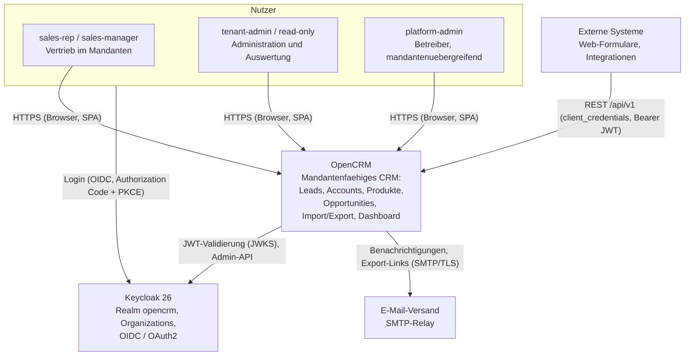
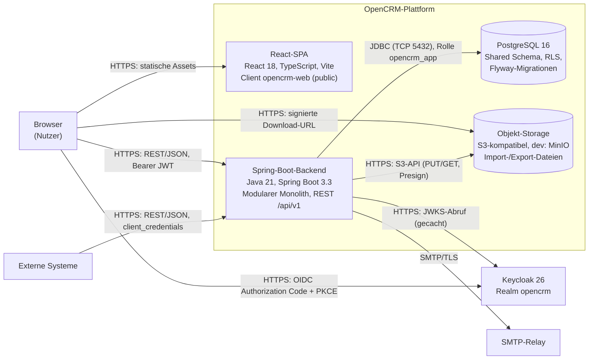
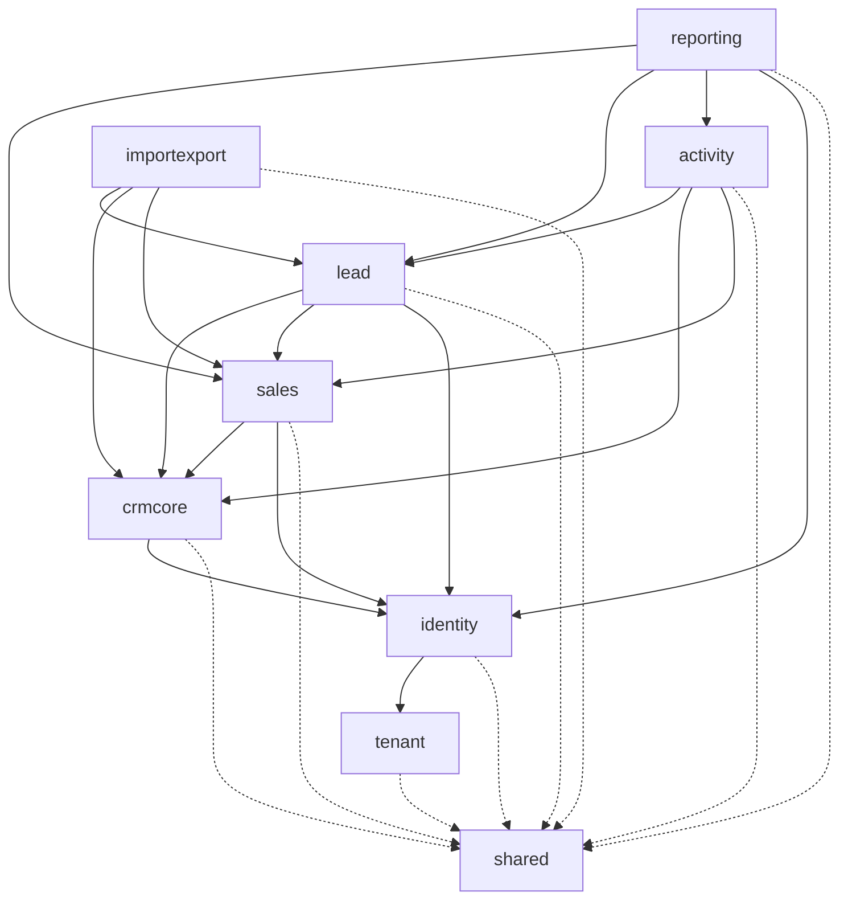
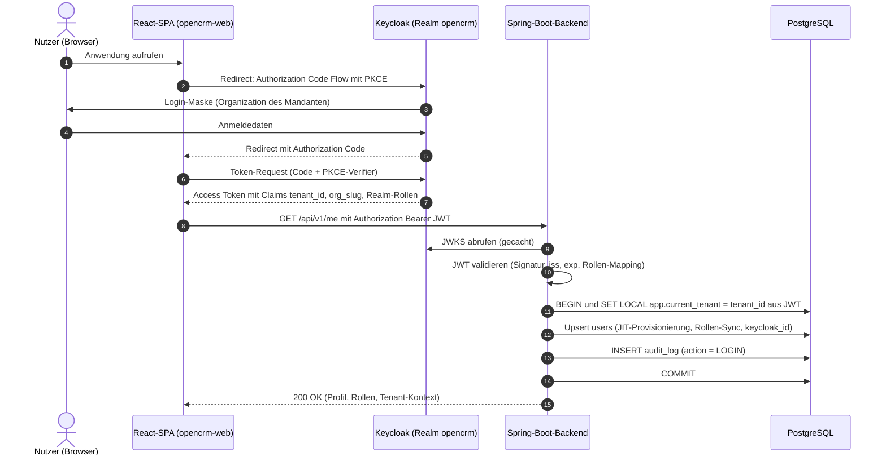
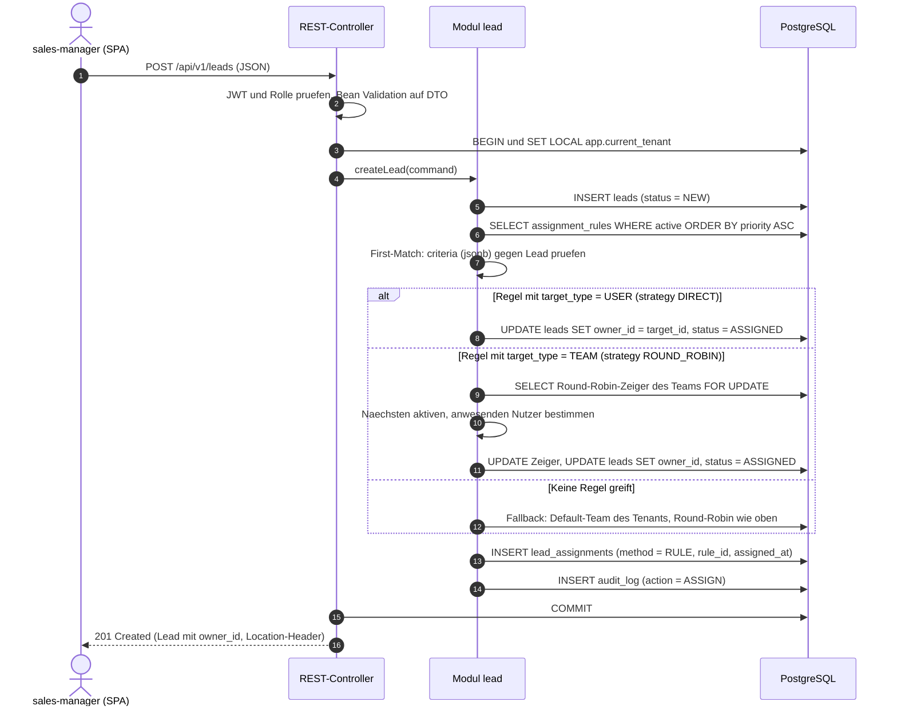
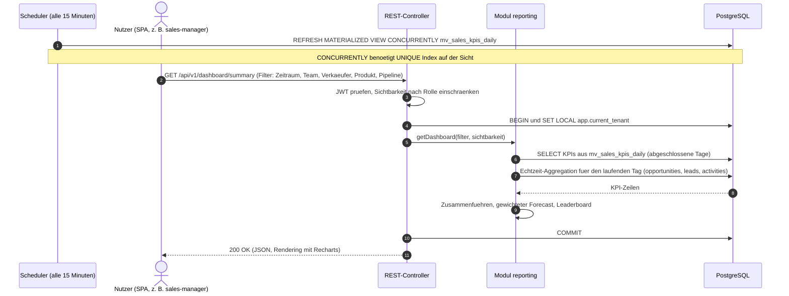

# Systemarchitektur

| Status | Stand | Verantwortlich |
|---|---|---|
| Entwurf | 2026-07-16 | Lead Architecture |

## Zweck

Dieses Dokument beschreibt die Gesamtarchitektur von OpenCRM: Systemkontext, Container, den Modulschnitt des Backends, die Begruendung der Architekturentscheidung "Modularer Monolith" sowie den Tech-Stack. Zentrale Ablaeufe (Login, Lead-Anlage mit regelbasierter Zuweisung, Dashboard-Abruf) werden als Sequenzdiagramme dargestellt. Querschnittsthemen wie Validierung, Fehlerbehandlung, Transaktionsgrenzen, Zeitzonen und Observability werden verbindlich festgelegt.

## Inhaltsverzeichnis

1. [Architekturprinzipien](#1-architekturprinzipien)
2. [Systemkontext (C4 Level 1)](#2-systemkontext-c4-level-1)
3. [Containersicht (C4 Level 2)](#3-containersicht-c4-level-2)
4. [Modulschnitt des Backends](#4-modulschnitt-des-backends)
5. [Modularer Monolith versus Microservices](#5-modularer-monolith-versus-microservices)
6. [Tech-Stack](#6-tech-stack)
7. [Zentrale Ablaeufe](#7-zentrale-ablaeufe)
8. [Querschnittsthemen](#8-querschnittsthemen)
9. [Offene Punkte](#9-offene-punkte)

## 1. Architekturprinzipien

1. **Mandantentrennung vor allem anderen.** Jede mandantenbezogene Tabelle traegt `tenant_id`; PostgreSQL Row-Level Security erzwingt die Trennung auf Datenbankebene zusaetzlich zur Anwendungslogik (Defense in Depth). Kein Feature darf diese Schicht umgehen. Details in [04-multi-tenancy.md](04-multi-tenancy.md).
2. **Modularer Monolith mit harten Modulgrenzen.** Ein Deployment-Artefakt, aber ein expliziter Modulschnitt nach Spring Modulith. Module kommunizieren nur ueber oeffentliche APIs (Java-Interfaces) und Domaenen-Events; direkte Zugriffe auf interne Klassen oder fremde Repositories sind verboten und werden durch Modulith-Verifikationstests im CI geprueft.
3. **PostgreSQL als einziges Backbone in Phase 1.** Fachdaten, Job-Steuerung (`import_jobs`/`export_jobs`), Round-Robin-Zeiger und Audit-Log liegen in PostgreSQL. Kein Message-Broker, kein Redis (bewusste Entscheidung, spaeter erweiterbar; siehe [ADR-006](adr/ADR-006-import-export-mit-spring-batch.md)).
4. **Standards statt Eigenbau bei Identitaet und Sicherheit.** Authentifizierung ausschliesslich via Keycloak (OIDC/OAuth2); das Backend ist reiner OAuth2 Resource Server und verwaltet keine Passwoerter. Details in [05-authentifizierung-keycloak.md](05-authentifizierung-keycloak.md).
5. **API-first.** Die REST-API unter `/api/v1` (OpenAPI 3.1) ist der einzige Zugang zu Fachlogik; SPA, externe Systeme und Maschinen-Clients nutzen dieselbe API. Kein UI-spezifischer Seitenkanal. Details in [10-api-design.md](10-api-design.md).
6. **Asynchron nur, wo noetig.** Lang laufende Arbeiten (Import, Export, KPI-Refresh) laufen via Spring Batch bzw. Scheduler; alle interaktiven Anwendungsfaelle bleiben synchron innerhalb einer Transaktion.
7. **Beobachtbar von Anfang an.** Strukturierte JSON-Logs mit `tenant_id` und `trace_id`, Micrometer-Metriken, OpenTelemetry-Traces. Fehlverhalten muss pro Mandant diagnostizierbar sein.
8. **UTC und ISO durchgaengig.** Persistenz in `timestamptz` (UTC), Waehrungen nach ISO 4217, Anzeigeformate sind reine Frontend-Aufgabe.

## 2. Systemkontext (C4 Level 1)

OpenCRM wird von den Rollen `sales-rep`, `sales-manager`, `tenant-admin`, `read-only` (jeweils mandantenbezogen) und `platform-admin` (Betreiber, mandantenuebergreifend) genutzt. Externe Systeme (z. B. Website-Formulare, Marketing-Tools) sprechen die REST-API mit einem Token des Service-Clients `opencrm-api`.



Hinweise:

- Alle Nutzer authentifizieren sich gegen den einen Realm `opencrm`; die Zuordnung zum Mandanten erfolgt ueber Keycloak Organizations und den Token-Claim `tenant_id`.
- E-Mail-Versand (z. B. Hinweis auf zugewiesene Leads, Export-fertig-Benachrichtigung) laeuft ueber ein konfigurierbares SMTP-Relay; OpenCRM betreibt keinen eigenen Mailserver.
- Externe Systeme erhalten keinen Datenbankzugang; einziger Integrationspunkt ist die REST-API (Lead-Quelle `API` bzw. `WEB_FORM`).

## 3. Containersicht (C4 Level 2)



- **React-SPA**: reines Frontend, wird als statisches Bundle ausgeliefert (dev: Vite-Devserver auf Port 5173, prod: Webserver-Container). Spricht ausschliesslich die REST-API; Tokens werden im Speicher gehalten, Refresh via OIDC.
- **Spring-Boot-Backend**: ein Prozess (Port 8080), enthaelt alle Module inklusive Spring-Batch-Jobs und Scheduler. Horizontal skalierbar; Job-Koordination erfolgt ueber die Job-Tabellen in PostgreSQL (Statusuebergaenge mit `SELECT FOR UPDATE`), nicht ueber Instanz-Lokalitaet.
- **PostgreSQL 16** (Port 5432): einzige Fachdatenbank. Zwei DB-Rollen: `opencrm_app` (Laufzeit, ohne `BYPASSRLS`) und `opencrm_migrator` (Flyway).
- **Objekt-Storage** (dev: MinIO, Port 9000): Ablage fuer Import-Quelldateien und Export-Ergebnisse; der Browser laedt Exporte ueber zeitlich begrenzte signierte URLs (`export_jobs.download_expires_at`), nie ueber das Backend gestreamt.
- **Keycloak 26** (dev: Port 8081): Identity Provider; das Backend haelt keine Sessions (stateless, JWT pro Request).

Deployment-Details (Compose, Kubernetes/Helm, CI/CD) in [11-deployment-und-betrieb.md](11-deployment-und-betrieb.md).

## 4. Modulschnitt des Backends

Der Monolith ist nach Spring Modulith in neun Module geschnitten. Jedes Modul besitzt ein oeffentliches API-Paket; alles andere ist modulintern. Fachliche Kopplung laeuft bevorzugt ueber synchrone API-Aufrufe (gleiche Transaktion) und ueber applikationsinterne Domaenen-Events (z. B. `LeadConvertedEvent`), die in derselben Transaktion konsumiert werden.



Durchgezogene Kanten: erlaubte fachliche Abhaengigkeiten. Gestrichelt: technisches Fundament `shared` (jedes Modul darf `shared` nutzen, `shared` nutzt kein anderes Modul). Der Graph ist azyklisch; neue Abhaengigkeiten benoetigen eine Architektur-Entscheidung.

| Modul | Verantwortlichkeit | Wichtige Tabellen | Darf abhaengen von |
|---|---|---|---|
| `tenant` | Mandanten-Stammdaten und -Lebenszyklus (ACTIVE/SUSPENDED/OFFBOARDING), Default-Waehrung, mandantenweite Konfiguration (z. B. Claim-Freigabe, Default-Team) | `tenants` | `shared` |
| `identity` | JWT-Verarbeitung, Just-in-Time-Provisionierung, Rollen-Sync, Teams | `users`, `teams`, `team_members` | `tenant`, `shared` |
| `crmcore` | Firmen und Ansprechpartner inkl. DSGVO-Feldern, Custom Fields | `accounts`, `contacts`, `custom_field_definitions` | `identity`, `shared` |
| `lead` | Lead-Lebenszyklus (NEW bis CONVERTED/DISQUALIFIED), Zuweisung (manuell, Round-Robin, regelbasiert), Konvertierung | `leads`, `lead_assignments`, `assignment_rules` | `crmcore`, `sales`, `identity`, `shared` |
| `sales` | Produktkatalog, Preislisten, Pipelines/Stages, Opportunities mit Positionen | `products`, `price_lists`, `price_list_items`, `pipelines`, `pipeline_stages`, `opportunities`, `opportunity_items` | `crmcore`, `identity`, `shared` |
| `activity` | Aktivitaeten (CALL/EMAIL/MEETING/NOTE/TASK) mit Bezug zu Lead, Account, Contact oder Opportunity | `activities` | `lead`, `crmcore`, `sales`, `identity`, `shared` |
| `importexport` | Datei-Import (CSV/XLSX) mit Mapping, Dry-Run und Duplikatstrategie; Export (CSV/XLSX/JSON); Spring-Batch-Jobs; S3-Anbindung | `import_jobs`, `import_job_errors`, `import_mappings`, `export_jobs` | `lead`, `crmcore`, `sales`, `identity`, `shared` |
| `reporting` | KPI-Berechnung, Dashboard-Endpunkte, Sichtbarkeitsregeln, Refresh von `mv_sales_kpis_daily` | `mv_sales_kpis_daily` (materialisierte Sicht, lesend auf Fachtabellen) | `sales`, `lead`, `activity`, `identity`, `shared` |
| `shared` | Technisches Fundament ohne Fachlogik: Tenant-Kontext (Request-Scope, `SET LOCAL`), Fehlerformat RFC 9457, Pagination-Hilfen, Audit-Schreiber, Basistypen | `audit_log` | — |

Regeln fuer Modulinteraktion:

- `reporting` liest fremde Tabellen ausschliesslich ueber dedizierte Read-Models/Views, schreibt nie in Fachtabellen anderer Module.
- Die Lead-Konvertierung (`lead` erzeugt Account, Contact, Opportunity) laeuft als ein Anwendungsfall in einer Transaktion ueber die oeffentlichen APIs von `crmcore` und `sales`.
- `importexport` validiert und schreibt ueber dieselben Domaenen-Services wie die REST-API, damit Regeln (Pflichtfelder, Duplikate, Zuweisung) fuer Import und UI identisch sind.
- Der Audit-Schreiber in `shared` wird von allen schreibenden Anwendungsfaellen aufgerufen (Aktionen CREATE/UPDATE/DELETE/ASSIGN/IMPORT/EXPORT/LOGIN).

## 5. Modularer Monolith versus Microservices

Entscheidung: Modularer Monolith (siehe [ADR-004](adr/ADR-004-modularer-monolith-spring-boot.md)). Zusammenfassung der Abwaegung:

| Kriterium | Modularer Monolith (gewaehlt) | Microservices |
|---|---|---|
| Konsistenz | Lead-Konvertierung, Zuweisung und Audit in einer ACID-Transaktion | Sagas/Outbox noetig, Eventual Consistency in Kernablaeufen |
| Mandantentrennung | Ein RLS-Konzept, eine Datenbank, ein Tenant-Kontext | RLS/Kontext je Service dupliziert, hoehere Fehlerflaeche |
| Betrieb | Ein Image, ein Deployment, Compose fuer dev trivial | Service-Mesh, Broker, verteiltes Tracing zwingend ab Tag 1 |
| Teamgroesse | Passt zu einem kleinen Team, keine Ownership-Grenzen noetig | Lohnt erst bei mehreren unabhaengigen Teams |
| Performance | In-Process-Aufrufe, Dashboard-Joins lokal in PostgreSQL | Netzwerk-Hops, Daten-Duplikation fuer Reporting |
| Evolierbarkeit | Modulith-Grenzen + Events erlauben spaeteres Herausloesen (Kandidaten: `importexport`, `reporting`) | Von Anfang an verteilt, Rueckbau teuer |
| Risiko | Disziplin an Modulgrenzen noetig (durch CI-Verifikation abgesichert) | Verteilte Fehlerbilder, hoehere Einstiegskomplexitaet |

Die Modulgrenzen sind so geschnitten, dass ein spaeterer Extraktionspfad existiert; bis dahin gilt: keine geteilten internen Klassen, keine Cross-Modul-Joins in JPA ausserhalb von `reporting`-Read-Models.

## 6. Tech-Stack

| Schicht | Technologie | Version | Begruendung |
|---|---|---|---|
| Sprache Backend | Java | 21 | LTS, Virtual Threads fuer I/O-lastige Requests, breite Teamerfahrung |
| Applikationsframework | Spring Boot (Web, Security OAuth2 Resource Server, Data JPA/Hibernate) | 3.3 | Etablierter Standard, erstklassige OAuth2- und JPA-Integration |
| Modulgrenzen | Spring Modulith | zu Boot 3.3 passend | Verifizierbarer Modulschnitt, applikationsinterne Events |
| Schema-Migration | Flyway | zu Boot 3.3 passend | Versionierte SQL-Migrationen inkl. RLS-Policies, Rolle `opencrm_migrator` |
| Batch/Jobs | Spring Batch | zu Boot 3.3 passend | Chunk-Verarbeitung, Restart-Faehigkeit, Job-Metadaten in PostgreSQL |
| Build | Maven | 3.9.x | Standard-Toolchain, reproduzierbare Builds |
| Datenbank | PostgreSQL | 16 | Anforderung des Auftraggebers; RLS, `jsonb`, materialisierte Sichten |
| Identity Provider | Keycloak | 26 | Anforderung; Organizations fuer Mandanten, ein Realm `opencrm` |
| Objekt-Storage | S3-kompatibel (dev: MinIO) | MinIO aktuell (dev) | Grosse Dateien ausserhalb der DB, signierte URLs, cloud-portabel |
| Frontend | React + TypeScript | 18 / 5.x | Anforderungsnahe SPA, Typsicherheit gegen OpenAPI-Typen |
| Frontend-Build | Vite | 5.x | Schnelle Builds und Devserver (Port 5173) |
| Server-State | TanStack Query | 5.x | Caching, Invalidierung, Cursor-Pagination-Support |
| Charts | Recharts | 2.x | Deklarative Dashboard-Charts in React |
| i18n | react-i18next | aktuell | de/en gemaess Baseline |
| Container | Docker, Docker Compose (dev) | aktuell | Einheitliche Images, lokale Gesamtumgebung |
| Orchestrierung | Kubernetes + Helm | aktuell | Produktionsbetrieb, Skalierung, Rollouts |
| CI/CD | GitHub Actions | — | Build, Tests, Modulith-Verifikation, Image-Publish |
| Metriken | Micrometer + Prometheus | zu Boot 3.3 passend | Standard-Metrikpfad in Spring |
| Dashboards/Alerts | Grafana | aktuell | Betriebs-Sichten auf Metriken und Logs |
| Tracing | OpenTelemetry | aktuell | Verteilte Traces SPA -> Backend -> DB |

## 7. Zentrale Ablaeufe

### 7.1 Browser-Login via Keycloak



Der Rollen-Sync laeuft bei jedem Login: Realm-Rollen aus dem Token werden in `users.role` gespiegelt. Das Backend haelt keine Session; jeder Request wird erneut ueber das JWT autorisiert.

### 7.2 Lead anlegen mit regelbasierter Zuweisung



Anlage, Regelauswertung, Zuweisung, Historie und Audit bilden eine Transaktion: entweder existiert der Lead vollstaendig zugewiesen inklusive `lead_assignments`-Eintrag, oder gar nicht. Das `SELECT FOR UPDATE` auf dem Round-Robin-Zeiger serialisiert konkurrierende Zuweisungen je Team. Fachliche Details in [06-lead-management.md](06-lead-management.md).

### 7.3 Dashboard-Abruf mit materialisierter Sicht



Sichtbarkeitsregeln (verbindlich): `sales-rep` sieht nur eigene Kennzahlen plus anonymisierten Team-Durchschnitt, `sales-manager` sein Team, `tenant-admin` und `read-only` den gesamten Mandanten. Die Filterung erfolgt serverseitig im Modul `reporting`, nie im Frontend. KPI-Definitionen und Aufbau der Sicht in [09-dashboard-und-reporting.md](09-dashboard-und-reporting.md).

## 8. Querschnittsthemen

### 8.1 Validierung

- **Feldvalidierung**: Jakarta Bean Validation auf Request-DTOs (Pflichtfelder, Formate, Laengen, Enum-Werte). Verletzungen fuehren zu `422` (`validation_failed`) mit Feldliste im Problem-Detail; nur nicht parsbare Requests (fehlerhaftes JSON, unlesbarer Body) liefern `400`. Verbindlicher Fehlercode-Katalog in [10-api-design.md](10-api-design.md).
- **Fachlich**: Invarianten in den Domaenen-Services der Module (z. B. Statusuebergaenge von `leads`, `sku` eindeutig je Tenant, `pipeline_stages`-Konsistenz). Verletzungen fuehren zu `409` oder `422` je nach Fehlerklasse.
- **Custom Fields**: Werte in der `custom`-jsonb-Spalte werden gegen `custom_field_definitions` des Tenants validiert (Typ, `required`, `options` bei SELECT).
- **Import**: identische Domaenen-Validierung pro Zeile; Fehler brechen den Job nicht ab, sondern landen in `import_job_errors` (Status `COMPLETED_WITH_ERRORS`). Details in [08-import-export.md](08-import-export.md).

### 8.2 Fehlerbehandlung

Fehlerformat ist RFC 9457 (`application/problem+json`), zentral gemappt in einem `@RestControllerAdvice`. Beispiel:

```json
{
  "type": "https://docs.opencrm.example/errors/validation_failed",
  "title": "Validation failed",
  "status": 422,
  "detail": "2 fields are invalid.",
  "instance": "/api/v1/leads",
  "code": "validation_failed",
  "errors": [
    { "field": "email", "code": "invalid_format" },
    { "field": "source", "code": "unknown_enum_value" }
  ],
  "traceId": "6f2a9c1d3e4b5a60"
}
```

Konventionen: `400` nicht parsbarer Request (fehlerhaftes JSON), `401` fehlendes/ungueltiges Token, `403` fehlende Rolle oder Sichtbarkeit, `404` auch fuer fremde Mandanten-Ressourcen (kein Existenz-Leak ueber RLS-Grenzen), `409` Konflikte (z. B. doppelte `sku`), `422` Feld-Validierung (`validation_failed`) und fachliche Ablehnung, `500` mit `traceId` ohne interne Details. Stacktraces erscheinen nur im Log, nie in der Response.

### 8.3 Transaktionsgrenzen

- Eine HTTP-Request-Verarbeitung entspricht genau einer Datenbanktransaktion (`@Transactional` auf Anwendungsfall-Ebene der Module). Controller sind transaktionsfrei.
- Zu Transaktionsbeginn setzt der Tenant-Kontext aus `shared` per `SET LOCAL app.current_tenant = '<uuid>'` (Wert aus JWT-Claim `tenant_id`) die RLS-Session-Variable; `SET LOCAL` gilt exakt bis zum Commit/Rollback und verhindert Kontext-Leaks bei Connection-Pooling.
- Domaenen-Events werden in derselben Transaktion konsumiert (kein At-least-once-Problem); ein spaeterer Wechsel auf asynchrone Events erfordert ein Outbox-Muster.
- Spring-Batch-Jobs arbeiten chunk-basiert: eine Transaktion je Chunk, `SET LOCAL` je Chunk-Transaktion mit der `tenant_id` des Jobs. Job-Statusuebergaenge in `import_jobs`/`export_jobs` erfolgen mit `SELECT FOR UPDATE`, damit mehrere Backend-Instanzen keinen Job doppelt starten.
- `REFRESH MATERIALIZED VIEW CONCURRENTLY` laeuft als eigene, mandantenuebergreifende Wartungstransaktion des Schedulers (die Sicht enthaelt `tenant_id`; die Leseabfragen bleiben RLS- bzw. filtergeschuetzt).

### 8.4 Zeitzonen und UTC

- Persistenz durchgaengig `timestamptz`; JVM und Datenbank-Sessions laufen mit UTC, JDBC uebertraegt `java.time.Instant`/`OffsetDateTime`.
- Die API liefert Zeitstempel als ISO-8601 mit UTC-Offset (`2026-07-16T09:30:00Z`); die SPA rendert in der Nutzer-Zeitzone.
- Tagesgrenzen fuer KPIs (z. B. `mv_sales_kpis_daily`) werden in UTC gebildet; abweichende Mandanten-Zeitzonen fuer Berichtsgrenzen sind ein offener Punkt (siehe unten).

### 8.5 Waehrungen

- Waehrungscodes nach ISO 4217 (`char(3)`), Betraege als `numeric` (keine Gleitkommatypen): `products.list_price numeric(12,2)`, `opportunities.amount numeric(14,2)`.
- Jeder Tenant hat `tenants.default_currency`; Produkte, Preislisten und Opportunities tragen ihre Waehrung explizit.
- Phase 1 rechnet nicht zwischen Waehrungen um: eine Opportunity und ihre Positionen fuehren eine Waehrung; Aggregationen im Dashboard gruppieren je Waehrung.

### 8.6 Logging, Tracing, Metriken

- **Logs**: strukturiert als JSON (ein Objekt je Zeile) mit `timestamp`, `level`, `logger`, `message`, `tenant_id`, `user_id`, `trace_id`, `span_id` (via MDC). Keine personenbezogenen Daten und keine Tokens in Logmeldungen.
- **Tracing**: OpenTelemetry ueber SPA (Trace-Header) -> Backend -> JDBC; die `traceId` erscheint in Problem-Responses und verbindet Support-Faelle mit Traces.
- **Metriken**: Micrometer/Prometheus; neben Standardmetriken fachliche Zaehler je Tenant-Label mit begrenzter Kardinalitaet (z. B. `leads_assigned_total`, `import_rows_processed_total`, Dauer des MV-Refresh).
- **Audit**: fachliche Nachvollziehbarkeit liegt in `audit_log` (mit `diff jsonb`), nicht in technischen Logs; Betriebs-Logs sind kurzlebig, Audit-Daten folgen der Aufbewahrung des Mandanten.

## 9. Offene Punkte

1. Tagesgrenzen fuer KPI-Aggregation: strikt UTC oder konfigurierbare Berichts-Zeitzone je Tenant (`mv_sales_kpis_daily` muesste dann je Tenant-Zeitzone aggregieren)?
2. Skalierung des Scheduler-/Batch-Betriebs bei mehreren Backend-Replikas: reicht Leader-Wahl via Job-Tabellen-Locking oder wird ShedLock-artiges DB-Locking als eigener Baustein festgelegt?
3. Rate Limiting fuer den Service-Client `opencrm-api` (externe Systeme): im Backend (Bucket je Client/Tenant in PostgreSQL) oder erst am Ingress?
4. SMTP-Anbindung: eigener Relay-Dienst je Umgebung oder Managed-Dienst; Umgang mit Bounce-Handling ist noch nicht entschieden.
5. Grenzwert fuer synchron erlaubte Exporte: ab welcher Zeilenzahl wird ein Export zwingend als `export_jobs`-Batchlauf ausgefuehrt (Vorschlag: immer asynchron, auch fuer kleine Mengen)?
