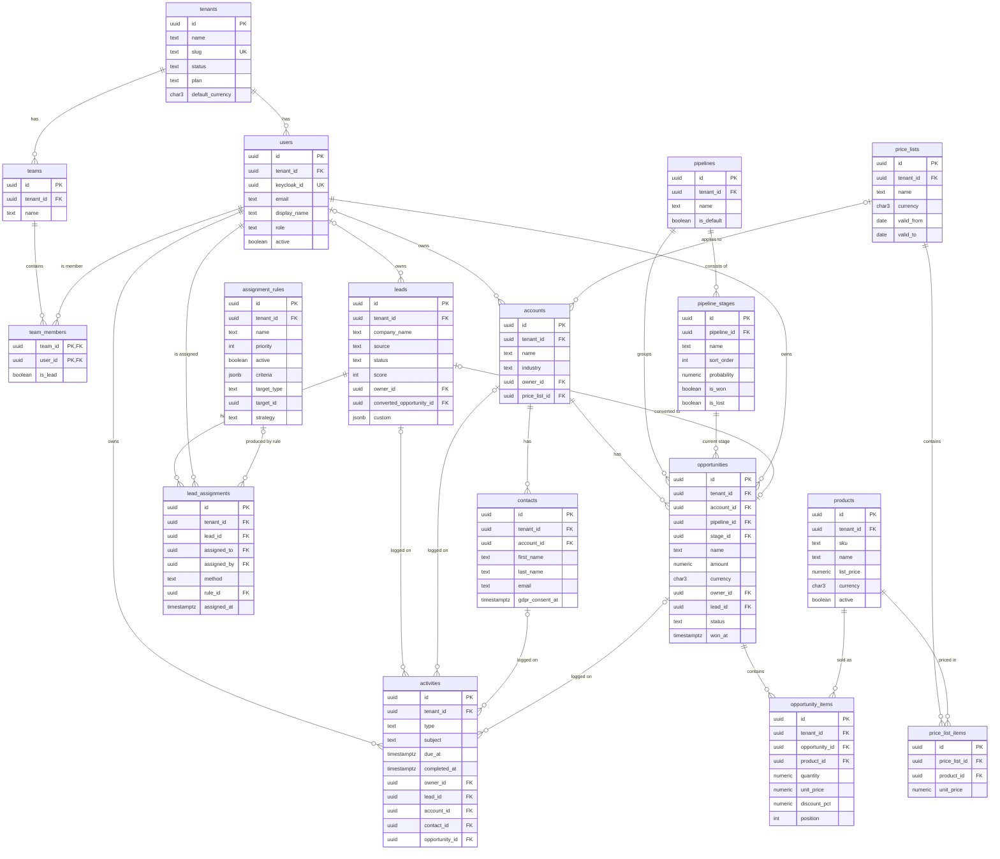

# Datenmodell

| Status | Stand | Verantwortlich |
|---|---|---|
| Entwurf | 2026-07-16 | Lead Architecture |

## Zweck

Dieses Dokument definiert das relationale Datenmodell von OpenCRM auf PostgreSQL 16: Kernentitäten, Beziehungen, Spalten, Constraints, Index-Strategie sowie die Konzepte für Soft Delete, Custom Fields und Audit-Logging. Es ist die verbindliche Referenz für die Flyway-Migrationen und die JPA-Entitäten. Die Mandantentrennung per `tenant_id` und Row-Level Security ist hier auf Tabellenebene beschrieben; das Gesamtkonzept steht in [04-multi-tenancy.md](04-multi-tenancy.md).

## Inhaltsverzeichnis

1. [Grundprinzipien und Standardspalten](#1-grundprinzipien-und-standardspalten)
2. [ER-Diagramm der Kernentitäten](#2-er-diagramm-der-kernentitäten)
3. [Tabellenkatalog](#3-tabellenkatalog)
4. [Index-Strategie](#4-index-strategie)
5. [Beispiel-DDL: leads, opportunities, opportunity_items](#5-beispiel-ddl-leads-opportunities-opportunity_items)
6. [Soft-Delete-Konzept](#6-soft-delete-konzept)
7. [Custom Fields](#7-custom-fields)
8. [Audit-Log-Konzept](#8-audit-log-konzept)
9. [Mengengerüst und Partitionierungs-Ausblick](#9-mengengerüst-und-partitionierungs-ausblick)
10. [Offene Punkte](#10-offene-punkte)

## 1. Grundprinzipien und Standardspalten

- **Shared Database / Shared Schema:** Alle Mandanten liegen im selben Schema. Jede mandantenbezogene Tabelle trägt `tenant_id UUID NOT NULL` und eine RLS-Policy, die gegen `current_setting('app.current_tenant', true)::uuid` prüft (Details in [04-multi-tenancy.md](04-multi-tenancy.md)).
- **Primärschlüssel:** `id UUID DEFAULT gen_random_uuid()` (PostgreSQL-16-Built-in, keine Extension nötig).
- **Zeit:** Persistenz durchgängig UTC als `timestamptz`; Anzeige-Zeitzone ist Sache des Frontends.
- **Währung:** ISO 4217 als `char(3)`; Default-Währung je Tenant in `tenants.default_currency`.
- **Statuswerte:** als `text` mit `CHECK`-Constraint (keine PostgreSQL-Enums, damit Werte per Migration ohne Typänderung erweiterbar bleiben). Die Wertelisten sind kanonisch und dürfen nicht umbenannt werden.
- **Kindtabellen ohne `tenant_id`:** `team_members`, `price_list_items`, `pipeline_stages`, `import_job_errors` erben die Mandantenzuordnung über ihre Elterntabelle; ihre RLS-Policy prüft per `EXISTS` gegen die Elterntabelle.
- **DB-Rollen:** Tabellen gehören `opencrm_migrator` (Flyway); die Anwendung verbindet als `opencrm_app` (ohne `BYPASSRLS`, nur DML-Grants). `FORCE ROW LEVEL SECURITY` stellt sicher, dass auch der Tabellen-Owner den Policies unterliegt.

### Standardspalten

Folgende Spalten gelten für alle mandantenbezogenen Tabellen und werden im Tabellenkatalog nicht wiederholt:

| Spalte | Typ | Constraints | Beschreibung |
|---|---|---|---|
| id | uuid | PK, DEFAULT gen_random_uuid() | Technischer Primärschlüssel |
| tenant_id | uuid | NOT NULL, FK → tenants(id) | Mandantenzuordnung, RLS-Kriterium |
| created_at | timestamptz | NOT NULL DEFAULT now() | Anlagezeitpunkt (UTC) |
| updated_at | timestamptz | NOT NULL DEFAULT now() | Letzte Änderung, per Trigger `set_updated_at()` gepflegt |
| deleted_at | timestamptz | NULL | Nur Kernentitäten (siehe [Abschnitt 6](#6-soft-delete-konzept)): accounts, contacts, leads, products, opportunities, activities |

Abweichungen (z. B. `tenants` ohne `tenant_id`, `audit_log` mit `occurred_at` statt `updated_at`) sind im Katalog vermerkt.

## 2. ER-Diagramm der Kernentitäten

Aus Gründen der Lesbarkeit sind die `tenant_id`-Beziehungen nur für `users` und `teams` eingezeichnet; tatsächlich referenziert jede mandantenbezogene Tabelle `tenants`. Die Job-, Konfigurations- und Benachrichtigungstabellen (`import_jobs`, `export_jobs`, `import_mappings`, `import_job_errors`, `custom_field_definitions`, `audit_log`, `notifications`, `round_robin_pointers`) sind im Katalog beschrieben, aber hier nicht dargestellt.



## 3. Tabellenkatalog

Standardspalten (Abschnitt 1) sind nicht wiederholt; aufgeführt sind nur die fachlichen Spalten.

### 3.1 tenants (plattformglobal)

Stammdaten der Kunden-Organisationen. Einzige fachliche Tabelle **ohne** `tenant_id` und ohne mandantenbezogene RLS-Policy; Zugriff nur durch `platform-admin`-Funktionen und interne Plattformlogik. Kein `updated_at`/`deleted_at`; Offboarding läuft über `status`.

| Spalte | Typ | Constraints | Beschreibung |
|---|---|---|---|
| name | text | NOT NULL | Anzeigename der Organisation |
| slug | text | NOT NULL, UNIQUE | URL-tauglicher Kurzname, gespiegelt als JWT-Claim `org_slug` |
| status | text | NOT NULL, CHECK IN (ACTIVE, SUSPENDED, OFFBOARDING) | Lebenszyklus des Mandanten |
| plan | text | NOT NULL | Gebuchter Plan (Abrechnung/Feature-Gates) |
| default_currency | char(3) | NOT NULL | ISO-4217-Default für neue Produkte/Opportunities |
| settings | jsonb | NOT NULL DEFAULT '{}' | Mandantenspezifische Einstellungen, u. a. Claim-Selbstzuweisung, SLA-Frist, Duplikat-Schwellen, Aufbewahrungsfristen (E-12) |
| created_at | timestamptz | NOT NULL DEFAULT now() | Anlagezeitpunkt |

### 3.2 users

Spiegel der Keycloak-Benutzer je Mandant, per Just-in-Time-Provisionierung beim ersten Login angelegt und bei jedem Login synchronisiert (siehe [05-authentifizierung-keycloak.md](05-authentifizierung-keycloak.md)). Deaktivierung über `active`, kein Soft Delete.

| Spalte | Typ | Constraints | Beschreibung |
|---|---|---|---|
| keycloak_id | uuid | NOT NULL, UNIQUE | Subject (`sub`) des Keycloak-Users, global eindeutig |
| email | text | NOT NULL | E-Mail, aus dem Token gespiegelt |
| display_name | text | NOT NULL | Anzeigename |
| role | text | NOT NULL, CHECK IN (tenant-admin, sales-manager, sales-rep, read-only) | Höchste mandantenbezogene Realm-Rolle; `platform-admin` wird nicht gespiegelt |
| active | bool | NOT NULL DEFAULT true | Inaktive Nutzer werden bei Round-Robin übersprungen und können sich nicht anmelden |

### 3.3 teams und team_members

Vertriebsteams eines Mandanten; Ziel von Zuweisungsregeln und Filterdimension im Dashboard. `team_members` ist die M:N-Auflösung ohne eigene `tenant_id` (Isolation über `teams`).

**teams**

| Spalte | Typ | Constraints | Beschreibung |
|---|---|---|---|
| name | text | NOT NULL, UNIQUE (tenant_id, name) | Teamname |

**team_members** (PK = (team_id, user_id), keine Standardspalten außer created_at/updated_at)

| Spalte | Typ | Constraints | Beschreibung |
|---|---|---|---|
| team_id | uuid | PK-Teil, FK → teams(id) ON DELETE CASCADE | Team |
| user_id | uuid | PK-Teil, FK → users(id) | Mitglied |
| is_lead | bool | NOT NULL DEFAULT false | Teamleitung (fachlich, keine Berechtigung) |
| is_primary | bool | NOT NULL DEFAULT false, UNIQUE-Index (user_id) WHERE is_primary | Primärteam des Nutzers (genau eines je Nutzer); Basis der Team-Zuordnung im Dashboard (E-19) |

### 3.4 accounts

Firmenkunden (B2B-Konten). Kernentität mit Soft Delete.

| Spalte | Typ | Constraints | Beschreibung |
|---|---|---|---|
| name | text | NOT NULL | Firmenname (pg_trgm-Suche) |
| industry | text | NULL | Branche |
| website | text | NULL | URL |
| street / postal_code / city | text | NULL | Adresse |
| country | char(2) | NULL | ISO 3166-1 alpha-2 |
| owner_id | uuid | NULL, FK → users(id) | Verantwortlicher Verkäufer |
| price_list_id | uuid | NULL, FK → price_lists(id) | Optionale Preisliste des Accounts, genau eine je Account (E-10) |
| external_id | text | NULL, UNIQUE (tenant_id, external_id) WHERE external_id IS NOT NULL | Stabiler externer Schlüssel für Import/Integration; bevorzugter Match-Schlüssel (E-11) |

### 3.5 contacts

Ansprechpersonen eines Accounts. Kernentität mit Soft Delete; personenbezogen und damit primärer Gegenstand des DSGVO-Löschprozesses.

| Spalte | Typ | Constraints | Beschreibung |
|---|---|---|---|
| account_id | uuid | NOT NULL, FK → accounts(id) | Zugehöriger Account |
| first_name / last_name | text | last_name NOT NULL | Name |
| email / phone | text | NULL | Kontaktdaten |
| position | text | NULL | Funktion im Unternehmen |
| gdpr_consent_at | timestamptz | NULL | Zeitpunkt der Einwilligung (z. B. Marketingkontakt); NULL = keine Einwilligung |
| external_id | text | NULL, UNIQUE (tenant_id, external_id) WHERE external_id IS NOT NULL | Stabiler externer Schlüssel für Import/Integration; bevorzugter Match-Schlüssel (E-11) |

### 3.6 leads

Unqualifizierte Verkaufskontakte; Lebenszyklus und Konvertierung sind in [06-lead-management.md](06-lead-management.md) beschrieben. Kernentität mit Soft Delete und Custom-Fields-Spalte.

| Spalte | Typ | Constraints | Beschreibung |
|---|---|---|---|
| title | text | NULL | Kurzbezeichnung des Leads |
| company_name | text | NULL, CHECK: company_name oder last_name gesetzt | Firmenname |
| first_name / last_name | text | NULL | Ansprechperson |
| email / phone | text | NULL | Kontaktdaten (Dublettenprüfung beim Import) |
| external_id | text | NULL, UNIQUE (tenant_id, external_id) WHERE external_id IS NOT NULL | Stabiler externer Schlüssel für Import/Integration; bevorzugter Match-Schlüssel (E-11) |
| source | text | NOT NULL, CHECK IN (WEB_FORM, IMPORT, MANUAL, API, EVENT, REFERRAL) | Herkunft |
| status | text | NOT NULL DEFAULT NEW, CHECK IN (NEW, ASSIGNED, CONTACTED, QUALIFIED, DISQUALIFIED, CONVERTED) | Lebenszyklus |
| score | int | NOT NULL DEFAULT 0, CHECK 0–100 | Lead-Score |
| owner_id | uuid | NULL, FK → users(id) | Zugewiesener Verkäufer; NULL solange status = NEW |
| disqualified_reason | text | NULL | Pflicht bei DISQUALIFIED (App-Validierung) |
| converted_at / disqualified_at | timestamptz | NULL | Gesetzt beim Statusübergang nach CONVERTED bzw. DISQUALIFIED (E-09); Basis der Lead-Conversion-KPI |
| converted_account_id | uuid | NULL, FK → accounts(id) | Ergebnis der Konvertierung |
| converted_contact_id | uuid | NULL, FK → contacts(id) | Ergebnis der Konvertierung |
| converted_opportunity_id | uuid | NULL, FK → opportunities(id) | Ergebnis der Konvertierung (FK per ALTER TABLE, zirkulär) |
| custom | jsonb | NOT NULL DEFAULT '{}' | Custom-Field-Werte (Abschnitt 7) |

### 3.7 lead_assignments

Vollständige, append-only geführte Zuweisungshistorie. Jede Zuweisung (manuell, Round-Robin, regelbasiert) erzeugt genau einen Eintrag und setzt gleichzeitig `leads.owner_id`.

| Spalte | Typ | Constraints | Beschreibung |
|---|---|---|---|
| lead_id | uuid | NOT NULL, FK → leads(id) | Betroffener Lead |
| assigned_to | uuid | NOT NULL, FK → users(id) | Neuer Owner |
| assigned_by | uuid | NULL, FK → users(id) | Auslösender Nutzer; NULL bei automatischer Zuweisung |
| method | text | NOT NULL, CHECK IN (MANUAL, ROUND_ROBIN, RULE) | Zuweisungsart |
| rule_id | uuid | NULL, FK → assignment_rules(id) | Greifende Regel bei method = RULE |
| assigned_at | timestamptz | NOT NULL DEFAULT now() | Zuweisungszeitpunkt (Basis der Reaktionszeit-KPI) |

### 3.8 assignment_rules

Regelwerk der automatischen Lead-Zuweisung; Auswertung nach `priority` aufsteigend, First-Match, Fallback auf das Default-Team des Tenants (siehe [06-lead-management.md](06-lead-management.md)).

| Spalte | Typ | Constraints | Beschreibung |
|---|---|---|---|
| name | text | NOT NULL | Regelname |
| priority | int | NOT NULL | Auswertungsreihenfolge, kleiner = früher |
| active | bool | NOT NULL DEFAULT true | Inaktive Regeln werden übersprungen |
| criteria | jsonb | NOT NULL | Kriterien, z. B. `{"source": ["WEB_FORM"], "region": "DE", "product_interest": "..."} ` |
| target_type | text | NOT NULL, CHECK IN (USER, TEAM) | Zieltyp |
| target_id | uuid | NOT NULL | Polymorphe Referenz auf users bzw. teams; Existenz wird in der Anwendung validiert (kein FK) |
| strategy | text | NOT NULL, CHECK IN (DIRECT, ROUND_ROBIN) | DIRECT nur bei USER, ROUND_ROBIN nur bei TEAM (App-Validierung) |

### 3.9 products

Produktkatalog je Mandant. Kernentität mit Soft Delete; `active = false` bedeutet "aktuell nicht verkäuflich", Soft Delete bedeutet "entfernt".

| Spalte | Typ | Constraints | Beschreibung |
|---|---|---|---|
| sku | text | NOT NULL, UNIQUE (tenant_id, sku) WHERE deleted_at IS NULL | Artikelnummer, eindeutig je Tenant |
| name | text | NOT NULL | Produktname (pg_trgm-Suche) |
| description | text | NULL | Beschreibung |
| category | text | NULL | Kategorie (Dashboard-Filter) |
| unit | text | NULL | Mengeneinheit (Stück, Stunde, Lizenz …) |
| list_price | numeric(12,2) | NOT NULL, CHECK >= 0 | Listenpreis |
| currency | char(3) | NOT NULL | ISO 4217; muss in Phase 1 der Default-Währung des Tenants entsprechen (E-01, Durchsetzung im Service-Layer) |
| tax_rate | numeric(5,2) | NOT NULL DEFAULT 0 | Steuersatz in Prozent |
| active | bool | NOT NULL DEFAULT true | Verkäuflichkeit |
| external_id | text | NULL, UNIQUE (tenant_id, external_id) WHERE external_id IS NOT NULL | Stabiler externer Schlüssel für Import/Integration; bevorzugter Match-Schlüssel (E-11) |

### 3.10 price_lists und price_list_items

Optionale Preislisten (z. B. je Währung oder Kundensegment) mit Gültigkeitszeitraum. `price_list_items` ohne eigene `tenant_id` (Isolation über `price_lists`).

**price_lists**

| Spalte | Typ | Constraints | Beschreibung |
|---|---|---|---|
| name | text | NOT NULL | Name der Preisliste |
| currency | char(3) | NOT NULL | Währung aller Positionen |
| valid_from / valid_to | date | NULL, CHECK valid_from <= valid_to | Gültigkeitszeitraum, offene Enden erlaubt |

**price_list_items**

| Spalte | Typ | Constraints | Beschreibung |
|---|---|---|---|
| price_list_id | uuid | NOT NULL, FK → price_lists(id) ON DELETE CASCADE | Preisliste |
| product_id | uuid | NOT NULL, FK → products(id), UNIQUE (price_list_id, product_id) | Produkt |
| unit_price | numeric(12,2) | NOT NULL, CHECK >= 0 | Preis in Listenwährung |

### 3.11 pipelines und pipeline_stages

Vertriebsprozesse je Mandant; genau eine Default-Pipeline (partieller Unique-Index). `pipeline_stages` ohne eigene `tenant_id` (Isolation über `pipelines`). Fachliche Beschreibung in [07-produkte-und-vertriebsprozess.md](07-produkte-und-vertriebsprozess.md).

**pipelines**

| Spalte | Typ | Constraints | Beschreibung |
|---|---|---|---|
| name | text | NOT NULL, UNIQUE (tenant_id, name) | Pipeline-Name |
| is_default | bool | NOT NULL DEFAULT false, UNIQUE-Index (tenant_id) WHERE is_default | Default-Pipeline des Tenants |

**pipeline_stages**

| Spalte | Typ | Constraints | Beschreibung |
|---|---|---|---|
| pipeline_id | uuid | NOT NULL, FK → pipelines(id) ON DELETE CASCADE | Pipeline |
| name | text | NOT NULL | Stage-Name |
| sort_order | int | NOT NULL, UNIQUE (pipeline_id, sort_order) | Reihenfolge im Board |
| probability | numeric(5,2) | NOT NULL, CHECK 0–100 | Gewichtung für Forecast |
| is_won / is_lost | bool | NOT NULL DEFAULT false, CHECK NOT (is_won AND is_lost) | Endstages; Wechsel dorthin setzt opportunities.status |

### 3.12 opportunities

Verkaufschancen. Kernentität mit Soft Delete. `amount` ist die denormalisierte Summe der Positionen (`opportunity_items`), gepflegt durch die Anwendung in derselben Transaktion wie jede Positionsänderung; ohne Positionen darf `amount` ein manueller Schätzbetrag sein (`is_estimated = true`, E-14).

| Spalte | Typ | Constraints | Beschreibung |
|---|---|---|---|
| account_id | uuid | NOT NULL, FK → accounts(id) | Kunde |
| pipeline_id | uuid | NOT NULL, FK → pipelines(id) | Vertriebsprozess |
| stage_id | uuid | NOT NULL, FK → pipeline_stages(id) | Aktuelle Stage (App validiert Zugehörigkeit zur Pipeline) |
| name | text | NOT NULL | Bezeichnung |
| amount | numeric(14,2) | NOT NULL DEFAULT 0 | Denormalisierte Positionssumme; ohne Positionen manueller Schätzbetrag (E-14) |
| is_estimated | bool | NOT NULL DEFAULT false | true, solange `amount` ein manueller Schätzbetrag ohne Positionen ist; die erste Position setzt `amount` aus der Positionsberechnung und `is_estimated = false` (E-14) |
| currency | char(3) | NOT NULL | ISO 4217, Default aus tenants.default_currency; muss in Phase 1 dem Tenant-Default entsprechen (E-01, Durchsetzung im Service-Layer) |
| expected_close_date | date | NULL | Erwarteter Abschluss |
| owner_id | uuid | NOT NULL, FK → users(id) | Verantwortlicher Verkäufer |
| lead_id | uuid | NULL, FK → leads(id) | Ursprungs-Lead bei Konvertierung |
| status | text | NOT NULL DEFAULT OPEN, CHECK IN (OPEN, WON, LOST) | Ergebnis |
| won_at / lost_at | timestamptz | NULL, Konsistenz-CHECKs zu status | Abschlusszeitpunkte (Basis der Umsatz- und Sales-Cycle-KPIs) |
| lost_reason | text | NULL | Pflicht bei LOST (App-Validierung) |

### 3.13 opportunity_items

Positionen einer Opportunity mit Produktbezug; Grundlage der Produkt-/Kategorie-Filter im Dashboard.

| Spalte | Typ | Constraints | Beschreibung |
|---|---|---|---|
| opportunity_id | uuid | NOT NULL, FK → opportunities(id) ON DELETE CASCADE | Opportunity |
| product_id | uuid | NOT NULL, FK → products(id) | Produkt |
| quantity | numeric(12,3) | NOT NULL, CHECK > 0 | Menge |
| unit_price | numeric(12,2) | NOT NULL, CHECK >= 0 | Preis zum Zeitpunkt der Erfassung (Kopie, keine Referenz) |
| discount_pct | numeric(5,2) | NOT NULL DEFAULT 0, CHECK 0–100 | Positionsrabatt |
| position | int | NOT NULL, UNIQUE (opportunity_id, position) | Sortierung |

### 3.14 activities

Aktivitäten (Anrufe, E-Mails, Termine, Notizen, Aufgaben) mit optionalem Bezug auf Lead, Account, Kontakt und/oder Opportunity. Kernentität mit Soft Delete; Basis der KPIs Aktivitätsvolumen und Reaktionszeit.

| Spalte | Typ | Constraints | Beschreibung |
|---|---|---|---|
| type | text | NOT NULL, CHECK IN (CALL, EMAIL, MEETING, NOTE, TASK) | Aktivitätstyp |
| subject | text | NOT NULL | Betreff |
| body | text | NULL | Freitext |
| due_at | timestamptz | NULL | Fälligkeit (TASK/MEETING) |
| completed_at | timestamptz | NULL | Erledigungszeitpunkt |
| owner_id | uuid | NOT NULL, FK → users(id) | Ausführender Verkäufer |
| lead_id / account_id / contact_id / opportunity_id | uuid | jeweils NULL, FK auf die jeweilige Tabelle | Bezugsobjekte; mindestens ein Bezug wird in der Anwendung erzwungen |

### 3.15 import_jobs, import_job_errors, import_mappings

Steuer- und Protokolltabellen des Imports (Spring Batch, Dateien im S3-kompatiblen Objekt-Storage; Ablauf in [08-import-export.md](08-import-export.md)). `import_job_errors` ohne eigene `tenant_id` (Isolation über `import_jobs`).

**import_jobs**

| Spalte | Typ | Constraints | Beschreibung |
|---|---|---|---|
| entity_type | text | NOT NULL, CHECK IN (LEAD, ACCOUNT, CONTACT, PRODUCT) | Zielentität |
| file_name | text | NOT NULL | Originaldateiname; Objekt-Key im Storage wird daraus und aus der Job-ID abgeleitet |
| format | text | NOT NULL, CHECK IN (CSV, XLSX) | Quellformat |
| mapping | jsonb | NOT NULL | Spalten-Mapping (Quellspalte → Zielfeld) |
| mode | text | NOT NULL, CHECK IN (DRY_RUN, EXECUTE) | Probelauf oder Ausführung |
| duplicate_strategy | text | NOT NULL, CHECK IN (SKIP, UPDATE, CREATE) | Verhalten bei Dubletten |
| status | text | NOT NULL, CHECK IN (PENDING, VALIDATING, RUNNING, COMPLETED, COMPLETED_WITH_ERRORS, FAILED, CANCELLED) | Jobstatus |
| total_rows / processed_rows / error_rows | int | NOT NULL DEFAULT 0 | Fortschrittszähler |
| created_by | uuid | NOT NULL, FK → users(id) | Auslösender Nutzer |
| started_at / finished_at | timestamptz | NULL | Laufzeitfenster |

**import_job_errors** (append-only)

| Spalte | Typ | Constraints | Beschreibung |
|---|---|---|---|
| import_job_id | uuid | NOT NULL, FK → import_jobs(id) ON DELETE CASCADE | Job |
| row_number | int | NOT NULL | Zeile in der Quelldatei (1-basiert, ohne Header) |
| column_name | text | NULL | Betroffene Spalte, NULL bei Zeilenfehlern |
| error_code | text | NOT NULL | Maschinenlesbarer Code (z. B. INVALID_EMAIL, REQUIRED_MISSING) |
| message | text | NOT NULL | Menschenlesbare Meldung |
| raw_row | jsonb | NOT NULL | Originalzeile zur Fehleranalyse |

**import_mappings** (gespeicherte Mapping-Vorlagen)

| Spalte | Typ | Constraints | Beschreibung |
|---|---|---|---|
| entity_type | text | NOT NULL, CHECK wie import_jobs | Zielentität |
| name | text | NOT NULL, UNIQUE (tenant_id, entity_type, name) | Vorlagenname |
| mapping | jsonb | NOT NULL | Wiederverwendbares Spalten-Mapping |

### 3.16 export_jobs

Steuertabelle des Exports; Ergebnisdatei liegt im Objekt-Storage und wird über signierte URLs mit Ablaufdatum ausgeliefert.

| Spalte | Typ | Constraints | Beschreibung |
|---|---|---|---|
| entity_type | text | NOT NULL, CHECK IN (LEAD, ACCOUNT, CONTACT, PRODUCT) | Quellentität |
| format | text | NOT NULL, CHECK IN (CSV, XLSX, JSON) | Zielformat |
| filter | jsonb | NOT NULL DEFAULT '{}' | Serialisierte Filterkriterien der Export-Anfrage |
| status | text | NOT NULL, CHECK wie import_jobs | Jobstatus |
| file_path | text | NULL | Objekt-Key im Storage, gesetzt bei COMPLETED |
| download_expires_at | timestamptz | NULL | Ende der Download-Gültigkeit |
| created_by | uuid | NOT NULL, FK → users(id) | Auslösender Nutzer |

### 3.17 custom_field_definitions

Mandantenspezifische Felddefinitionen; die Werte liegen in der `jsonb`-Spalte `custom` der jeweiligen Entität (Abschnitt 7).

| Spalte | Typ | Constraints | Beschreibung |
|---|---|---|---|
| entity_type | text | NOT NULL, CHECK IN (LEAD, ACCOUNT, CONTACT, PRODUCT) | Entität, für die das Feld gilt |
| field_key | text | NOT NULL, UNIQUE (tenant_id, entity_type, field_key) | Technischer Schlüssel im jsonb (snake_case, App-validiert) |
| label | text | NOT NULL | Anzeigename |
| field_type | text | NOT NULL, CHECK IN (TEXT, NUMBER, DATE, BOOLEAN, SELECT) | Datentyp |
| options | jsonb | NULL | Werteliste bei SELECT |
| required | bool | NOT NULL DEFAULT false | Pflichtfeld (App-Validierung) |

### 3.18 audit_log

Revisionssicheres, append-only Protokoll fachlicher Aktionen (Abschnitt 8). Abweichend von den Standardspalten: `occurred_at` statt `created_at`/`updated_at`, kein `deleted_at`; `opencrm_app` erhält nur INSERT und SELECT.

| Spalte | Typ | Constraints | Beschreibung |
|---|---|---|---|
| actor_id | uuid | NULL, FK → users(id) | Handelnder Nutzer; NULL bei Systemaktionen (z. B. Scheduler) |
| entity_type | text | NOT NULL | Betroffene Entität (z. B. LEAD, OPPORTUNITY) |
| entity_id | uuid | NULL | Betroffener Datensatz; NULL bei Sammelaktionen (IMPORT, EXPORT, LOGIN) |
| action | text | NOT NULL, CHECK IN (CREATE, UPDATE, DELETE, ASSIGN, IMPORT, EXPORT, LOGIN) | Aktionstyp |
| diff | jsonb | NULL | Geänderte Felder als `{"field": {"old": ..., "new": ...}}`; bei IMPORT/EXPORT Job-Metadaten |
| occurred_at | timestamptz | NOT NULL DEFAULT now() | Ereigniszeitpunkt |

### 3.19 notifications

In-App-Benachrichtigungen (Zuweisung, SLA-Eskalation, ab M2 Import-/Export-Abschluss); die SPA pollt ungelesene Einträge per Intervall (Ablauf in [06-lead-management.md](06-lead-management.md)). Strukturgleich zur Definition in Kapitel 06, ins kanonische Modell aufgenommen (E-13). Abweichend von den Standardspalten: kein `updated_at`/`deleted_at`. RLS-Policy wie üblich auf `tenant_id`.

| Spalte | Typ | Constraints | Beschreibung |
|---|---|---|---|
| user_id | uuid | NOT NULL, FK → users(id) | Empfänger |
| type | text | NOT NULL | Ereignistyp (z. B. LEAD_ASSIGNED, SLA_ESCALATION, IMPORT_COMPLETED) |
| payload | jsonb | NOT NULL | Anzeigedaten der Benachrichtigung (Titel, Text, Bezugsobjekt) |
| read_at | timestamptz | NULL | Lesezeitpunkt; NULL = ungelesen |

### 3.20 round_robin_pointers

Persistenter Round-Robin-Zuweisungszeiger je Team; die Zeigerzeile wird bei der Zuweisung per `SELECT ... FOR UPDATE` gesperrt (Algorithmus in [06-lead-management.md](06-lead-management.md)). Strukturgleich zur Definition in Kapitel 06, ins kanonische Modell aufgenommen (E-13). Abweichend von den Standardspalten: kein `created_at`/`deleted_at`. RLS-Policy wie üblich auf `tenant_id`.

| Spalte | Typ | Constraints | Beschreibung |
|---|---|---|---|
| team_id | uuid | NOT NULL, FK → teams(id), UNIQUE (tenant_id, team_id) | Team; genau ein Zeiger je Team und Tenant |
| last_user_id | uuid | NULL, FK → users(id) | Zuletzt zugewiesenes Mitglied; darf auf ein inaktives oder ausgeschiedenes Mitglied zeigen |
| updated_at | timestamptz | NOT NULL DEFAULT now() | Letzte Fortschreibung des Zeigers |

## 4. Index-Strategie

Grundregeln:

1. **`tenant_id` führt jeden Composite-Index an.** RLS filtert jede Abfrage auf `tenant_id`; ein führendes `tenant_id` macht jeden Index dafür direkt nutzbar und hält die Selektivität pro Mandant hoch.
2. **Partielle Indizes spiegeln die dominanten Filter:** `deleted_at IS NULL` auf allen Kernentitäten; zusätzlich fachliche Prädikate wie offene Opportunities (`status = 'OPEN'`) und aktive Leads (Status vor DISQUALIFIED/CONVERTED). Das hält die Indizes klein und deckt die Arbeitslisten-Queries ab.
3. **Eindeutigkeit unter Soft Delete** wird über partielle Unique-Indizes mit `WHERE deleted_at IS NULL` abgebildet (z. B. `products (tenant_id, sku)`), damit ein gelöschter Datensatz die Wiederverwendung des Schlüssels nicht blockiert.
4. **`GIN`-Index mit `jsonb_path_ops`** auf jeder `custom`-Spalte für Containment-Filter (`custom @> '{"field": "value"}'`).
5. **`pg_trgm`** (Extension, per Flyway aktiviert) mit `GIN (col gin_trgm_ops)` für die Namenssuche: `accounts.name`, `contacts.last_name`, `leads.company_name`, `products.name`, `opportunities.name`. Deckt `ILIKE '%...%'`-Suchen der Listenansichten ab.
6. **Cursor-Pagination** ([10-api-design.md](10-api-design.md)) nutzt Keyset auf `(created_at, id)`; Listen-Indizes enden deshalb auf `created_at, id` bzw. dem jeweiligen Sortierfeld.
7. **FK-Spalten** sind über die Composite-Indizes abgedeckt; wo nicht, erhält die FK-Spalte einen eigenen Index (z. B. `lead_assignments (lead_id)` über `(tenant_id, lead_id, assigned_at)`).
8. Die materialisierte Sicht `mv_sales_kpis_daily` benötigt einen **UNIQUE-Index** für `REFRESH MATERIALIZED VIEW CONCURRENTLY`; Definition in [09-dashboard-und-reporting.md](09-dashboard-und-reporting.md).

Wichtigste Indizes je Tabelle (nicht abschließend; konkrete DDL für leads/opportunities/opportunity_items in Abschnitt 5):

| Tabelle | Index | Zweck |
|---|---|---|
| users | UNIQUE (keycloak_id); (tenant_id, email) | JIT-Lookup beim Login; Nutzersuche |
| team_members | UNIQUE (user_id) WHERE is_primary | Genau ein Primärteam je Nutzer (E-19) |
| accounts | (tenant_id, owner_id) WHERE deleted_at IS NULL; GIN (name gin_trgm_ops); UNIQUE (tenant_id, external_id) WHERE external_id IS NOT NULL | Meine Accounts; Namenssuche; Import-Match (E-11) |
| contacts | (tenant_id, account_id) WHERE deleted_at IS NULL; (tenant_id, email); GIN (last_name gin_trgm_ops); UNIQUE (tenant_id, external_id) WHERE external_id IS NOT NULL | Kontakte je Account; Dubletten; Suche; Import-Match (E-11) |
| leads | siehe Abschnitt 5 | — |
| lead_assignments | (tenant_id, lead_id, assigned_at DESC); (tenant_id, assigned_to, assigned_at DESC) | Historie je Lead; Reaktionszeit-KPI |
| assignment_rules | (tenant_id, active, priority) | Regelauswertung in Prioritätsreihenfolge |
| products | UNIQUE (tenant_id, sku) WHERE deleted_at IS NULL; (tenant_id, category, active); GIN (name gin_trgm_ops); UNIQUE (tenant_id, external_id) WHERE external_id IS NOT NULL | SKU-Eindeutigkeit; Katalogfilter; Suche; Import-Match (E-11) |
| price_list_items | UNIQUE (price_list_id, product_id) | Ein Preis je Produkt und Liste |
| pipelines | UNIQUE (tenant_id, name); UNIQUE (tenant_id) WHERE is_default | Genau eine Default-Pipeline |
| pipeline_stages | UNIQUE (pipeline_id, sort_order) | Board-Reihenfolge |
| opportunities | siehe Abschnitt 5 | — |
| opportunity_items | (tenant_id, opportunity_id); (tenant_id, product_id) | Positionen je Opportunity; Produktauswertungen |
| activities | (tenant_id, owner_id, type, created_at); (tenant_id, lead_id, created_at) WHERE lead_id IS NOT NULL; analoge partielle Indizes für account_id/contact_id/opportunity_id; (tenant_id, owner_id, due_at) WHERE completed_at IS NULL AND deleted_at IS NULL | Aktivitätsvolumen-KPI; Timeline je Objekt; offene Aufgaben |
| import_jobs / export_jobs | (tenant_id, status, created_at DESC) | Joblisten und Scheduler-Polling |
| import_job_errors | (import_job_id, row_number) | Fehlerreport je Job |
| custom_field_definitions | UNIQUE (tenant_id, entity_type, field_key) | Schlüsseleindeutigkeit |
| audit_log | (tenant_id, entity_type, entity_id, occurred_at DESC); (tenant_id, actor_id, occurred_at DESC); BRIN (occurred_at) | Objekt-Historie; Akteurssicht; Zeitraumscans günstig |
| notifications | (tenant_id, user_id, created_at DESC) WHERE read_at IS NULL | Ungelesene Benachrichtigungen (Polling-Query) |
| round_robin_pointers | UNIQUE (tenant_id, team_id) | Genau ein Zeiger je Team |

## 5. Beispiel-DDL: leads, opportunities, opportunity_items

PostgreSQL-16-kompatibel; Auszug aus den Flyway-Migrationen. Voraussetzungen (einmalig):

```sql
-- V001__extensions.sql
CREATE EXTENSION IF NOT EXISTS pg_trgm;

-- Gemeinsamer Trigger fuer updated_at
CREATE OR REPLACE FUNCTION set_updated_at() RETURNS trigger
LANGUAGE plpgsql AS $$
BEGIN
    NEW.updated_at := now();
    RETURN NEW;
END;
$$;
```

### 5.1 leads

```sql
CREATE TABLE leads (
    id                       uuid          NOT NULL DEFAULT gen_random_uuid(),
    tenant_id                uuid          NOT NULL REFERENCES tenants (id),
    title                    text,
    company_name             text,
    first_name               text,
    last_name                text,
    email                    text,
    phone                    text,
    external_id              text,
    source                   text          NOT NULL
        CHECK (source IN ('WEB_FORM','IMPORT','MANUAL','API','EVENT','REFERRAL')),
    status                   text          NOT NULL DEFAULT 'NEW'
        CHECK (status IN ('NEW','ASSIGNED','CONTACTED','QUALIFIED','DISQUALIFIED','CONVERTED')),
    score                    int           NOT NULL DEFAULT 0
        CHECK (score BETWEEN 0 AND 100),
    owner_id                 uuid          REFERENCES users (id),
    disqualified_reason      text,
    converted_at             timestamptz,
    disqualified_at          timestamptz,
    converted_account_id     uuid          REFERENCES accounts (id),
    converted_contact_id     uuid          REFERENCES contacts (id),
    converted_opportunity_id uuid,         -- FK folgt nach CREATE TABLE opportunities
    custom                   jsonb         NOT NULL DEFAULT '{}'::jsonb,
    created_at               timestamptz   NOT NULL DEFAULT now(),
    updated_at               timestamptz   NOT NULL DEFAULT now(),
    deleted_at               timestamptz,
    CONSTRAINT leads_pkey PRIMARY KEY (id),
    CONSTRAINT leads_name_present
        CHECK (company_name IS NOT NULL OR last_name IS NOT NULL)
);

CREATE TRIGGER trg_leads_updated_at
    BEFORE UPDATE ON leads
    FOR EACH ROW EXECUTE FUNCTION set_updated_at();

-- Row-Level Security
ALTER TABLE leads ENABLE ROW LEVEL SECURITY;
ALTER TABLE leads FORCE ROW LEVEL SECURITY;

CREATE POLICY tenant_isolation_leads ON leads
    FOR ALL
    USING      (tenant_id = current_setting('app.current_tenant', true)::uuid)
    WITH CHECK (tenant_id = current_setting('app.current_tenant', true)::uuid);

GRANT SELECT, INSERT, UPDATE, DELETE ON leads TO opencrm_app;

-- Indizes
CREATE INDEX idx_leads_tenant_owner_status
    ON leads (tenant_id, owner_id, status)
    WHERE deleted_at IS NULL;

CREATE INDEX idx_leads_tenant_status_created
    ON leads (tenant_id, status, created_at, id)          -- Keyset-Pagination
    WHERE deleted_at IS NULL;

CREATE INDEX idx_leads_active                              -- partieller Index: aktive Leads
    ON leads (tenant_id, owner_id, created_at)
    WHERE status IN ('NEW','ASSIGNED','CONTACTED','QUALIFIED')
      AND deleted_at IS NULL;

CREATE INDEX idx_leads_tenant_email                        -- Dublettenpruefung Import
    ON leads (tenant_id, email)
    WHERE deleted_at IS NULL;

CREATE UNIQUE INDEX uq_leads_tenant_external_id            -- Import-Match-Schluessel (E-11)
    ON leads (tenant_id, external_id)
    WHERE external_id IS NOT NULL;

CREATE INDEX idx_leads_custom_gin
    ON leads USING gin (custom jsonb_path_ops);

CREATE INDEX idx_leads_company_trgm
    ON leads USING gin (company_name gin_trgm_ops);
```

### 5.2 opportunities

```sql
CREATE TABLE opportunities (
    id                  uuid           NOT NULL DEFAULT gen_random_uuid(),
    tenant_id           uuid           NOT NULL REFERENCES tenants (id),
    account_id          uuid           NOT NULL REFERENCES accounts (id),
    pipeline_id         uuid           NOT NULL REFERENCES pipelines (id),
    stage_id            uuid           NOT NULL REFERENCES pipeline_stages (id),
    name                text           NOT NULL,
    amount              numeric(14,2)  NOT NULL DEFAULT 0,
    is_estimated        boolean        NOT NULL DEFAULT false,
    currency            char(3)        NOT NULL,
    expected_close_date date,
    owner_id            uuid           NOT NULL REFERENCES users (id),
    lead_id             uuid           REFERENCES leads (id),
    status              text           NOT NULL DEFAULT 'OPEN'
        CHECK (status IN ('OPEN','WON','LOST')),
    won_at              timestamptz,
    lost_at             timestamptz,
    lost_reason         text,
    created_at          timestamptz    NOT NULL DEFAULT now(),
    updated_at          timestamptz    NOT NULL DEFAULT now(),
    deleted_at          timestamptz,
    CONSTRAINT opportunities_pkey PRIMARY KEY (id),
    CONSTRAINT opportunities_won_consistency  CHECK ((status = 'WON')  = (won_at  IS NOT NULL)),
    CONSTRAINT opportunities_lost_consistency CHECK ((status = 'LOST') = (lost_at IS NOT NULL))
);

-- Zirkulaere Referenz Lead <-> Opportunity erst jetzt aufloesbar:
ALTER TABLE leads
    ADD CONSTRAINT fk_leads_converted_opportunity
    FOREIGN KEY (converted_opportunity_id) REFERENCES opportunities (id);

CREATE TRIGGER trg_opportunities_updated_at
    BEFORE UPDATE ON opportunities
    FOR EACH ROW EXECUTE FUNCTION set_updated_at();

ALTER TABLE opportunities ENABLE ROW LEVEL SECURITY;
ALTER TABLE opportunities FORCE ROW LEVEL SECURITY;

CREATE POLICY tenant_isolation_opportunities ON opportunities
    FOR ALL
    USING      (tenant_id = current_setting('app.current_tenant', true)::uuid)
    WITH CHECK (tenant_id = current_setting('app.current_tenant', true)::uuid);

GRANT SELECT, INSERT, UPDATE, DELETE ON opportunities TO opencrm_app;

-- Indizes
CREATE INDEX idx_opportunities_tenant_owner_status
    ON opportunities (tenant_id, owner_id, status)
    WHERE deleted_at IS NULL;

CREATE INDEX idx_opportunities_open_stage                  -- partieller Index: offene Opportunities (Board, Pipeline-Wert)
    ON opportunities (tenant_id, pipeline_id, stage_id)
    WHERE status = 'OPEN' AND deleted_at IS NULL;

CREATE INDEX idx_opportunities_won                         -- Umsatz- und Sales-Cycle-KPIs
    ON opportunities (tenant_id, won_at)
    WHERE status = 'WON' AND deleted_at IS NULL;

CREATE INDEX idx_opportunities_tenant_account
    ON opportunities (tenant_id, account_id, created_at, id)
    WHERE deleted_at IS NULL;

CREATE INDEX idx_opportunities_name_trgm
    ON opportunities USING gin (name gin_trgm_ops);
```

### 5.3 opportunity_items

```sql
CREATE TABLE opportunity_items (
    id             uuid           NOT NULL DEFAULT gen_random_uuid(),
    tenant_id      uuid           NOT NULL REFERENCES tenants (id),
    opportunity_id uuid           NOT NULL REFERENCES opportunities (id) ON DELETE CASCADE,
    product_id     uuid           NOT NULL REFERENCES products (id),
    quantity       numeric(12,3)  NOT NULL CHECK (quantity > 0),
    unit_price     numeric(12,2)  NOT NULL CHECK (unit_price >= 0),
    discount_pct   numeric(5,2)   NOT NULL DEFAULT 0
        CHECK (discount_pct >= 0 AND discount_pct <= 100),
    position       int            NOT NULL,
    created_at     timestamptz    NOT NULL DEFAULT now(),
    updated_at     timestamptz    NOT NULL DEFAULT now(),
    CONSTRAINT opportunity_items_pkey PRIMARY KEY (id),
    CONSTRAINT uq_opportunity_items_position UNIQUE (opportunity_id, position)
);

CREATE TRIGGER trg_opportunity_items_updated_at
    BEFORE UPDATE ON opportunity_items
    FOR EACH ROW EXECUTE FUNCTION set_updated_at();

ALTER TABLE opportunity_items ENABLE ROW LEVEL SECURITY;
ALTER TABLE opportunity_items FORCE ROW LEVEL SECURITY;

CREATE POLICY tenant_isolation_opportunity_items ON opportunity_items
    FOR ALL
    USING      (tenant_id = current_setting('app.current_tenant', true)::uuid)
    WITH CHECK (tenant_id = current_setting('app.current_tenant', true)::uuid);

GRANT SELECT, INSERT, UPDATE, DELETE ON opportunity_items TO opencrm_app;

CREATE INDEX idx_opportunity_items_tenant_opportunity
    ON opportunity_items (tenant_id, opportunity_id, position);

CREATE INDEX idx_opportunity_items_tenant_product
    ON opportunity_items (tenant_id, product_id);
```

Hinweis: `current_setting('app.current_tenant', true)` liefert `NULL` statt eines Fehlers, wenn die Session-Variable nicht gesetzt ist; die Policy-Bedingung wird dann `NULL` und **keine Zeile ist sichtbar** (Fail-Closed). Das Setzen per `SET LOCAL` pro Transaktion beschreibt [04-multi-tenancy.md](04-multi-tenancy.md).

## 6. Soft-Delete-Konzept

- **Geltungsbereich:** Kernentitäten `accounts`, `contacts`, `leads`, `products`, `opportunities`, `activities` tragen `deleted_at timestamptz`. Löschen über die API setzt `deleted_at = now()` (plus `audit_log`-Eintrag mit action DELETE); der Datensatz bleibt für Historie, Reporting-Korrekturen und Wiederherstellung erhalten.
- **Sichtbarkeit:** Alle Standard-Queries filtern `deleted_at IS NULL` (in JPA über einen globalen Filter je Entität); die partiellen Indizes enthalten dasselbe Prädikat. Gelöschte Datensätze sind nur über dedizierte Admin-Endpunkte (Papierkorb, Restore) sichtbar.
- **Kaskaden:** Soft Delete kaskadiert fachlich in der Anwendung (z. B. Account-Löschung markiert abhängige Kontakte), nicht per DB-Trigger. `ON DELETE CASCADE` existiert nur für rein technische Kindtabellen (`opportunity_items`, `price_list_items`, `pipeline_stages`, `team_members`, `import_job_errors`), die dem harten Löschen ihres Parents folgen.
- **Keine Soft Deletes:** `users` (Deaktivierung über `active`), `pipelines`/`pipeline_stages` (werden umbenannt oder hart gelöscht, solange keine Opportunities referenzieren), Job- und Konfigurationstabellen, `lead_assignments` und `audit_log` (append-only).
- **Harte Löschung nur über den DSGVO-Prozess:** Auf Löschverlangen (Art. 17 DSGVO) anonymisiert bzw. löscht ein dedizierter, protokollierter Admin-Prozess personenbezogene Daten hart – betroffen sind v. a. `contacts`, `leads` (Namens-/Kontaktfelder), `activities.body` sowie personenbezogene Werte in `custom` und `audit_log.diff`. Der Prozess läuft als Batch-Job unter einer eigenen Berechtigung, erzeugt einen `audit_log`-Eintrag ohne Personendaten und ist nicht über die reguläre API erreichbar. Details zum Betriebsablauf in [11-deployment-und-betrieb.md](11-deployment-und-betrieb.md).
- **Eindeutigkeit:** Unique-Constraints auf Kernentitäten sind partielle Unique-Indizes mit `WHERE deleted_at IS NULL` (siehe Abschnitt 4, Regel 3).

## 7. Custom Fields

- **Definition:** `custom_field_definitions` beschreibt je Tenant und `entity_type` die erlaubten Felder (`field_key`, `field_type`, `options`, `required`).
- **Speicherung:** Werte liegen in der `jsonb`-Spalte `custom` der jeweiligen Entität als flaches Objekt `{"field_key": value}`. In Phase 1 trägt `leads` die Spalte (kanonisches Modell); weitere Entitäten (accounts, contacts, products) erhalten sie bei Bedarf per Flyway-Migration – die Definitionstabelle unterstützt sie bereits über `entity_type`.
- **Validierung ausschließlich in der Anwendung:** Das Backend prüft bei jedem Schreibzugriff Typkonformität (`field_type`), Pflichtfelder (`required`), SELECT-Werte gegen `options` und weist unbekannte Schlüssel ab. Die Datenbank erzwingt nur `custom IS NOT NULL` und den jsonb-Typ; keine CHECK-Constraints auf jsonb-Inhalte, damit Felddefinitionen ohne Migration änderbar bleiben.
- **Löschung einer Definition:** entfernt die Werte nicht sofort; ein asynchroner Bereinigungsjob räumt die Schlüssel aus `custom` (Kompromiss zugunsten schneller Admin-Operationen).
- **Abfragen:** Filter auf Custom Fields laufen über Containment (`custom @> ...`) und nutzen den GIN-Index (`jsonb_path_ops`). Sortierung nach Custom Fields ist in Phase 1 nicht zugesichert (kein Ausdrucksindex je Feld).
- **Import/Export:** Custom Fields sind über das Spalten-Mapping importierbar und im Export enthalten ([08-import-export.md](08-import-export.md)).

## 8. Audit-Log-Konzept

- **Was wird geloggt:** Alle schreibenden fachlichen Aktionen auf Kernentitäten (CREATE, UPDATE, DELETE inkl. Soft Delete), jede Lead-Zuweisung (ASSIGN, zusätzlich zur Fachhistorie in `lead_assignments`), Start und Abschluss von Import-/Export-Jobs (IMPORT, EXPORT, mit Job-Metadaten in `diff`) sowie Logins (LOGIN, im Rahmen der JIT-Provisionierung). Reine Lesezugriffe werden nicht geloggt.
- **Wie:** Das Backend schreibt den Eintrag in derselben Transaktion wie die fachliche Änderung (Modul `shared`, aufgerufen aus den Domänen-Services) – kein DB-Trigger, damit `actor_id` und fachlicher Kontext verfügbar sind. `diff` enthält nur geänderte Felder mit Alt-/Neuwert; als sensibel markierte Felder werden maskiert.
- **Schutz:** append-only. `opencrm_app` erhält nur `INSERT` und `SELECT`; `UPDATE`/`DELETE` sind nicht gegrantet. RLS wie üblich auf `tenant_id`, damit `tenant-admin` nur das eigene Protokoll sieht; `platform-admin`-Zugriffe laufen über einen separaten, mandantenübergreifenden Betriebszugang ([04-multi-tenancy.md](04-multi-tenancy.md)).
- **Aufbewahrung:** 24 Monate online (entschieden, E-20), je Tenant über `tenants.settings` konfigurierbar (E-12); danach Archivierung als Export in den Objekt-Storage und Löschung aus der Tabelle (nach Partitionierung: `DROP PARTITION`).
- **Abgrenzung:** `audit_log` ist ein fachliches Protokoll, kein Ersatz für strukturierte Logs/Traces der Observability-Pipeline ([11-deployment-und-betrieb.md](11-deployment-und-betrieb.md)).

## 9. Mengengerüst und Partitionierungs-Ausblick

Planungsannahmen für die ersten 24 Monate (Mittelwert je aktivem Tenant; Plattform-Annahme: 200 Tenants im Vollausbau gemäß Richtwert NFR-03 in [01-vision-und-anforderungen.md](01-vision-und-anforderungen.md) und [ADR-002](adr/ADR-002-multi-tenancy-shared-schema-rls.md)):

| Tabelle | Je Tenant/Jahr | Plattform/Jahr (200 Tenants) | Anmerkung |
|---|---|---|---|
| users | 50 (Bestand) | 10.000 (Bestand) | quasi-statisch |
| accounts | 2.000 neu, 10.000 Bestand | 2 Mio. Bestand | moderat wachsend |
| contacts | 6.000 neu | 6 Mio. Bestand | ~3 Kontakte je Account |
| leads | 20.000 | 4 Mio. | Import-lastig, Spitzen bei Kampagnen |
| lead_assignments | 30.000 | 6 Mio. | ~1,5 Zuweisungen je Lead |
| opportunities | 5.000 | 1 Mio. | inkl. WON/LOST-Bestand |
| opportunity_items | 15.000 | 3 Mio. | ~3 Positionen je Opportunity |
| activities | 100.000 | 20 Mio. | größte operative Tabelle |
| audit_log | 200.000 | 40 Mio. | größte Tabelle insgesamt |
| import_job_errors | stoßweise | — | pro fehlerhaftem Import bis zu Zehntausende Zeilen; Bereinigung mit dem Job |

Konsequenzen:

- **Phase 1 ohne Partitionierung.** Bei den angenommenen Volumina bleiben alle Tabellen mit den Indizes aus Abschnitt 4 performant; `mv_sales_kpis_daily` entlastet die KPI-Queries ([09-dashboard-und-reporting.md](09-dashboard-und-reporting.md)). Einzige Ausnahme im Blick: `audit_log` überschreitet bei Vollausbau (200 Tenants, ~40 Mio. Zeilen/Jahr) die unten genannte Schwelle voraussichtlich noch im Planungszeitraum und ist der erste Partitionierungskandidat.
- **Partitionierungs-Ausblick:** `audit_log` und `activities` wachsen monoton und werden zeitbasiert partitioniert (deklaratives `PARTITION BY RANGE` auf `occurred_at` bzw. `created_at`, monatliche Partitionen), sobald eine Tabelle ~50 Mio. Zeilen oder ~100 GB überschreitet oder Retention-Löschungen spürbar werden. Vorteile: Retention per `DROP PARTITION` statt teurem `DELETE`, kleinere Indizes, partition pruning bei Zeitraum-Queries.
- **Vorbereitung heute:** Beide Tabellen werden ausschließlich über zeitbehaftete Queries gelesen (Timeline, Zeitraum-KPIs), sodass der Partition Key später natürlich passt. Bei der Umstellung muss der Primärschlüssel den Partition Key aufnehmen (`PRIMARY KEY (id, occurred_at)` bzw. `(id, created_at)`); FKs aus anderen Tabellen auf `activities` existieren nicht (nur ausgehende FKs), was die Umstellung einfach hält. RLS-Policies gelten auf der partitionierten Tabelle und wirken auf alle Partitionen.
- **BRIN-Index** auf `audit_log.occurred_at` schon in Phase 1: nahezu kostenlos und für Zeitraumscans auf insert-geordneten Daten effizient.
- **import_job_errors** wird mit dem zugehörigen Job gelöscht (`ON DELETE CASCADE`); Jobs inklusive Fehlern werden nach 90 Tagen bereinigt (Betriebsjob, siehe [08-import-export.md](08-import-export.md)).

## 10. Offene Punkte

Alle offenen Punkte dieses Kapitels sind entschieden (Stand 2026-07-16) — Details im [Entscheidungsprotokoll](13-entscheidungen.md).

- Punkt 1 (Aufbewahrungsfrist `audit_log`) → **E-20/E-02**: 24 Monate Default, je Tenant über `tenants.settings` konfigurierbar; vor Löschung Archiv-Export in den Objekt-Storage.
- Punkt 2 (`accounts.owner_id` verpflichtend?) → **E-15**: bleibt nullable; beim Import kann optional ein Default-Owner je Import-Job gesetzt werden.
- Punkt 3 (E-Mail-Eindeutigkeit bei `leads`/`contacts`) → **E-16**: kein UNIQUE-Constraint (bleibt); Dubletten über Import-Strategie und UI-Warnungen.
- Punkt 4 (`custom`-Spalte für weitere Entitäten) → **E-17**: Phase 1 nur `leads`; Erweiterung auf accounts/contacts/products ist Backlog.
- Punkt 5 (Währungsabweichung je Opportunity) → **E-01**: eine Währung je Mandant in Phase 1; `opportunities.currency` entspricht dem Tenant-Default.
