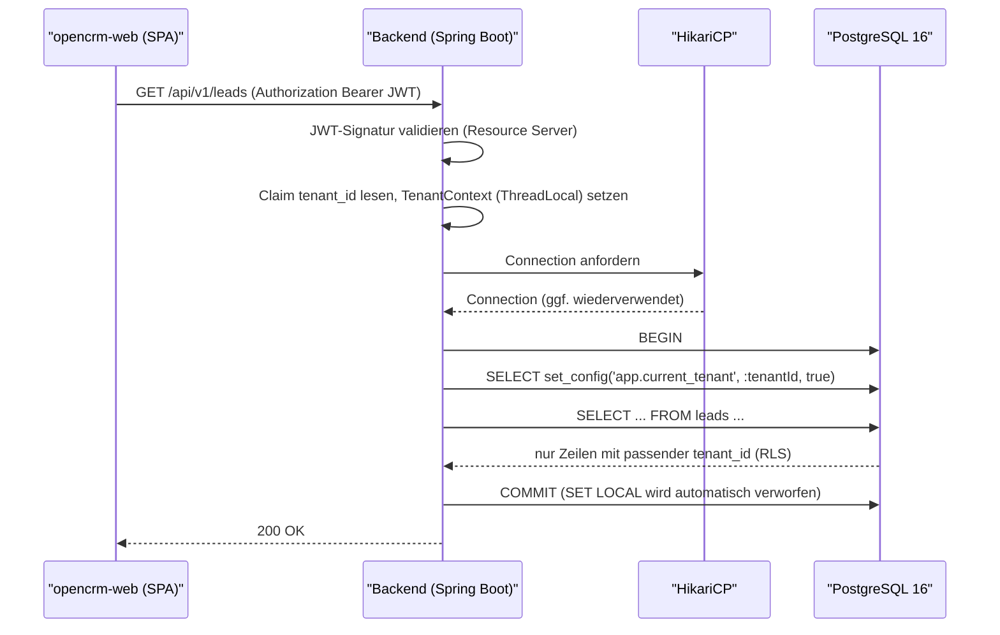
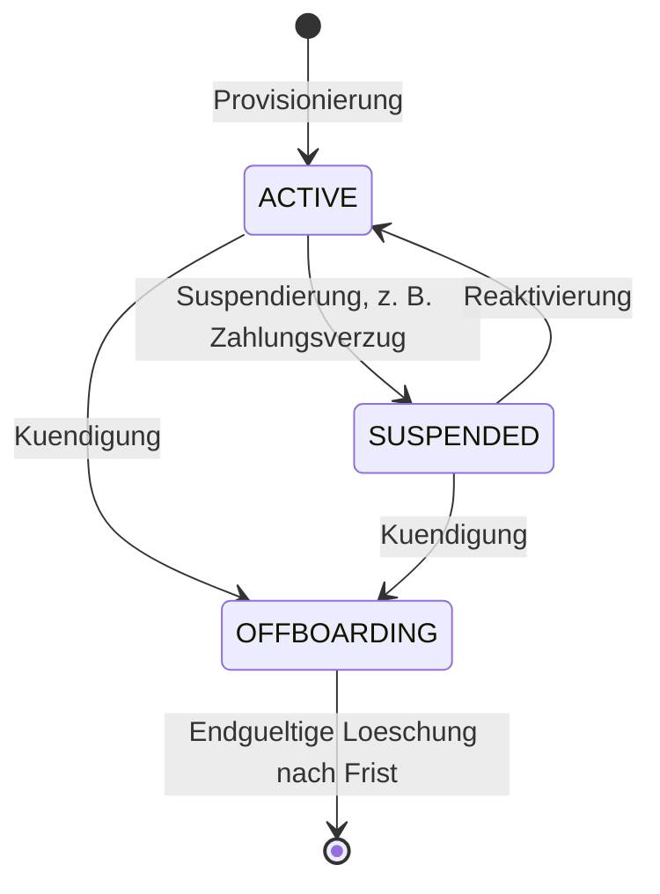

# Multi-Tenancy-Konzept

| Status | Stand | Verantwortlich |
|---|---|---|
| Entwurf | 2026-07-16 | Lead Architecture |

## Zweck

Dieses Dokument beschreibt, wie OpenCRM mehrere Kunden-Organisationen (Mandanten) strikt getrennt auf einer gemeinsamen Plattform betreibt. Es begruendet die Entscheidung fuer Shared Database / Shared Schema mit Row-Level Security (RLS) in PostgreSQL 16, spezifiziert die RLS-Implementierung inklusive Tenant-Kontext in Spring Boot und Spring Batch und definiert Tenant-Lifecycle, Quotas, Test-Strategie und Risiken. Zielgruppe ist das Umsetzungsteam.

## Inhaltsverzeichnis

1. [Isolationsanforderungen](#1-isolationsanforderungen)
2. [Optionsvergleich und Entscheidung](#2-optionsvergleich-und-entscheidung)
3. [RLS-Implementierung im Detail](#3-rls-implementierung-im-detail)
4. [Tenant-Kontext in der Anwendung](#4-tenant-kontext-in-der-anwendung)
5. [Tenant-Kontext in Hintergrundjobs](#5-tenant-kontext-in-hintergrundjobs)
6. [Fail-Closed-Verhalten](#6-fail-closed-verhalten)
7. [Plattformweite Betreiber-Zugriffe](#7-plattformweite-betreiber-zugriffe)
8. [Tenant-Lifecycle](#8-tenant-lifecycle)
9. [Quotas je Plan](#9-quotas-je-plan)
10. [Test-Strategie fuer Isolation](#10-test-strategie-fuer-isolation)
11. [Risiken und Gegenmassnahmen](#11-risiken-und-gegenmassnahmen)
12. [Offene Punkte](#offene-punkte)

## 1. Isolationsanforderungen

Aus den Anforderungen (siehe [01-vision-und-anforderungen.md](01-vision-und-anforderungen.md)) leiten sich folgende Isolationsanforderungen ab:

- **Datenisolation (hart):** Kein Mandant darf Daten eines anderen Mandanten lesen oder schreiben koennen - auch nicht bei Programmierfehlern in der Anwendungsschicht (Defense in Depth: Durchsetzung in der Datenbank, nicht nur im Code).
- **Identitaetsisolation:** Nutzer sind genau einem Mandanten zugeordnet. Die Zuordnung kommt aus Keycloak (Realm `opencrm`, eine Keycloak Organization je Mandant, Claim `tenant_id` im Access Token, siehe [05-authentifizierung-keycloak.md](05-authentifizierung-keycloak.md)).
- **Konfigurationsisolation:** Pipelines, Zuweisungsregeln, Custom Fields, Import-Mappings und Default-Waehrung sind je Mandant getrennt konfigurierbar.
- **Dateiisolation:** Import-/Export-Dateien im Objekt-Storage liegen unter mandantenspezifischen Prefixen (`{tenant_id}/...`); Downloads nur ueber signierte URLs (siehe [08-import-export.md](08-import-export.md)).
- **Betriebsisolation (weich):** Ein Mandant darf die Plattform nicht monopolisieren (Noisy Neighbor); harte Ressourcengarantien je Mandant sind in Phase 1 nicht gefordert.
- **Lifecycle-Isolation:** Suspendierung und Offboarding eines Mandanten duerfen andere Mandanten nicht beeintraechtigen; beim Offboarding muessen alle Daten des Mandanten exportierbar und anschliessend nachweisbar loeschbar sein.
- **Auditierbarkeit:** Mandantenuebergreifende Zugriffe des Betreibers sind auf dedizierte, auditierte Pfade beschraenkt (`audit_log`).

Nicht gefordert (bewusst): physisch getrennte Datenbanken je Mandant, mandantenspezifische Verschluesselungsschluessel, dediziertes Compute je Mandant.

## 2. Optionsvergleich und Entscheidung

| Kriterium | Datenbank pro Tenant | Schema pro Tenant | Shared Schema mit RLS |
|---|---|---|---|
| **Isolation** | Sehr hoch (physisch getrennt, eigene Rollen/Backups) | Hoch (logisch getrennt, gemeinsame Instanz) | Hoch, wenn RLS korrekt und fail-closed umgesetzt ist; Durchsetzung in der DB, unabhaengig vom App-Code |
| **Betriebsaufwand** | Hoch: n Datenbanken provisionieren, ueberwachen, patchen; Connection-Pool je DB | Mittel bis hoch: Schema-Sprawl, Monitoring und Vacuum je Schema, Suchpfad-Verwaltung | Niedrig: eine Datenbank, ein Pool, ein Monitoring |
| **Kosten** | Hoch (Ressourcen-Overhead je DB, kaum Buendelung) | Mittel (gemeinsame Instanz, aber Overhead je Schema: Kataloggroesse, Cache-Verduennung) | Niedrig (maximale Ressourcen-Buendelung, gut fuer viele kleine Mandanten) |
| **Migrationen (Flyway)** | n-fach ausfuehren, Versionsdrift zwischen Mandanten moeglich, lange Rollouts | n-fach je Schema, Flyway-Mehrfachlaeufe, Drift-Risiko | Einmal pro Deployment, alle Mandanten immer auf gleichem Stand |
| **Skalierung (Anzahl Mandanten)** | Schlecht: Verbindungs- und Speicher-Overhead waechst linear, Grenze bei wenigen hundert DBs | Maessig: PostgreSQL-Katalog und Tooling degradieren ab einigen tausend Schemas | Gut: Mandantenzahl ist nur eine Datenfrage; spaeter Partitionierung nach `tenant_id` oder Sharding moeglich |
| **Backup/Restore je Tenant** | Trivial (pg_dump/PITR je DB) | Gut (pg_dump je Schema) | Aufwaendiger: Restore einzelner Mandanten via logischem Export (`COPY ... WHERE tenant_id = ...`) bzw. Vollexport-Funktion; PITR nur global |

**Entscheidung:** Shared Database / Shared Schema mit Spalte `tenant_id` (UUID) auf allen mandantenbezogenen Tabellen plus Row-Level Security. Begruendung und verworfene Alternativen im Detail: [ADR-002](adr/ADR-002-multi-tenancy-shared-schema-rls.md).

Ausschlaggebend: erwartetes Profil "viele kleine bis mittlere Mandanten", ein einziger Flyway-Migrationslauf pro Release, geringster Betriebsaufwand fuer ein kleines Team, und die Tatsache, dass RLS die Isolation in der Datenbank erzwingt statt sie der Disziplin des Anwendungscodes zu ueberlassen. Die Schwaeche beim Tenant-Restore wird durch die ohnehin geforderte Vollexport-Funktion (Offboarding, Abschnitt 8) abgefedert.

## 3. RLS-Implementierung im Detail

### 3.1 DB-Rollen

| Rolle | Zweck | Rechte |
|---|---|---|
| `opencrm_migrator` | Flyway-Migrationen (DDL), Eigentuemer aller Tabellen | `LOGIN`, `NOBYPASSRLS`; DDL im Schema |
| `opencrm_app` | Laufzeitverbindungen der Anwendung (HikariCP) | `LOGIN`, `NOBYPASSRLS`; nur `SELECT/INSERT/UPDATE/DELETE` auf Anwendungstabellen, kein DDL |
| `opencrm_platform_ops` | Ausschliesslich dedizierte Admin-Endpunkte des Betreibers (Abschnitt 7) | `LOGIN`, `BYPASSRLS`; separater, kleiner Connection-Pool |
| `opencrm_reporting` | Ausschliesslich Refresh der materialisierten Sicht `mv_sales_kpis_daily`; Owner der MV, dedizierter Pool der Groesse 1 (siehe [09-dashboard-und-reporting.md](09-dashboard-und-reporting.md)) | `LOGIN`, `BYPASSRLS`; nur `SELECT` auf die benoetigten Basistabellen, nie fuer Request-Verarbeitung |

```sql
CREATE ROLE opencrm_migrator LOGIN NOBYPASSRLS;
CREATE ROLE opencrm_app LOGIN NOBYPASSRLS NOCREATEDB NOCREATEROLE;
CREATE ROLE opencrm_platform_ops LOGIN BYPASSRLS NOCREATEDB NOCREATEROLE;
CREATE ROLE opencrm_reporting LOGIN BYPASSRLS NOCREATEDB NOCREATEROLE;

GRANT SELECT, INSERT, UPDATE, DELETE ON ALL TABLES IN SCHEMA public TO opencrm_app;
ALTER DEFAULT PRIVILEGES FOR ROLE opencrm_migrator IN SCHEMA public
    GRANT SELECT, INSERT, UPDATE, DELETE ON TABLES TO opencrm_app;
```

Wichtig: `opencrm_app` ist **nicht** Eigentuemer der Tabellen und hat kein `BYPASSRLS`. Da Tabelleneigentuemer RLS per Default umgehen, wird zusaetzlich `FORCE ROW LEVEL SECURITY` gesetzt - damit greift RLS selbst dann, wenn versehentlich als `opencrm_migrator` DML ausgefuehrt wird.

### 3.2 ENABLE plus FORCE ROW LEVEL SECURITY

Jede Flyway-Migration, die eine mandantenbezogene Tabelle anlegt, aktiviert RLS unmittelbar:

```sql
ALTER TABLE leads ENABLE ROW LEVEL SECURITY;
ALTER TABLE leads FORCE ROW LEVEL SECURITY;
```

Das gilt fuer alle Tabellen mit Spalte `tenant_id` (siehe [03-datenmodell.md](03-datenmodell.md)). Ausnahmen: `tenants` selbst (plattformglobal, Zugriff nur ueber eingeschraenkte Sichten bzw. Admin-Pfad) sowie reine Kind-Tabellen ohne eigene `tenant_id`-Spalte (`team_members`, `price_list_items`, `pipeline_stages`, `import_job_errors`) - diese erhalten Policies ueber einen `EXISTS`-Join auf die Eltern-Tabelle (Beispiel unten).

### 3.3 Policies

Standardfall ist eine `FOR ALL`-Policy mit `USING` (Lesen/Aendern/Loeschen sichtbarer Zeilen) und `WITH CHECK` (Schreiben neuer/geaenderter Zeilen):

```sql
CREATE POLICY tenant_isolation_leads ON leads
    FOR ALL
    TO opencrm_app
    USING (tenant_id = current_setting('app.current_tenant', true)::uuid)
    WITH CHECK (tenant_id = current_setting('app.current_tenant', true)::uuid);
```

Aequivalente Variante mit getrennten Policies je Kommando - fachlich identisch, nur zu verwenden, wenn ein Kommando abweichende Bedingungen benoetigt:

```sql
CREATE POLICY leads_select ON leads FOR SELECT TO opencrm_app
    USING (tenant_id = current_setting('app.current_tenant', true)::uuid);

CREATE POLICY leads_insert ON leads FOR INSERT TO opencrm_app
    WITH CHECK (tenant_id = current_setting('app.current_tenant', true)::uuid);

CREATE POLICY leads_update ON leads FOR UPDATE TO opencrm_app
    USING (tenant_id = current_setting('app.current_tenant', true)::uuid)
    WITH CHECK (tenant_id = current_setting('app.current_tenant', true)::uuid);

CREATE POLICY leads_delete ON leads FOR DELETE TO opencrm_app
    USING (tenant_id = current_setting('app.current_tenant', true)::uuid);
```

Kind-Tabellen ohne eigene `tenant_id`-Spalte werden ueber die Eltern-Tabelle abgesichert:

```sql
ALTER TABLE pipeline_stages ENABLE ROW LEVEL SECURITY;
ALTER TABLE pipeline_stages FORCE ROW LEVEL SECURITY;

CREATE POLICY tenant_isolation_pipeline_stages ON pipeline_stages
    FOR ALL
    TO opencrm_app
    USING (EXISTS (
        SELECT 1 FROM pipelines p
        WHERE p.id = pipeline_stages.pipeline_id
          AND p.tenant_id = current_setting('app.current_tenant', true)::uuid))
    WITH CHECK (EXISTS (
        SELECT 1 FROM pipelines p
        WHERE p.id = pipeline_stages.pipeline_id
          AND p.tenant_id = current_setting('app.current_tenant', true)::uuid));
```

Zusaetzlich setzt die Anwendung `tenant_id` beim INSERT immer explizit aus dem Tenant-Kontext (JPA-Entity-Listener); die `WITH CHECK`-Klausel ist das Sicherheitsnetz, nicht der Mechanismus.

## 4. Tenant-Kontext in der Anwendung

### 4.1 Ablauf pro Request



### 4.2 Bausteine in Spring

1. **Filter (nach der JWT-Validierung):** liest den Claim `tenant_id` aus dem validierten Access Token, prueft ihn als UUID und legt ihn in einem `TenantContext` (ThreadLocal) ab. Requests ohne gueltigen `tenant_id`-Claim werden mit 401/403 abgelehnt (Ausnahme: dedizierte Admin-Endpunkte, Abschnitt 7). Der Filter raeumt den ThreadLocal im `finally`-Block ab.
2. **Transaktionsgebundener Interceptor:** unmittelbar nach Transaktionsbeginn wird auf der transaktionsgebundenen Connection der Tenant-Kontext gesetzt. Umsetzung als Aspekt bzw. `TransactionSynchronization`, der als erstes Statement der Transaktion ausfuehrt:

```java
// Wird zu Transaktionsbeginn auf der gebundenen Connection ausgefuehrt.
// set_config(key, value, is_local=true) entspricht SET LOCAL,
// ist aber im Gegensatz zu SET LOCAL parametrisierbar (kein SQL-String-Bau).
try (PreparedStatement ps = connection.prepareStatement(
        "SELECT set_config('app.current_tenant', ?, true)")) {
    ps.setString(1, TenantContext.required().toString());
    ps.execute();
}
```

3. **Konvention:** Jeder Datenbankzugriff laeuft in einer Spring-Transaktion (`@Transactional`, auch fuer reine Lesezugriffe mit `readOnly = true`). `SET LOCAL` bzw. `set_config(..., true)` ausserhalb einer Transaktion ist wirkungslos - deshalb ist "keine DB ohne Transaktion" eine harte Regel, die ein ArchUnit-Test absichert.

### 4.3 Warum SET LOCAL statt SET - Zusammenspiel mit HikariCP

HikariCP haelt einen Pool physischer Connections und verteilt dieselbe Connection nacheinander an Requests **unterschiedlicher Mandanten**. Beim Zurueckgeben in den Pool setzt HikariCP nur definierte Attribute zurueck (autoCommit, Isolation Level usw.) - **PostgreSQL-Session-Variablen wie `app.current_tenant` gehoeren nicht dazu**.

- Mit `SET app.current_tenant = ...` (Session-Scope) bliebe der Wert nach Transaktionsende auf der Connection stehen. Der naechste Request, der diese Connection erhaelt und - etwa durch einen Programmierfehler - den Kontext nicht neu setzt, wuerde **mit dem Mandanten des Vorgaengers** arbeiten: ein Cross-Tenant-Leak.
- Mit `SET LOCAL` (bzw. `set_config(..., true)`) ist der Wert strikt auf die laufende Transaktion begrenzt. `COMMIT` und `ROLLBACK` verwerfen ihn automatisch. Eine wiederverwendete Connection traegt damit nie einen alten Tenant-Kontext; ohne neues `SET LOCAL` ist die Variable `NULL` und RLS liefert keine Zeilen (fail-closed, Abschnitt 6).

Ergaenzend wird kein `connection-init-sql` fuer Tenant-Werte verwendet (der Pool kennt keinen Mandanten), und ein Housekeeping-`DISCARD ALL` ist nicht noetig, weil kein Session-State aufgebaut wird.

## 5. Tenant-Kontext in Hintergrundjobs

Hintergrundverarbeitung (Import/Export ueber Spring Batch, Dashboard-Refresh per Scheduler, siehe [08-import-export.md](08-import-export.md) und [09-dashboard-und-reporting.md](09-dashboard-und-reporting.md)) laeuft ausserhalb eines HTTP-Requests - es gibt keinen JWT und keinen Filter. Der Tenant-Kontext wird deshalb **explizit aus Job-Parametern** gesetzt:

- Jeder Spring-Batch-Job erhaelt `tenant_id` als verpflichtenden `JobParameter` (Quelle: die Zeile in `import_jobs` bzw. `export_jobs`, die den Job ausgeloest hat - beide Tabellen tragen selbst `tenant_id`).
- Ein `StepExecutionListener` bzw. Job-Scope-Bean liest den Parameter, validiert ihn gegen `tenants` (Status muss `ACTIVE` sein) und befuellt den `TenantContext` fuer den ausfuehrenden Thread.
- Da Spring Batch chunk-orientiert in **eigenen Transaktionen** arbeitet, setzt derselbe Transaktions-Interceptor wie im Web-Pfad (Abschnitt 4.2) `set_config('app.current_tenant', ..., true)` zu Beginn **jeder Chunk-Transaktion** neu. Es gibt keinen zweiten Mechanismus - ein Codepfad fuer Web und Batch.
- Scheduler-Jobs, die ueber alle Mandanten iterieren (z. B. Refresh-Vorbereitung fuer `mv_sales_kpis_daily`), holen die Tenant-Liste ueber den Admin-Pfad (Abschnitt 7) und starten dann **je Mandant** eine eigene Verarbeitung mit gesetztem Kontext. Es gibt keine "Kontext-freien" Schreibzugriffe auf Mandantendaten.
- Der `TenantContext` wird nach Job-/Step-Ende im `finally`-Block geleert, damit wiederverwendete Worker-Threads keinen alten Kontext tragen.

## 6. Fail-Closed-Verhalten

Die Policies verwenden `current_setting('app.current_tenant', true)`:

- Der zweite Parameter (`missing_ok = true`) sorgt dafuer, dass ein **nicht gesetzter** Kontext keinen Fehler wirft, sondern `NULL` liefert.
- Der Vergleich `tenant_id = NULL` ergibt in SQL `NULL`, was RLS wie `false` behandelt: **SELECT liefert null Zeilen, INSERT/UPDATE/DELETE schlagen an der Policy fehl.** Ein vergessenes `SET LOCAL` fuehrt also nie zu fremden Daten, sondern zu leeren Ergebnissen bzw. Policy-Fehlern.
- Randfall Leerstring: `''::uuid` wuerde einen Cast-Fehler werfen. Die Anwendung setzt daher niemals einen Leerstring; der Interceptor validiert den Wert als UUID, bevor er ihn setzt. Ein zusaetzliches `NULLIF` in den Policies ist damit nicht noetig und wird bewusst weggelassen, um die Policy-Ausdruecke einheitlich und indexfreundlich zu halten.

Bewusste Konsequenz: Ein vergessener Kontext aeussert sich als "leere Liste" statt als Exception und kann dadurch unauffaellig sein. Gegenmassnahmen: der Interceptor wirft eine Exception, wenn bei Transaktionsbeginn kein `TenantContext` vorliegt (ausser auf explizit annotierten Admin-Pfaden); zusaetzlich Metriken/Alerts auf ungewoehnliche 0-Zeilen-Quoten und die Leak-Tests aus Abschnitt 10.

## 7. Plattformweite Betreiber-Zugriffe

Der Betreiber (Realm-Rolle `platform-admin`) benoetigt mandantenuebergreifende Sicht fuer Provisionierung, Support und Betrieb. Grundsaetze:

- **Kein RLS-Bypass im normalen App-Pfad.** Der reguläre Anwendungscode laeuft ausschliesslich als `opencrm_app` und kann RLS nicht umgehen - auch nicht fuer `platform-admin`-Nutzer.
- Mandantenuebergreifende Operationen existieren nur als **dedizierte Admin-Endpunkte** unter `/api/v1/admin/**`, abgesichert ueber die Realm-Rolle `platform-admin` (siehe [10-api-design.md](10-api-design.md)).
- Diese Endpunkte nutzen eine **separate DataSource mit der Rolle `opencrm_platform_ops`** (`BYPASSRLS`), kleiner eigener HikariCP-Pool, getrennt konfiguriert und getrennt gemonitort.
- **Jeder** Aufruf eines Admin-Endpunkts erzeugt einen Eintrag in `audit_log` (`actor_id`, `entity_type`, `action`, betroffener Mandant im `diff`), bevor die eigentliche Operation ausgefuehrt wird.
- Der Funktionsumfang ist bewusst schmal: Tenant-Lifecycle (Abschnitt 8), Quota-Verwaltung, Support-Lesezugriffe. Fachliche CRM-Operationen (Leads bearbeiten usw.) gibt es im Admin-Pfad nicht; fuer Support-Faelle im Mandantenkontext wird ein regulaerer, auditierter Zugang im jeweiligen Mandanten verwendet.

## 8. Tenant-Lifecycle



### 8.1 Provisionierung

Ausgeloest ueber einen Admin-Endpunkt (`platform-admin`), idempotent umgesetzt als orchestrierte Schrittfolge:

1. Zeile in `tenants` anlegen (`status = ACTIVE`, `plan`, `default_currency`, eindeutiger `slug`).
2. Keycloak Organization im Realm `opencrm` anlegen (Name/Alias = `slug`); ersten `tenant-admin`-Nutzer einladen. Der Protocol Mapper liefert ab dann `tenant_id` und `org_slug` in Access Tokens (siehe [05-authentifizierung-keycloak.md](05-authentifizierung-keycloak.md)).
3. Seed-Daten im Tenant-Kontext anlegen (der Provisionierungscode setzt den Kontext explizit auf den neuen Mandanten):
   - **Default-Pipeline**: Eintrag in `pipelines` (`is_default = true`) mit Standard-Stages in `pipeline_stages`.
   - **Default-Team**: Eintrag in `teams` (z. B. Name "Default"); der erste `tenant-admin` wird bei JIT-Provisionierung Mitglied.
   - **Default-Zuweisungsregel**: Eintrag in `assignment_rules` (niedrigste Prioritaet, leere `criteria`, `target_type = TEAM` auf das Default-Team, `strategy = ROUND_ROBIN`) als Fallback der Lead-Zuweisung (siehe [06-lead-management.md](06-lead-management.md)).
4. Objekt-Storage-Prefix `{tenant_id}/` ist rein konventionell, keine Provisionierung noetig.

Schlaegt ein Schritt fehl, wird der Vorgang wiederaufgesetzt (Idempotenz ueber `slug` bzw. Existenzpruefungen), nicht halbfertig belassen.

### 8.2 Suspendierung

- `tenants.status = SUSPENDED` setzen; Keycloak Organization bzw. deren Mitglieder werden deaktiviert (Login scheitert).
- Das Backend prueft den Tenant-Status bei der Request-Autorisierung (gecachter Lookup): Requests suspendierter Mandanten erhalten 403 (`application/problem+json`).
- Laufende und geplante Batch-Jobs des Mandanten werden nicht mehr gestartet; laufende Jobs laufen kontrolliert aus oder werden auf `CANCELLED` gesetzt.
- Daten bleiben vollstaendig erhalten; Reaktivierung ist jederzeit verlustfrei moeglich.

### 8.3 Offboarding

1. `tenants.status = OFFBOARDING`; Zugriff wie bei Suspendierung gesperrt, Ausnahme: `tenant-admin` kann noch Exporte abrufen.
2. **Vollexport**: je Entitaetstyp ein `export_jobs`-Lauf (Format `CSV` oder `JSON`) ueber die regulaere Export-Strecke; Bereitstellung als signierte Download-URLs mit `download_expires_at` (siehe [08-import-export.md](08-import-export.md)).
3. **Loeschfrist**: nach vertraglich vereinbarter Frist (Default 30 Kalendertage, siehe Offene Punkte) endgueltige Loeschung: `DELETE ... WHERE tenant_id = ...` ueber alle Tabellen in FK-sicherer Reihenfolge (Admin-Pfad, auditiert), Loeschen des Objekt-Storage-Prefixes, Loeschen der Keycloak Organization samt Nutzern, zuletzt die `tenants`-Zeile.
4. Loeschnachweis als `audit_log`-Eintrag (`action = DELETE`, `entity_type = TENANT`) plus Betriebsprotokoll. Backups rotieren gemaess Aufbewahrungsfrist aus [11-deployment-und-betrieb.md](11-deployment-und-betrieb.md); eine gezielte Loeschung einzelner Mandanten aus bestehenden Backups erfolgt nicht (branchenueblich, in AVV zu dokumentieren).

## 9. Quotas je Plan

Quotas begrenzen Missbrauch und Noisy-Neighbor-Effekte und bilden die kommerziellen Plaene ab. Grenzwerte werden je `tenants.plan` konfiguriert (zentrale Konfiguration, kein Schemaaenderungsbedarf je Plan). Beispielhafte Startwerte - final mit Produktmanagement abzustimmen:

| Quota | starter | professional | enterprise |
|---|---|---|---|
| Aktive Nutzer (`users.active = true`) | 5 | 25 | unbegrenzt |
| Leads (nicht geloescht) | 10.000 | 100.000 | 1.000.000 |
| Speicher Objekt-Storage (Import/Export) | 1 GB | 10 GB | 100 GB |
| Zeilen je Import-Datei | 10.000 | 50.000 | 100.000 |
| Parallele Export-Jobs | 1 | 2 | 4 |

Die Zeilenlimits je Import-Datei liegen innerhalb des technischen Maximums von 100.000 Zeilen (`ROW_LIMIT_EXCEEDED`, siehe [08-import-export.md](08-import-export.md)). Parallele `EXECUTE`-Importe sind kein Plan-Merkmal: pro Tenant laeuft unabhaengig vom Plan maximal ein `EXECUTE`-Import gleichzeitig, weitere Jobs warten in `PENDING` (ebenfalls [08-import-export.md](08-import-export.md)).

Durchsetzung:

- **Nutzer**: beim Einladen/JIT-Provisionieren; Ueberschreitung liefert 403 mit Fehlercode `quota_exceeded` (`application/problem+json`, Fehlerkatalog in [10-api-design.md](10-api-design.md)).
- **Leads**: beim Anlegen (API) und in der Import-Validierung (Dry Run meldet die Ueberschreitung, Execute bricht kontrolliert ab).
- **Speicher**: Nightly-Job aggregiert Objektgroessen je Prefix; bei Ueberschreitung werden neue Export-/Import-Uploads abgelehnt, Bestandsdaten bleiben lesbar.
- Quota-Auslastung ist fuer `tenant-admin` per API einsehbar; der Betreiber sieht sie ueber den Admin-Pfad.

## 10. Test-Strategie fuer Isolation

Isolation wird automatisiert in CI (GitHub Actions) gegen ein echtes PostgreSQL 16 (Testcontainers) getestet - nicht gegen H2, da RLS dort nicht existiert.

- **Zwei Test-Tenants**: Die Test-Suite provisioniert `tenant-a` und `tenant-b` inklusive Nutzern und Seed-Daten.
- **Tenant-Leak-Tests (Kernmuster)**: Fuer jede Kernentitaet (accounts, contacts, leads, products, opportunities, activities, import_jobs, export_jobs, ...) gilt parametrisiert:
  1. Als `tenant-a` Datensatz anlegen.
  2. Als `tenant-b` Liste abrufen -> Datensatz erscheint nicht; Direktzugriff per ID -> 404 (nicht 403, um Existenz nicht zu verraten).
  3. Als `tenant-b` UPDATE/DELETE auf die ID von `tenant-a` -> 404, Datensatz unveraendert.
  4. INSERT als `tenant-b` mit manipulierter `tenant_id` von `tenant-a` im Payload -> `tenant_id` wird serverseitig ueberschrieben bzw. Request abgelehnt; nie Daten im fremden Mandanten.
- **Fail-Closed-Tests auf SQL-Ebene**: Direkt via JDBC als `opencrm_app` ohne gesetzten Kontext: SELECT liefert 0 Zeilen, INSERT scheitert an der Policy. Mit Kontext `tenant-a`: nur a-Zeilen sichtbar.
- **Policy-Coverage-Test**: Ein Test prueft gegen den Katalog, dass keine Tabelle mit `tenant_id`-Spalte ohne aktivierte und erzwungene RLS existiert - damit kann keine neue Migration die Absicherung vergessen:

```sql
SELECT c.relname
FROM pg_class c
JOIN pg_namespace n ON n.oid = c.relnamespace AND n.nspname = 'public'
JOIN pg_attribute a ON a.attrelid = c.oid AND a.attname = 'tenant_id' AND NOT a.attisdropped
WHERE c.relkind = 'r'
  AND (NOT c.relrowsecurity OR NOT c.relforcerowsecurity
       OR NOT EXISTS (SELECT 1 FROM pg_policy p WHERE p.polrelid = c.oid));
-- Erwartung: 0 Zeilen; jede Treffer-Zeile laesst den Test fehlschlagen.
```

- **Batch-Kontext-Tests**: Ein Import-Job fuer `tenant-a` darf ausschliesslich a-Daten schreiben; ein Job ohne `tenant_id`-JobParameter schlaegt beim Start fehl.
- **Connection-Reuse-Test**: Sequenz zweier Transaktionen unterschiedlicher Mandanten auf einem Pool der Groesse 1 - die zweite Transaktion sieht ohne eigenes `SET LOCAL` keine Daten der ersten.

## 11. Risiken und Gegenmassnahmen

| Risiko | Wirkung | Gegenmassnahmen |
|---|---|---|
| Vergessenes `SET LOCAL` in einem Codepfad | Leere Ergebnisse bzw. fehlgeschlagene Writes (fail-closed), schwer diagnostizierbare Bugs | Ein zentraler Interceptor fuer Web und Batch; Exception bei Transaktionsbeginn ohne `TenantContext`; ArchUnit-Regel "kein Repository-Zugriff ausserhalb @Transactional"; Leak- und Fail-Closed-Tests in CI |
| Session-Kontext ueberlebt Connection-Reuse | Cross-Tenant-Leak | Ausschliesslich `SET LOCAL`/`set_config(..., true)` (transaktionsgebunden), kein `SET`; kein `connection-init-sql` mit Tenant-Bezug; Connection-Reuse-Test (Abschnitt 10) |
| Neue Tabelle ohne RLS-Policy | Luecke in der Isolation | Policy-Coverage-Test gegen den Katalog (Abschnitt 10) als CI-Gate; Migrations-Review-Checkliste |
| Noisy Neighbor (ein Mandant dominiert CPU/IO) | Latenz fuer alle Mandanten | `statement_timeout` fuer `opencrm_app`; Pagination-Limits (max. 200); Quotas fuer Importgroesse und parallele Jobs; Batch-Durchsatzdrosselung; Monitoring je `tenant_id` (Micrometer-Tags); spaeter: getrennte Pools/Read-Replicas |
| RLS verschlechtert Query-Plaene | Langsame Abfragen, Seq Scans | Alle Indexe mandantenbezogener Tabellen beginnen mit `tenant_id` (z. B. `(tenant_id, status)`, `(tenant_id, owner_id)`); `current_setting(...)::uuid` wird vom Planner als stabiler Init-Wert behandelt; `auto_explain` und `pg_stat_statements` im Monitoring ([11-deployment-und-betrieb.md](11-deployment-und-betrieb.md)); bei Bedarf `plan_cache_mode = force_custom_plan` fuer betroffene Statements |
| `BYPASSRLS`-Rolle wird versehentlich im App-Pfad genutzt | Totalverlust der Isolation | `opencrm_platform_ops` nur in der Admin-DataSource konfiguriert; Credentials getrennt (eigene Secrets); Integrationstest, dass die Standard-DataSource als `opencrm_app` verbindet (`SELECT current_user`) |
| Materialisierte Sicht `mv_sales_kpis_daily` unterstuetzt kein RLS | Reporting koennte fremde Aggregate zeigen | `opencrm_app` erhaelt `SELECT` auf die MV (alle anderen Grants entzogen, `REVOKE ALL ... FROM PUBLIC`); jede Query filtert verpflichtend auf `tenant_id`, erzwungen im zentralen `reporting`-Repository und abgesichert durch einen Architektur-Test (Entscheidung in [09-dashboard-und-reporting.md](09-dashboard-und-reporting.md), Abschnitt 5.4) |
| Manipulierter `tenant_id`-Claim | Zugriff auf fremden Mandanten | Claims stammen ausschliesslich aus signierten Keycloak-Tokens (Signaturpruefung als Resource Server); `tenant_id` wird nie aus Request-Parametern uebernommen |

## Offene Punkte

1. **Loeschfristen beim Offboarding**: Default 30 Kalendertage ist ein Platzhalter; endgueltige Frist und Umgang mit Backup-Aufbewahrung sind juristisch (AVV/DSGVO) zu bestaetigen.
2. **Quota-Grenzwerte und Plan-Namen**: Die Tabelle in Abschnitt 9 ist ein technischer Vorschlag; verbindliche Werte und Plan-Bezeichnungen legt das Produktmanagement fest.
3. **Skalierungsschwelle**: Ab welcher Mandanten-/Datenmenge wird Partitionierung nach `tenant_id` (deklarative Partitionen) oder Sharding evaluiert? Vorschlag: Review bei > 50 Mio. Zeilen in `activities` oder > 500 aktiven Mandanten.
4. **Ablage mandantenspezifischer Einstellungen** (z. B. Claim-Selbstzuweisung aus [06-lead-management.md](06-lead-management.md)): Erweiterung der Tabelle `tenants` um eine `settings jsonb`-Spalte vs. eigene Tabelle `tenant_settings` - zu entscheiden mit dem Datenmodell-Team.
