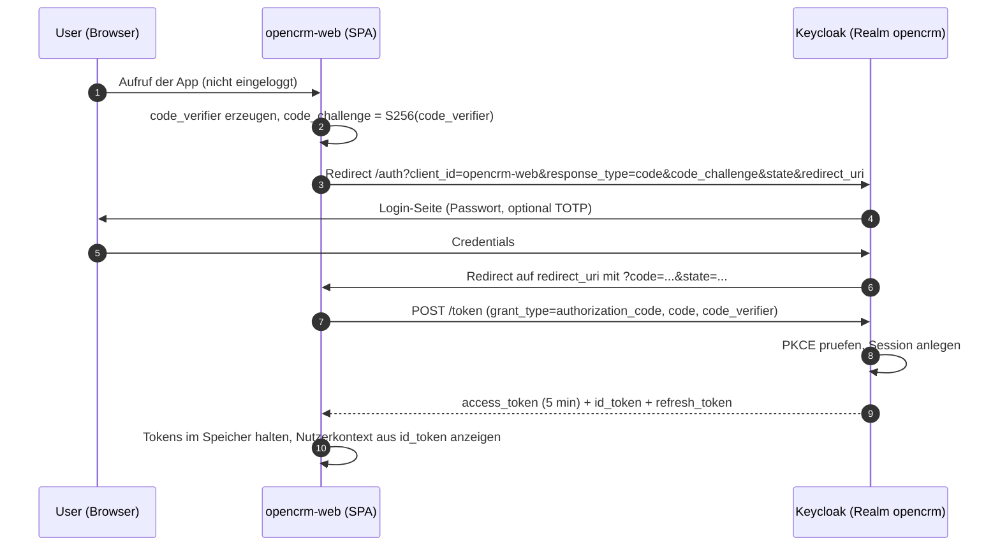
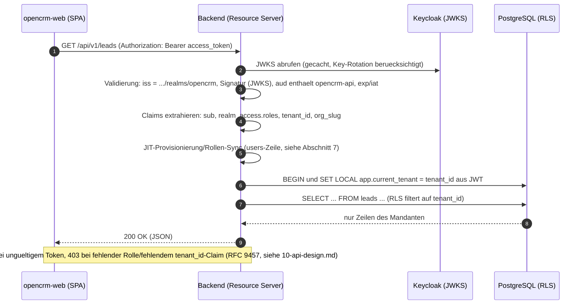
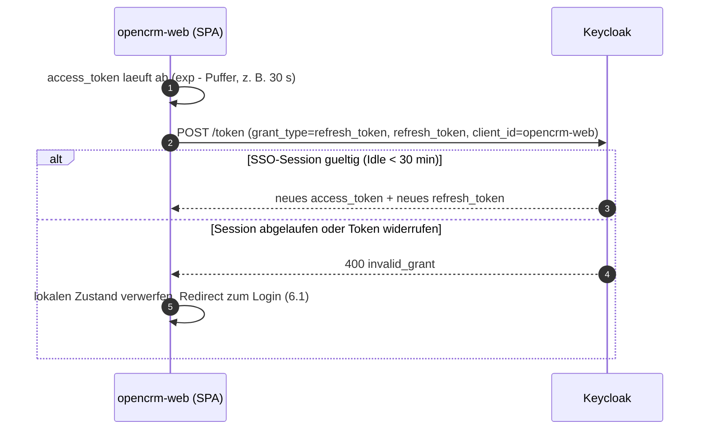
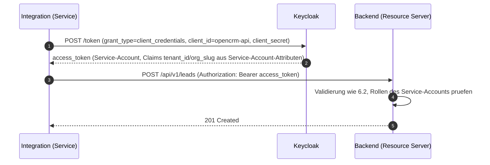

# Authentifizierung und Autorisierung mit Keycloak

| Status | Stand | Verantwortlich |
|---|---|---|
| Entwurf | 2026-07-16 | Lead Architecture |

## Zweck

Dieses Dokument beschreibt die Authentifizierung und die grobgranulare Autorisierung von OpenCRM auf Basis von Keycloak 26. Es legt Realm-Design, Clients, Rollenmodell, Token-Inhalte, Login-/Validierungs-Ablaeufe, JIT-Provisionierung, Logout sowie Sicherheits- und Betriebseinstellungen verbindlich fest. Die feingranulare, datenbezogene Autorisierung (z. B. "sales-rep sieht nur eigene Leads") ist bewusst nicht Teil von Keycloak und wird im Backend umgesetzt (siehe [Abgrenzung](#11-abgrenzung-feingranulare-autorisierung)).

## Inhaltsverzeichnis

1. [OIDC-Grundlagen](#1-oidc-grundlagen)
2. [Realm-Design: ein Realm, Organizations je Mandant](#2-realm-design-ein-realm-organizations-je-mandant)
3. [Clients](#3-clients)
4. [Rollenmodell und Berechtigungsmatrix](#4-rollenmodell-und-berechtigungsmatrix)
5. [Token-Design](#5-token-design)
6. [Ablaeufe (Sequenzdiagramme)](#6-ablaeufe)
7. [JIT-Provisionierung in der App-DB](#7-jit-provisionierung-in-der-app-db)
8. [Logout und Session-Invalidierung](#8-logout-und-session-invalidierung)
9. [Sicherheits-Einstellungen](#9-sicherheits-einstellungen)
10. [Betrieb](#10-betrieb)
11. [Abgrenzung: feingranulare Autorisierung](#11-abgrenzung-feingranulare-autorisierung)
12. [Offene Punkte](#offene-punkte)

## 1. OIDC-Grundlagen

OpenCRM nutzt OpenID Connect (OIDC) auf Basis von OAuth 2.1-Empfehlungen. Die fuer uns relevanten Begriffe:

- **Authorization Server**: Keycloak, Realm `opencrm`. Stellt Access-, ID- und Refresh-Tokens aus.
- **Client**: registrierte Anwendung. OpenCRM verwendet `opencrm-web` (SPA) und `opencrm-api` (Maschinenzugriff).
- **Resource Server**: das Spring-Boot-Backend. Es besitzt keine eigene Session, sondern validiert bei jedem Request das Access Token (JWT) statuslos.
- **Access Token**: kurzlebiges JWT (5 Minuten), traegt Identitaet, Realm-Rollen und die Mandanten-Claims `tenant_id` und `org_slug`.
- **ID Token**: nur fuer das Frontend (Anzeige von Name/E-Mail), wird nie an das Backend gesendet.
- **Refresh Token**: erneuert Access Tokens ohne erneuten Login, gebunden an die SSO-Session (Idle 30 Minuten).
- **Flows**: Authorization Code Flow mit PKCE fuer den Browser (kein Client-Secret in der SPA), Client Credentials fuer Server-zu-Server. Implicit Flow und Resource Owner Password Flow sind deaktiviert.

Endpunkte des Realms (Discovery unter `/.well-known/openid-configuration`):

| Endpunkt | Pfad (relativ zur Keycloak-Basis-URL) |
|---|---|
| Issuer | `/realms/opencrm` |
| Authorization | `/realms/opencrm/protocol/openid-connect/auth` |
| Token | `/realms/opencrm/protocol/openid-connect/token` |
| JWKS | `/realms/opencrm/protocol/openid-connect/certs` |
| Logout (RP-initiated) | `/realms/opencrm/protocol/openid-connect/logout` |

Dev-Basis-URL: `http://localhost:8081` (siehe [11-deployment-und-betrieb.md](11-deployment-und-betrieb.md)).

## 2. Realm-Design: ein Realm, Organizations je Mandant

**Entscheidung**: EIN Realm `opencrm` fuer alle Mandanten. Jeder Mandant wird als Keycloak **Organization** abgebildet (Feature "Organizations", GA seit Keycloak 26). Jeder Nutzer gehoert in Phase 1 genau einer Organization an. Begruendung und verworfene Alternativen (Realm je Mandant, eigener IdP je Mandant) sind in [ADR-003](adr/ADR-003-keycloak-single-realm-organizations.md) dokumentiert; Kurzfassung:

- **Betreibbarkeit**: ein Realm bedeutet eine Client-Konfiguration, ein Rollenmodell, ein Theme, eine Token-Policy. Realm-pro-Mandant skaliert operativ schlecht (Konfigurationsdrift, Update-Aufwand, Keycloak-Performance bei vielen Realms).
- **Konsistenz mit dem Datenmodell**: die Mandantentrennung liegt in der App-DB (Shared Schema, `tenant_id` + RLS, siehe [04-multi-tenancy.md](04-multi-tenancy.md)). Keycloak liefert dafuer den vertrauenswuerdigen `tenant_id`-Claim; mehr Trennung wird auf IdP-Seite nicht benoetigt.
- **Erweiterbarkeit**: Organizations unterstuetzen spaeter Identity Brokering je Mandant (Kunden-SSO via SAML/OIDC), ohne das Realm-Design zu aendern.

Zuordnung Organization ↔ Tenant:

| Keycloak | App-DB (`tenants`) |
|---|---|
| Organization Alias | `tenants.slug` |
| Organization-Attribut `tenant_id` | `tenants.id` (UUID) |
| Organization Name | `tenants.name` |

Der Tenant-Onboarding-Prozess (siehe [04-multi-tenancy.md](04-multi-tenancy.md)) legt beide Seiten konsistent an: erst `tenants`-Zeile, dann Organization mit Alias = `slug` und Attribut `tenant_id` = `tenants.id`.

`platform-admin`-Nutzer (Betreiber) gehoeren keiner Organization an und erhalten keinen `tenant_id`-Claim. Das Backend akzeptiert Tokens ohne `tenant_id` ausschliesslich auf Plattform-Admin-Endpunkten (Mandantenverwaltung); alle fachlichen Endpunkte lehnen sie mit 403 ab.

## 3. Clients

### 3.1 opencrm-web (SPA)

| Einstellung | Wert |
|---|---|
| Client ID | `opencrm-web` |
| Typ | public (kein Secret) |
| Flow | Authorization Code + PKCE (S256), `Standard Flow` an, alle anderen Flows aus |
| Redirect URIs (dev) | `http://localhost:5173/auth/callback` |
| Redirect URIs (prod) | `https://app.opencrm.example/auth/callback` (Platzhalter, finale Domain offen) |
| Post-Logout Redirect URIs | `http://localhost:5173/`, `https://app.opencrm.example/` |
| Web Origins | `http://localhost:5173`, `https://app.opencrm.example` (exakte Origins, kein `*`) |
| Wildcards | keine Wildcard-Redirects; exakte URIs pro Umgebung im Realm-Export |

Die SPA verwendet eine gepflegte OIDC-Bibliothek (z. B. `oidc-client-ts` oder `keycloak-js`), haelt Tokens ausschliesslich im Speicher (kein `localStorage`) und erneuert per Refresh Token.

### 3.2 opencrm-api (Service-Client)

| Einstellung | Wert |
|---|---|
| Client ID | `opencrm-api` |
| Typ | confidential (Client Secret, Rotation ueber Betrieb) |
| Flow | `Service Accounts` (client_credentials), Standard Flow aus |
| Verwendung | Maschinenzugriffe auf die REST-API (Integrationen, interne Jobs mit API-Zugriff) |
| Service-Account-Rollen | minimal, pro Integration explizit vergeben |
| Mandantenbezug | Service-Account-Attribute `tenant_id`/`org_slug` je Integration; ein Service-Account pro Mandanten-Integration |

Zusaetzlich dient `opencrm-api` als **Audience**: ein Audience-Mapper am Client-Scope traegt `opencrm-api` in `aud` aller Access Tokens ein; das Backend akzeptiert nur Tokens mit dieser Audience.

## 4. Rollenmodell und Berechtigungsmatrix

Fuenf **Realm-Rollen** (keine Client-Rollen, keine Composite-Hierarchie in Phase 1 - Rollen werden explizit zugewiesen):

- `platform-admin`: Betreiber, mandantenuebergreifend, nur Plattformverwaltung - kein fachlicher Zugriff auf CRM-Daten der Mandanten (Ausnahme: auditierter Support-Zugriff "Assume Tenant", Abschnitt 4.1).
- `tenant-admin`: Administration innerhalb des eigenen Mandanten.
- `sales-manager`: Vertriebsleitung, Team-Scope.
- `sales-rep`: Verkaeufer, Eigen-Scope.
- `read-only`: Lesezugriff auf den gesamten Mandanten (z. B. Controlling).

| Aktion | platform-admin | tenant-admin | sales-manager | sales-rep | read-only |
|---|---|---|---|---|---|
| Mandanten anlegen/sperren (`tenants`) | Ja | - | - | - | - |
| Benutzer verwalten, Teams anlegen/umbenennen/loeschen | - | Ja | - | - | - |
| Team-Mitglieder pflegen (`team_members`, inkl. `is_lead`) | - | Ja | Ja | - | - |
| Tenant-Einstellungen aendern (Default-Waehrung, Custom Fields, Claim-Option) | - | Ja | - | - | - |
| Assignment-Regeln pflegen (`assignment_rules`) | - | Ja | Ja | - | - |
| Lead zuweisen (manuell) | - | Ja | Ja | - | - |
| Lead selbst uebernehmen ("Claim", falls je Tenant aktiviert) | - | Ja | Ja | Ja | - |
| Leads/Accounts/Contacts anlegen und bearbeiten | - | Ja | Ja | Ja (eigene) | - |
| Opportunities anlegen und bearbeiten | - | Ja | Ja | Ja (eigene) | - |
| Produkte/Preislisten pflegen | - | Ja | Ja | - | - |
| Import starten (`import_jobs`) | - | Ja | Ja | - | - |
| Export starten (`export_jobs`) | - | Ja | Ja | Ja (eigener Datenscope) | Ja |
| Dashboard-Scope | keine fachlichen KPIs | ganzer Mandant | eigenes Team | eigene KPIs + anonymisierter Team-Durchschnitt | ganzer Mandant |
| Audit-Log einsehen | Plattform-Ereignisse | Ja (Mandant) | - | - | - |

Die Spaltenwerte "eigene"/"eigenes Team" sind **Datenscopes**, die das Backend durchsetzt (siehe Abschnitt 11); Keycloak kennt nur die Rollenzugehoerigkeit. Massgeblich fuer die Rechte je Operation ist der Endpunkt-Katalog in [10-api-design.md](10-api-design.md); diese Matrix ist die Zusammenfassung. Details zu Lead-Aktionen in [06-lead-management.md](06-lead-management.md), Dashboard-Sichtbarkeit in [09-dashboard-und-reporting.md](09-dashboard-und-reporting.md).

### 4.1 Support-Zugriff "Assume Tenant" (E-05)

Fuer Support-Faelle startet ein `platform-admin` eine zeitlich begrenzte Support-Session auf einen Ziel-Mandanten ("Assume Tenant"): maximal 4 Stunden, ein expliziter Grund ist Pflicht. Das Backend setzt dafuer den Tenant-Kontext des Ziel-Mandanten (regulaerer RLS-Pfad, kein Bypass, siehe [04-multi-tenancy.md](04-multi-tenancy.md), Abschnitt 7); alle Aktionen werden im `audit_log` mit Support-Kennzeichnung erfasst, und die tenant-admins des betroffenen Mandanten werden automatisch benachrichtigt. Es sind keine neuen Token-Claims noetig - die Autorisierung der Support-Session liegt vollstaendig im Backend.

## 5. Token-Design

### 5.1 Beispiel-Access-Token (Payload)

```json
{
  "iss": "https://auth.opencrm.example/realms/opencrm",
  "sub": "8f14e45f-ceea-467f-a4d1-91f4d0f0c001",
  "aud": ["opencrm-api"],
  "azp": "opencrm-web",
  "typ": "Bearer",
  "exp": 1752662700,
  "iat": 1752662400,
  "jti": "b3c1a9d2-5c7e-4f7a-9d2e-1a2b3c4d5e6f",
  "preferred_username": "m.schneider",
  "email": "m.schneider@acme.example",
  "realm_access": {
    "roles": ["sales-rep"]
  },
  "tenant_id": "0b7e6f3a-2d4c-4e8b-9a1f-6c5d4e3f2a10",
  "org_slug": "acme"
}
```

Verbindliche Custom Claims: `tenant_id` (UUID als String, Quelle fuer `SET LOCAL app.current_tenant`) und `org_slug` (Anzeige/Logging). Das Backend behandelt `tenant_id` als einzige vertrauenswuerdige Mandantenquelle; Header oder Request-Parameter werden dafuer nie akzeptiert (siehe [04-multi-tenancy.md](04-multi-tenancy.md)).

### 5.2 Protocol-Mapper-Konfiguration

Fuehrende Datenquelle ist die **Organization** (Attribut `tenant_id`, Alias als `org_slug`). Da Keycloak 26 keinen Standard-Mapper "Organization-Attribut → beliebiger Claim" mitbringt, werden die Werte beim Anlegen der Organization-Mitgliedschaft (Onboarding/Benutzeranlage ueber die Admin-API) als **User-Attribute** synchronisiert und ueber Standard-Mapper vom Typ "User Attribute" ausgeliefert. Damit bleiben wir bei stabilen Keycloak-Bordmitteln (kein Custom-SPI in Phase 1).

Mapper im Client Scope `opencrm-claims` (Default Scope fuer `opencrm-web` und `opencrm-api`):

| Mapper-Name | Typ | Quelle | Token Claim Name | Claim JSON Type | Access Token | ID Token |
|---|---|---|---|---|---|---|
| `tenant-id` | User Attribute | User-Attribut `tenant_id` (synchronisiert aus Organization-Attribut) | `tenant_id` | String | Ja | Ja |
| `org-slug` | User Attribute | User-Attribut `org_slug` (synchronisiert aus Organization Alias) | `org_slug` | String | Ja | Ja |
| `audience-opencrm-api` | Audience | statisch | `aud` | - | Ja | Nein |

Invariante: die Synchronisation laeuft ausschliesslich ueber den Onboarding-/Provisionierungsprozess; manuelles Editieren der User-Attribute ist organisatorisch untersagt und wird per Admin-Event-Logging ueberwacht. Ein Nutzer ohne `tenant_id`-Attribut erhaelt ein Token ohne Claim und kommt damit an keinem fachlichen Endpunkt vorbei.

## 6. Ablaeufe

### 6.1 Browser-Login (Authorization Code + PKCE)



### 6.2 API-Call: Validierung und Tenant-Kontext



Spring-Konfiguration (Ausschnitt, dev):

```yaml
spring:
  security:
    oauth2:
      resourceserver:
        jwt:
          issuer-uri: http://localhost:8081/realms/opencrm
          audiences: opencrm-api
```

### 6.3 Token-Refresh



### 6.4 client_credentials (Server-zu-Server)



Service-Accounts erhalten keinen Refresh Token; sie holen bei Bedarf ein neues Token (Client-Bibliothek cached bis kurz vor `exp`).

## 7. JIT-Provisionierung in der App-DB

Die App-DB fuehrt in `users` einen Spiegel der Keycloak-Nutzer (Fremdschluessel-Ziel fuer `owner_id`, `created_by` usw.). Provisionierung erfolgt **Just-in-Time** im Backend-Request-Filter nach erfolgreicher Token-Validierung:

1. **Erster Login** (kein `users`-Eintrag mit `keycloak_id = sub`): Zeile anlegen mit `tenant_id` aus dem Claim, `email`, `display_name` (aus `preferred_username`/`email`), `role`, `active = true`.
2. **Jeder Login/Request mit frischem Token**: Rollen-Sync - `role` wird aus `realm_access.roles` abgeleitet (hoechste Rolle nach Rangfolge `tenant-admin > sales-manager > sales-rep > read-only`); geaenderte `email`/`display_name` werden nachgezogen. Der Sync ist idempotent und wird pro Session gecacht (z. B. ein Sync pro `sub` und 5-Minuten-Fenster), um Schreiblast zu vermeiden.
3. `platform-admin`-Tokens (ohne `tenant_id`) werden **nicht** in `users` provisioniert.

```sql
INSERT INTO users (tenant_id, keycloak_id, email, display_name, role, active)
VALUES (:tenant_id, :sub, :email, :display_name, :role, true)
ON CONFLICT (keycloak_id) DO UPDATE
   SET email        = EXCLUDED.email,
       display_name = EXCLUDED.display_name,
       role         = EXCLUDED.role,
       updated_at   = now();
```

Konsistenzregeln:

- Weicht der `tenant_id`-Claim vom gespeicherten `users.tenant_id` ab, wird der Request mit 403 abgelehnt und ein Alert ausgeloest (Organization-Wechsel ist in Phase 1 nicht vorgesehen).
- **Deaktivierung**: fuehrend ist Keycloak (`enabled = false` → keine neuen Tokens). Der `tenant-admin` deaktiviert Nutzer ueber die OpenCRM-Oberflaeche; das Backend setzt `users.active = false`, schaltet den Keycloak-Account per Admin-API ab und beendet zusaetzlich dessen aktive Keycloak-Sessions ueber die Admin-API (E-24). Bereits ausgestellte Access Tokens bleiben maximal 5 Minuten gueltig; zusaetzlich prueft der Request-Filter `users.active` und lehnt inaktive Nutzer sofort mit 403 ab. Ein reiner Rollenwechsel (Downgrade) beendet dagegen keine Sessions - hier genuegt die 5-Minuten-Token-Lifetime (E-24). Inaktive Nutzer werden bei Round-Robin-Zuweisungen uebersprungen (siehe [06-lead-management.md](06-lead-management.md)).
- Geloescht wird nicht: `users`-Zeilen bleiben wegen historischer Referenzen (`lead_assignments`, `audit_log`) erhalten, nur `active = false`.

## 8. Logout und Session-Invalidierung

- **RP-initiated Logout**: die SPA ruft den Logout-Endpunkt mit `id_token_hint` und `post_logout_redirect_uri` auf. Keycloak beendet die SSO-Session und invalidiert alle Refresh Tokens dieser Session; danach Redirect zur Startseite.
- **Access Tokens sind statuslos**: ein bereits ausgestelltes Access Token bleibt bis `exp` gueltig (maximal 5 Minuten). Das ist der akzeptierte Kompromiss fuer statuslose Validierung; die kurze Lifetime begrenzt das Fenster.
- **Administrative Invalidierung**: bei Kompromittierung setzt der Betreiber die Realm-weite "not-before"-Policy (Push Revocation) bzw. beendet einzelne Sessions in der Admin-Konsole; das Backend benoetigt dafuer keine Aenderung, da abgelaufene/widerrufene Refresh Tokens beim naechsten Refresh scheitern.
- **Deaktivierung vs. Rollenwechsel (E-24)**: Bei Deaktivierung eines Nutzers beendet das Backend dessen Keycloak-Sessions ueber die Admin-API (Abschnitt 7). Ein Rollenwechsel loest keine Session-Beendigung aus; die 5-Minuten-Lifetime des Access Tokens begrenzt die Wirkzeit der alten Rolle.
- **Idle-Timeout**: ohne Aktivitaet laeuft die SSO-Session nach 30 Minuten ab (Abschnitt 9); der naechste Refresh scheitert und die SPA leitet zum Login.
- Backchannel Logout ist in Phase 1 nicht erforderlich (Backend haelt keine Sessions).

## 9. Sicherheits-Einstellungen

| Bereich | Einstellung (Realm `opencrm`) |
|---|---|
| Passwort-Policy | `length(12) and upperCase(1) and lowerCase(1) and digits(1) and specialChars(1) and notUsername and passwordHistory(5)` |
| MFA (TOTP) | **Pflicht fuer `platform-admin` und `tenant-admin`** (E-04), umgesetzt in Keycloak z. B. ueber Required Action bzw. Conditional OTP im Authentication Flow fuer die betroffenen Rollen. Fuer alle anderen Rollen Opt-in, **je Organization** aktivierbar (Organization-gebundener Authentication Flow). |
| Brute-Force-Detection | aktiviert: max. 5 Fehlversuche, Wartezeit initial 1 min, eskalierend bis 15 min; permanente Sperre nur manuell durch Admin |
| Access Token Lifespan | **5 Minuten** (konfigurierbar) |
| SSO Session Idle | **30 Minuten** (bestimmt effektive Refresh-Gueltigkeit; konfigurierbar) |
| SSO Session Max | 10 Stunden (harte Obergrenze pro Login-Session) |
| Refresh-Token-Rotation | "Revoke Refresh Token" aktiv (jedes Refresh Token einmal verwendbar) |
| E-Mail-Verifikation | Pflicht bei Einladung neuer Nutzer |
| Transport | ausschliesslich HTTPS in prod; `sslRequired=external`; HSTS am Ingress |
| Admin-Konsole | eigener Hostname/Netzsegment, nicht oeffentlich erreichbar; Admin-Events-Logging aktiv |

Alle Lifetimes sind Realm-Konfiguration und ohne Code-Aenderung anpassbar; die genannten Werte sind die verbindlichen Defaults.

## 10. Betrieb

- **Infrastructure as Code**: die Realm-Konfiguration liegt als Export-JSON im Repo (`infra/keycloak/realm-opencrm.json`): Clients, Client Scope `opencrm-claims`, Protocol Mapper, Realm-Rollen, Policies, Authentication Flows. Secrets (Client Secret `opencrm-api`, SMTP) sind **nicht** im Export, sondern werden per Umgebungsvariablen/Secret-Store injiziert. Dev: Import beim Start via `--import-realm` (Docker Compose); prod: idempotenter Import im Deployment (z. B. `keycloak-config-cli`), Aenderungen nur ueber Pull Request. Organizations und Nutzer sind Laufzeitdaten und **nicht** Teil des Exports.
- **Updates**: Keycloak-Minor-/Patch-Updates zeitnah (Security-Fixes), Major-Updates mit Migrationsnotizen-Review und Test-Realm-Durchlauf in Staging. Keycloak migriert sein DB-Schema selbst beim Start; vorher Datenbank-Backup.
- **Datenbank**: Keycloak nutzt eine eigene PostgreSQL-Datenbank (getrennt von der OpenCRM-App-DB, gleicher Cluster moeglich), damit App-Migrationen (Flyway) und Keycloak-Migrationen entkoppelt bleiben.
- **HA (prod)**: mindestens 2 Keycloak-Replikas hinter dem Ingress; verteilter Infinispan-Cache mit Kubernetes-DNS-Discovery fuer Sessions/Token-Metadaten. Fuer Login-Flows sind Sticky Sessions empfohlen, API-seitig irrelevant (statuslose JWT-Validierung). Details in [11-deployment-und-betrieb.md](11-deployment-und-betrieb.md).
- **Monitoring**: Keycloak-Metriken (Prometheus-Endpoint) und Admin-/Login-Events in das zentrale Logging; Alarm auf Brute-Force-Sperren und Fehlerraten am Token-Endpoint.

## 11. Abgrenzung: feingranulare Autorisierung

Keycloak liefert **Authentifizierung, Rollen und Mandanten-Claims - nicht mehr**. Bewusst nicht verwendet werden Keycloak Authorization Services (UMA, Ressourcen-Policies) in Phase 1:

- **Datenscopes im Backend**: Regeln wie "sales-rep sieht nur eigene Leads", "sales-manager sieht sein Team", Dashboard-Sichtbarkeiten und das optionale Claim-Recht liegen als Service-Layer-Logik im Backend (Kombination aus Rolle, `users.id`/`owner_id`, `team_members`). Grundlage sind die Definitionen in [06-lead-management.md](06-lead-management.md) und [09-dashboard-und-reporting.md](09-dashboard-und-reporting.md).
- **Mandantentrennung in der Datenbank**: RLS auf `tenant_id` ist die harte Grenze (siehe [04-multi-tenancy.md](04-multi-tenancy.md)); sie ersetzt keine Objektberechtigungen innerhalb des Mandanten, sondern ergaenzt sie.
- Begruendung: Objektbezogene Regeln haengen an App-Daten (Ownership, Teams), die Keycloak nicht kennt; eine Spiegelung in UMA-Ressourcen wuerde Datenhaltung duplizieren und jede Lead-Zuweisung zu einem Keycloak-Roundtrip machen. Sollte Phase 2 externe Policy-Auswertung benoetigen, ist eine Policy-Engine im Backend (z. B. auf Basis der bestehenden Scope-Logik) der vorgesehene Erweiterungspunkt.

## Offene Punkte

Alle offenen Punkte dieses Kapitels sind entschieden oder terminiert (Stand 2026-07-16) — Details im [Entscheidungsprotokoll](13-entscheidungen.md).

1. **Produktions-Domains** → **E-23**: Platzhalter bleiben bis zur Domain-Entscheidung (EXTERN, E-53); alle URLs sind ueber Konfiguration/Helm-Values gesetzt, nichts ist hart kodiert.
2. **Support-Zugriff "Assume Tenant"** → **E-05**: erlaubt mit Schutzmassnahmen (max. 4 h, Grund Pflicht, Audit-Markierung, Benachrichtigung der tenant-admins), siehe Abschnitt 4.1.
3. **MFA-Governance** → **E-04**: TOTP-Pflicht fuer `platform-admin` und `tenant-admin`; fuer alle anderen Rollen Opt-in, je Organization aktivierbar.
4. **Rollen-Downgrade** → **E-24**: die 5-Minuten-Token-Lifetime genuegt; bei Deaktivierung eines Nutzers werden zusaetzlich seine Keycloak-Sessions ueber die Admin-API beendet.
5. **Identity Brokering** → **E-25**: Phase 2+; Anforderungsaufnahme beim ersten konkreten Kundenbedarf.
