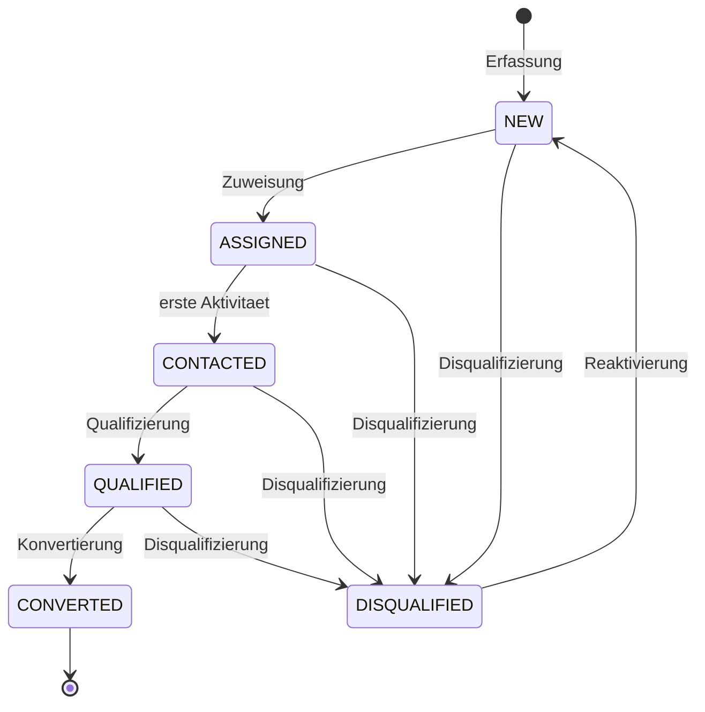
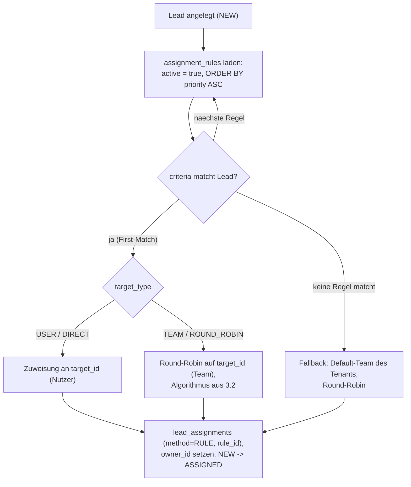
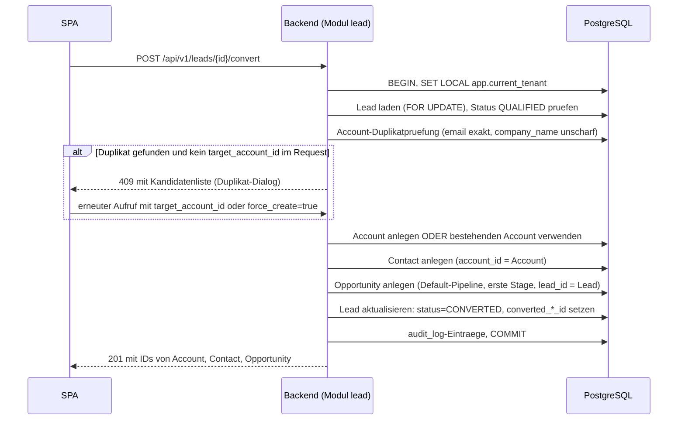

# Lead-Management und Zuweisung

| Status | Stand | Verantwortlich |
|---|---|---|
| Entwurf | 2026-07-16 | Lead Architecture |

## Zweck

Dieses Dokument spezifiziert den vollstaendigen Lead-Lifecycle von OpenCRM: Erfassung, Zuweisung an Verkaeufer (manuell, Round-Robin, regelbasiert), Neuzuweisung, SLA-Ueberwachung, Konvertierung in Account/Contact/Opportunity sowie Duplikaterkennung. Es richtet sich an das Umsetzungsteam des Moduls `lead` und definiert Ablaeufe, Datenzugriffe und Berechtigungen verbindlich. Grundlage sind das Datenmodell aus [03-datenmodell.md](03-datenmodell.md) und die Mandantentrennung aus [04-multi-tenancy.md](04-multi-tenancy.md).

## Inhaltsverzeichnis

1. [Lead-Lifecycle](#1-lead-lifecycle)
2. [Lead-Quellen und Erfassungswege](#2-lead-quellen-und-erfassungswege)
3. [Zuweisung](#3-zuweisung)
4. [Neuzuweisung und Zuweisungshistorie](#4-neuzuweisung-und-zuweisungshistorie)
5. [Kapazitaet und Abwesenheit](#5-kapazitaet-und-abwesenheit)
6. [SLA und Eskalation](#6-sla-und-eskalation)
7. [Konvertierung](#7-konvertierung-lead-zu-account-contact-opportunity)
8. [Duplikaterkennung](#8-duplikaterkennung)
9. [Benachrichtigungen](#9-benachrichtigungen)
10. [Berechtigungen je Rolle](#10-berechtigungen-je-rolle)
11. [Offene Punkte](#offene-punkte)

## 1. Lead-Lifecycle

Ein Lead durchlaeuft die Status `NEW`, `ASSIGNED`, `CONTACTED`, `QUALIFIED`, `DISQUALIFIED`, `CONVERTED` (Spalte `leads.status`). `CONVERTED` ist terminal; `DISQUALIFIED` kann durch Reaktivierung zurueck nach `NEW` wechseln.



### Uebergaenge im Detail

| Uebergang | Wer darf ausloesen | Nebeneffekte |
|---|---|---|
| (neu) → NEW | System (Formular, Import, API), sales-rep, sales-manager, tenant-admin | Duplikatpruefung (Abschnitt 8); `audit_log`-Eintrag `CREATE` |
| NEW → ASSIGNED | sales-manager, tenant-admin (manuell); System (Round-Robin/Regel); sales-rep (Claim, falls je Tenant aktiviert) | Eintrag in `lead_assignments`; `leads.owner_id` gesetzt; Benachrichtigung an Zugewiesenen (Abschnitt 9); `audit_log`-Eintrag `ASSIGN` |
| ASSIGNED → CONTACTED | System, sobald die erste Aktivitaet (`activities` mit `lead_id`) angelegt wird; alternativ manuell durch Owner | Startzeitpunkt fuer KPI Reaktionszeit (siehe [09-dashboard-und-reporting.md](09-dashboard-und-reporting.md)); SLA-Timer wird beendet |
| CONTACTED → QUALIFIED | Owner (sales-rep), sales-manager, tenant-admin | Lead wird fuer Konvertierung freigeschaltet; `audit_log`-Eintrag `UPDATE` |
| NEW/ASSIGNED/CONTACTED/QUALIFIED → DISQUALIFIED | Owner, sales-manager, tenant-admin | Pflichtfeld `disqualified_reason` (Request ohne Grund wird mit 422 abgelehnt); zaehlt in KPI Lead-Conversion als Nenner |
| QUALIFIED → CONVERTED | Owner, sales-manager, tenant-admin | Transaktionale Erstellung Account/Contact/Opportunity (Abschnitt 7); `converted_account_id`, `converted_contact_id`, `converted_opportunity_id` gesetzt; `audit_log`-Eintrag `UPDATE` |
| DISQUALIFIED → NEW | sales-manager, tenant-admin | `disqualified_reason` wird geleert; `owner_id` bleibt erhalten, Status faellt bewusst auf `NEW` zurueck, damit eine erneute Zuweisung sauber protokolliert wird |

Regeln:

- Uebergaenge, die nicht in der Tabelle stehen, lehnt das Backend mit RFC-9457-Problem `409 invalid-state-transition` ab.
- Eine Neuzuweisung (Abschnitt 4) aendert den Status nicht, wenn der Lead bereits ueber `ASSIGNED` hinaus ist; sie erzeugt nur einen weiteren `lead_assignments`-Eintrag.
- Statusaenderungen an konvertierten Leads sind nicht moeglich (terminal).

## 2. Lead-Quellen und Erfassungswege

Die Quelle wird in `leads.source` protokolliert und ist ein zentrales Kriterium fuer die regelbasierte Zuweisung.

| Quelle (`source`) | Erfassungsweg | Besonderheiten |
|---|---|---|
| `WEB_FORM` | Oeffentliches Webformular des Mandanten ruft die API mit dem Service-Client `opencrm-api` (client_credentials, siehe [05-authentifizierung-keycloak.md](05-authentifizierung-keycloak.md)) auf | Serverseitige Validierung, Rate-Limiting je Tenant; Regel-Engine laeuft sofort nach Anlage |
| `IMPORT` | CSV/XLSX-Import ueber `import_jobs` (siehe [08-import-export.md](08-import-export.md)) | Duplikatstrategie `SKIP`/`UPDATE`/`CREATE` aus dem Import-Job; Regel-Engine laeuft optional pro importierter Zeile (Flag am Import-Job) |
| `MANUAL` | Erfassung in der SPA durch sales-rep, sales-manager oder tenant-admin | Erfasst ein sales-rep den Lead selbst, kann er ihn direkt sich selbst zuweisen (implizites Claim) |
| `API` | Externe Systeme ueber `POST /api/v1/leads` mit Token des Service-Clients | `tenant_id` stammt ausschliesslich aus dem JWT-Claim, nie aus dem Payload |
| `EVENT` | Manuell oder per Import nach Messen/Veranstaltungen | Typischerweise mit Custom Field `event_name` (siehe `custom_field_definitions`) |
| `REFERRAL` | Manuell durch Vertrieb | Empfehlung durch Bestandskunden; optionales Custom Field `referred_by` |

Alle Wege erzeugen einen Lead im Status `NEW`. Pflichtfelder bei Anlage: mindestens eines von `company_name` und `last_name` (durchgesetzt per DB-Constraint `leads_name_present`, siehe [03-datenmodell.md](03-datenmodell.md)). Zusaetzlich ist `title` bei Anlage ueber SPA und API Pflicht (Schema `LeadCreate`, siehe [10-api-design.md](10-api-design.md)); beim Datei-Import ist `title` bewusst optional, dort prueft die Validierung nur `company_name` oder `last_name` (siehe [08-import-export.md](08-import-export.md)). `email` und `phone` sind auf allen Wegen optional.

## 3. Zuweisung

Drei Mechanismen setzen `leads.owner_id`, erzeugen je einen Eintrag in `lead_assignments` und loesen den Statuswechsel `NEW → ASSIGNED` aus. Das Feld `lead_assignments.method` unterscheidet `MANUAL`, `ROUND_ROBIN` und `RULE`.

### 3.1 Manuelle Zuweisung

Berechtigt: sales-manager und tenant-admin. Selbstzuweisung ("Claim") durch sales-rep ist optional und wird je Tenant konfiguriert (Tenant-Einstellung `lead_claim_enabled`, Default `false`).

UI-Ablauf (Einzelzuweisung):

1. Manager oeffnet die Lead-Liste (Filter: `status=NEW`, Quelle, Zeitraum) oder die Lead-Detailansicht.
2. Aktion "Zuweisen" oeffnet eine Nutzerauswahl; angezeigt werden nur aktive Nutzer (`users.active = true`) des Mandanten mit Rolle sales-rep oder sales-manager, inklusive aktueller Anzahl offener Leads als Entscheidungshilfe.
3. Bestaetigung ruft `POST /api/v1/leads/{id}/assign` mit `{ "assigned_to": "<user_id>" }` auf.
4. Backend prueft Berechtigung und Zielnutzer, schreibt `lead_assignments` (`method=MANUAL`, `assigned_by=<actor>`), setzt `owner_id` und Status, versendet Benachrichtigungen.

Massenzuweisung:

- In der Lead-Liste selektiert der Manager mehrere Leads (Checkboxen, auch seitenuebergreifend ueber "alle Treffer des Filters").
- `POST /api/v1/leads/bulk-assign` mit `{ "lead_ids": [...], "assigned_to": "<user_id>" }` oder alternativ `{ "lead_ids": [...], "team_id": "<team_id>", "strategy": "ROUND_ROBIN" }` zur gleichmaessigen Verteilung auf ein Team.
- Verarbeitung in einer Transaktion pro Lead (nicht eine Gesamttransaktion), damit ein einzelner Konflikt (z. B. Lead zwischenzeitlich konvertiert) nicht den gesamten Batch abbricht. Antwort listet je Lead Erfolg oder Fehlergrund.
- Obergrenze: 500 Leads pro Aufruf; groessere Mengen laufen ueber den Import-/Regelweg.

Claim (falls aktiviert): `POST /api/v1/leads/{id}/claim` ohne Body; nur zulaessig fuer Leads im Status `NEW`. `assigned_by` bleibt `NULL`, `assigned_to` ist der Aufrufer.

### 3.2 Round-Robin je Team

Round-Robin verteilt Leads reihum an die aktiven Mitglieder eines Teams. Der Zeiger ist persistent, damit die Verteilung Neustarts und parallele Instanzen uebersteht. Dafuer fuehrt das Modul `lead` eine ergaenzende Tabelle:

```sql
CREATE TABLE round_robin_pointers (
    id           uuid PRIMARY KEY DEFAULT gen_random_uuid(),
    tenant_id    uuid NOT NULL,
    team_id      uuid NOT NULL REFERENCES teams(id),
    last_user_id uuid NULL REFERENCES users(id),
    updated_at   timestamptz NOT NULL DEFAULT now(),
    UNIQUE (tenant_id, team_id)
);
-- RLS-Policy analog zu allen mandantenbezogenen Tabellen, siehe 04-multi-tenancy.md
```

Algorithmus (eine Transaktion, Race Conditions werden ueber `SELECT ... FOR UPDATE` auf der Zeigerzeile ausgeschlossen):

```sql
BEGIN;
-- app.current_tenant ist bereits per SET LOCAL gesetzt (siehe 04-multi-tenancy.md)

-- 1. Zeigerzeile anlegen, falls noch nicht vorhanden
INSERT INTO round_robin_pointers (tenant_id, team_id)
VALUES (current_setting('app.current_tenant', true)::uuid, :team_id)
ON CONFLICT (tenant_id, team_id) DO NOTHING;

-- 2. Zeiger exklusiv sperren: parallele Zuweisungen desselben Teams warten hier
SELECT last_user_id
FROM round_robin_pointers
WHERE team_id = :team_id
FOR UPDATE;

-- 3. Naechstes aktives Teammitglied zyklisch bestimmen
--    (inaktive Nutzer werden durch u.active = true uebersprungen)
SELECT u.id AS next_user_id
FROM team_members tm
JOIN users u ON u.id = tm.user_id
WHERE tm.team_id = :team_id
  AND u.active = true
ORDER BY (u.id > COALESCE(:last_user_id, '00000000-0000-0000-0000-000000000000'::uuid)) DESC,
         u.id ASC
LIMIT 1;
-- Sortierung: erst alle IDs groesser als der Zeiger (aufsteigend), sonst Wrap-around
-- zum kleinsten aktiven Mitglied. Kein Treffer => Fehler NO_ACTIVE_TEAM_MEMBER,
-- Lead bleibt in NEW, Eskalation an tenant-admin (Abschnitt 9).

-- 4. Zeiger fortschreiben
UPDATE round_robin_pointers
SET last_user_id = :next_user_id, updated_at = now()
WHERE team_id = :team_id;

-- 5. Zuweisung persistieren
INSERT INTO lead_assignments (tenant_id, lead_id, assigned_to, assigned_by, method, rule_id, assigned_at)
VALUES (current_setting('app.current_tenant', true)::uuid,
        :lead_id, :next_user_id, :actor_or_null, 'ROUND_ROBIN', :rule_id_or_null, now());

UPDATE leads
SET owner_id = :next_user_id,
    status   = CASE WHEN status = 'NEW' THEN 'ASSIGNED' ELSE status END,
    updated_at = now()
WHERE id = :lead_id;

COMMIT;
```

Eigenschaften:

- Die Sperre liegt pro Team, nicht global: Zuweisungen verschiedener Teams blockieren sich nicht.
- Verlassen Mitglieder das Team oder wird der Zeigernutzer inaktiv, funktioniert die zyklische Sortierung weiterhin korrekt (der Zeiger muss nicht auf ein existierendes Mitglied zeigen).
- Benachrichtigungen werden erst nach Commit versendet (`@TransactionalEventListener(phase = AFTER_COMMIT)`).

### 3.3 Regelbasierte Zuweisung

Die Regel-Engine laeuft bei Lead-Anlage ueber `WEB_FORM` und `API` immer, bei `IMPORT` optional (Flag am Import-Job), bei `MANUAL` nie (dort entscheidet der Erfasser). Auswertung: alle Regeln des Tenants mit `active = true`, sortiert nach `priority` aufsteigend, First-Match gewinnt.



#### Aufbau von `assignment_rules.criteria` (jsonb)

Semantik: Objektschluessel sind Lead-Felder; mehrere Schluessel sind UND-verknuepft, Array-Werte je Schluessel ODER-verknuepft. Custom Fields (Werte in `leads.custom`) werden mit dem Praefix `custom.` adressiert. Fuer `score` ist ein Bereichsobjekt mit `min`/`max` zulaessig.

Beispiel 1 - Webformular-Leads mit Produktinteresse "CRM_SUITE" an das Inside-Sales-Team (Round-Robin):

```json
{
  "name": "Webform CRM Suite -> Inside Sales",
  "priority": 10,
  "active": true,
  "criteria": {
    "source": ["WEB_FORM"],
    "custom.product_interest": ["CRM_SUITE"]
  },
  "target_type": "TEAM",
  "target_id": "9f1c2f2e-team-inside-sales",
  "strategy": "ROUND_ROBIN"
}
```

Beispiel 2 - Leads aus der Region DACH mit hohem Score direkt an einen Key-Account-Verkaeufer:

```json
{
  "name": "DACH High-Score -> Key Account",
  "priority": 20,
  "active": true,
  "criteria": {
    "custom.region": ["DE", "AT", "CH"],
    "score": { "min": 70 }
  },
  "target_type": "USER",
  "target_id": "3b7d9a10-user-key-account",
  "strategy": "DIRECT"
}
```

Beispiel 3 - Messe- und Empfehlungs-Leads an das Field-Sales-Team:

```json
{
  "name": "Event/Referral -> Field Sales",
  "priority": 30,
  "active": true,
  "criteria": {
    "source": ["EVENT", "REFERRAL"]
  },
  "target_type": "TEAM",
  "target_id": "c4e8b5d2-team-field-sales",
  "strategy": "ROUND_ROBIN"
}
```

Fallback: Matcht keine Regel, wird der Lead per Round-Robin dem Default-Team des Tenants zugewiesen (Tenant-Einstellung `default_team_id`). Ist kein Default-Team konfiguriert oder hat es keine aktiven Mitglieder, bleibt der Lead in `NEW` und der tenant-admin wird benachrichtigt. Zeigt `target_id` einer Regel auf einen inaktiven Nutzer (`DIRECT`), wird die Regel uebersprungen und die naechste ausgewertet.

## 4. Neuzuweisung und Zuweisungshistorie

- Neuzuweisung erfolgt ueber denselben Endpunkt `POST /api/v1/leads/{id}/assign`; berechtigt sind sales-manager und tenant-admin. Ein sales-rep kann Leads nicht an andere abgeben (nur der Manager verteilt um).
- Jede Zuweisung, auch jede Neuzuweisung, erzeugt einen neuen Eintrag in `lead_assignments`. Die Tabelle ist append-only: Eintraege werden nie geaendert oder geloescht.
- Der jeweils aktuelle Owner steht denormalisiert in `leads.owner_id`; die Historie beantwortet Fragen wie "wer hatte den Lead wann" und ist Grundlage der KPI Reaktionszeit (Zeit von `lead_assignments.assigned_at` bis zur ersten Aktivitaet, siehe [09-dashboard-und-reporting.md](09-dashboard-und-reporting.md)).
- Anzeige in der SPA: Zeitleiste auf der Lead-Detailseite mit `assigned_at`, `assigned_to`, `assigned_by` (leer bei Claim und System-Zuweisung), `method` und ggf. Regelname (ueber `rule_id`).
- Typische Ausloeser fuer Neuzuweisung: SLA-Eskalation (Abschnitt 6), Ausscheiden eines Verkaeufers (Massen-Neuzuweisung aller offenen Leads ueber `bulk-assign`), manuelle Umverteilung.

## 5. Kapazitaet und Abwesenheit

Phase 1:

- `users.active = false` (gesetzt beim Rollen-Sync aus Keycloak oder manuell durch tenant-admin) nimmt einen Nutzer aus Round-Robin und regelbasierter Direktzuweisung heraus. Bestehende Leads behalten ihren Owner; der Manager verteilt bei laengerer Abwesenheit per Massenzuweisung um.
- Die Nutzerauswahl bei manueller Zuweisung zeigt die aktuelle Anzahl offener Leads je Verkaeufer, damit Manager Last manuell ausbalancieren koennen.

Ausblick (nicht Phase 1, siehe [12-roadmap.md](12-roadmap.md)):

- Optionales Tageslimit je Verkaeufer (z. B. `max_leads_per_day`): Round-Robin ueberspringt Nutzer, die ihr Limit erreicht haben; sind alle Mitglieder am Limit, greift der Fallback auf das Default-Team bzw. eine Manager-Benachrichtigung.
- Abwesenheitskalender (geplante Urlaube) mit automatischem, zeitgesteuertem Herausnehmen aus der Verteilung statt des binaeren `active`-Flags.

## 6. SLA und Eskalation

- Je Tenant konfigurierbare Frist `lead_sla_hours` (Default 24), gemessen ab der letzten Zuweisung (`lead_assignments.assigned_at`) bis zur ersten Aktivitaet am Lead (`activities` mit passender `lead_id`, `created_at` nach der Zuweisung).
- Ein Spring-Scheduler prueft alle 15 Minuten alle Leads im Status `ASSIGNED`, deren SLA-Frist ueberschritten ist und fuer die noch keine Eskalation versendet wurde (Markierung `sla_escalated_at` am Lead, ergaenzende Spalte des Moduls `lead`).
- Eskalationsstufe 1: Benachrichtigung (In-App plus E-Mail) an den Owner und an die sales-manager des Teams des Owners.
- Eskalationsstufe 2 (optional je Tenant, `lead_sla_reassign` Default `false`): Nach einer zweiten Frist (Default weitere 24 Stunden ohne Aktivitaet) weist das System den Lead per Round-Robin innerhalb desselben Teams neu zu (`method=ROUND_ROBIN`, `assigned_by=NULL`); der bisherige Owner wird uebersprungen und benachrichtigt.
- Kein Message-Broker in Phase 1: Der Scheduler laeuft im Backend-Prozess; bei mehreren Instanzen sichert eine Advisory-Lock-basierte Leader-Auswahl (`pg_try_advisory_lock`) ab, dass nur eine Instanz eskaliert (Details siehe [11-deployment-und-betrieb.md](11-deployment-und-betrieb.md)).

## 7. Konvertierung Lead zu Account, Contact, Opportunity

Voraussetzung: Lead im Status `QUALIFIED`. Endpunkt: `POST /api/v1/leads/{id}/convert`. Die Konvertierung laeuft vollstaendig in einer Datenbanktransaktion; schlaegt ein Schritt fehl, wird alles zurueckgerollt.



### Feld-Mapping

| Quelle (leads) | Ziel | Anmerkung |
|---|---|---|
| `company_name` | `accounts.name` | Pflicht fuer Neuanlage; fehlt es, verlangt der Dialog eine Eingabe |
| `owner_id` | `accounts.owner_id` | Owner des Leads wird Owner des Accounts |
| `first_name` | `contacts.first_name` | |
| `last_name` | `contacts.last_name` | |
| `email` | `contacts.email` | |
| `phone` | `contacts.phone` | |
| (neuer/gewaehlter Account) | `contacts.account_id` | |
| `title` | `opportunities.name` | Im Dialog ueberschreibbar |
| `owner_id` | `opportunities.owner_id` | |
| `id` | `opportunities.lead_id` | Rueckverweis fuer Reporting |
| (Default-Pipeline des Tenants) | `opportunities.pipeline_id` | `pipelines.is_default = true` |
| (erste Stage nach `sort_order`) | `opportunities.stage_id` | |
| (Tenant-Default) | `opportunities.currency` | `tenants.default_currency` |
| (Dialog-Eingabe, optional) | `opportunities.expected_close_date` | |
| - | `opportunities.amount` | 0.00; Positionen (`opportunity_items`) werden erst nach Konvertierung erfasst, siehe [07-produkte-und-vertriebsprozess.md](07-produkte-und-vertriebsprozess.md) |
| - | `opportunities.status` | `OPEN` |
| `custom` (jsonb) | `leads`-Datensatz bleibt bestehen | Custom Fields werden nicht automatisch uebertragen; Definitionsraeume je `entity_type` sind getrennt |

Am Lead werden gesetzt: `status = CONVERTED`, `converted_account_id`, `converted_contact_id`, `converted_opportunity_id`. Der Lead bleibt les-, aber nicht mehr aenderbar.

### Verhalten bei existierendem Account (Duplikat-Dialog)

- Vor der Neuanlage prueft das Backend auf Kandidaten (Abschnitt 8). Gibt es Treffer und enthaelt der Request weder `target_account_id` noch `force_create=true`, antwortet die API mit `409` (application/problem+json) und einer Kandidatenliste (Account-ID, Name, Stadt, Owner, Similarity-Wert).
- Die SPA zeigt den Duplikat-Dialog: "An bestehenden Account anhaengen" (erneuter Aufruf mit `target_account_id`; Contact und Opportunity werden am bestehenden Account angelegt, dessen `owner_id` bleibt unveraendert) oder "Trotzdem neu anlegen" (`force_create=true`).
- Optional kann der Aufrufer die Contact-Anlage unterdruecken (`create_contact=false`), wenn der Ansprechpartner am Account bereits existiert.

## 8. Duplikaterkennung

Duplikaterkennung laeuft an zwei Stellen: bei Lead-Anlage (Warnung/Import-Strategie) und bei Konvertierung (Account-Kandidaten).

- Exakte Treffer: `lower(leads.email) = lower(:email)` innerhalb des Tenants gegen `leads` (offene Leads) und `contacts`. Bei Anlage ueber die SPA wird ein Warnhinweis mit Link auf den Treffer gezeigt; die Anlage bleibt moeglich. Beim Import entscheidet `duplicate_strategy` (`SKIP`/`UPDATE`/`CREATE`) aus dem Import-Job (siehe [08-import-export.md](08-import-export.md)).
- Unscharfe Firmennamen: PostgreSQL-Extension `pg_trgm` mit `similarity()` gegen `accounts.name`.

```sql
CREATE EXTENSION IF NOT EXISTS pg_trgm;
CREATE INDEX idx_accounts_name_trgm ON accounts USING gin (name gin_trgm_ops);

-- Kandidatensuche bei Konvertierung (RLS begrenzt implizit auf den Tenant).
-- Wichtig: Nur der Aehnlichkeitsoperator % nutzt den GIN-Index; ein
-- similarity()-Aufruf im WHERE (z. B. similarity(name, :x) >= 0.4) laeuft
-- als Seq Scan ueber alle Accounts des Tenants. Der Schwellwert wird daher
-- pro Transaktion gesetzt (Wert aus der Tenant-Konfiguration, Default 0.4):
SET LOCAL pg_trgm.similarity_threshold = 0.4;

SELECT id, name, city, owner_id, similarity(name, :company_name) AS score
FROM accounts
WHERE deleted_at IS NULL
  AND name % :company_name
ORDER BY score DESC
LIMIT 5;
```

Schwellenwerte (je Tenant konfigurierbar, Defaults):

| Score | Verhalten |
|---|---|
| >= 0.85 | Starker Kandidat: Duplikat-Dialog vorbelegt mit "an bestehenden Account anhaengen" |
| 0.40 - 0.84 | Kandidatenliste im Dialog, keine Vorauswahl |
| < 0.40 | Kein Hinweis, Neuanlage ohne Dialog |

Merge-Konzept (Ausblick, nicht Phase 1): Zwei Datensaetze (Lead/Lead, Account/Account) werden zusammengefuehrt, indem ein Gewinner-Datensatz bestimmt wird und der Verlierer eine Spalte `merged_into` (UUID-Verweis auf den Gewinner) erhaelt und per Soft Delete (`deleted_at`) ausgeblendet wird. Fremdschluessel abhaengiger Datensaetze (Aktivitaeten, Zuweisungen, Contacts) werden auf den Gewinner umgehaengt; der Vorgang wird im `audit_log` protokolliert. Feldkonflikte loest ein Merge-Dialog (Feld fuer Feld waehlbar). Aufnahme in die Roadmap, siehe [12-roadmap.md](12-roadmap.md).

## 9. Benachrichtigungen

Ausloeser im Lead-Kontext:

| Ereignis | Empfaenger | Kanaele |
|---|---|---|
| Zuweisung / Neuzuweisung | Zugewiesener Verkaeufer | In-App plus E-Mail |
| SLA-Eskalation Stufe 1 | Owner plus sales-manager des Teams | In-App plus E-Mail |
| SLA-Re-Assignment (Stufe 2) | Neuer Owner, bisheriger Owner, Manager | In-App plus E-Mail |
| Regel-Fallback fehlgeschlagen (kein Default-Team / keine aktiven Mitglieder) | tenant-admin | In-App plus E-Mail |

Technik (Phase 1, ohne Broker):

- In-App: Persistente Zeilen in einer modulinternen Tabelle `notifications(id, tenant_id, user_id, type, payload jsonb, read_at, created_at)`; die SPA pollt `GET /api/v1/notifications?unread=true` per TanStack Query (Intervall 60 Sekunden) und zeigt ein Badge. Kein WebSocket/SSE in Phase 1.
- E-Mail: Versand ueber Spring Mail/SMTP mit mandantenspezifischem Absendernamen; Templates zweisprachig de/en analog zur Frontend-Lokalisierung.
- Versand strikt nach Transaktions-Commit (`@TransactionalEventListener(phase = AFTER_COMMIT)`), damit keine Benachrichtigung fuer zurueckgerollte Zuweisungen entsteht. Fehlgeschlagener E-Mail-Versand blockiert die Zuweisung nicht (Retry mit Backoff, Fehler-Log).
- Nutzer koennen E-Mail-Benachrichtigungen je Ereignistyp in ihrem Profil deaktivieren; In-App-Benachrichtigungen sind immer aktiv.

## 10. Berechtigungen je Rolle

Rollen gemaess [05-authentifizierung-keycloak.md](05-authentifizierung-keycloak.md). platform-admin agiert mandantenuebergreifend nur fuer Betrieb/Support und nutzt keine fachlichen Lead-Funktionen im Tagesgeschaeft; technisch besitzt er dieselben Rechte wie tenant-admin im jeweiligen Mandantenkontext (jede Nutzung wird im `audit_log` protokolliert).

| Aktion | sales-rep | sales-manager | tenant-admin | read-only |
|---|---|---|---|---|
| Leads sehen | eigene; zusaetzlich nicht zugewiesene, falls Claim aktiviert | alle des eigenen Teams plus nicht zugewiesene | alle im Mandanten | alle im Mandanten |
| Lead anlegen (`MANUAL`) | ja | ja | ja | nein |
| Lead bearbeiten | eigene | Team | alle | nein |
| Zuweisen (einzeln) | nein (nur Claim, falls aktiviert) | ja | ja | nein |
| Massenzuweisung | nein | ja | ja | nein |
| Claim (Selbstzuweisung) | ja, falls je Tenant aktiviert | ja | ja | nein |
| Status aendern (CONTACTED/QUALIFIED) | eigene | Team | alle | nein |
| Disqualifizieren (inkl. `disqualified_reason`) | eigene | Team | alle | nein |
| Reaktivieren (DISQUALIFIED -> NEW) | nein | ja | ja | nein |
| Konvertieren | eigene | Team | alle | nein |
| Loeschen (Soft Delete) | nein | ja (Team) | ja | nein |
| Zuweisungshistorie einsehen | eigene Leads | Team | alle | ja |
| assignment_rules verwalten | nein | ja (anlegen/aendern; DELETE nur tenant-admin, siehe [10-api-design.md](10-api-design.md)) | ja | nein |
| Leads importieren | nein | ja | ja | nein |
| Leads exportieren | eigene | Team | alle | ja |
| SLA-/Claim-/Default-Team-Einstellungen | nein | nein | ja | nein |

Durchsetzung: grob ueber Spring-Security-Rollenpruefung am Endpunkt, fein (Sichtbarkeit "eigene"/"Team") ueber Service-Layer-Filter; die Mandantengrenze sichert unabhaengig davon RLS (siehe [04-multi-tenancy.md](04-multi-tenancy.md)). API-Uebersicht der Lead-Endpunkte in [10-api-design.md](10-api-design.md).

## Offene Punkte

1. Team-Zuordnung von sales-managern fuer die Sichtbarkeit "Team": Genuegt `team_members.is_lead = true` als Kriterium, oder braucht ein Manager Sicht auf mehrere Teams? Entscheidung gemeinsam mit Modul `identity`.
2. Soll die Regel-Engine bei Aenderung eines noch nicht zugewiesenen Leads (Status `NEW`) erneut laufen (z. B. nach Score-Update), oder ausschliesslich einmalig bei Anlage?
3. Schwellenwerte der Duplikaterkennung (0.40/0.85) sind Startwerte; Validierung mit realen Firmennamensdaten eines Pilotmandanten steht aus.
4. SLA-Fristen: Kalenderstunden vs. Geschaeftszeiten des Tenants (Wochenenden/Feiertage). Phase 1 rechnet in Kalenderstunden; Geschaeftszeitenmodell waere eine Tenant-Einstellung mit spuerbarer Komplexitaet.
5. Benachrichtigungs-Polling (60 Sekunden) vs. SSE: Bei vielen gleichzeitigen Nutzern koennte Polling die API unnoetig belasten; Entscheidung nach Lasttest in [11-deployment-und-betrieb.md](11-deployment-und-betrieb.md) dokumentieren.
