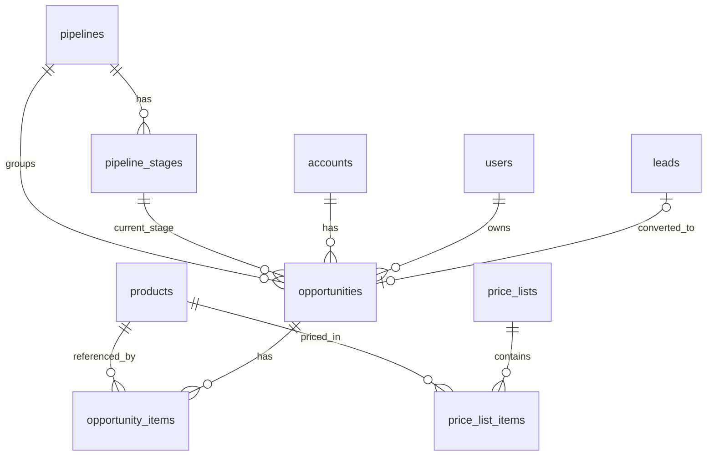
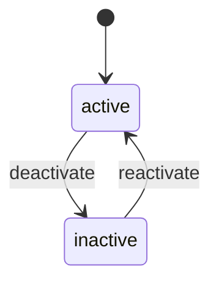
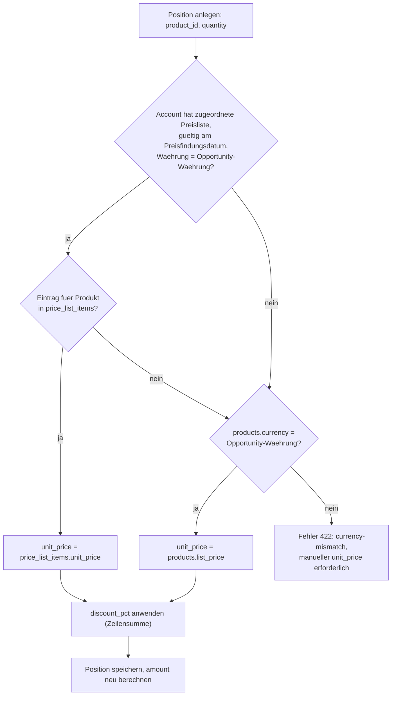
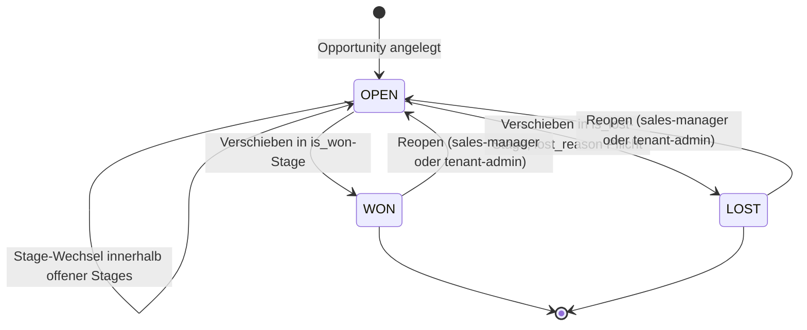
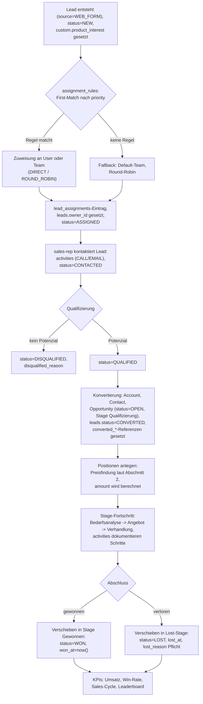

# Produkte und Vertriebsprozess

| Status | Stand | Verantwortlich |
|---|---|---|
| Entwurf | 2026-07-16 | Lead Architecture |

## Zweck

Dieses Dokument spezifiziert den Produktkatalog, die Preisfindung, die Pipeline- und Stage-Konfiguration sowie das Statusmodell und die Betragslogik von Opportunities in OpenCRM. Es definiert die fachlichen Regeln, die das sales-Modul (products/opportunities/pipelines) umsetzt, und beschreibt den End-to-End-Vertriebsprozess vom Lead bis zum gewonnenen Abschluss. Grundlage sind das kanonische Datenmodell (siehe [03-datenmodell.md](03-datenmodell.md)) und das Lead-Management (siehe [06-lead-management.md](06-lead-management.md)).

## Inhaltsverzeichnis

1. [Produktkatalog](#1-produktkatalog)
2. [Preisfindung](#2-preisfindung)
3. [Steuern: Abgrenzung Phase 1](#3-steuern-abgrenzung-phase-1)
4. [Pipelines und Stages](#4-pipelines-und-stages)
5. [Opportunity-Statusmodell](#5-opportunity-statusmodell)
6. [Betrags- und Positionslogik](#6-betrags-und-positionslogik)
7. [Forecast: gewichtete Pipeline](#7-forecast-gewichtete-pipeline)
8. [Produktinteresse am Lead](#8-produktinteresse-am-lead)
9. [End-to-End-Prozess: Lead bis WON](#9-end-to-end-prozess-lead-bis-won)
10. [Reporting-Anknuepfung](#10-reporting-anknuepfung)
11. [Offene Punkte](#offene-punkte)

## Entitaeten im Ueberblick



Alle Tabellen des sales-Moduls tragen `tenant_id` und unterliegen der Row-Level Security (siehe [04-multi-tenancy.md](04-multi-tenancy.md)). Ausnahme: `price_list_items` und `pipeline_stages` haengen ueber ihre Eltern (`price_lists`, `pipelines`) am Tenant; Zugriffe laufen immer ueber einen Join auf die Elterntabelle.

## 1. Produktkatalog

### 1.1 Felder

Die Tabelle `products` traegt die Felder laut Baseline:

| Spalte | Typ | Bedeutung |
|---|---|---|
| id | uuid PK | Primaerschluessel |
| tenant_id | uuid NOT NULL | Mandant |
| sku | text | Artikelnummer, eindeutig je Tenant (siehe 1.4) |
| name | text | Anzeigename |
| description | text | Freitext, optional |
| category | text | Kategorie (siehe 1.2) |
| unit | text | Mengeneinheit (siehe 1.2) |
| list_price | numeric(12,2) | Listenpreis pro Einheit |
| currency | char(3) | ISO-4217-Waehrung des Listenpreises |
| tax_rate | numeric(5,2) | Steuersatz in Prozent, rein informativ (siehe Abschnitt 3) |
| active | boolean | Lebenszyklus-Flag (siehe 1.3) |
| created_at / updated_at | timestamptz | Zeitstempel, UTC |
| deleted_at | timestamptz | Soft Delete (Kernentitaet, siehe [03-datenmodell.md](03-datenmodell.md)) |

### 1.2 Kategorien und Einheiten

- **Kategorien** sind in Phase 1 Freitextwerte je Tenant, keine eigene Tabelle. Die API liefert die im Tenant verwendeten Kategorien als Facette (`GET /api/v1/products/categories`, distinct-Abfrage), damit das Frontend eine Auswahlliste statt Freitexteingabe anbieten kann. Kategorien dienen als Filterkriterium im Katalog, im Dashboard (Filter Produkt/Kategorie) und als Wertevorrat fuer das Lead-Feld `product_interest` (Abschnitt 8).
- **Einheiten** (`unit`) sind ebenfalls Freitext mit empfohlenem Standardvorrat, den das Frontend als Vorschlagsliste anbietet: `piece`, `hour`, `day`, `month`, `year`, `license`, `user`. Die Einheit ist beschreibend; sie geht nicht in Berechnungen ein. Mengen (`opportunity_items.quantity`, numeric(12,3)) erlauben Bruchteile, z. B. 7.5 Stunden.

### 1.3 Lebenszyklus aktiv/inaktiv



Regeln:

- Neue Produkte entstehen mit `active = true`.
- **Deaktivieren** (`active = false`) blendet das Produkt aus der Auswahl fuer **neue** `opportunity_items` aus. Die API lehnt das Anlegen einer Position mit inaktivem Produkt mit HTTP 422 (RFC 9457, `type` = `.../product-inactive`) ab.
- **Bestehende Referenzen bleiben unveraendert**: Historische und offene Opportunities behalten ihre `opportunity_items.product_id`; Anzeige, Reporting und Export funktionieren weiter. Bereits vorhandene Positionen mit inzwischen inaktivem Produkt bleiben editierbar (Menge, Rabatt), nur ein Produktwechsel auf ein inaktives Produkt ist gesperrt.
- **Reaktivieren** ist jederzeit moeglich.
- **Loeschen**: Produkte werden nicht hart geloescht, solange `opportunity_items` oder `price_list_items` referenzieren (FK-Restriktion). Der Standardweg zum Ausmustern ist Deaktivieren; das haelt SKU-Historie und Reporting konsistent.
- Preislisteneintraege inaktiver Produkte bleiben bestehen, werden aber bei der Preisaufloesung fuer neue Positionen nicht mehr benoetigt (das Produkt ist ohnehin nicht waehlbar).

### 1.4 SKU-Eindeutigkeit je Tenant

Die SKU ist je Tenant eindeutig, nicht plattformweit — zwei Mandanten koennen dieselbe SKU verwenden:

```sql
CREATE UNIQUE INDEX uq_products_tenant_sku
    ON products (tenant_id, sku)
    WHERE deleted_at IS NULL;
```

Die Eindeutigkeit ist bewusst als **partieller Unique-Index** umgesetzt (kein voller Constraint): `products` ist eine Soft-Delete-Kernentitaet, und ein geloeschtes Produkt darf die Wiederverwendung seiner SKU nicht blockieren. Massgebliche DDL-Quelle fuer die Flyway-Migrationen ist [03-datenmodell.md](03-datenmodell.md) (Index-Regel "Eindeutigkeit unter Soft Delete").

Der Import (siehe [08-import-export.md](08-import-export.md)) nutzt die SKU als natuerlichen Schluessel fuer die Duplikaterkennung bei `entity_type = PRODUCT` (`duplicate_strategy` SKIP/UPDATE/CREATE; bei CREATE mit vorhandener SKU entsteht ein Zeilenfehler in `import_job_errors` mit `error_code = DUPLICATE_SKU`).

## 2. Preisfindung

### 2.1 Aufloesungsreihenfolge

Beim Anlegen einer Position (`opportunity_items`) schlaegt der Service-Layer den Einzelpreis in dieser Reihenfolge vor:

1. **Preisliste des Accounts**: Ist dem Account der Opportunity eine Preisliste zugeordnet, die zum Preisfindungsdatum gueltig ist (Abschnitt 2.2) und deren Waehrung zur Opportunity passt, und enthaelt sie einen Eintrag fuer das Produkt, gilt `price_list_items.unit_price`.
2. **Listenpreis**: Sonst gilt `products.list_price` (sofern `products.currency` zur Opportunity-Waehrung passt; sonst Fehler, siehe 2.3).
3. **Positionsrabatt**: Auf den ermittelten Einzelpreis wird der positionsbezogene Rabatt `discount_pct` angewandt (Abschnitt 6). Der Rabatt ist Teil der Position, nicht der Preisfindung — er veraendert `unit_price` nicht.

Der aufgeloeste Preis wird als `unit_price` **in die Position kopiert** (Snapshot). Spaetere Aenderungen an Preisliste oder Listenpreis wirken nicht rueckwirkend auf bestehende Positionen. Nutzer mit Schreibrecht auf die Opportunity duerfen den vorgeschlagenen `unit_price` manuell uebersteuern; der Vorschlagswert und die Quelle (PRICE_LIST | LIST_PRICE | MANUAL) werden im `audit_log` (action `UPDATE`, diff) nachvollziehbar.



Referenzabfrage fuer Schritt 1 (Preisfindungsdatum = aktuelles Datum beim Anlegen der Position):

```sql
SELECT pli.unit_price
FROM price_list_items pli
JOIN price_lists pl ON pl.id = pli.price_list_id
WHERE pl.tenant_id = current_setting('app.current_tenant', true)::uuid
  AND pl.id = :account_price_list_id
  AND pli.product_id = :product_id
  AND pl.currency = :opportunity_currency
  AND (pl.valid_from IS NULL OR pl.valid_from <= :pricing_date)
  AND (pl.valid_to IS NULL OR pl.valid_to >= :pricing_date);
```

Hinweis: Das kanonische Datenmodell enthaelt noch kein Feld, das einen Account mit einer Preisliste verknuepft (vorgesehen: `accounts.price_list_id`, nullable, FK auf `price_lists`). Diese Ergaenzung ist mit dem Datenmodell-Kapitel abzustimmen (siehe Offene Punkte).

### 2.2 Gueltigkeitszeitraeume

- `price_lists.valid_from` / `valid_to` begrenzen die Gueltigkeit (Datumsgrenzen, inklusiv). Beide Grenzen sind optional (offene Enden, siehe [03-datenmodell.md](03-datenmodell.md)): `valid_from IS NULL` bedeutet offener Beginn, `valid_to IS NULL` unbefristet.
- Massgeblich ist das **Preisfindungsdatum** = Zeitpunkt des Anlegens bzw. des expliziten Neu-Bepreisens einer Position ("Preise aktualisieren"-Aktion an der Opportunity). Ein Ablauf der Preisliste veraendert bestehende Positionen nicht (Snapshot-Prinzip).
- Ueberlappende Gueltigkeit mehrerer Preislisten ist unkritisch, weil je Account genau eine Preisliste zugeordnet ist; die Zuordnung selbst prueft keine Gueltigkeit — ist die zugeordnete Liste am Preisfindungsdatum ungueltig, greift Stufe 2 (Listenpreis).

### 2.3 Waehrungsregel

- **Eine Waehrung je Opportunity**: `opportunities.currency` wird beim Anlegen gesetzt (Default: `tenants.default_currency`) und ist aenderbar, solange keine Positionen existieren.
- **Positionen erben die Waehrung** der Opportunity; `opportunity_items` traegt bewusst keine eigene Waehrungsspalte. `unit_price` ist immer in der Opportunity-Waehrung zu verstehen.
- Preisquellen in fremder Waehrung (Preisliste oder `products.currency` ungleich Opportunity-Waehrung) werden **nicht umgerechnet**; die Preisfindung liefert dann keinen Vorschlag, und der Nutzer muss `unit_price` manuell setzen (API: 422 `currency-mismatch` beim Versuch der automatischen Uebernahme). Waehrungsumrechnung ist kein Bestandteil von Phase 1.

## 3. Steuern: Abgrenzung Phase 1

`products.tax_rate` ist ein **rein informatives** Feld (z. B. 19.00 fuer den Regelsteuersatz). In Phase 1 gilt:

- Keine Steuerberechnung: Zeilensummen und `opportunities.amount` sind Nettowerte; es gibt keine Brutto-/Nettologik, keine Steuerbetragsfelder.
- Keine Rechnungsstellung, keine Angebots-PDF-Erzeugung, keine Integration in Buchhaltungssysteme.
- `tax_rate` wird im Produktkatalog gepflegt, per Import/Export transportiert und in der Produktdetailansicht angezeigt, damit die Daten bei einer spaeteren Erweiterung (Angebots-/Rechnungsmodul) bereits vorliegen.

## 4. Pipelines und Stages

### 4.1 Konfiguration je Tenant

- `pipelines` und `pipeline_stages` sind je Tenant frei konfigurierbar (tenant-admin; sales-manager lesend). Mehrere Pipelines je Tenant sind zulaessig (z. B. Neukundengeschaeft vs. Bestandskundenausbau); genau eine traegt `is_default = true`.
- `pipeline_stages.sort_order` bestimmt die Reihenfolge im Kanban-Board; `probability` (numeric(5,2), Prozentwert 0.00 bis 100.00) speist den gewichteten Forecast (Abschnitt 7).
- Stages mit zugeordneten offenen Opportunities koennen nicht geloescht werden; der tenant-admin muss Opportunities zuerst in eine andere Stage verschieben (API: 409 Conflict).
- Aenderungen an `probability` wirken sofort auf den Forecast (Echtzeit-Query) und ab dem naechsten Refresh auf `mv_sales_kpis_daily`.

### 4.2 Default-Pipeline beim Provisioning

Beim Tenant-Provisioning legt das System eine Default-Pipeline `Sales Pipeline` (`is_default = true`) mit folgenden Stages an:

| sort_order | name | probability | is_won | is_lost |
|---:|---|---:|---|---|
| 1 | Qualifizierung | 10.00 | false | false |
| 2 | Bedarfsanalyse | 25.00 | false | false |
| 3 | Angebot | 50.00 | false | false |
| 4 | Verhandlung | 75.00 | false | false |
| 5 | Gewonnen | 100.00 | true | false |
| 6 | Verloren | 0.00 | false | true |

Der Tenant kann Namen, Reihenfolge und Wahrscheinlichkeiten anschliessend anpassen oder weitere Stages einfuegen.

### 4.3 Regeln fuer is_won/is_lost-Stages

- Jede Pipeline hat **genau eine** Stage mit `is_won = true` und **mindestens eine** Stage mit `is_lost = true` (mehrere Lost-Stages sind erlaubt, z. B. "Verloren an Wettbewerb" / "Kein Budget"). Der Service-Layer erzwingt diese Invariante bei jeder Pipeline-Aenderung.
- Eine Stage kann nicht gleichzeitig `is_won` und `is_lost` sein (`CHECK (NOT (is_won AND is_lost))`).
- Die `is_won`-Stage hat fest `probability = 100.00`, `is_lost`-Stages fest `probability = 0.00`; der Service-Layer normalisiert abweichende Eingaben.
- Das **Verschieben** einer Opportunity in eine `is_won`- bzw. `is_lost`-Stage ist der einzige Weg, den Status auf WON bzw. LOST zu setzen (Abschnitt 5). Umgekehrt setzt das Verschieben aus einer Won/Lost-Stage zurueck in eine offene Stage den Status wieder auf OPEN (Reopen).
- Won/Lost-Stages fliessen nicht in den Pipeline-Wert offener Opportunities ein (KPI-Definition: nur `status = OPEN`).

## 5. Opportunity-Statusmodell



Regeln:

- **OPEN -> WON**: Verschieben in die `is_won`-Stage setzt `status = WON` und `won_at = now()` (UTC). Voraussetzung: mindestens eine Position (`opportunity_items`) existiert; sonst 422 (`.../won-requires-items`), damit Umsatz-KPIs nicht auf leeren Opportunities basieren.
- **OPEN -> LOST**: Verschieben in eine `is_lost`-Stage setzt `status = LOST` und `lost_at = now()`. **`lost_reason` ist Pflicht** — die API lehnt den Uebergang ohne `lost_reason` mit 422 ab. `lost_reason` ist Freitext mit tenant-konfigurierbarer Vorschlagsliste (Phase 1: Freitext).
- **Reopen** (WON -> OPEN, LOST -> OPEN): nur sales-manager und tenant-admin. Verschieben in eine offene Stage setzt `status = OPEN` und leert `won_at` bzw. `lost_at`/`lost_reason`. Jeder Reopen erzeugt einen `audit_log`-Eintrag (action `UPDATE`, diff mit altem Status). Reopens veraendern rueckwirkend KPI-Werte; das ist beabsichtigt (Korrekturfaelle) und wird im Dashboard durch den 15-Minuten-Refresh der materialisierten Sicht sichtbar (siehe [09-dashboard-und-reporting.md](09-dashboard-und-reporting.md)).
- Ein direkter WON <-> LOST-Wechsel ist nicht vorgesehen; der Weg fuehrt ueber Reopen.
- `status`, `won_at`, `lost_at` werden ausschliesslich vom Service-Layer als Folge des Stage-Wechsels gesetzt, nie direkt per API-Feld beschrieben (Konsistenz von Stage und Status).

## 6. Betrags- und Positionslogik

### 6.1 Positionsmodell opportunity_items

| Spalte | Typ | Bedeutung |
|---|---|---|
| id | uuid PK | Primaerschluessel |
| tenant_id | uuid NOT NULL | Mandant (RLS) |
| opportunity_id | uuid FK | Zugehoerige Opportunity |
| product_id | uuid FK | Produkt (Snapshot-Referenz, bleibt bei Deaktivierung bestehen) |
| quantity | numeric(12,3) | Menge, > 0 |
| unit_price | numeric(12,2) | Einzelpreis in Opportunity-Waehrung (Snapshot aus Preisfindung oder manuell) |
| discount_pct | numeric(5,2) | Positionsrabatt in Prozent, 0.00 bis 100.00 |
| position | int | Sortierreihenfolge in der Positionsliste |

Zeilensumme (nicht persistiert, in Anwendungsschicht und Abfragen berechnet):

```
line_total = round(quantity * unit_price * (1 - discount_pct / 100), 2)
```

Gerundet wird **je Zeile** auf 2 Nachkommastellen (kaufmaennisch, `RoundingMode.HALF_UP` in Java bzw. `ROUND()` in PostgreSQL); `amount` ist die Summe der gerundeten Zeilensummen. Damit liefern Anwendungsschicht und SQL-Abgleich identische Werte.

### 6.2 Beispielrechnung

Opportunity in EUR mit drei Positionen:

| position | sku | name | quantity | unit_price | discount_pct | line_total |
|---:|---|---|---:|---:|---:|---:|
| 1 | CRM-LIC-PRO | Lizenz Professional | 25.000 | 49.00 | 10.00 | 1102.50 |
| 2 | CRM-ONB-STD | Onboarding-Paket Standard | 1.000 | 2400.00 | 0.00 | 2400.00 |
| 3 | CRM-SUP-GLD | Support Gold (Monat) | 12.000 | 180.00 | 5.00 | 2052.00 |

Rechenweg Position 1: `25 * 49.00 = 1225.00`; Rabatt 10 % -> `1225.00 * 0.90 = 1102.50`.

`opportunities.amount = 1102.50 + 2400.00 + 2052.00 = 5554.50` (EUR, netto).

### 6.3 amount-Konsistenz: Service-Layer plus Abgleich-Job

`opportunities.amount` (numeric(14,2)) ist die **denormalisierte Summe der Positionen**. Sie existiert, damit Listenansichten, Kanban-Board, Forecast und die materialisierte Sicht ohne Join auf `opportunity_items` auskommen.

- **Berechnung in der Anwendungsschicht**: Jede schreibende Operation auf Positionen (Create/Update/Delete, auch per Import) laeuft durch den Opportunity-Service, der `amount` in derselben Transaktion neu berechnet und schreibt. Es gibt keinen Datenbank-Trigger; die Logik liegt bewusst einmal im Service-Layer (testbar, Rundung identisch zur Anzeige).
- **Nebenlaeufigkeit**: Der Service laedt die Opportunity mit `SELECT ... FOR UPDATE`, bevor Positionen geaendert werden, damit parallele Positionsaenderungen `amount` nicht auf Basis veralteter Zwischenstaende ueberschreiben.
- **Periodischer Abgleich-Job**: Ein naechtlicher Spring-Batch-Job (analog zu den Jobs in [08-import-export.md](08-import-export.md), ohne eigene Job-Tabelle) iteriert ueber alle aktiven Tenants, setzt je Transaktion `SET LOCAL app.current_tenant` und korrigiert Abweichungen:

```sql
WITH calculated AS (
    SELECT oi.opportunity_id,
           SUM(ROUND(oi.quantity * oi.unit_price * (1 - oi.discount_pct / 100), 2)) AS item_sum
    FROM opportunity_items oi
    GROUP BY oi.opportunity_id
)
SELECT o.id, o.amount, COALESCE(c.item_sum, 0) AS item_sum
FROM opportunities o
LEFT JOIN calculated c ON c.opportunity_id = o.id
WHERE o.deleted_at IS NULL
  AND o.amount IS DISTINCT FROM COALESCE(c.item_sum, 0);
```

Gefundene Abweichungen werden korrigiert (`UPDATE opportunities SET amount = ...`), als Micrometer-Counter `opencrm.opportunity.amount.drift` gezaehlt und im Log ausgewiesen. Ein Zaehlerstand ungleich 0 ist ein Bug-Indikator im Service-Layer, kein Normalzustand.

- Opportunities **ohne Positionen** haben `amount = 0`. Ein manuell gepflegter Schaetzbetrag ohne Positionen ist in Phase 1 nicht vorgesehen (siehe Offene Punkte).

## 7. Forecast: gewichtete Pipeline

Definition laut KPI-Baseline (Details in [09-dashboard-und-reporting.md](09-dashboard-und-reporting.md)):

- **Pipeline-Wert** = Summe `amount` offener Opportunities (`status = OPEN`) je Stage.
- **Gewichteter Forecast** = Summe (`amount * stage.probability / 100`), da `probability` als Prozentwert gespeichert ist.

Beispiel (Default-Pipeline, offene Opportunities eines Teams):

| Stage | probability | Summe amount | gewichtet |
|---|---:|---:|---:|
| Qualifizierung | 10.00 | 40000.00 | 4000.00 |
| Bedarfsanalyse | 25.00 | 60000.00 | 15000.00 |
| Angebot | 50.00 | 30000.00 | 15000.00 |
| Verhandlung | 75.00 | 20000.00 | 15000.00 |
| **Summe** | | **150000.00** | **49000.00** |

Der ungewichtete Pipeline-Wert betraegt 150000.00, der gewichtete Forecast 49000.00 (jeweils in Tenant-Default-Waehrung; Opportunities in abweichender Waehrung siehe Offene Punkte). Massgeblich ist immer die **aktuelle** Stage-Zuordnung; eine Historisierung von Stage-Wechseln fuer Verlaufs-Forecasts ist nicht Teil von Phase 1.

## 8. Produktinteresse am Lead

Das Produktinteresse wird am Lead im JSONB-Feld `custom` unter dem Schluessel `product_interest` gefuehrt (Custom Field laut `custom_field_definitions`: `entity_type = LEAD`, `field_key = 'product_interest'`, `field_type = SELECT`; die `options` pflegt der tenant-admin sinnvollerweise entlang der Produktkategorien aus Abschnitt 1.2).

Zwei Verwendungen:

1. **Routing-Kriterium**: `assignment_rules.criteria` (jsonb) kann auf `product_interest` matchen, z. B. `{"product_interest": "CRM_LICENSES"}` — Leads mit diesem Interesse gehen an das darauf spezialisierte Team (Strategie ROUND_ROBIN) oder direkt an einen Spezialisten (DIRECT). Details zur Regelauswertung: [06-lead-management.md](06-lead-management.md).
2. **Vorbefuellung der Opportunity**: Bei der Lead-Konvertierung (Status CONVERTED, Anlage von Account/Contact/Opportunity) uebernimmt der Konvertierungsdialog `product_interest` als Vorauswahl: Die Produktauswahl fuer die erste Position wird auf die passende Kategorie vorgefiltert, und der Opportunity-Name wird mit Lead-Titel plus Interesse vorbelegt. Es werden **keine Positionen automatisch angelegt** — Menge und Preis erfordern eine bewusste Nutzerentscheidung.

## 9. End-to-End-Prozess: Lead bis WON



Ablaufnotizen:

- Die Lead-Statuskette und die Zuweisungsmechanik (manuell, Round-Robin, regelbasiert) sind in [06-lead-management.md](06-lead-management.md) spezifiziert; dieses Dokument haengt sich ab der Konvertierung ein.
- Die Konvertierung ist eine Transaktion: Account (oder Zuordnung zu bestehendem Account), Contact, Opportunity und die Rueckreferenzen `converted_account_id` / `converted_contact_id` / `converted_opportunity_id` am Lead entstehen atomar; `opportunities.lead_id` verweist zurueck auf den Lead.
- Die neue Opportunity startet in der ersten offenen Stage (`sort_order = 1`) der Default-Pipeline des Tenants; Pipeline und Stage sind im Dialog aenderbar.
- `opportunities.owner_id` wird mit `leads.owner_id` vorbelegt (der zugewiesene Verkaeufer fuehrt den Deal weiter), ist aber aenderbar.

## 10. Reporting-Anknuepfung

Die KPI-Definitionen und die technische Umsetzung (`mv_sales_kpis_daily`, 15-Minuten-Refresh, Echtzeit-Queries fuer den laufenden Tag, Sichtbarkeitsregeln je Rolle) stehen in [09-dashboard-und-reporting.md](09-dashboard-und-reporting.md). Dieses Kapitel liefert die Quelldaten:

| KPI | Gespeiste Felder aus diesem Kapitel |
|---|---|
| Umsatz | `opportunities.amount`, `status = WON`, `won_at` (Zeitraum), `owner_id` (Verkaeufer/Team), `currency` |
| Pipeline-Wert je Stage | `opportunities.amount`, `status = OPEN`, `stage_id`, `pipeline_id` |
| Gewichteter Forecast | zusaetzlich `pipeline_stages.probability` |
| Win-Rate | `status` (WON/LOST), `won_at` / `lost_at` (Zeitraum) |
| Durchschnittlicher Sales-Cycle | `won_at - created_at` gewonnener Opportunities |
| Filter Produkt/Kategorie | `opportunity_items.product_id` -> `products.category`; Filterung auf Opportunity-Ebene ueber Existenz passender Positionen |
| Lost-Analyse | `lost_reason`, `lost_at` (Auswertung der Verlustgruende je Zeitraum) |

Konsequenzen fuer die Umsetzung:

- `won_at`, `lost_at`, `status`, `stage_id`, `owner_id` und `amount` muessen fuer die materialisierte Sicht stabil und ausschliesslich ueber die Service-Layer-Uebergaenge aus Abschnitt 5 gepflegt sein — genau deshalb sind Direkt-Updates dieser Felder per API ausgeschlossen.
- Der Produkt-/Kategorie-Filter des Dashboards benoetigt einen Index auf `opportunity_items (tenant_id, product_id)`; Details zur Indexstrategie in [03-datenmodell.md](03-datenmodell.md).
- Reopens (Abschnitt 5) veraendern historische KPI-Werte; das Dashboard zeigt immer den aktuellen Datenstand, keine eingefrorenen Snapshots.

## Offene Punkte

1. **Account-Preislisten-Verknuepfung**: Das kanonische Datenmodell enthaelt noch kein Verknuepfungsfeld. Vorschlag: `accounts.price_list_id` (nullable, FK auf `price_lists`, 1:1-Zuordnung je Account). Entscheidung und Aufnahme in [03-datenmodell.md](03-datenmodell.md) stehen aus; Alternative waere eine n:m-Zuordnung mit Prioritaet, die fuer Phase 1 als zu komplex eingeschaetzt wird.
2. **Mengenstaffeln**: `price_list_items` kennt keinen Staffelpreis (z. B. `min_quantity`). Bedarf fuer Phase 2 klaeren; das Positions-Snapshot-Prinzip bliebe davon unberuehrt.
3. **Schaetzbetrag ohne Positionen**: Soll eine frisch konvertierte Opportunity einen manuellen Schaetzwert fuehren duerfen, bis Positionen existieren (`amount` waere dann zeitweise nicht positionsgedeckt)? Aktuelle Festlegung: nein, `amount = 0` ohne Positionen — Auswirkung auf Forecast-Aussagekraft in fruehen Stages pruefen.
4. **Multi-Currency im Reporting**: Opportunities in abweichender Waehrung koennen in Tenant-KPIs nicht sauber summiert werden; Quelle und Pflege von Umrechnungskursen sind ungeklaert (Abstimmung mit [09-dashboard-und-reporting.md](09-dashboard-und-reporting.md)); Phase 1 weist gemischte Waehrungen getrennt aus.
5. **Vorschlagsliste fuer lost_reason**: Freitext vs. tenant-konfigurierbare Auswahlliste (bessere Auswertbarkeit der Lost-Analyse). Phase 1 startet mit Freitext; Entscheidung fuer die Auswahlliste inkl. Migration bestehender Werte offen.
