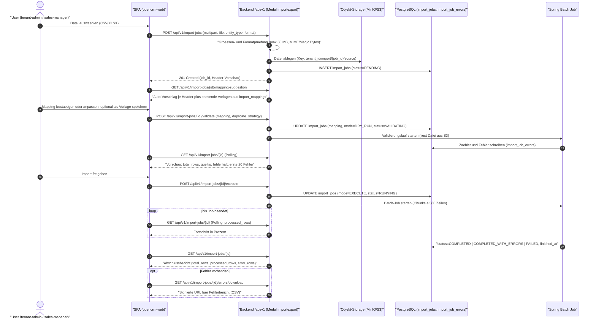
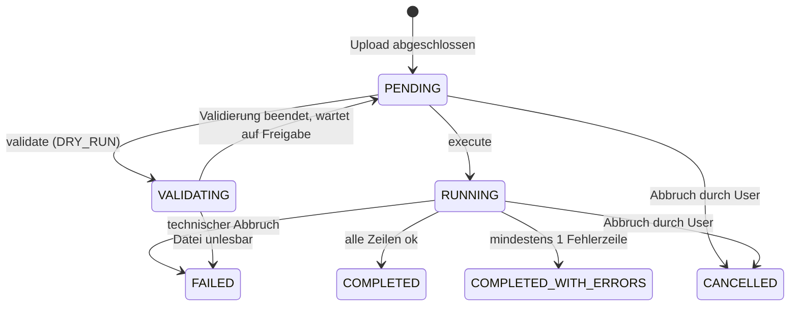

# Import und Export

| Status | Stand | Verantwortlich |
|---|---|---|
| Entwurf | 2026-07-16 | Lead Architecture |

## Zweck

Dieses Dokument spezifiziert die Import- und Exportfunktionen von OpenCRM: Datei-Import ueber die UI (CSV, XLSX), den programmatischen Weg ueber die REST-API, den Datei-Export (CSV, XLSX, JSON) sowie die DSGVO-Datenauskunft. Es beschreibt Ablaeufe, Validierungsregeln, Duplikatbehandlung, die technische Umsetzung mit Spring Batch und die Sicherheitsanforderungen. Zielgruppe ist das Umsetzungsteam des Moduls `importexport`.

## Inhaltsverzeichnis

1. [Ueberblick der Wege](#1-ueberblick-der-wege)
2. [Unterstuetzte Entitaeten](#2-unterstuetzte-entitaeten)
3. [Import-Ablauf](#3-import-ablauf)
4. [Spalten-Mapping](#4-spalten-mapping)
5. [Validierung je Entitaet](#5-validierung-je-entitaet)
6. [Duplikatstrategien](#6-duplikatstrategien)
7. [Batch-Technik](#7-batch-technik)
8. [Fehlerbericht](#8-fehlerbericht)
9. [Export](#9-export)
10. [DSGVO-Datenauskunft](#10-dsgvo-datenauskunft)
11. [Sicherheit](#11-sicherheit)
12. [Offene Punkte](#offene-punkte)

## 1. Ueberblick der Wege

OpenCRM bietet vier Wege, Daten in das System hinein- und herauszubringen. Alle Wege sind strikt tenant-gebunden (siehe [04-multi-tenancy.md](04-multi-tenancy.md)) und werden im `audit_log` protokolliert.

| Weg | Richtung | Formate | Ausfuehrung | Zielgruppe |
|---|---|---|---|---|
| UI-Datei-Import | Import | CSV, XLSX | asynchron (Spring Batch, `import_jobs`) | tenant-admin, sales-manager |
| REST-API | Import/Export | JSON | synchron je Request (`/api/v1/...`) | Integrationen ueber Service-Client `opencrm-api` |
| UI-Export | Export | CSV, XLSX, JSON | asynchron (Spring Batch, `export_jobs`) | alle Rollen im Rahmen ihrer Sichtbarkeit |
| DSGVO-Datenauskunft | Export | JSON | asynchron (`export_jobs`) | tenant-admin |

Abgrenzungen:

- Die REST-API ist der programmatische Weg fuer Einzeloperationen und kleine Batches (Create/Update ueber die regulaeren Endpunkte, siehe [10-api-design.md](10-api-design.md)). Massendaten laufen ausschliesslich ueber den Datei-Import; die API-Endpunkte des Moduls `importexport` steuern lediglich die Jobs.
- Ein Message-Broker kommt in Phase 1 bewusst nicht zum Einsatz; die Job-Steuerung laeuft vollstaendig ueber die PostgreSQL-Tabellen `import_jobs` und `export_jobs` plus Spring Batch (siehe [02-systemarchitektur.md](02-systemarchitektur.md)).
- **Ausblick Phase 2: Webhooks.** Ausgehende Ereignisse (z. B. `lead.created`, `opportunity.won`) an konfigurierbare Endpunkte je Tenant. Nicht Teil dieses Dokuments; Aufnahme in [12-roadmap.md](12-roadmap.md).

Import- und Export-Dateien liegen im S3-kompatiblen Objekt-Storage (dev: MinIO, Port 9000), niemals im Container-Dateisystem. Downloads erfolgen ausschliesslich ueber signierte URLs.

## 2. Unterstuetzte Entitaeten

Import und Export unterstuetzen in Phase 1 die Entitaetstypen gemaess `import_jobs.entity_type` bzw. `export_jobs.entity_type`:

| entity_type | Tabelle | Import | Export | Besonderheiten |
|---|---|---|---|---|
| `LEAD` | `leads` | ja | ja | Custom Fields ueber Spalte `custom` (jsonb), Zuweisung optional per Regelwerk nach Import (siehe [06-lead-management.md](06-lead-management.md)) |
| `ACCOUNT` | `accounts` | ja | ja | `owner_id` per E-Mail-Referenz auf `users` aufloesbar |
| `CONTACT` | `contacts` | ja | ja | `account_id` per Account-Name-Referenz aufloesbar; `gdpr_consent_at` importierbar |
| `PRODUCT` | `products` | ja | ja | `sku` eindeutig je Tenant; Preise mit `currency` (ISO 4217) |

Opportunities, Activities und Pipelines sind in Phase 1 nicht Teil des Datei-Imports; der Opportunity-Import bleibt eine spaetere Ausbaustufe nach M3 (E-08, siehe [13-entscheidungen.md](13-entscheidungen.md)). Alle vier importierbaren Entitaetstypen tragen `external_id` (E-11) als optional importierbaren, bevorzugten Match-Schluessel (Abschnitt 6) — dieses Fundament fuer den spaeteren Opportunity-Import wird bereits in Phase 1 gelegt.

## 3. Import-Ablauf

Der Import laeuft in zwei Phasen: erst `DRY_RUN` (Validierung mit Vorschau, keine Schreibzugriffe auf Zieltabellen), dann `EXECUTE` (Spring-Batch-Job). Der Modus wird in `import_jobs.mode` festgehalten.



Statusuebergaenge des Import-Jobs:



Regeln:

- `DRY_RUN` schreibt ausschliesslich in `import_jobs` und `import_job_errors`, niemals in die Zieltabellen. Die Vorschau zeigt: Gesamtzeilen, Anzahl gueltig, Anzahl fehlerhaft sowie die ersten 20 Fehler mit Zeilennummer, Spalte und Meldung.
- `EXECUTE` ist nur nach mindestens einem `DRY_RUN` mit identischem Mapping erlaubt (Backend erzwingt das; verhindert Import mit ungeprueftem Mapping).
- Fehlerhafte Zeilen blockieren den Import nicht: gueltige Zeilen werden geschrieben, fehlerhafte landen in `import_job_errors` (Ergebnis `COMPLETED_WITH_ERRORS`).
- Polling-Intervall der SPA: 2 Sekunden waehrend `VALIDATING`/`RUNNING`, mit TanStack Query `refetchInterval`. Kein WebSocket/SSE in Phase 1. Ab M2 erzeugt der Job-Abschluss zusaetzlich eine In-App-Notification (E-34); Polling bleibt der Basis-Mechanismus.
- Optional kann je Import-Job ein **Default-Owner** gesetzt werden (E-15): Er greift fuer Zeilen ohne gemappte bzw. aufloesbare Owner-Referenz; ohne Angabe bleibt `owner_id` leer (kein Zwang, `accounts.owner_id` ist nullable).

## 4. Spalten-Mapping

Das Mapping ordnet Quellspalten (CSV-Header bzw. erste XLSX-Zeile) den Zielfeldern der Entitaet zu und liegt als `jsonb` in `import_jobs.mapping` bzw. als wiederverwendbare Vorlage in `import_mappings`.

- **Auto-Vorschlag:** Das Backend normalisiert Header-Namen (Kleinschreibung, Umlaut-Transliteration, Sonderzeichen entfernen) und matcht gegen ein Synonym-Woerterbuch je Zielfeld (z. B. `email`, `e-mail`, `mail`, `e_mail_adresse` -> `email`). Treffergenauigkeit wird als `confidence` (0..1) mitgeliefert; die UI markiert Vorschlaege unter 0.8 zur manuellen Bestaetigung.
- **Gespeicherte Vorlagen:** `import_mappings(id, tenant_id, entity_type, name, mapping)`. Beim Upload schlaegt das Backend Vorlagen desselben `entity_type` vor, deren Quellspalten die Datei-Header abdecken. Vorlagen sind tenant-weit sichtbar.
- **Zeichenkodierung (E-33):** UTF-8 ist Default; eine UTF-8-BOM wird automatisch erkannt und beim Parsen uebersprungen. Der Mapping-Dialog bietet ab Phase 1 zusaetzlich Windows-1252/Latin-1 als explizite Auswahl an (`options.encoding`); eine darueber hinausgehende automatische Erkennung findet nicht statt. Die Option gilt fuer CSV — XLSX bringt die Kodierung formatbedingt mit.
- **Custom Fields:** Zielfelder koennen `custom.<field_key>` sein — in Phase 1 ausschliesslich fuer `entity_type=LEAD`, da nur `leads` die Speicherspalte `custom` traegt (siehe [03-datenmodell.md](03-datenmodell.md), Abschnitt 7); zulaessige Keys stammen aus `custom_field_definitions` des Tenants, Typpruefung nach `field_type`. Fuer andere Entitaetstypen weist der `DRY_RUN` ein Mapping auf `custom.<field_key>` mit `CUSTOM_FIELD_UNKNOWN` ab.
- **Mapping-Format** (`import_jobs.mapping`):

```json
{
  "columns": [
    { "source": "E-Mail", "target": "email" },
    { "source": "Firma", "target": "company_name" },
    { "source": "Region", "target": "custom.region" }
  ],
  "options": {
    "date_format": "dd.MM.yyyy",
    "decimal_separator": ",",
    "default_country_code": "DE",
    "skip_header_rows": 1,
    "encoding": "UTF-8"
  }
}
```

Nicht gemappte Quellspalten werden ignoriert; nicht gemappte Pflicht-Zielfelder fuehren im `DRY_RUN` zum Fehler `MAPPING_REQUIRED_FIELD_MISSING` fuer alle Zeilen (der Job wird in diesem Fall sofort auf `FAILED` gesetzt statt 100 000 identische Fehler zu erzeugen).

## 5. Validierung je Entitaet

Allgemeine Formatregeln (gelten fuer alle Entitaeten):

| Regel | Umsetzung |
|---|---|
| E-Mail | Syntaxpruefung nach RFC 5322 (praktikables Subset), Kleinschreibung des Domain-Teils, max. 320 Zeichen |
| Datum | ISO 8601 (`yyyy-MM-dd` bzw. `yyyy-MM-dd'T'HH:mm:ssXXX`) als Default; abweichendes Format konfigurierbar via `options.date_format`; Persistenz immer UTC (`timestamptz`) |
| Dezimalzahlen | Trennzeichen konfigurierbar via `options.decimal_separator` (`.` oder `,`); Tausendertrennzeichen werden entfernt; Skala gemaess Zielspalte (z. B. `numeric(12,2)`) |
| Telefon | Normalisierung nach E.164 mit `options.default_country_code` als Fallback fuer nationale Nummern; nicht parsebare Nummern -> Fehler `PHONE_INVALID` |
| Enum-Werte | Case-insensitives Matching gegen die kanonischen Werte (z. B. `leads.source`); unbekannte Werte -> Fehler `ENUM_VALUE_INVALID` |
| Strings | Trimmen fuehrender/abschliessender Whitespaces; leere Strings werden als NULL behandelt |
| Waehrung | ISO-4217-Code; fehlt die Angabe, gilt `tenants.default_currency` |

Entitaetsspezifische Regeln:

| entity_type | Pflichtfelder | Weitere Pruefungen |
|---|---|---|
| `LEAD` | `last_name` oder `company_name` (mind. eines) | `email` Format; `phone` E.164; `source` in [WEB_FORM, IMPORT, MANUAL, API, EVENT, REFERRAL], Default bei Datei-Import: `IMPORT`; `score` int 0..100; `owner_id`-Referenz per User-E-Mail muss aktiven `users`-Eintrag im Tenant treffen; Custom Fields gegen `custom_field_definitions` |
| `ACCOUNT` | `name` | `website` URL-Syntax; `country` ISO 3166-1 alpha-2; `owner_id`-Referenz per User-E-Mail; `postal_code` max. 20 Zeichen |
| `CONTACT` | `last_name` | `email` Format; `phone` E.164; `account_id`-Referenz per Account-Name (eindeutig im Tenant, sonst `REFERENCE_AMBIGUOUS`); `gdpr_consent_at` Datum |
| `PRODUCT` | `sku`, `name`, `list_price`, `currency` | `sku` max. 64 Zeichen, eindeutig je Tenant; `list_price` >= 0, `numeric(12,2)`; `tax_rate` 0..100, `numeric(5,2)`; `currency` ISO 4217; `active` bool (`true/false/1/0/ja/nein`) |

Jede Zeile wird vollstaendig geprueft; alle Fehler einer Zeile werden gesammelt (nicht nur der erste), damit der Fehlerbericht eine Korrektur in einem Durchgang erlaubt.

## 6. Duplikatstrategien

Die Strategie wird je Job in `import_jobs.duplicate_strategy` gewaehlt und wirkt auf Basis eines Match-Schluessels je Entitaet. Der Match beruecksichtigt nur Datensaetze des eigenen Tenants (RLS erzwingt das ohnehin) und ignoriert soft-geloeschte Datensaetze (`deleted_at IS NULL`).

**Bevorzugter Match-Schluessel ist `external_id`** (E-11, siehe [13-entscheidungen.md](13-entscheidungen.md)): Alle importierbaren Entitaeten (`leads`, `accounts`, `contacts`, `products`) tragen `external_id` (text, NULL, partieller UNIQUE-Index je Tenant). Hat die Importdatei eine auf `external_id` gemappte Spalte und existiert im Tenant ein Datensatz mit gleicher `external_id`, greift die `duplicate_strategy` auf dieser Basis. Nur wenn kein `external_id`-Match moeglich ist (Spalte nicht gemappt, Zelle leer oder kein Treffer), gilt der Fallback auf die bisherigen Match-Schluessel. `external_id` wird getrimmt und case-sensitiv verglichen (technischer Schluessel, analog `sku`).

| entity_type | Fallback-Match-Schluessel | Normalisierung fuer den Match |
|---|---|---|
| `LEAD` | `email` | Kleinschreibung, getrimmt; Zeilen ohne E-Mail gelten immer als neu |
| `ACCOUNT` | `name` + `postal_code` | Name getrimmt, case-insensitiv; `postal_code` getrimmt |
| `CONTACT` | `email` | Kleinschreibung, getrimmt; Zeilen ohne E-Mail gelten immer als neu |
| `PRODUCT` | `sku` | getrimmt, case-sensitiv (SKU ist technischer Schluessel) |

Verhalten je Strategie:

| Strategie | Kein Treffer | Genau ein Treffer | Mehrere Treffer |
|---|---|---|---|
| `SKIP` | INSERT | Zeile ueberspringen, Fehlercode `DUPLICATE_SKIPPED` (informativ, zaehlt als error_row) | wie ein Treffer |
| `UPDATE` | INSERT | UPDATE der gemappten Felder (nicht gemappte Felder bleiben unveraendert; `custom` wird per Key gemergt, nicht ersetzt) | Fehler `DUPLICATE_AMBIGUOUS`, Zeile uebersprungen |
| `CREATE` | INSERT | INSERT (bewusstes Duplikat) | INSERT |

Bei `PRODUCT` ist `CREATE` fuer eine bereits vorhandene `sku` nicht moeglich (Unique-Constraint je Tenant); solche Zeilen erhalten den Fehler `DUPLICATE_KEY_CONFLICT`. Der `DRY_RUN` weist Duplikate bereits in der Vorschau aus, damit die Strategie vor `EXECUTE` angepasst werden kann.

## 7. Batch-Technik

Umsetzung als Spring-Batch-Job (`importJob`) mit Reader (CSV via Streaming-Parser, XLSX via Streaming-API, jeweils direkt aus dem Objekt-Storage), Processor (Mapping, Validierung, Duplikat-Match) und Writer (JPA/JDBC-Batch-Insert/-Update).

- **Chunk-Groesse 500:** Reader/Processor/Writer arbeiten in Chunks von 500 Zeilen. Jeder Chunk laeuft in genau einer Datenbanktransaktion; nach jedem Chunk werden `processed_rows`/`error_rows` in `import_jobs` fortgeschrieben (separate kurze Transaktion), damit das Polling reale Fortschritte zeigt.
- **Tenant-Kontext:** Der Job traegt `tenant_id` aus `import_jobs` als Job-Parameter. Zu Beginn jeder Chunk-Transaktion setzt ein Transaktions-Hook `SET LOCAL app.current_tenant = '<tenant_id>'`, bevor der Writer schreibt. Damit greifen die RLS-Policies auch im Batch-Kontext identisch zur Request-Verarbeitung (siehe [04-multi-tenancy.md](04-multi-tenancy.md)). Der Job laeuft mit der Rolle `opencrm_app` (kein BYPASSRLS).
- **Idempotenz:** Schluessel ist `import_job_id` + `row_number`. Der Writer protokolliert je Chunk die zuletzt erfolgreich verarbeitete Zeilennummer im Spring-Batch-ExecutionContext (persistiert in den Batch-Metadatentabellen, gleiche PostgreSQL-Instanz). Ein erneuter Lauf desselben Jobs ueberspringt bereits verarbeitete Zeilen.
- **Wiederanlauf nach Absturz:** Stuerzt die Anwendung ab, bleibt der Job in `RUNNING` stehen. Ein Scheduler erkennt beim Start verwaiste Jobs (Heartbeat-Spalte bzw. Spring-Batch-Status `STARTED` ohne lebende Ausfuehrung) und startet sie per Spring-Batch-Restart ab dem letzten abgeschlossenen Chunk neu. Da jeder Chunk atomar committet wurde, entstehen keine halben Chunks und keine Doppelverarbeitung.
- **Limits:** maximale Dateigroesse 50 MB (Pruefung beim Upload, HTTP 413 mit `application/problem+json`), maximal 100 000 Datenzeilen (Pruefung im `DRY_RUN`, Fehler `ROW_LIMIT_EXCEEDED`, Job -> `FAILED`). Pro Tenant laeuft maximal ein `EXECUTE`-Import gleichzeitig; weitere Jobs warten in `PENDING`.
- **Abbruch:** `POST /api/v1/import-jobs/{id}/cancel` setzt ein Cancel-Flag; der Job prueft es an Chunk-Grenzen und beendet sich mit `CANCELLED`. Bereits committete Chunks bleiben bestehen (kein Rollback ueber Chunk-Grenzen; der Abschlussbericht weist die verarbeiteten Zeilen aus).

## 8. Fehlerbericht

Jeder Zeilenfehler erzeugt einen Eintrag in `import_job_errors(id, import_job_id, row_number, column_name, error_code, message, raw_row)`. `raw_row` enthaelt die Originalzeile als jsonb (Header -> Rohwert), damit der Kontext ohne Originaldatei nachvollziehbar ist.

Error-Code-Katalog (Phase 1):

| error_code | Bedeutung | Beispiel-message |
|---|---|---|
| `REQUIRED_FIELD_MISSING` | Pflichtfeld leer | "last_name ist erforderlich" |
| `MAPPING_REQUIRED_FIELD_MISSING` | Pflicht-Zielfeld nicht gemappt | "Kein Mapping fuer Pflichtfeld sku" |
| `EMAIL_INVALID` | E-Mail-Syntax ungueltig | "'max@@firma' ist keine gueltige E-Mail" |
| `DATE_INVALID` | Datum nicht parsebar | "'31.02.2026' entspricht nicht dd.MM.yyyy" |
| `NUMBER_INVALID` | Zahl nicht parsebar oder ausserhalb der Skala | "'12,3,4' ist keine gueltige Zahl" |
| `PHONE_INVALID` | Telefonnummer nicht E.164-normalisierbar | "'12345' ohne Laendervorwahl nicht aufloesbar" |
| `ENUM_VALUE_INVALID` | Wert nicht im zulaessigen Wertebereich | "source 'Messe' unbekannt; erlaubt: WEB_FORM, IMPORT, ..." |
| `VALUE_TOO_LONG` | Wert ueberschreitet Feldlaenge | "sku laenger als 64 Zeichen" |
| `VALUE_OUT_OF_RANGE` | Wert ausserhalb des Wertebereichs | "score 250 nicht in 0..100" |
| `REFERENCE_NOT_FOUND` | Referenz nicht aufloesbar | "Kein aktiver User mit E-Mail 'x@y.de'" |
| `REFERENCE_AMBIGUOUS` | Referenz mehrdeutig | "Account-Name 'Mueller GmbH' ist nicht eindeutig" |
| `CUSTOM_FIELD_UNKNOWN` | Custom-Field-Key nicht definiert | "custom.region ist fuer LEAD nicht definiert" |
| `CUSTOM_FIELD_TYPE_MISMATCH` | Wert passt nicht zum field_type | "'abc' ist kein NUMBER" |
| `DUPLICATE_SKIPPED` | Duplikat bei Strategie SKIP uebersprungen | "Lead mit email 'a@b.de' existiert bereits" |
| `DUPLICATE_AMBIGUOUS` | Mehrere Treffer bei Strategie UPDATE | "2 Accounts matchen name+postal_code" |
| `DUPLICATE_KEY_CONFLICT` | Unique-Constraint verletzt | "sku 'ABC-1' existiert bereits" |
| `ROW_LIMIT_EXCEEDED` | Zeilenlimit ueberschritten (Job-Fehler) | "Datei hat 120000 Zeilen, Maximum 100000" |
| `ROW_PARSE_ERROR` | Zeile strukturell unlesbar | "Spaltenanzahl 7 statt erwarteter 9" |

Zugriff:

- `GET /api/v1/import-jobs/{id}/errors` liefert die Fehler cursor-paginiert (Default `limit=50`, Maximum 200).
- `GET /api/v1/import-jobs/{id}/errors/download` erzeugt einen Fehlerbericht als CSV (Spalten: `row_number`, `column_name`, `error_code`, `message` plus alle Originalspalten aus `raw_row`) im Objekt-Storage und liefert eine signierte URL. Das CSV ist so aufgebaut, dass korrigierte Zeilen direkt erneut importiert werden koennen.

## 9. Export

Exporte laufen asynchron ueber `export_jobs` und denselben Spring-Batch-Mechanismus.

Ablauf:

1. `POST /api/v1/export-jobs` mit `entity_type`, `format` (`CSV` | `XLSX` | `JSON`), `filter` (jsonb) und optionaler Spaltenauswahl `columns`.
2. Das **Filterobjekt** verwendet exakt dieselben Filterparameter wie die Listen-Endpunkte der jeweiligen Entitaet (siehe [10-api-design.md](10-api-design.md)), als JSON-Objekt serialisiert; zusaetzlich `sort` in derselben Syntax (`field` bzw. `-field`). Damit gilt: "Was die Liste zeigt, exportiert der Job" — inklusive Sichtbarkeitsregeln der Rolle (ein sales-rep exportiert nur eigene Datensaetze).
3. Der Batch-Job liest cursor-basiert (Keyset-Pagination, keine OFFSET-Scans), schreibt die Datei streamend in den Objekt-Storage (Key: `tenant_id/export/{job_id}/{file_name}`) und setzt `file_path` sowie `download_expires_at = now() + 24 h`.
4. `GET /api/v1/export-jobs/{id}` liefert Status und nach Abschluss eine **signierte Download-URL mit 24 Stunden Ablauf** (identisch zu `download_expires_at`). Nach Ablauf loescht ein Aufraeum-Scheduler die Datei aus dem Objekt-Storage.

Regeln:

- **Spaltenauswahl:** `columns` ist eine geordnete Liste aus Standardfeldern und `custom.<field_key>` (Letzteres in Phase 1 nur fuer `LEAD`, siehe [03-datenmodell.md](03-datenmodell.md), Abschnitt 7); ohne Angabe wird ein dokumentierter Default-Spaltensatz je Entitaet exportiert. Custom Fields werden flach als eigene Spalten ausgegeben (CSV/XLSX) bzw. als `custom`-Objekt (JSON).
- Formate: CSV mit UTF-8 (BOM fuer Excel-Kompatibilitaet), Trennzeichen `,`; XLSX mit einem Sheet je Export; JSON als Array von Objekten mit den kanonischen Feldnamen.
- Zeitstempel werden in UTC (ISO 8601) exportiert; die Interpretation in Nutzer-Zeitzone ist Sache des Konsumenten.
- **Tenant-Limits fuer Export-Jobs (E-35):** Maximal **2 parallel laufende Export-Jobs je Tenant** — weitere Jobs werden eingereiht — und maximal **10 Export-Jobs pro Stunde je Tenant**; Anfragen darueber hinaus lehnt die API mit `429 quota_exceeded` ab.
- Limits: maximal 100 000 Zeilen je regulaerem Export-Job (analog Import); groessere Datenmengen sind ueber Filter zu segmentieren. **Ausnahme Offboarding-Vollexport:** Die beim Tenant-Offboarding je Entitaetstyp ausgeloesten `export_jobs`-Laeufe (siehe [04-multi-tenancy.md](04-multi-tenancy.md), Abschnitt 8.3) unterliegen keinem Zeilenlimit; der Batch-Job splittet die Ausgabe automatisch in Teildateien zu je 100 000 Zeilen (Key: `tenant_id/export/{job_id}/{file_name}.part-NNN`, eine signierte URL je Teildatei), damit auch enterprise-Mandanten (bis 1 000 000 Leads) vollstaendig exportiert werden koennen.
- Statusmodell und Polling identisch zum Import (`export_jobs.status` nutzt dieselben Werte wie `import_jobs.status`).

## 10. DSGVO-Datenauskunft

Fuer Auskunftsersuchen nach Art. 15 DSGVO bietet OpenCRM einen personenbezogenen JSON-Export je Contact:

- `POST /api/v1/contacts/{id}/gdpr-export` (Rollen: tenant-admin) erzeugt einen `export_jobs`-Eintrag mit `entity_type=CONTACT`, `format=JSON` und einem festen, nicht veraenderbaren Filter auf die Contact-ID.
- Der Export aggregiert alle personenbezogenen Daten des Contacts: den `contacts`-Datensatz selbst (inkl. `gdpr_consent_at`; `contacts` traegt in Phase 1 keine `custom`-Spalte, siehe [03-datenmodell.md](03-datenmodell.md), Abschnitt 7), zugehoerige `activities` (ueber `contact_id`), aus dem Contact hervorgegangene bzw. dorthin konvertierte `leads` (ueber `converted_contact_id`, inkl. deren `custom`-Werten) sowie die auf den Contact bezogenen `audit_log`-Eintraege.
- Auslieferung wie jeder Export: signierte URL, 24 Stunden gueltig; der Abruf selbst wird im `audit_log` mit `action=EXPORT` protokolliert.
- **Loeschung** (Art. 17 DSGVO) ist kein Export-Thema: der Loesch- und Anonymisierungsprozess (Soft Delete, Aufbewahrungsfristen, endgueltige Loeschung) ist in [11-deployment-und-betrieb.md](11-deployment-und-betrieb.md) beschrieben.

## 11. Sicherheit

- **Groessen- und Formatpruefung beim Upload:** Ablehnung ueber 50 MB (HTTP 413); Pruefung des Dateityps nicht nur ueber die Dateiendung, sondern ueber Magic Bytes (ZIP-Signatur fuer XLSX, Text-Heuristik fuer CSV); XLSX-Parsing ausschliesslich mit Streaming-Parser und Schutz gegen Zip-Bomben (Limit fuer entpackte Groesse und Eintragsanzahl).
- **Keine Formel-Injektion in Exporten:** Beim Schreiben von CSV und XLSX werden Zellwerte, die mit `=`, `+`, `-`, `@`, Tab oder CR beginnen, mit einem fuehrenden `'` (Prefix-Escaping) neutralisiert, damit Tabellenkalkulationen sie nicht als Formel ausfuehren. Das gilt auch fuer den Fehlerbericht-CSV (enthaelt Rohdaten aus fremden Dateien).
- **Tenant-Bindung:** Alle Job- und Datei-Zugriffe laufen unter dem Tenant-Kontext aus dem JWT (`app.current_tenant` via `SET LOCAL`); Objekt-Storage-Keys sind mit `tenant_id` gepraefixt, und das Backend prueft vor jeder URL-Signierung, dass der Job zum Tenant des Aufrufers gehoert. Signierte URLs sind kurzlebig (Download-URL fuer Exporte: 24 h; interne Lese-URLs des Batch-Jobs: Minuten) und nicht erratbar.
- **Berechtigungen:** Import ausloesen duerfen tenant-admin und sales-manager; Exporte alle Rollen im Rahmen ihrer Datensichtbarkeit; DSGVO-Export nur tenant-admin; platform-admin hat keinen fachlichen Zugriff auf Mandantendaten-Exporte.
- **Audit:** Jeder Import-`EXECUTE` erzeugt einen `audit_log`-Eintrag mit `action=IMPORT` (diff: entity_type, job_id, Zeilenzahlen), jeder Export-Abschluss und jeder Download-URL-Abruf einen Eintrag mit `action=EXPORT`. `actor_id` ist der ausloesende User bzw. der Service-Client.
- **Fehlerformat:** Alle API-Fehler des Moduls folgen RFC 9457 (`application/problem+json`), inkl. sprechender `type`-URIs fuer die o. g. Fehlerfaelle.

## Offene Punkte

Alle offenen Punkte dieses Kapitels sind entschieden oder terminiert (Stand 2026-07-16) — Details im [Entscheidungsprotokoll](13-entscheidungen.md).

1. Opportunity-Import -> **E-08**: bleibt spaetere Ausbaustufe (nach M3); das Fundament `external_id` wird in Phase 1 gelegt (Abschnitt 2).
2. Unscharfer Account-Match -> **E-11**: `external_id` je importierbarer Entitaet als bevorzugter Match-Schluessel eingefuehrt (Abschnitt 6).
3. CSV-Encoding -> **E-33**: UTF-8 Default mit BOM-Erkennung; Windows-1252/Latin-1 als explizite Auswahl im Mapping-Dialog (Abschnitt 4).
4. Job-Benachrichtigung -> **E-34**: In-App-Notification ab M2, E-Mail-Benachrichtigung Phase 2; Polling bleibt Basis-Mechanismus (Abschnitt 3).
5. Export-Rate-Limit -> **E-35**: max. 2 parallele Export-Jobs je Tenant plus max. 10 pro Stunde (`429 quota_exceeded`, Abschnitt 9).
