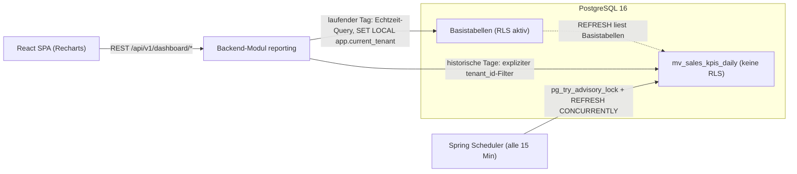

# Dashboard und Verkaeufer-Performance

| Status | Stand | Verantwortlich |
|---|---|---|
| Entwurf | 2026-07-16 | Lead Architecture |

## Zweck

Dieses Dokument spezifiziert das Vertriebs-Dashboard von OpenCRM: die KPI-Definitionen inklusive Formeln und Beispiel-SQL, den Widget-Aufbau, die rollenbasierten Sichtbarkeitsregeln und die technische Umsetzung ueber die materialisierte Sicht `mv_sales_kpis_daily` in Kombination mit Echtzeit-Queries. Es ist die verbindliche Grundlage fuer das Modul `reporting` und die Dashboard-Ansichten im Frontend.

## Inhaltsverzeichnis

1. [Zielbild und Nutzerbeduerfnisse je Rolle](#1-zielbild-und-nutzerbeduerfnisse-je-rolle)
2. [KPI-Katalog](#2-kpi-katalog)
3. [Dashboard-Aufbau](#3-dashboard-aufbau)
4. [Sichtbarkeitsregeln und Durchsetzung](#4-sichtbarkeitsregeln-und-durchsetzung)
5. [Architektur der Aggregation](#5-architektur-der-aggregation)
6. [Dashboard-API-Endpunkte](#6-dashboard-api-endpunkte)
7. [Performance-Budget und Massnahmen](#7-performance-budget-und-massnahmen)
8. [Ausblick](#8-ausblick)
9. [Offene Punkte](#9-offene-punkte)

## 1. Zielbild und Nutzerbeduerfnisse je Rolle

Das Dashboard beantwortet fuer jede Rolle eine andere Leitfrage. Alle Rollen sehen dieselben Widget-Typen, aber mit unterschiedlichem Daten-Scope (siehe [Abschnitt 4](#4-sichtbarkeitsregeln-und-durchsetzung)).

| Rolle | Leitfrage | Beduerfnisse |
|---|---|---|
| sales-rep | "Wie stehe ich da, was muss ich als Naechstes tun?" | Eigener Umsatz und eigene Pipeline im Zeitraum, eigene Win-Rate und Reaktionszeit, offene Aktivitaeten; zur Einordnung ein anonymisierter Team-Durchschnitt (keine Zahlen einzelner Kollegen). |
| sales-manager | "Wo steht mein Team, wo klemmt es?" | Teamvergleich (Leaderboard), Pipeline-Funnel zur Engpass-Erkennung (Stages mit Stau), Reaktionszeit-Ausreisser, Aktivitaetsvolumen je Mitarbeiter, Forecast (gewichteter Pipeline-Wert). |
| tenant-admin | "Wie performt der gesamte Mandant?" | Gesamtbild ueber alle Teams und Pipelines, Vergleich nach Produktkategorie, Trend-Zeitreihen, Datenbasis fuer Steuerungsentscheidungen. |
| read-only | Wie tenant-admin, ohne Schreibrechte | Identische Sicht wie tenant-admin, ausschliesslich lesend (z. B. Geschaeftsfuehrung, Controlling). |
| platform-admin | Betreibersicht | Kein fachliches Vertriebs-Dashboard; nutzt Betriebs-Monitoring (siehe [11-deployment-und-betrieb.md](11-deployment-und-betrieb.md)). |

Nicht-Ziele in Phase 1: frei konfigurierbare Reports (Report-Builder), Zielvorgaben/Quoten, Export der Dashboard-Daten. Siehe [Abschnitt 8](#8-ausblick) und [12-roadmap.md](12-roadmap.md).

## 2. KPI-Katalog

Alle KPIs beziehen sich auf einen Zeitraum `[from, to)` (halb-offenes Intervall, UTC-Tage) und unterstuetzen die Dimensionen **Zeitraum, Team, Verkaeufer, Produktkategorie, Pipeline** — sofern die Dimension fuer die KPI fachlich sinnvoll ist (unten je KPI vermerkt). Betraege werden in der Default-Waehrung des Tenants ausgewiesen (siehe Offener Punkt 3). Die Beispiel-SQLs zeigen die Backend-Queries; `:tenant_id` stammt immer aus dem JWT-Claim `tenant_id`, nie aus Client-Parametern (siehe [04-multi-tenancy.md](04-multi-tenancy.md)).

**Abfrageregel fuer `mv_sales_kpis_daily`:** Die Sicht enthaelt zwei Granularitaeten. Zeilen mit `product_category IS NULL` tragen die Gesamtwerte je Tag/Owner/Pipeline; Zeilen mit gesetzter `product_category` tragen ausschliesslich die nach Kategorie aufgeteilten Betragskennzahlen (`won_amount`, `open_amount`, `weighted_amount`). Queries ohne Kategorie-Filter muessen `product_category IS NULL` setzen, sonst werden Betraege doppelt gezaehlt.

### 2.1 Umsatz

- **Definition:** Summe `amount` gewonnener Opportunities (`status = 'WON'`), zeitlich eingeordnet nach `won_at`.
- **Formel:** `SUM(opportunities.amount) WHERE status = 'WON' AND won_at IN Zeitraum`
- **Dimensionen:** Zeitraum, Team, Verkaeufer, Produktkategorie (ueber `opportunity_items` -> `products.category`), Pipeline.

```sql
-- Umsatz je Verkaeufer im Zeitraum (aus der MV, Gesamtgrain)
SELECT owner_id, SUM(won_amount) AS revenue
  FROM mv_sales_kpis_daily
 WHERE tenant_id = :tenant_id
   AND day >= :from AND day < :to
   AND product_category IS NULL
   AND (:team_id::uuid IS NULL OR team_id = :team_id)
   AND (:pipeline_id::uuid IS NULL OR pipeline_id = :pipeline_id)
 GROUP BY owner_id;
```

### 2.2 Pipeline-Wert und gewichteter Forecast

- **Definition:** Summe `amount` offener Opportunities (`status = 'OPEN'`) je Stage; gewichteter Forecast = Summe `amount * stage.probability / 100` (`probability` ist ein Prozentwert 0.00–100.00, siehe [03-datenmodell.md](03-datenmodell.md) und [07-produkte-und-vertriebsprozess.md](07-produkte-und-vertriebsprozess.md)).
- **Formel:** `SUM(amount)` bzw. `SUM(amount * probability / 100)` ueber offene Opportunities.
- **Dimensionen:** Team, Verkaeufer, Produktkategorie, Pipeline, Stage. Der Pipeline-Wert ist eine **Bestandsgroesse** (aktueller Zustand), kein Zeitraum-Fluss; der Zeitraum-Filter entfaellt. Die Stage-Aufloesung liegt nicht in der MV und wird direkt auf den Basistabellen abgefragt (RLS aktiv).

```sql
-- Aktueller Pipeline-Funnel je Stage (Echtzeit, Basistabellen unter RLS)
SELECT ps.id AS stage_id, ps.name, ps.sort_order,
       COUNT(*)                                 AS open_count,
       SUM(o.amount)                            AS open_amount,
       SUM(o.amount * ps.probability / 100.0)   AS weighted_amount
  FROM opportunities o
  JOIN pipeline_stages ps ON ps.id = o.stage_id
 WHERE o.tenant_id = :tenant_id
   AND o.status = 'OPEN'
   AND o.deleted_at IS NULL
   AND o.pipeline_id = :pipeline_id
 GROUP BY ps.id, ps.name, ps.sort_order
 ORDER BY ps.sort_order;
```

### 2.3 Win-Rate

- **Definition:** Anteil gewonnener an entschiedenen Opportunities im Zeitraum.
- **Formel:** `WON / (WON + LOST)`; WON nach `won_at`, LOST nach `lost_at` im Zeitraum. Ohne entschiedene Opportunities ist die Win-Rate undefiniert (`NULL`, im Frontend als "–").
- **Dimensionen:** Zeitraum, Team, Verkaeufer, Pipeline (Produktkategorie nicht sinnvoll, da Zaehlgroessen nicht kategoriescharf vorliegen).

```sql
SELECT SUM(won_count)::numeric
       / NULLIF(SUM(won_count) + SUM(lost_count), 0) AS win_rate
  FROM mv_sales_kpis_daily
 WHERE tenant_id = :tenant_id
   AND day >= :from AND day < :to
   AND product_category IS NULL
   AND (:owner_id::uuid IS NULL OR owner_id = :owner_id);
```

### 2.4 Lead-Conversion

- **Definition:** Anteil konvertierter an abgeschlossenen Leads im Zeitraum.
- **Formel:** `CONVERTED / (CONVERTED + DISQUALIFIED)`.
- **Dimensionen:** Zeitraum, Team, Verkaeufer (Pipeline/Produktkategorie nicht anwendbar).
- **Hinweis:** `leads` besitzt keinen dedizierten Abschluss-Zeitstempel; als Naeherung dient `updated_at` (Offener Punkt 1). Da `DISQUALIFIED` nicht in der MV liegt, laeuft diese KPI auf der Basistabelle.

```sql
SELECT COUNT(*) FILTER (WHERE status = 'CONVERTED')::numeric
       / NULLIF(COUNT(*) FILTER (WHERE status IN ('CONVERTED', 'DISQUALIFIED')), 0)
       AS lead_conversion
  FROM leads
 WHERE tenant_id = :tenant_id
   AND updated_at >= :from AND updated_at < :to   -- Naeherung, siehe Offene Punkte
   AND deleted_at IS NULL
   AND (:owner_id::uuid IS NULL OR owner_id = :owner_id);
```

### 2.5 Durchschnittlicher Sales-Cycle

- **Definition:** Mittelwert der Dauer `won_at - created_at` gewonnener Opportunities im Zeitraum (nach `won_at`).
- **Formel:** `AVG(won_at - created_at)`, Ausgabe in Tagen.
- **Dimensionen:** Zeitraum, Team, Verkaeufer, Pipeline. Nicht in der MV vorberechnet (Durchschnitt ist nicht additiv ueber Tage aggregierbar); Query auf Basistabelle.

```sql
SELECT AVG(EXTRACT(EPOCH FROM (won_at - created_at)) / 86400.0) AS avg_sales_cycle_days
  FROM opportunities
 WHERE tenant_id = :tenant_id
   AND status = 'WON'
   AND won_at >= :from AND won_at < :to
   AND deleted_at IS NULL;
```

### 2.6 Aktivitaetsvolumen

- **Definition:** Anzahl `activities` je Typ und Verkaeufer im Zeitraum (nach `created_at`).
- **Formel:** `COUNT(*) GROUP BY owner_id, type`
- **Dimensionen:** Zeitraum, Team, Verkaeufer, Aktivitaetstyp. Die MV liefert die Gesamtsumme je Owner (`activities_count`); die Typ-Aufloesung kommt aus der Basistabelle.

```sql
SELECT owner_id, type, COUNT(*) AS activity_count
  FROM activities
 WHERE tenant_id = :tenant_id
   AND created_at >= :from AND created_at < :to
   AND deleted_at IS NULL
 GROUP BY owner_id, type;
```

### 2.7 Reaktionszeit

- **Definition:** Mittlere Zeit von der Lead-Zuweisung bis zur ersten Aktivitaet des zugewiesenen Verkaeufers am Lead. Basis ist die **erste** Zuweisung je Lead aus `lead_assignments` (siehe [06-lead-management.md](06-lead-management.md)); Leads ohne Folgeaktivitaet fliessen nicht in den Mittelwert ein, werden aber als eigener Zaehler ("unbeantwortet") ausgewiesen.
- **Formel:** `AVG(first_activity_at - assigned_at)`, Ausgabe in Stunden.
- **Dimensionen:** Zeitraum (nach `assigned_at`), Team, Verkaeufer.

```sql
WITH first_assignment AS (
    SELECT DISTINCT ON (la.lead_id)
           la.lead_id, la.assigned_to, la.assigned_at
      FROM lead_assignments la
     WHERE la.tenant_id = :tenant_id
       AND la.assigned_at >= :from AND la.assigned_at < :to
     ORDER BY la.lead_id, la.assigned_at
),
first_touch AS (
    SELECT fa.assigned_to, fa.assigned_at, MIN(a.created_at) AS first_activity_at
      FROM first_assignment fa
      JOIN activities a
        ON a.lead_id = fa.lead_id
       AND a.owner_id = fa.assigned_to
       AND a.created_at >= fa.assigned_at
     WHERE a.deleted_at IS NULL
     GROUP BY fa.lead_id, fa.assigned_to, fa.assigned_at
)
SELECT assigned_to AS owner_id,
       AVG(EXTRACT(EPOCH FROM (first_activity_at - assigned_at)) / 3600.0)
       AS avg_response_hours
  FROM first_touch
 GROUP BY assigned_to;
```

### 2.8 Leaderboard

- **Definition:** Rangliste der Verkaeufer im Zeitraum nach einer waehlbaren Metrik (Default: Umsatz); kombiniert Umsatz, gewonnene Abschluesse, Win-Rate und Aktivitaetsvolumen in einer Tabelle.
- **Formel:** Zusammensetzung aus 2.1, 2.3 und 2.6 je `owner_id`.
- **Dimensionen:** Zeitraum, Team, Pipeline, Sortiermetrik.

```sql
SELECT owner_id,
       SUM(won_amount)     AS revenue,
       SUM(won_count)      AS deals_won,
       SUM(won_count)::numeric
         / NULLIF(SUM(won_count) + SUM(lost_count), 0) AS win_rate,
       SUM(activities_count) AS activities
  FROM mv_sales_kpis_daily
 WHERE tenant_id = :tenant_id
   AND day >= :from AND day < :to
   AND product_category IS NULL
   AND owner_id IS NOT NULL
   AND (:team_id::uuid IS NULL OR team_id = :team_id)
 GROUP BY owner_id
 ORDER BY revenue DESC
 LIMIT :limit;
```

## 3. Dashboard-Aufbau

### 3.1 Widget-Katalog

| Widget | Inhalt | Datenquelle (API) | Visualisierung (Recharts) |
|---|---|---|---|
| KPI-Kacheln | Umsatz, gewichteter Forecast, Win-Rate, Lead-Conversion, Sales-Cycle, Reaktionszeit — jeweils mit Vergleich zur Vorperiode | `GET /dashboard/summary` | Stat-Kacheln mit Delta-Indikator |
| Umsatz-Zeitreihe | Umsatz pro Tag/Woche/Monat im Zeitraum, optional gestapelt nach Team oder Produktkategorie | `GET /dashboard/revenue-timeseries` | Linien-/Flaechendiagramm |
| Pipeline-Funnel | Offene Opportunities je Stage (Anzahl, Summe, gewichtet), aktueller Bestand | `GET /dashboard/pipeline-funnel` | Funnel-/Balkendiagramm nach `sort_order` |
| Leaderboard-Tabelle | Rangliste je Verkaeufer (2.8), sortierbar nach Metrik | `GET /dashboard/leaderboard` | Tabelle mit Rangspalte |
| Aktivitaeten-Uebersicht | Anzahl Aktivitaeten je Typ und Verkaeufer im Zeitraum | `GET /dashboard/activities` | Gestapeltes Balkendiagramm |
| Reaktionszeit-Verteilung | Histogramm der Reaktionszeiten (Buckets: <1h, 1–4h, 4–24h, 1–3d, >3d) plus Mittelwert | `GET /dashboard/response-times` | Balkendiagramm (Histogramm) |

### 3.2 Layout (Grid)

Responsives 12-Spalten-Grid (CSS Grid), Widgets in fester Anordnung (Phase 1 nicht konfigurierbar):

| Zeile | Belegung (Spalten) |
|---|---|
| 0 | Filterleiste (12) |
| 1 | 6 KPI-Kacheln (je 2) |
| 2 | Umsatz-Zeitreihe (8), Pipeline-Funnel (4) |
| 3 | Leaderboard-Tabelle (6), Aktivitaeten-Uebersicht (3), Reaktionszeit-Verteilung (3) |

Unter 1024 px Breite bricht das Grid auf eine Spalte um (Reihenfolge wie oben). Fuer die Rolle sales-rep entfaellt das Leaderboard; stattdessen zeigt die Kachelzeile eigene Werte plus anonymisierten Team-Durchschnitt als Referenzlinie in den Charts.

### 3.3 Filterleiste

Globale Filter, wirken auf alle Widgets; jede Aenderung loest parallele Refetches via TanStack Query aus (Query-Keys enthalten alle Filterwerte):

- **Zeitraum:** Presets (heute, 7 Tage, 30 Tage, Quartal, Jahr) plus freier Bereich; intern immer `from`/`to` als UTC-Datumsgrenzen, Anzeige in Nutzer-Zeitzone.
- **Team:** Auswahl aus `teams` (Scope-abhaengig, siehe Abschnitt 4).
- **Verkaeufer:** Auswahl aus `users` (Scope-abhaengig; fuer sales-rep fest auf die eigene Person).
- **Produktkategorie:** distinct `products.category` des Tenants; wirkt nur auf Betragskennzahlen (Hinweis im UI).
- **Pipeline:** Auswahl aus `pipelines`, Default `is_default = true`.

Die Filterwerte werden als Query-Parameter an die Dashboard-Endpunkte durchgereicht ([Abschnitt 6](#6-dashboard-api-endpunkte)).

## 4. Sichtbarkeitsregeln und Durchsetzung

Verbindliche Regeln laut Baseline:

| Rolle | Sichtbarer Scope |
|---|---|
| sales-rep | Nur eigene Kennzahlen; zusaetzlich anonymisierter Team-Durchschnitt (aggregiert, ohne Personenbezug) |
| sales-manager | Alle Mitglieder seines Teams / seiner Teams |
| tenant-admin | Alles im Mandanten |
| read-only | Alles im Mandanten (lesend) |

**Durchsetzung ausschliesslich im Backend.** Das Frontend blendet lediglich Bedienelemente aus (z. B. Verkaeufer-Filter fuer sales-rep); das ist Komfort, keine Sicherheit. Im Modul `reporting` leitet eine zentrale Komponente `DashboardScope` den erlaubten Datenbereich pro Request ab:

1. Rollen und `tenant_id` kommen aus dem validierten JWT (siehe [05-authentifizierung-keycloak.md](05-authentifizierung-keycloak.md)); die Team-Zugehoerigkeit aus `team_members` der App-DB. Fuer sales-manager gilt: sichtbar sind die Teams, in denen der Nutzer Mitglied mit `is_lead = true` ist.
2. Der Scope wird als Pflicht-Praedikat in jede Repository-Query eingesetzt: sales-rep -> `owner_id = :self`; sales-manager -> `team_id IN (:led_teams)` bzw. `owner_id IN (SELECT user_id FROM team_members WHERE team_id IN (:led_teams))`; tenant-admin/read-only -> nur `tenant_id`-Filter.
3. Client-Filter (`ownerId`, `teamId`) werden gegen den Scope validiert. Ein Filter ausserhalb des Scopes fuehrt zu `403` mit `application/problem+json` (RFC 9457, siehe [10-api-design.md](10-api-design.md)) — er wird nicht stillschweigend eingeengt, damit Fehlbedienung sichtbar ist.
4. Der anonymisierte Team-Durchschnitt fuer sales-rep wird serverseitig als Aggregat ueber das Team berechnet und ohne Personenaufloesung ausgeliefert (nur `team_avg`-Werte, keine Einzelwerte anderer Nutzer). Mindestteamgroesse siehe Offener Punkt 4.
5. Fuer Echtzeit-Queries auf Basistabellen wirkt zusaetzlich RLS ueber `app.current_tenant` als zweite Verteidigungslinie; fuer die MV ersetzt der explizite `tenant_id`-Filter die RLS (siehe 5.4).

## 5. Architektur der Aggregation

### 5.1 Ueberblick



Grundprinzip: Historische Tage (`day < CURRENT_DATE`) kommen aus der vorberechneten MV, der laufende Tag aus einer Echtzeit-Query auf den Basistabellen; beide Teile werden per `UNION ALL` kombiniert (5.5). KPIs, die nicht additiv vorberechenbar sind (Sales-Cycle, Reaktionszeit, Lead-Conversion, Funnel je Stage), laufen vollstaendig als Echtzeit-Query.

### 5.2 Definition der materialisierten Sicht

Dimensionen: `day, tenant_id, owner_id, team_id, pipeline_id, product_category`. Kennzahlen: `won_amount, won_count, lost_count, open_amount, weighted_amount, new_leads, converted_leads, activities_count`. Tageszuordnung: WON nach `won_at`, LOST nach `lost_at`, offene Opportunities und Leads nach `created_at` (die Summe der `open_amount` ueber alle Tage ergibt damit den aktuellen Gesamtbestand der offenen Pipeline). Alle Tagesgrenzen in UTC.

```sql
CREATE MATERIALIZED VIEW mv_sales_kpis_daily AS
WITH user_team AS (
    -- Primaerteam je Nutzer; bei Mehrfachmitgliedschaft deterministisch
    -- das kleinste team_id (siehe Offene Punkte)
    SELECT u.id AS user_id,
           (SELECT tm.team_id
              FROM team_members tm
             WHERE tm.user_id = u.id
             ORDER BY tm.team_id
             LIMIT 1) AS team_id
      FROM users u
),
item_lines AS (
    SELECT oi.tenant_id,
           oi.opportunity_id,
           p.category AS product_category,
           oi.quantity * oi.unit_price
             * (1 - COALESCE(oi.discount_pct, 0) / 100.0) AS line_amount
      FROM opportunity_items oi
      JOIN products p ON p.id = oi.product_id
),
facts AS (
    -- 1) Gewonnen (Gesamtgrain, product_category IS NULL)
    SELECT o.tenant_id, (o.won_at AT TIME ZONE 'UTC')::date AS day,
           o.owner_id, o.pipeline_id, NULL::text AS product_category,
           o.amount AS won_amount, 1 AS won_count, 0 AS lost_count,
           0::numeric AS open_amount, 0::numeric AS weighted_amount,
           0 AS new_leads, 0 AS converted_leads, 0 AS activities_count
      FROM opportunities o
     WHERE o.status = 'WON' AND o.deleted_at IS NULL
    UNION ALL
    -- 2) Verloren (Gesamtgrain)
    SELECT o.tenant_id, (o.lost_at AT TIME ZONE 'UTC')::date,
           o.owner_id, o.pipeline_id, NULL,
           0, 0, 1, 0, 0, 0, 0, 0
      FROM opportunities o
     WHERE o.status = 'LOST' AND o.deleted_at IS NULL
    UNION ALL
    -- 3) Offen (Gesamtgrain, Tag = Anlagetag)
    SELECT o.tenant_id, (o.created_at AT TIME ZONE 'UTC')::date,
           o.owner_id, o.pipeline_id, NULL,
           0, 0, 0, o.amount, o.amount * ps.probability / 100.0, 0, 0, 0
      FROM opportunities o
      JOIN pipeline_stages ps ON ps.id = o.stage_id
     WHERE o.status = 'OPEN' AND o.deleted_at IS NULL
    UNION ALL
    -- 4) Gewonnene Betraege je Produktkategorie (Positionsgrain)
    SELECT o.tenant_id, (o.won_at AT TIME ZONE 'UTC')::date,
           o.owner_id, o.pipeline_id, il.product_category,
           il.line_amount, 0, 0, 0, 0, 0, 0, 0
      FROM opportunities o
      JOIN item_lines il ON il.opportunity_id = o.id
     WHERE o.status = 'WON' AND o.deleted_at IS NULL
    UNION ALL
    -- 5) Offene Betraege je Produktkategorie (Positionsgrain)
    SELECT o.tenant_id, (o.created_at AT TIME ZONE 'UTC')::date,
           o.owner_id, o.pipeline_id, il.product_category,
           0, 0, 0, il.line_amount, il.line_amount * ps.probability / 100.0, 0, 0, 0
      FROM opportunities o
      JOIN pipeline_stages ps ON ps.id = o.stage_id
      JOIN item_lines il ON il.opportunity_id = o.id
     WHERE o.status = 'OPEN' AND o.deleted_at IS NULL
    UNION ALL
    -- 6) Neue Leads (Tag = Anlagetag; owner_id kann NULL sein)
    SELECT l.tenant_id, (l.created_at AT TIME ZONE 'UTC')::date,
           l.owner_id, NULL::uuid, NULL,
           0, 0, 0, 0, 0, 1, 0, 0
      FROM leads l
     WHERE l.deleted_at IS NULL
    UNION ALL
    -- 7) Konvertierte Leads (Naeherung ueber updated_at, siehe Offene Punkte)
    SELECT l.tenant_id, (l.updated_at AT TIME ZONE 'UTC')::date,
           l.owner_id, NULL::uuid, NULL,
           0, 0, 0, 0, 0, 0, 1, 0
      FROM leads l
     WHERE l.status = 'CONVERTED' AND l.deleted_at IS NULL
    UNION ALL
    -- 8) Aktivitaeten
    SELECT a.tenant_id, (a.created_at AT TIME ZONE 'UTC')::date,
           a.owner_id, NULL::uuid, NULL,
           0, 0, 0, 0, 0, 0, 0, 1
      FROM activities a
     WHERE a.deleted_at IS NULL
)
SELECT f.day, f.tenant_id, f.owner_id, ut.team_id, f.pipeline_id,
       f.product_category,
       SUM(f.won_amount)       AS won_amount,
       SUM(f.won_count)        AS won_count,
       SUM(f.lost_count)       AS lost_count,
       SUM(f.open_amount)      AS open_amount,
       SUM(f.weighted_amount)  AS weighted_amount,
       SUM(f.new_leads)        AS new_leads,
       SUM(f.converted_leads)  AS converted_leads,
       SUM(f.activities_count) AS activities_count
  FROM facts f
  LEFT JOIN user_team ut ON ut.user_id = f.owner_id
 GROUP BY f.day, f.tenant_id, f.owner_id, ut.team_id, f.pipeline_id,
          f.product_category
WITH NO DATA;
```

### 5.3 UNIQUE-Index und Refresh

`REFRESH MATERIALIZED VIEW CONCURRENTLY` setzt einen UNIQUE-Index ohne WHERE-Klausel voraus, der jede Zeile eindeutig identifiziert. Da `owner_id`, `team_id`, `pipeline_id` und `product_category` NULL sein koennen, wird der PostgreSQL-15+-Modus `NULLS NOT DISTINCT` verwendet — die `GROUP BY`-Ausgabe ist je Dimensionskombination (NULLs eingeschlossen) eindeutig:

```sql
CREATE UNIQUE INDEX ux_mv_sales_kpis_daily
    ON mv_sales_kpis_daily (day, tenant_id, owner_id, team_id,
                            pipeline_id, product_category)
    NULLS NOT DISTINCT;

-- Zugriffspfad der Dashboard-Queries
CREATE INDEX ix_mv_sales_kpis_daily_tenant_day
    ON mv_sales_kpis_daily (tenant_id, day);
```

Refresh-Ablauf (Spring Scheduler im Modul `reporting`, alle 15 Minuten):

1. Der Scheduler holt eine Connection aus einem **dedizierten Reporting-Pool** (Groesse 1) mit der DB-Rolle `opencrm_reporting`. Hintergrund: Der Refresh fuehrt die MV-Query mit den Rechten des MV-Owners aus; liefe er als `opencrm_app`, wuerde RLS greifen und die MV bliebe leer. `opencrm_reporting` ist Owner der MV, hat `BYPASSRLS` und ausschliesslich SELECT auf die benoetigten Basistabellen; die Rolle wird nur fuer den Refresh verwendet, nie fuer Request-Verarbeitung.
2. `SELECT pg_try_advisory_lock(hashtext('mv_sales_kpis_daily'))` — Session-Level Advisory Lock. Gibt er `false` zurueck, refresht bereits eine andere Backend-Instanz; der Lauf endet sofort (kein Warten, kein Doppel-Refresh bei mehreren Pods).
3. `REFRESH MATERIALIZED VIEW CONCURRENTLY mv_sales_kpis_daily` als eigenes Autocommit-Statement — `CONCURRENTLY` ist in Transaktionsbloecken (und damit in plpgsql-Funktionen) nicht erlaubt. Lesezugriffe bleiben waehrend des Refresh moeglich.
4. `SELECT pg_advisory_unlock(hashtext('mv_sales_kpis_daily'))` im `finally`-Block derselben Connection.
5. Erststart: Die MV wird per Flyway `WITH NO DATA` angelegt; solange `pg_matviews.ispopulated = false` ist, fuehrt der Scheduler einmalig ein nicht-konkurrentes `REFRESH` aus.

```java
@Scheduled(cron = "0 */15 * * * *")
void refreshSalesKpis() {
    try (var con = reportingDataSource.getConnection();
         var st = con.createStatement()) {
        var rs = st.executeQuery(
            "SELECT pg_try_advisory_lock(hashtext('mv_sales_kpis_daily'))");
        rs.next();
        if (!rs.getBoolean(1)) return; // andere Instanz refresht bereits
        try {
            st.execute("REFRESH MATERIALIZED VIEW CONCURRENTLY mv_sales_kpis_daily");
        } finally {
            st.execute("SELECT pg_advisory_unlock(hashtext('mv_sales_kpis_daily'))");
        }
    }
}
```

Dauer und Erfolg des Refresh werden als Micrometer-Metriken (`reporting.mv.refresh.duration`, `reporting.mv.refresh.result`) exportiert; ein Alert greift, wenn der letzte erfolgreiche Refresh aelter als 45 Minuten ist.

### 5.4 RLS und die materialisierte Sicht

**RLS wirkt nicht auf materialisierte Sichten.** PostgreSQL erlaubt keine Policies auf MVs, und ein SELECT auf die MV wendet die Policies der Basistabellen nicht an — die MV enthaelt physisch Zeilen **aller** Mandanten. Konsequenzen:

- Kein direkter MV-Zugriff ausserhalb des Backends; `opencrm_app` erhaelt SELECT auf die MV, alle anderen Grants werden entzogen (`REVOKE ALL ... FROM PUBLIC`).
- Jede Backend-Query auf die MV filtert **verpflichtend** `tenant_id = :tenant_id` mit dem Wert aus dem JWT. Das Praedikat wird zentral im `reporting`-Repository erzeugt (gemeinsamer Query-Builder mit `DashboardScope`), nicht in jedem Aufrufer einzeln — ein vergessener Filter ist damit ein struktureller, testbarer Fehler statt eines stillen Datenlecks. Ein Architektur-Test (Spring Modulith) verifiziert, dass MV-Zugriffe nur ueber dieses Repository laufen.
- Begruendung der Ausnahme: Die Alternative (normale Sicht mit RLS-Durchgriff) wuerde die Aggregation bei jedem Request neu berechnen und das Performance-Budget verfehlen; eine MV je Tenant skaliert nicht (Objektanzahl, Refresh-Zeitfenster). Der explizite Filter plus zentralisierter Zugriffspfad ist der bewusste Trade-off; die Echtzeit-Queries auf Basistabellen bleiben vollstaendig unter RLS (siehe [04-multi-tenancy.md](04-multi-tenancy.md)).

### 5.5 Kombination mit dem laufenden Tag

Die MV hinkt bis zu 15 Minuten hinterher und der laufende Tag ist unvollstaendig. Abfragemuster fuer Zeitreihen: MV fuer abgeschlossene Tage, Echtzeit fuer heute, per `UNION ALL`:

```sql
-- Umsatz-Zeitreihe: historische Tage aus der MV, laufender Tag live
SELECT day, SUM(won_amount) AS revenue
  FROM mv_sales_kpis_daily
 WHERE tenant_id = :tenant_id
   AND day >= :from AND day < CURRENT_DATE
   AND product_category IS NULL
 GROUP BY day
UNION ALL
SELECT CURRENT_DATE AS day, COALESCE(SUM(o.amount), 0)
  FROM opportunities o
 WHERE o.tenant_id = :tenant_id            -- RLS greift hier zusaetzlich
   AND o.status = 'WON'
   AND o.won_at >= date_trunc('day', now() AT TIME ZONE 'UTC') AT TIME ZONE 'UTC'
   AND o.deleted_at IS NULL
 ORDER BY day;
```

Beide Teil-Queries laufen in derselben Transaktion; fuer den Echtzeit-Teil ist `app.current_tenant` per `SET LOCAL` gesetzt. Endet der angefragte Zeitraum vor dem heutigen Tag, entfaellt der Echtzeit-Zweig.

## 6. Dashboard-API-Endpunkte

Alle Endpunkte unter `/api/v1/dashboard`, Methode GET, authentifiziert (JWT), Fehler als `application/problem+json`. Gemeinsame Parameter: `from`, `to` (ISO-Datum, Pflicht), `teamId`, `ownerId`, `pipelineId`, `productCategory` (optional, Scope-validiert). Die Endpunkte liefern begrenzte Aggregate — keine Cursor-Pagination noetig (Details zum API-Stil in [10-api-design.md](10-api-design.md)).

| Pfad | Zusaetzliche Parameter | Antwortstruktur (Skizze) |
|---|---|---|
| `/dashboard/summary` | `compareWithPrevious` (bool, Default true) | `{ "period": {...}, "kpis": { "revenue": { "value": 125000.00, "currency": "EUR", "previous": 98000.00 }, "weightedForecast": {...}, "winRate": {...}, "leadConversion": {...}, "avgSalesCycleDays": {...}, "avgResponseHours": {...} }, "teamAvg": {...\|null} }` |
| `/dashboard/revenue-timeseries` | `interval` = `day`\|`week`\|`month` (Default `day`), `groupBy` = `none`\|`team`\|`productCategory` | `{ "interval": "day", "series": [ { "key": "total", "points": [ { "date": "2026-07-01", "value": 4200.00 }, ... ] } ] }` |
| `/dashboard/pipeline-funnel` | `pipelineId` (Pflicht) | `{ "pipelineId": "...", "stages": [ { "stageId": "...", "name": "Qualified", "sortOrder": 1, "openCount": 12, "openAmount": 84000.00, "weightedAmount": 25200.00 }, ... ] }` |
| `/dashboard/leaderboard` | `metric` = `revenue`\|`dealsWon`\|`winRate`\|`activities` (Default `revenue`), `limit` (Default 10, Max 50) | `{ "rows": [ { "rank": 1, "ownerId": "...", "displayName": "...", "revenue": 42000.00, "dealsWon": 7, "winRate": 0.58, "activities": 134 }, ... ] }` |
| `/dashboard/activities` | `groupBy` = `type`\|`owner`\|`typeAndOwner` (Default `type`) | `{ "groups": [ { "type": "CALL", "ownerId": null, "count": 220 }, ... ] }` |
| `/dashboard/response-times` | – | `{ "avgResponseHours": 5.4, "unansweredLeads": 3, "buckets": [ { "label": "<1h", "count": 14 }, { "label": "1-4h", "count": 9 }, ... ] }` |

Verhalten: `403` bei Filtern ausserhalb des Rollen-Scopes; `400` bei `to <= from` oder Zeitraum ueber 366 Tagen; Betraege immer mit `currency` (Default-Waehrung des Tenants). Fuer sales-rep liefert `/dashboard/leaderboard` `403`; `/dashboard/summary` enthaelt stattdessen `teamAvg`.

## 7. Performance-Budget und Massnahmen

**Budget:** p95 der Antwortzeit jedes Dashboard-Endpunkts unter 500 ms (serverseitig, gemessen per Micrometer-Timer `http.server.requests` je URI); Ziel-p50 unter 150 ms. Das Budget gilt fuer Tenants bis 1 Mio. Opportunities und 5 Mio. Aktivitaeten.

Massnahmen:

1. **Vorberechnung:** Historische Tage ausschliesslich aus `mv_sales_kpis_daily`; Echtzeit-Queries sind auf den laufenden Tag begrenzt und treffen ueber Indexe nur kleine Datenmengen.
2. **Indexe:** `ix_mv_sales_kpis_daily_tenant_day` (5.3); auf Basistabellen partielle Indexe fuer die Echtzeit-Zweige, z. B. `CREATE INDEX ix_opportunities_won_at ON opportunities (tenant_id, won_at) WHERE status = 'WON' AND deleted_at IS NULL;` sowie analog fuer `status = 'OPEN'`, `activities (tenant_id, created_at)` und `lead_assignments (tenant_id, assigned_at)` (Details in [03-datenmodell.md](03-datenmodell.md)).
3. **Parallelisierung im Frontend:** Jedes Widget ruft seinen Endpunkt unabhaengig auf (TanStack Query); ein langsames Widget blockiert die Seite nicht, Skeleton-Loading je Widget.
4. **In-Process-Cache:** Caffeine-Cache je Instanz mit TTL 60 s, Schluessel = (tenant, scope, endpoint, filter). Kein Redis (Baseline); leichte Inkonsistenz zwischen Pods ist bei 15-Minuten-MV-Latenz akzeptabel.
5. **Query-Disziplin:** Alle Dashboard-Queries mit `EXPLAIN (ANALYZE, BUFFERS)` im CI-Datenset geprueft; Statement-Timeout 2 s fuer Reporting-Queries, damit Ausreisser nicht den Pool blockieren.
6. **Monitoring:** Grafana-Dashboard mit p95 je Endpunkt, MV-Refresh-Dauer und MV-Alter; Alert bei Budget-Verletzung ueber 15 Minuten (siehe [11-deployment-und-betrieb.md](11-deployment-und-betrieb.md)).

## 8. Ausblick

Nicht Teil von Phase 1, aber im Design beruecksichtigt (Einordnung siehe [12-roadmap.md](12-roadmap.md)):

- **Zielvorgaben/Quoten:** Tabelle `sales_targets` (je Verkaeufer/Team und Periode) mit Soll-Ist-Anzeige in den KPI-Kacheln und im Leaderboard; die MV liefert die Ist-Seite bereits.
- **Report-Builder:** Frei kombinierbare Dimensionen/Kennzahlen auf Basis der MV-Struktur; erfordert erweiterte MV oder Aggregations-API mit dynamischem Group-By.
- **Dashboard-Exporte:** Export der Leaderboard- und Zeitreihendaten ueber die bestehende `export_jobs`-Infrastruktur (Format CSV/XLSX, Filter als `filter jsonb`), inklusive signierter Download-URLs — Mechanik siehe [08-import-export.md](08-import-export.md).

## 9. Offene Punkte

1. `leads` hat keine Spalten `converted_at`/`disqualified_at`; Lead-Conversion und `converted_leads` naehern den Zeitpunkt ueber `updated_at` an. Entscheidung noetig (mit [03-datenmodell.md](03-datenmodell.md)): Spalten ergaenzen oder Zeitpunkt aus `audit_log` ableiten.
2. Nutzer in mehreren Teams: Die MV waehlt deterministisch das kleinste `team_id` als Primaerteam. Zu klaeren, ob `team_members` ein `is_primary`-Flag erhaelt oder Kennzahlen je Mitgliedschaft dupliziert werden sollen.
3. Multi-Currency: Phase 1 summiert Betraege ohne Umrechnung und unterstellt die Default-Waehrung des Tenants. Umgang mit abweichenden `opportunities.currency` (Ausschluss, Warnung oder Kursumrechnung mit Kurstabelle) ist offen.
4. Anonymisierter Team-Durchschnitt bei kleinen Teams: Ab welcher Mindestgroesse (Vorschlag: >= 3 Mitglieder) wird `teamAvg` ausgeliefert, damit keine Rueckschluesse auf Einzelpersonen moeglich sind?
