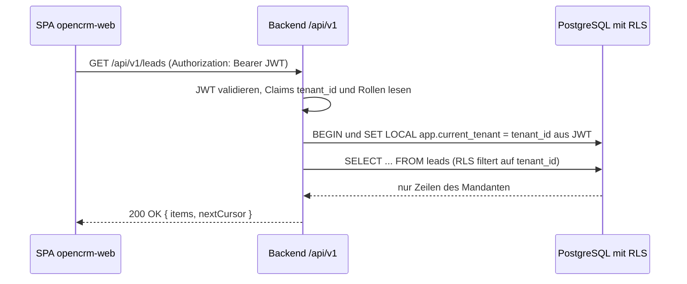

# API-Design

| Status | Stand | Verantwortlich |
|---|---|---|
| Entwurf | 2026-07-16 | Lead Architecture |

## Zweck

Dieses Dokument definiert das REST-API-Design von OpenCRM: Prinzipien, Konventionen, Pagination, Fehlerformat, Idempotenz, Optimistic Locking, Rate Limiting sowie den vollstaendigen Endpunkt-Katalog mit Rollenzuordnung. Es ist die verbindliche Grundlage fuer die Implementierung des Backends (Spring Boot 3.3, OAuth2 Resource Server) und des Frontends (React SPA). Die vollstaendige maschinenlesbare Spezifikation entsteht als OpenAPI 3.1; dieses Dokument enthaelt einen exemplarischen Auszug fuer die Lead-Ressource.

## Inhaltsverzeichnis

1. [Prinzipien](#1-prinzipien)
2. [Basis und Konventionen](#2-basis-und-konventionen)
3. [Pagination](#3-pagination)
4. [Filterung und Sortierung](#4-filterung-und-sortierung)
5. [Fehlerformat (RFC 9457)](#5-fehlerformat-rfc-9457)
6. [Idempotenz](#6-idempotenz)
7. [Optimistic Locking](#7-optimistic-locking)
8. [Rate Limiting](#8-rate-limiting)
9. [Endpunkt-Katalog](#9-endpunkt-katalog)
10. [OpenAPI-3.1-Auszug: Lead-Ressource](#10-openapi-31-auszug-lead-ressource)
11. [Versionierung und Deprecation](#11-versionierung-und-deprecation)
12. [Ausblick: Webhooks (Phase 2)](#12-ausblick-webhooks-phase-2)
13. [Offene Punkte](#offene-punkte)

## 1. Prinzipien

- **Ressourcenorientiert:** Substantive im Plural als Pfade, Standard-HTTP-Methoden (GET, POST, PATCH, DELETE). Zustandsuebergaenge, die keine reine Attributaenderung sind, werden als benannte Aktions-Endpunkte modelliert (z. B. `POST /leads/{id}/convert`, `POST /opportunities/{id}/won`).
- **Konsistent:** Ein Regelwerk fuer alle Ressourcen — gleiche Pagination, gleiches Fehlerformat, gleiche Namenskonventionen. Keine Ausnahmen je Modul.
- **Least Privilege:** Jeder Endpunkt deklariert die minimal notwendigen Rollen ([05-authentifizierung-keycloak.md](05-authentifizierung-keycloak.md)). Autorisierung wird serverseitig erzwungen (Methoden-Sicherheit), nie nur im Frontend. `sales-rep` ist zusaetzlich auf eigene Datensaetze (`owner_id`) beschraenkt, wo im Katalog vermerkt.
- **Tenant-transparent:** `tenant_id` ist NIEMALS Parameter, Pfadbestandteil, Request- oder Response-Feld. Der Mandantenkontext stammt ausschliesslich aus dem JWT-Claim `tenant_id` und wird pro Transaktion via `SET LOCAL app.current_tenant` an PostgreSQL-RLS durchgereicht ([04-multi-tenancy.md](04-multi-tenancy.md)). Ein Client kann den Mandanten weder waehlen noch wechseln.
- **Fehler sind API:** Fehlerantworten sind maschinenlesbar (RFC 9457), mit stabilen Fehlercodes, die Clients auswerten koennen.



## 2. Basis und Konventionen

| Aspekt | Festlegung |
|---|---|
| Basis-URL | `/api/v1` |
| Authentifizierung | `Authorization: Bearer <JWT>` (Keycloak-Access-Token); ohne gueltiges Token `401` |
| Content-Type | `application/json; charset=utf-8` (Ausnahme: Datei-Upload `multipart/form-data`, Fehler `application/problem+json`) |
| Pfade | kebab-case, Plural: `/assignment-rules`, `/import-jobs`, `/price-lists` |
| JSON-Felder | camelCase: `ownerId`, `expectedCloseDate`, `createdAt` |
| IDs | UUID als String: `"6f1b2c3d-..."`; vom Server vergeben (`gen_random_uuid()`) |
| Zeitstempel | ISO 8601 in UTC mit `Z`-Suffix: `"2026-07-16T09:30:00Z"`; Anzeige-Zeitzone ist Sache des Clients |
| Betraege | Dezimalwerte als JSON-Number mit fixer Skala (z. B. `1250.00`), Waehrung als ISO-4217-Code (`"currency": "EUR"`) |
| Enums | GROSSBUCHSTABEN wie im Datenmodell: `"status": "ASSIGNED"` ([03-datenmodell.md](03-datenmodell.md)) |
| Loeschen | `DELETE` fuehrt Soft Delete aus (`deleted_at`); geloeschte Datensaetze erscheinen nicht mehr in Listen/Gets |
| PATCH-Semantik | JSON Merge Patch (RFC 7386): nur mitgesendete Felder werden geaendert, `null` loescht ein Feld |

Erfolgs-Statuscodes: `200` (GET/PATCH/Aktion mit Response-Body), `201` mit `Location`-Header (POST Create), `202` (asynchron angenommener Job), `204` (DELETE).

## 3. Pagination

Alle Listen-Endpunkte sind Cursor-basiert paginiert.

- Parameter: `cursor` (opak, Base64-kodiert; leer fuer erste Seite) und `limit` (Default **50**, Maximum **200**; groessere Werte werden mit `validation_failed` abgelehnt).
- Der Cursor kodiert Sortierschluessel + `id` als Tiebreaker und ist nur fuer dieselbe Kombination aus Filter und Sortierung gueltig; ein unpassender Cursor liefert `validation_failed`.
- `totalCount` ist optional und wird nur berechnet, wenn der Client `includeTotal=true` sendet (Kostenkontrolle bei grossen Tabellen).

Response-Envelope (einheitlich fuer alle Listen):

```json
{
  "items": [ { "id": "…", "title": "…" } ],
  "nextCursor": "eyJjcmVhdGVkQXQiOiIyMDI2LTA3LTE1VDEwOjAwOjAwWiIsImlkIjoi…",
  "totalCount": 1234
}
```

`nextCursor` ist `null`, wenn keine weitere Seite existiert. `totalCount` fehlt, wenn nicht angefordert.

## 4. Filterung und Sortierung

Filter sind Query-Parameter; mehrere Filter werden UND-verknuepft. Typische Parameter (je Ressource in OpenAPI vollstaendig spezifiziert):

| Parameter | Typ | Beispiel | Bedeutung |
|---|---|---|---|
| `status` | Enum, mehrfach als CSV | `status=NEW,ASSIGNED` | Statusfilter (ODER innerhalb des Parameters) |
| `ownerId` | UUID | `ownerId=6f1b…` | Zugewiesener Verkaeufer |
| `q` | String | `q=acme` | Volltext ueber definierte Textfelder der Ressource |
| `createdFrom` / `createdTo` | ISO 8601 | `createdFrom=2026-07-01T00:00:00Z` | Zeitraum auf `createdAt` (inklusiv / exklusiv) |
| `source`, `pipelineId`, `stageId`, `accountId`, `productId`, `teamId` | Enum/UUID | — | ressourcenspezifische Filter |

Sortierung: `sort=field` (aufsteigend) bzw. `sort=-field` (absteigend), z. B. `sort=-createdAt`. Mehrfachsortierung als CSV: `sort=-score,createdAt`. Sortierbare Felder sind je Ressource whitelisted; unbekannte Felder liefern `validation_failed`. Default: `sort=-createdAt`.

## 5. Fehlerformat (RFC 9457)

Alle Fehler antworten mit `Content-Type: application/problem+json`. Erweiterungsfelder: `code` (stabiler Fehlercode, maschinenlesbar), `errors` (Feldfehler bei Validierung), `traceId` (Korrelation mit Logs/Tracing).

Beispiel (Validierungsfehler):

```json
{
  "type": "https://docs.opencrm.example/errors/validation_failed",
  "title": "Validation failed",
  "status": 422,
  "detail": "Request body contains 2 invalid fields.",
  "instance": "/api/v1/leads",
  "code": "validation_failed",
  "traceId": "7c0e9a2b4d1f4e08",
  "errors": [
    { "field": "email", "code": "invalid_format", "message": "must be a valid email address" },
    { "field": "score", "code": "out_of_range", "message": "must be between 0 and 100" }
  ]
}
```

### Fehlercode-Katalog

| `code` | HTTP-Status | Bedeutung | Retry sinnvoll |
|---|---|---|---|
| `validation_failed` | 422 | Request syntaktisch korrekt, aber inhaltlich ungueltig (Feldfehler in `errors`) | nein |
| `unauthorized` | 401 | Token fehlt, abgelaufen oder ungueltig | nach Token-Refresh |
| `forbidden` | 403 | Rolle/Ownership erlaubt die Operation nicht | nein |
| `tenant_context_missing` | 403 | Token enthaelt keinen gueltigen `tenant_id`-Claim (z. B. User ohne Organization) | nein |
| `tenant_suspended` | 403 | Mandant ist `SUSPENDED` oder `OFFBOARDING` | nein |
| `not_found` | 404 | Ressource existiert nicht oder gehoert einem anderen Mandanten (bewusst identisch, kein Existenz-Leak) | nein |
| `duplicate_found` | 409 | Unique-Konflikt, z. B. `sku` je Tenant bereits vergeben, E-Mail-Dublette bei Lead-Import via API | nein |
| `invalid_state_transition` | 409 | Statusuebergang nicht erlaubt, z. B. `convert` auf `DISQUALIFIED`-Lead, `won` auf bereits geschlossener Opportunity | nein |
| `version_conflict` | 412 | `If-Match`-Version stimmt nicht mit aktuellem Stand ueberein (Optimistic Locking) | nach Reload |
| `precondition_required` | 428 | `If-Match` fehlt bei PATCH auf versionierter Ressource | nein |
| `idempotency_key_conflict` | 409 | `Idempotency-Key` wurde mit anderem Request-Body wiederverwendet | nein |
| `quota_exceeded` | 403 | Plan-Limit des Mandanten erreicht (z. B. max. Zeilen je Import, max. parallele Jobs) | nein |
| `rate_limit_exceeded` | 429 | Zu viele Requests; `Retry-After`-Header beachten | ja, nach Wartezeit |
| `payload_too_large` | 413 | Upload ueberschreitet das Groessenlimit ([08-import-export.md](08-import-export.md)) | nein |
| `unsupported_media_type` | 415 | Falscher Content-Type (z. B. XML) | nein |
| `internal_error` | 500 | Unerwarteter Serverfehler; Details nur im Log (`traceId`) | ja, begrenzt |

## 6. Idempotenz

`POST` auf Job-Ressourcen (`/import-jobs`, `/export-jobs`) sowie auf `/leads/bulk-assign` akzeptiert den Header `Idempotency-Key` (Client-generierte UUID):

- Erster Request: normale Verarbeitung; Key, Request-Hash und Response werden 24 h in der Datenbank gespeichert.
- Wiederholung mit gleichem Key und gleichem Body: gespeicherte Response wird erneut geliefert (kein zweiter Job).
- Gleicher Key, anderer Body: `409 idempotency_key_conflict`.

Fuer alle uebrigen `POST`-Endpunkte ist der Header optional und wird in Phase 1 ignoriert; `PATCH` und `DELETE` sind durch Optimistic Locking bzw. Soft Delete von Natur aus sicher wiederholbar.

## 7. Optimistic Locking

Alle Kernentitaeten tragen ein serverseitig gepflegtes Feld `version` (Integer, von JPA `@Version` inkrementiert):

- `GET /leads/{id}` liefert `version` im Body und als `ETag: "7"`.
- `PATCH` erfordert `If-Match: "7"`. Stimmt die Version nicht, antwortet der Server `412 version_conflict`; fehlt der Header, `428 precondition_required`.
- Der Client laedt bei `412` den aktuellen Stand, merged und wiederholt den PATCH.

Aktions-Endpunkte (`assign`, `claim`, `convert`, `won`, `lost`, `validate`, `execute`, `cancel`) pruefen stattdessen serverseitig den zulaessigen Ausgangszustand und antworten bei Konflikt mit `409 invalid_state_transition`; `If-Match` ist dort optional.

## 8. Rate Limiting

Limits werden je Principal durchgesetzt: fuer `opencrm-web` je User (`sub`-Claim), fuer `opencrm-api` je Client (`client_id`). Richtwerte Phase 1 (konfigurierbar je Plan):

| Client / Kategorie | Limit |
|---|---|
| `opencrm-web`, Lese-Endpunkte | 600 Requests/min je User |
| `opencrm-web`, Schreib-Endpunkte | 120 Requests/min je User |
| `opencrm-api` (client_credentials) | 300 Requests/min je Client |
| Job-Erzeugung (`POST /import-jobs`, `/export-jobs`) | 10 Requests/min je User |

Jede Response traegt die Header `X-RateLimit-Limit`, `X-RateLimit-Remaining`, `X-RateLimit-Reset` (Unix-Epoch-Sekunden). Bei Ueberschreitung: `429 rate_limit_exceeded` mit `Retry-After`. Umsetzung Phase 1 in-memory je Backend-Instanz (Bucket4j), da bewusst kein Redis eingesetzt wird; das effektive Limit skaliert damit mit der Replikazahl (dokumentierte Einschraenkung, siehe [11-deployment-und-betrieb.md](11-deployment-und-betrieb.md)).

## 9. Endpunkt-Katalog

Rollen-Legende: **TA** = tenant-admin, **SM** = sales-manager, **SR** = sales-rep, **RO** = read-only. „Lesen: alle" = TA, SM, SR, RO. Zusatz „(eigene)" bei SR: nur Datensaetze mit `ownerId` = eigener User. `platform-admin` nutzt separate Plattform-Endpunkte (Tenant-Verwaltung, siehe [04-multi-tenancy.md](04-multi-tenancy.md)) und ist hier nicht aufgefuehrt. Alle Pfade relativ zu `/api/v1`.

### Leads ([06-lead-management.md](06-lead-management.md))

| Methode | Pfad | Zweck | Rollen |
|---|---|---|---|
| GET | `/leads` | Liste mit Filtern (`status`, `ownerId`, `source`, `q`, `createdFrom/To`) | alle — Scope: SR eigene plus nicht zugewiesene (falls Claim aktiviert), SM eigenes Team plus nicht zugewiesene (siehe [06, Abschnitt 10](06-lead-management.md)) |
| POST | `/leads` | Lead anlegen (`source=MANUAL` bzw. `API`) | TA, SM, SR |
| GET | `/leads/{id}` | Einzelnen Lead lesen | alle — Scope wie `GET /leads` |
| PATCH | `/leads/{id}` | Felder aendern (Merge Patch, `If-Match`) | TA, SM, SR (eigene) |
| DELETE | `/leads/{id}` | Soft Delete | TA, SM |
| POST | `/leads/{id}/assign` | Zuweisung an User (`assignedTo`); schreibt `lead_assignments`, setzt Status `NEW → ASSIGNED`; auch fuer Neuzuweisung | TA, SM |
| POST | `/leads/{id}/claim` | Selbstzuweisung („Claim") ohne Body; nur Status `NEW`, nur falls je Tenant aktiviert (`lead_claim_enabled`); `assignedBy` bleibt leer | TA, SM, SR |
| POST | `/leads/{id}/convert` | Konvertierung zu Account/Contact/Opportunity; Status → `CONVERTED` | TA, SM, SR (eigene) |
| POST | `/leads/bulk-assign` | Mehrere Leads zuweisen (direkt, per Regel oder Round-Robin auf Team); idempotenzfaehig | TA, SM |

### Accounts und Contacts

| Methode | Pfad | Zweck | Rollen |
|---|---|---|---|
| GET | `/accounts` | Liste (`ownerId`, `industry`, `q`) | alle |
| POST | `/accounts` | Account anlegen | TA, SM, SR |
| GET | `/accounts/{id}` | Account lesen | alle |
| PATCH | `/accounts/{id}` | Account aendern (`If-Match`) | TA, SM, SR (eigene) |
| DELETE | `/accounts/{id}` | Soft Delete | TA, SM |
| GET | `/contacts` | Liste (`accountId`, `q`) | alle |
| POST | `/contacts` | Contact anlegen (mit `accountId`) | TA, SM, SR |
| GET | `/contacts/{id}` | Contact lesen | alle |
| PATCH | `/contacts/{id}` | Contact aendern (inkl. `gdprConsentAt`) | TA, SM, SR |
| DELETE | `/contacts/{id}` | Soft Delete | TA, SM |

### Products und Price-Lists ([07-produkte-und-vertriebsprozess.md](07-produkte-und-vertriebsprozess.md))

| Methode | Pfad | Zweck | Rollen |
|---|---|---|---|
| GET | `/products` | Liste (`category`, `active`, `q`) | alle |
| POST | `/products` | Produkt anlegen (`sku` eindeutig je Tenant, sonst `duplicate_found`) | TA, SM |
| GET | `/products/{id}` | Produkt lesen | alle |
| PATCH | `/products/{id}` | Produkt aendern / deaktivieren | TA, SM |
| DELETE | `/products/{id}` | Soft Delete | TA, SM |
| GET | `/price-lists` | Preislisten (`currency`, `validFrom/To`-Filter) | alle |
| POST | `/price-lists` | Preisliste anlegen | TA, SM |
| GET | `/price-lists/{id}` | Preisliste inkl. Kopfdaten lesen | alle |
| PATCH | `/price-lists/{id}` | Preisliste aendern | TA, SM |
| DELETE | `/price-lists/{id}` | Preisliste loeschen | TA, SM |
| GET | `/price-lists/{id}/items` | Positionen der Preisliste | alle |
| POST | `/price-lists/{id}/items` | Position hinzufuegen (`productId`, `unitPrice`) | TA, SM |
| PATCH | `/price-lists/{id}/items/{itemId}` | Position aendern | TA, SM |
| DELETE | `/price-lists/{id}/items/{itemId}` | Position entfernen | TA, SM |

### Pipelines und Stages

| Methode | Pfad | Zweck | Rollen |
|---|---|---|---|
| GET | `/pipelines` | Pipelines inkl. Stages (eingebettet) | alle |
| POST | `/pipelines` | Pipeline anlegen | TA |
| PATCH | `/pipelines/{id}` | Pipeline umbenennen, `isDefault` setzen | TA |
| DELETE | `/pipelines/{id}` | Loeschen (nur ohne offene Opportunities, sonst `invalid_state_transition`) | TA |
| POST | `/pipelines/{id}/stages` | Stage anlegen (`sortOrder`, `probability`, `isWon`, `isLost`) | TA |
| PATCH | `/pipelines/{id}/stages/{stageId}` | Stage aendern / umsortieren | TA |
| DELETE | `/pipelines/{id}/stages/{stageId}` | Stage loeschen (nur ohne zugeordnete Opportunities) | TA |

### Opportunities

| Methode | Pfad | Zweck | Rollen |
|---|---|---|---|
| GET | `/opportunities` | Liste (`status`, `ownerId`, `pipelineId`, `stageId`, `accountId`, `expectedCloseFrom/To`) | alle |
| POST | `/opportunities` | Opportunity anlegen | TA, SM, SR |
| GET | `/opportunities/{id}` | Opportunity inkl. Positionen lesen | alle |
| PATCH | `/opportunities/{id}` | Felder/Stage aendern (`If-Match`) | TA, SM, SR (eigene) |
| DELETE | `/opportunities/{id}` | Soft Delete | TA, SM |
| GET | `/opportunities/{id}/items` | Positionen lesen | alle |
| POST | `/opportunities/{id}/items` | Position anlegen (`productId`, `quantity`, `unitPrice`, `discountPct`); `amount` wird serverseitig neu berechnet | TA, SM, SR (eigene) |
| PATCH | `/opportunities/{id}/items/{itemId}` | Position aendern | TA, SM, SR (eigene) |
| DELETE | `/opportunities/{id}/items/{itemId}` | Position entfernen | TA, SM, SR (eigene) |
| POST | `/opportunities/{id}/won` | Komfort-Endpunkt: verschiebt in die `is_won`-Stage der Pipeline (genau eine je Pipeline); der Stage-Wechsel setzt serverseitig `status=WON` und `wonAt`; nur aus `OPEN`, mindestens eine Position erforderlich | TA, SM, SR (eigene) |
| POST | `/opportunities/{id}/lost` | Komfort-Endpunkt: verschiebt in die per `stageId` (Pflicht) benannte `is_lost`-Stage; `lostReason` erforderlich; der Stage-Wechsel setzt `status=LOST` und `lostAt`; nur aus `OPEN` | TA, SM, SR (eigene) |

Statuswechsel laufen ausschliesslich ueber Stage-Wechsel ([07, Abschnitt 5](07-produkte-und-vertriebsprozess.md)): `status`, `wonAt` und `lostAt` sind read-only und nie direkt per PATCH-Feld beschreibbar; `/won` und `/lost` fuehren intern denselben Stage-Wechsel aus wie `PATCH /opportunities/{id}` mit `stageId`. Reopen (`WON`/`LOST → OPEN`): Verschieben in eine offene Stage via `PATCH /opportunities/{id}` mit `stageId` setzt `status=OPEN` und leert `wonAt` bzw. `lostAt`/`lostReason`; nur TA und SM.

### Activities

| Methode | Pfad | Zweck | Rollen |
|---|---|---|---|
| GET | `/activities` | Liste (`type`, `ownerId`, `leadId`, `accountId`, `contactId`, `opportunityId`, `dueFrom/To`, `completed`) | alle |
| POST | `/activities` | Aktivitaet anlegen (CALL, EMAIL, MEETING, NOTE, TASK) | TA, SM, SR |
| GET | `/activities/{id}` | Aktivitaet lesen | alle |
| PATCH | `/activities/{id}` | Aendern, `completedAt` setzen | TA, SM, SR (eigene) |
| DELETE | `/activities/{id}` | Soft Delete | TA, SM, SR (eigene) |

### Users und Teams

| Methode | Pfad | Zweck | Rollen |
|---|---|---|---|
| GET | `/users` | User des Mandanten (`role`, `active`, `q`) — Spiegel der JIT-Provisionierung | alle |
| GET | `/users/{id}` | User lesen | alle |
| GET | `/users/me` | Eigener User inkl. effektiver Rollen | alle |
| PATCH | `/users/{id}` | `active`, `displayName` aendern (Rollenaenderung erfolgt in Keycloak, Sync beim Login) | TA |
| GET | `/teams` | Teams inkl. Mitglieder | alle |
| POST | `/teams` | Team anlegen | TA |
| PATCH | `/teams/{id}` | Team umbenennen | TA |
| DELETE | `/teams/{id}` | Team loeschen | TA |
| POST | `/teams/{id}/members` | Mitglied hinzufuegen (`userId`, `isLead`) | TA, SM |
| DELETE | `/teams/{id}/members/{userId}` | Mitglied entfernen | TA, SM |

### Assignment-Rules

| Methode | Pfad | Zweck | Rollen |
|---|---|---|---|
| GET | `/assignment-rules` | Regeln sortiert nach `priority` | TA, SM |
| POST | `/assignment-rules` | Regel anlegen (`criteria` jsonb, `targetType`, `strategy`) | TA, SM |
| GET | `/assignment-rules/{id}` | Regel lesen | TA, SM |
| PATCH | `/assignment-rules/{id}` | Regel aendern, `active`/`priority` setzen | TA, SM |
| DELETE | `/assignment-rules/{id}` | Regel loeschen | TA |

### Import-Jobs und Export-Jobs ([08-import-export.md](08-import-export.md))

| Methode | Pfad | Zweck | Rollen |
|---|---|---|---|
| POST | `/import-jobs` | Upload: `multipart/form-data` mit Teil `file` (CSV/XLSX) und Teil `job` (JSON: `entityType`, `format`); legt Job mit `status=PENDING` an; Antwort `201` mit Job-Ressource und Header-Vorschau; `Idempotency-Key` unterstuetzt | TA, SM |
| GET | `/import-jobs` | Jobs des Mandanten (`status`, `entityType`) | TA, SM |
| GET | `/import-jobs/{id}` | Status/Fortschritt (`status`, `totalRows`, `processedRows`, `errorRows`) — Polling-Endpunkt | TA, SM |
| GET | `/import-jobs/{id}/mapping-suggestion` | Auto-Mapping-Vorschlag je Datei-Header (mit `confidence`) plus passende Vorlagen aus `import_mappings` | TA, SM |
| POST | `/import-jobs/{id}/validate` | Setzt `mapping` und `duplicateStrategy`, startet Validierungslauf (`mode=DRY_RUN`, `status=VALIDATING`); Antwort `202` | TA, SM |
| POST | `/import-jobs/{id}/execute` | Startet den Import (`mode=EXECUTE`, `status=RUNNING`); nur nach mindestens einem `DRY_RUN` mit identischem Mapping erlaubt, sonst `invalid_state_transition`; Antwort `202` | TA, SM |
| GET | `/import-jobs/{id}/errors` | Zeilenfehler paginiert (`rowNumber`, `columnName`, `errorCode`, `message`, `rawRow`) | TA, SM |
| GET | `/import-jobs/{id}/errors/download` | Fehlerbericht als re-importierbares CSV: `302` auf signierte, zeitlich begrenzte Objekt-Storage-URL | TA, SM |
| POST | `/import-jobs/{id}/cancel` | Abbruch, solange `PENDING`/`VALIDATING`/`RUNNING`; sonst `invalid_state_transition` | TA, SM |
| GET | `/import-mappings` | Gespeicherte Mapping-Vorlagen (`entityType`) | TA, SM |
| POST | `/import-mappings` | Vorlage speichern | TA, SM |
| DELETE | `/import-mappings/{id}` | Vorlage loeschen | TA, SM |
| POST | `/export-jobs` | Export anstossen (`entityType`, `format=CSV\|XLSX\|JSON`, `filter` jsonb); Antwort `202`; `Idempotency-Key` unterstuetzt | TA, SM, SR (nur eigene Daten), RO |
| GET | `/export-jobs` | Exportjobs des Mandanten | TA, SM, SR, RO (jeweils eigene Jobs; TA alle) |
| GET | `/export-jobs/{id}` | Status inkl. `downloadExpiresAt` | wie Ersteller; TA alle |
| GET | `/export-jobs/{id}/download` | `302` auf signierte, zeitlich begrenzte Objekt-Storage-URL | wie Ersteller; TA alle |

### Dashboard ([09-dashboard-und-reporting.md](09-dashboard-und-reporting.md))

Gemeinsame Filter-Parameter: `from`, `to` (ISO-Datum, Pflicht), `teamId`, `ownerId`, `pipelineId`, `productCategory` (optional, Scope-validiert). Die Endpunkte liefern begrenzte Aggregate — keine Cursor-Pagination. Sichtbarkeit wird serverseitig erzwungen: SR nur eigene Kennzahlen plus anonymisierter Team-Durchschnitt, SM sein Team, TA und RO alles im Mandanten; Filter ausserhalb des Rollen-Scopes liefern `403 forbidden`.

| Methode | Pfad | Zweck | Rollen |
|---|---|---|---|
| GET | `/dashboard/summary` | KPI-Kacheln: Umsatz, gewichteter Forecast, Win-Rate, Lead-Conversion, Sales-Cycle, Reaktionszeit; Vergleich zur Vorperiode (`compareWithPrevious`, Default `true`) | alle (Sichtbarkeitsregeln) |
| GET | `/dashboard/revenue-timeseries` | Umsatz-Zeitreihe (`interval=day\|week\|month`, `groupBy=none\|team\|productCategory`), Basis `wonAt` | alle (Sichtbarkeitsregeln) |
| GET | `/dashboard/pipeline-funnel` | Offene Opportunities je Stage: Anzahl, Summe, gewichteter Wert; `pipelineId` Pflicht | alle (Sichtbarkeitsregeln) |
| GET | `/dashboard/leaderboard` | Rangliste der Verkaeufer (`metric=revenue\|dealsWon\|winRate\|activities`, `limit` Default 10, Max 50) | TA, SM, RO (SR erhaelt `403`) |
| GET | `/dashboard/activities` | Aktivitaetsvolumen je Typ und Verkaeufer (`groupBy=type\|owner\|typeAndOwner`) | alle (Sichtbarkeitsregeln) |
| GET | `/dashboard/response-times` | Verteilung der Reaktionszeiten (Histogramm-Buckets) plus Mittelwert | alle (Sichtbarkeitsregeln) |

### Audit-Log

| Methode | Pfad | Zweck | Rollen |
|---|---|---|---|
| GET | `/audit-log` | Ereignisse (`entityType`, `entityId`, `actorId`, `action`, `occurredFrom/To`); nur lesend, kein Schreiben via API | TA |

## 10. OpenAPI-3.1-Auszug: Lead-Ressource

Auszug der maschinenlesbaren Spezifikation (vollstaendige Datei wird im Backend-Repository unter `openapi/opencrm-v1.yaml` gepflegt und aus dem Code generiert/validiert):

```yaml
openapi: 3.1.0
info:
  title: OpenCRM API
  version: 1.0.0
  description: Auszug - Lead-Ressource (GET /leads, POST /leads, POST /leads/{leadId}/assign).
servers:
  - url: /api/v1
security:
  - bearerAuth: []
paths:
  /leads:
    get:
      operationId: listLeads
      summary: Leads auflisten (cursor-paginiert)
      tags: [Leads]
      parameters:
        - name: cursor
          in: query
          schema:
            type: string
        - name: limit
          in: query
          schema:
            type: integer
            minimum: 1
            maximum: 200
            default: 50
        - name: status
          in: query
          description: CSV mehrerer Statuswerte moeglich
          schema:
            type: string
        - name: ownerId
          in: query
          schema:
            type: string
            format: uuid
        - name: q
          in: query
          schema:
            type: string
        - name: createdFrom
          in: query
          schema:
            type: string
            format: date-time
        - name: createdTo
          in: query
          schema:
            type: string
            format: date-time
        - name: sort
          in: query
          schema:
            type: string
            default: "-createdAt"
      responses:
        "200":
          description: Seite von Leads
          content:
            application/json:
              schema:
                $ref: "#/components/schemas/LeadPage"
        default:
          $ref: "#/components/responses/ProblemResponse"
    post:
      operationId: createLead
      summary: Lead anlegen
      tags: [Leads]
      requestBody:
        required: true
        content:
          application/json:
            schema:
              $ref: "#/components/schemas/LeadCreate"
      responses:
        "201":
          description: Lead angelegt
          headers:
            Location:
              schema:
                type: string
          content:
            application/json:
              schema:
                $ref: "#/components/schemas/Lead"
        "422":
          $ref: "#/components/responses/ProblemResponse"
        default:
          $ref: "#/components/responses/ProblemResponse"
  /leads/{leadId}/assign:
    post:
      operationId: assignLead
      summary: Lead einem Verkaeufer zuweisen
      description: >
        Erzeugt einen Eintrag in der Zuweisungshistorie, setzt ownerId
        und den Status NEW -> ASSIGNED.
      tags: [Leads]
      parameters:
        - name: leadId
          in: path
          required: true
          schema:
            type: string
            format: uuid
      requestBody:
        required: true
        content:
          application/json:
            schema:
              $ref: "#/components/schemas/LeadAssignRequest"
      responses:
        "200":
          description: Zugewiesener Lead
          content:
            application/json:
              schema:
                $ref: "#/components/schemas/Lead"
        "404":
          $ref: "#/components/responses/ProblemResponse"
        "409":
          $ref: "#/components/responses/ProblemResponse"
        default:
          $ref: "#/components/responses/ProblemResponse"
components:
  securitySchemes:
    bearerAuth:
      type: http
      scheme: bearer
      bearerFormat: JWT
  responses:
    ProblemResponse:
      description: Fehler nach RFC 9457
      content:
        application/problem+json:
          schema:
            $ref: "#/components/schemas/Problem"
  schemas:
    LeadStatus:
      type: string
      enum: [NEW, ASSIGNED, CONTACTED, QUALIFIED, DISQUALIFIED, CONVERTED]
    LeadSource:
      type: string
      enum: [WEB_FORM, IMPORT, MANUAL, API, EVENT, REFERRAL]
    Lead:
      type: object
      required: [id, title, source, status, version, createdAt, updatedAt]
      properties:
        id:
          type: string
          format: uuid
          readOnly: true
        title:
          type: string
          maxLength: 255
        companyName:
          type: ["string", "null"]
        firstName:
          type: ["string", "null"]
        lastName:
          type: ["string", "null"]
        email:
          type: ["string", "null"]
          format: email
        phone:
          type: ["string", "null"]
        source:
          $ref: "#/components/schemas/LeadSource"
        status:
          $ref: "#/components/schemas/LeadStatus"
        score:
          type: ["integer", "null"]
          minimum: 0
          maximum: 100
        ownerId:
          type: ["string", "null"]
          format: uuid
        disqualifiedReason:
          type: ["string", "null"]
        convertedAccountId:
          type: ["string", "null"]
          format: uuid
        convertedContactId:
          type: ["string", "null"]
          format: uuid
        convertedOpportunityId:
          type: ["string", "null"]
          format: uuid
        custom:
          type: object
          additionalProperties: true
        version:
          type: integer
          readOnly: true
        createdAt:
          type: string
          format: date-time
          readOnly: true
        updatedAt:
          type: string
          format: date-time
          readOnly: true
    LeadCreate:
      type: object
      required: [title]
      properties:
        title:
          type: string
          maxLength: 255
        companyName:
          type: ["string", "null"]
        firstName:
          type: ["string", "null"]
        lastName:
          type: ["string", "null"]
        email:
          type: ["string", "null"]
          format: email
        phone:
          type: ["string", "null"]
        source:
          $ref: "#/components/schemas/LeadSource"
        score:
          type: ["integer", "null"]
          minimum: 0
          maximum: 100
        custom:
          type: object
          additionalProperties: true
    LeadAssignRequest:
      type: object
      required: [assignedTo]
      properties:
        assignedTo:
          type: string
          format: uuid
          description: userId des zugewiesenen Verkaeufers
    LeadPage:
      type: object
      required: [items]
      properties:
        items:
          type: array
          items:
            $ref: "#/components/schemas/Lead"
        nextCursor:
          type: ["string", "null"]
        totalCount:
          type: integer
    Problem:
      type: object
      properties:
        type:
          type: string
          format: uri
        title:
          type: string
        status:
          type: integer
        detail:
          type: string
        instance:
          type: string
        code:
          type: string
        traceId:
          type: string
        errors:
          type: array
          items:
            type: object
            properties:
              field:
                type: string
              code:
                type: string
              message:
                type: string
```

## 11. Versionierung und Deprecation

- **v1 ist stabil.** Innerhalb von `/api/v1` sind nur abwaertskompatible Aenderungen erlaubt: neue Endpunkte, neue optionale Request-Felder, neue Response-Felder, neue optionale Query-Parameter. Clients muessen unbekannte Response-Felder ignorieren (Tolerant Reader).
- **Neue Enum-Werte** gelten als potenziell brechend fuer Clients mit exhaustiven Switches; sie werden im Changelog angekuendigt und fruehestens 30 Tage nach Ankuendigung aktiviert.
- **Breaking Changes** (Feld entfernen/umbenennen, Semantik aendern, Pflichtfelder hinzufuegen) nur mit neuer Major-Version `/api/v2`; v1 und v2 laufen uebergangsweise parallel.
- **Deprecation-Prozess:** Betroffene Endpunkte liefern die Header `Deprecation: true` und `Sunset: <HTTP-Datum>` (RFC 8594) plus `Link: <…>; rel="successor-version"`. Mindestfrist zwischen Ankuendigung und Abschaltung: 6 Monate. Nach Sunset antwortet der Endpunkt mit `410 Gone`.
- Aenderungen werden im API-Changelog (Teil der OpenAPI-Auslieferung) dokumentiert; die Roadmap-Einordnung steht in [12-roadmap.md](12-roadmap.md).

## 12. Ausblick: Webhooks (Phase 2)

Nicht Teil von Phase 1 (bewusst: kein Message-Broker). Vorgesehene Eckpunkte fuer Phase 2:

- Ereignisse initial: `lead.created`, `lead.assigned`, `opportunity.won`; Payload = Ereignis-Metadaten (`eventId`, `eventType`, `occurredAt`) plus Ressourcen-Snapshot im API-Format.
- Tenant-Admins registrieren Endpunkte je Tenant (`POST /webhook-subscriptions` mit URL und Ereignisfilter); Zustellung nur an HTTPS-Ziele.
- **Signatur via HMAC-SHA256:** Header `X-OpenCRM-Signature: t=<unix-ts>,v1=<hex>` ueber `timestamp + '.' + body` mit je Subscription generiertem Secret; Empfaenger verifizieren Signatur und Timestamp-Fenster (Replay-Schutz).
- Zustellung at-least-once mit exponentiellem Retry (Backoff, max. 24 h), danach Deaktivierung der Subscription plus Benachrichtigung; Grundlage ist eine Outbox-Tabelle in PostgreSQL, damit die Erweiterung ohne Broker startet und spaeter auf einen Broker umziehen kann (siehe [02-systemarchitektur.md](02-systemarchitektur.md)).

## Offene Punkte

1. `totalCount`-Berechnung: exakter `COUNT(*)` versus Schaetzung ueber `pg_class.reltuples` fuer sehr grosse Tabellen — Entscheidung nach ersten Lasttests.
2. PATCH-Semantik ist als JSON Merge Patch (RFC 7386) festgelegt; ob zusaetzlich JSON Patch (RFC 6902) fuer partielle Listen-Operationen (z. B. Umsortieren von Stages) angeboten wird, ist offen.
3. Rate Limiting ist in Phase 1 nur je Backend-Instanz durchsetzbar (kein Redis); ob das fuer die Produktions-Replikazahl akzeptabel ist oder ein DB-gestuetzter Zaehler noetig wird, ist zu klaeren.
4. Umfang der Volltextsuche (`q`): einfache `ILIKE`-Suche je Ressource versus zentraler Such-Endpunkt auf Basis von PostgreSQL Full Text Search — Festlegung gemeinsam mit dem Frontend-Team.
5. Maschinenzugriff je Mandant: ob neben dem plattformweiten Service-Client `opencrm-api` mandantenspezifische API-Clients (eigene client_credentials je Tenant) angeboten werden, entscheidet sich mit den ersten Integrationsanforderungen.
