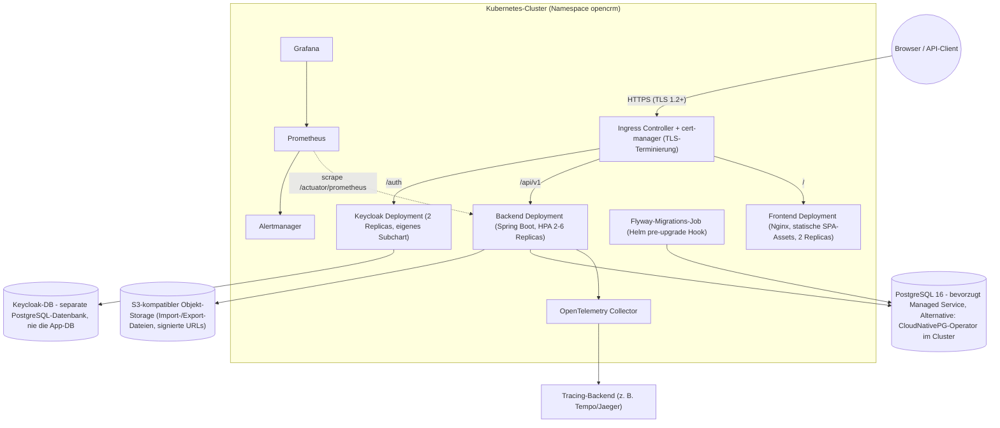
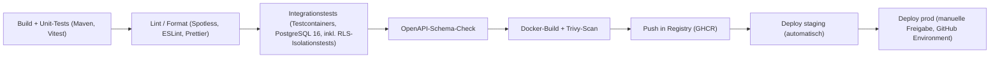

# Deployment und Betrieb

| Status | Stand | Verantwortlich |
|---|---|---|
| Entwurf | 2026-07-16 | Lead Architecture |

## Zweck

Dieses Dokument beschreibt, wie OpenCRM gebaut, ausgeliefert und betrieben wird: lokale Entwicklungsumgebung mit Docker Compose, Produktionszielbild auf Kubernetes mit Helm, CI/CD mit GitHub Actions, Datenbank-Migrationen, Backup/Disaster Recovery, Monitoring, Logging, Security-Betrieb und DSGVO-relevante Betriebsprozesse. Zielgruppe sind das Umsetzungsteam und der Plattformbetrieb.

## Inhaltsverzeichnis

1. [Umgebungen](#1-umgebungen)
2. [Lokale Entwicklung (Docker Compose)](#2-lokale-entwicklung-docker-compose)
3. [Produktion auf Kubernetes](#3-produktion-auf-kubernetes)
4. [CI/CD mit GitHub Actions](#4-cicd-mit-github-actions)
5. [Datenbank-Migrationen](#5-datenbank-migrationen)
6. [Backup und Disaster Recovery](#6-backup-und-disaster-recovery)
7. [Monitoring und Alerting](#7-monitoring-und-alerting)
8. [Logging](#8-logging)
9. [Security-Betrieb](#9-security-betrieb)
10. [DSGVO im Betrieb](#10-dsgvo-im-betrieb)
11. [Offene Punkte](#offene-punkte)

## 1. Umgebungen

| Umgebung | Zweck | Daten | Zugang | Wesentliche Unterschiede |
|---|---|---|---|---|
| **dev** | Lokale Entwicklung, Feature-Arbeit, Debugging | Synthetische Testdaten (Seed-Skripte), keine Echtdaten | Entwickler lokal, keine externe Erreichbarkeit | Docker Compose, Keycloak im Dev-Modus, MinIO statt S3, kein TLS, Hot Reload (Vite, Spring DevTools) |
| **staging** | Integrations- und Abnahmetests, Zielumgebung jedes Merges auf `main` | Anonymisierte bzw. synthetische Daten; **niemals** Produktionsdaten | Projektteam via SSO, IP-Allowlist; automatisches Deploy aus CI | Kubernetes wie prod, aber kleinere Ressourcen (1 Backend-Replica, kleine DB-Instanz), eigene Keycloak-Instanz, eigene Registry-Tags |
| **prod** | Produktivbetrieb fuer alle Mandanten | Echte Kundendaten (personenbezogen, DSGVO-relevant) | Endnutzer via HTTPS; Betriebszugriff nur ueber Break-Glass-Verfahren mit Audit | Kubernetes mit HPA (2-6 Backend-Replicas), Managed PostgreSQL, WAL-Archivierung/PITR, vollstaendiges Alerting, manuelle Deploy-Freigabe |

Grundregeln: Konfiguration unterscheidet sich ausschliesslich ueber Helm-Values und Secrets, nie ueber abweichende Images. Ein Image-Digest, der in staging getestet wurde, wird unveraendert nach prod promotet.

## 2. Lokale Entwicklung (Docker Compose)

Die lokale Umgebung startet alle Abhaengigkeiten laut Baseline: PostgreSQL 16 (Port 5432), Keycloak 26 (Port 8081), Backend (Port 8080), Frontend (Port 5173), MinIO (Port 9000). Der Keycloak-Container importiert beim Start den vorkonfigurierten Realm `opencrm` (Realm-JSON inkl. Clients `opencrm-web`/`opencrm-api`, Realm-Rollen und Protocol Mapper, siehe [05-authentifizierung-keycloak.md](05-authentifizierung-keycloak.md)).

```yaml
# docker-compose.yml (Repository-Wurzel)
name: opencrm

services:
  postgres:
    image: postgres:16
    ports:
      - "5432:5432"
    environment:
      POSTGRES_DB: opencrm
      POSTGRES_USER: postgres
      POSTGRES_PASSWORD: postgres
    volumes:
      - postgres_data:/var/lib/postgresql/data
      # Legt Datenbank "keycloak" sowie die Rollen opencrm_app (ohne BYPASSRLS)
      # und opencrm_migrator an:
      - ./docker/postgres/init.sql:/docker-entrypoint-initdb.d/init.sql:ro
    healthcheck:
      test: ["CMD-SHELL", "pg_isready -U postgres -d opencrm"]
      interval: 5s
      timeout: 3s
      retries: 10

  keycloak:
    image: quay.io/keycloak/keycloak:26.0
    command: ["start-dev", "--import-realm"]
    ports:
      - "8081:8080"   # Admin-Konsole und OIDC-Endpunkte: http://localhost:8081
    environment:
      KC_BOOTSTRAP_ADMIN_USERNAME: admin
      KC_BOOTSTRAP_ADMIN_PASSWORD: admin
      KC_DB: postgres
      KC_DB_URL: jdbc:postgresql://postgres:5432/keycloak
      KC_DB_USERNAME: keycloak
      KC_DB_PASSWORD: keycloak
      KC_HEALTH_ENABLED: "true"
      # Fixiert den Issuer-Wert (iss-Claim) auf die Browser-URL - unabhaengig
      # davon, ob der Zugriff ueber localhost:8081 (Host) oder keycloak:8080
      # (Compose-Netz) erfolgt:
      KC_HOSTNAME: http://localhost:8081
    volumes:
      # Realm-Export inkl. Clients, Rollen, Organizations-Setup, Protocol Mapper:
      - ./docker/keycloak/realm-opencrm.json:/opt/keycloak/data/import/realm-opencrm.json:ro
    depends_on:
      postgres:
        condition: service_healthy
    healthcheck:
      # Management-Port 9000 (nur containerintern, kein Host-Mapping);
      # TCP-Check, da das Keycloak-Image weder curl noch wget enthaelt.
      test: ["CMD-SHELL", "exec 3<>/dev/tcp/127.0.0.1/9000"]
      interval: 10s
      timeout: 5s
      retries: 12
      start_period: 30s

  minio:
    image: minio/minio:latest
    command: ["server", "/data", "--console-address", ":9001"]
    ports:
      - "9000:9000"   # S3-API
      - "9001:9001"   # Web-Konsole (nur dev)
    environment:
      MINIO_ROOT_USER: minioadmin
      MINIO_ROOT_PASSWORD: minioadmin
    volumes:
      - minio_data:/data
    healthcheck:
      test: ["CMD", "curl", "-f", "http://localhost:9000/minio/health/live"]
      interval: 10s
      timeout: 5s
      retries: 5

  backend:
    build: ./backend
    ports:
      - "8080:8080"
    environment:
      SPRING_PROFILES_ACTIVE: dev
      SPRING_DATASOURCE_URL: jdbc:postgresql://postgres:5432/opencrm
      SPRING_DATASOURCE_USERNAME: opencrm_app
      SPRING_DATASOURCE_PASSWORD: opencrm_app
      # Flyway laeuft in dev im selben Prozess, aber mit eigener Rolle:
      SPRING_FLYWAY_USER: opencrm_migrator
      SPRING_FLYWAY_PASSWORD: opencrm_migrator
      # issuer-uri ist reiner Validierungswert fuer den iss-Claim; der
      # JWKS-Abruf laeuft ueber das Compose-Netz (keycloak:8080), weil
      # localhost im Backend-Container auf den Container selbst zeigt:
      SPRING_SECURITY_OAUTH2_RESOURCESERVER_JWT_ISSUER_URI: http://localhost:8081/realms/opencrm
      SPRING_SECURITY_OAUTH2_RESOURCESERVER_JWT_JWK_SET_URI: http://keycloak:8080/realms/opencrm/protocol/openid-connect/certs
      OPENCRM_S3_ENDPOINT: http://minio:9000
      OPENCRM_S3_BUCKET: opencrm-files
      OPENCRM_S3_ACCESS_KEY: minioadmin
      OPENCRM_S3_SECRET_KEY: minioadmin
    depends_on:
      postgres:
        condition: service_healthy
      keycloak:
        condition: service_healthy
      minio:
        condition: service_healthy
    healthcheck:
      test: ["CMD-SHELL", "curl -f http://localhost:8080/actuator/health || exit 1"]
      interval: 15s
      timeout: 5s
      retries: 10
      start_period: 40s

  frontend:
    build: ./frontend
    ports:
      - "5173:5173"
    environment:
      VITE_API_BASE_URL: http://localhost:8080/api/v1
      VITE_KEYCLOAK_URL: http://localhost:8081
      VITE_KEYCLOAK_REALM: opencrm
      VITE_KEYCLOAK_CLIENT_ID: opencrm-web
    volumes:
      - ./frontend:/app        # Hot Reload via Vite
      - /app/node_modules
    depends_on:
      backend:
        condition: service_healthy

volumes:
  postgres_data:
  minio_data:
```

Hinweise:

- `docker/postgres/init.sql` erstellt die Keycloak-Datenbank sowie die Rollen `opencrm_app` (ohne `BYPASSRLS`, damit RLS greift) und `opencrm_migrator`; Details zur Rollen- und RLS-Konfiguration in [04-multi-tenancy.md](04-multi-tenancy.md).
- Der Bucket `opencrm-files` wird per einmaligem Seed-Skript (z. B. `mc mb`) angelegt.
- Issuer-Wert und erreichbare URL sind bewusst getrennt: Browser (SPA) und Backend muessen denselben Issuer-**Wert** validieren (`http://localhost:8081/realms/opencrm`, per `KC_HOSTNAME` fixiert), aber `localhost` zeigt im Backend-Container auf den Container selbst - Keycloak ist dort nur als `keycloak:8080` erreichbar. Deshalb dient `issuer-uri` nur der `iss`-Validierung, waehrend der Schluesselabruf ueber `jwk-set-uri` gegen das Compose-Netz laeuft; sind beide Properties gesetzt, macht Spring Boot beim Start keine Issuer-Discovery gegen `localhost`.

## 3. Produktion auf Kubernetes

### 3.1 Zielbild



Entscheidungen und Begruendungen:

- **PostgreSQL:** Bevorzugt als Managed Service des Cloud-Providers (automatisierte Backups, PITR, Patching, HA). Alternative fuer On-Prem/Cloud-agnostische Setups: CloudNativePG-Operator im Cluster mit synchroner Standby-Replica. Die Wahl aendert nichts am Anwendungsdesign (RLS, Rollen), nur an Betriebsverantwortung.
- **Keycloak:** Empfohlen als eigenes Deployment (offizielles Image bzw. Keycloak-Operator) mit externer Datenbank; wo verfuegbar ist ein Managed-Keycloak-Angebot zulaessig. Mindestens 2 Replicas mit verteiltem Cache (JGroups/`kubernetes`-Discovery). Realm-Konfiguration wird versioniert (Realm-JSON im Repo) und per CI angewendet.
- **Frontend:** Statische Assets aus dem Vite-Build, ausgeliefert von Nginx; keine Server-Side-Logik. Nginx setzt Cache-Header (Assets mit Hash: immutable; `index.html`: no-cache) und Security-Header (Abschnitt 9).
- **Backend:** HPA auf CPU (Ziel 70 %) und Requests/s, min 2, max 6 Replicas; `PodDisruptionBudget` minAvailable 1; Readiness-Probe `/actuator/health/readiness`, Liveness `/actuator/health/liveness`; Rolling Update mit `maxUnavailable: 0`.
- **Kein Message-Broker, kein Redis** in Phase 1 (Baseline): Spring-Batch-Jobs laufen in den Backend-Pods; Job-Koordination ueber die Tabellen `import_jobs`/`export_jobs` mit DB-Locking. Der Scheduler fuer den MV-Refresh (`mv_sales_kpis_daily`, alle 15 Minuten) laeuft mit ShedLock-artiger DB-Sperre, damit bei mehreren Replicas genau eine Instanz refresht.

### 3.2 Helm-Chart-Struktur

Umbrella-Chart `opencrm` mit Subcharts; Fremdkomponenten als Chart-Dependencies:

```text
deploy/helm/opencrm/
├── Chart.yaml                 # Umbrella-Chart, Dependencies s. u.
├── values.yaml                # Defaults (prod-nah)
├── values-staging.yaml
├── values-prod.yaml
├── templates/
│   ├── externalsecrets.yaml   # ExternalSecret-Ressourcen (DB, S3, OIDC-Client)
│   ├── networkpolicies.yaml
│   └── servicemonitors.yaml
└── charts/
    ├── backend/               # Deployment, Service, HPA, PDB, Flyway pre-upgrade Job
    ├── frontend/              # Deployment (Nginx), Service
    ├── keycloak/              # Dependency: offizielles/Operator-Chart, eigene Values
    ├── minio/                 # optional; in prod i. d. R. externer S3 -> disabled
    └── monitoring/            # Dependency: kube-prometheus-stack, otel-collector
```

Konfigurationsprinzipien:

- **Values statt Umgebungslogik:** Alle Unterschiede zwischen staging und prod liegen in `values-*.yaml` (Replicas, Ressourcen, Hostnamen, Issuer-URI, S3-Endpoint, Feature-Flags).
- **Secrets nie in Values:** External Secrets Operator synchronisiert Secrets (DB-Passwoerter, S3-Keys, Keycloak-Client-Secret fuer `opencrm-api`) aus dem Secret-Store des Providers (z. B. AWS Secrets Manager, Vault) in Kubernetes-Secrets. Helm referenziert nur die Secret-Namen.
- **Image-Tags:** CI setzt den Image-Digest per `--set image.digest=...`; `latest` ist verboten.

## 4. CI/CD mit GitHub Actions



| Stufe | Inhalt | Gate |
|---|---|---|
| Build + Unit-Tests | `mvn verify` (Unit-Scope), Frontend `npm ci && npm test`; Spring-Modulith-Verifikation der Modulgrenzen | Pflicht auf jedem PR |
| Lint/Format | Spotless (Java), ESLint + Prettier (TS), Helm `lint` | Pflicht auf jedem PR |
| Integrationstests | Testcontainers gegen echtes `postgres:16`: Flyway-Migrationen, Repository-Tests, **RLS-Isolationstests** (Verbindung als `opencrm_app`, `SET LOCAL app.current_tenant`, Nachweis, dass Tenant A keine Zeilen von Tenant B liest/schreibt; Negativtest ohne gesetzten Kontext), Spring-Batch-Jobtests | Pflicht auf jedem PR |
| OpenAPI-Schema-Check | Generiertes OpenAPI-3.1-Dokument gegen eingechecktes Schema diffen; Breaking Changes (entfernte Felder/Pfade) schlagen fehl, siehe [10-api-design.md](10-api-design.md) | Pflicht auf jedem PR |
| Docker-Build + Trivy | Multi-Stage-Builds (Backend: Temurin 21 JRE; Frontend: Nginx); Trivy-Scan der Images, Fail bei CRITICAL/HIGH mit verfuegbarem Fix | Pflicht vor Push |
| Push in Registry | Push nach GHCR mit Tags `sha-<gitsha>` und Digest-Pinning; SBOM (Syft) als Artefakt | nur `main` und Tags |
| Deploy staging | `helm upgrade --install` mit `values-staging.yaml`; anschliessend Smoke-Tests (Health, Login-Flow, ein API-Roundtrip) | automatisch bei Merge auf `main` |
| Deploy prod | GitHub Environment `prod` mit Required Reviewers (manuelle Freigabe); identischer Image-Digest wie staging; automatischer `helm rollback` bei fehlschlagenden Smoke-Tests | manuell |

Workflows: `ci.yml` (PR + `main`), `deploy-staging.yml` (Push auf `main`), `deploy-prod.yml` (Release-Tag `v*` + Environment-Approval). Registry-Login und Cluster-Zugriff via OIDC-Federation, keine langlebigen Tokens in GitHub-Secrets.

## 5. Datenbank-Migrationen

- **Ausfuehrung:** In staging/prod laeuft Flyway **nicht** im Anwendungsstart, sondern als eigener Kubernetes-Job (Helm `pre-upgrade`/`pre-install` Hook) mit der Rolle `opencrm_migrator`. Das Backend startet erst nach erfolgreichem Job (Hook-Reihenfolge) und prueft beim Start nur `flyway validate`. In dev laeuft Flyway eingebettet (Compose, Abschnitt 2).
- **Rollen:** `opencrm_migrator` ist Owner der Objekte und darf DDL; `opencrm_app` erhaelt nur DML-Grants und hat kein `BYPASSRLS` ([04-multi-tenancy.md](04-multi-tenancy.md)). RLS-Policies sind Teil der Flyway-Migrationen und damit versioniert und reviewbar.
- **Zero-Downtime-Regeln (expand-contract):**
  1. Innerhalb eines Releases sind nur **additive** Migrationen erlaubt: neue Tabellen, neue nullable Spalten, neue Indizes.
  2. **Kein `DROP`** (Spalte/Tabelle) und kein inkompatibles `ALTER` im selben Release, in dem der Code die Struktur noch nutzt; Entfernen fruehestens ein Release nach Entfernung aller Codezugriffe (contract-Phase).
  3. `NOT NULL` auf bestehenden Spalten nur dreistufig: Spalte nullable + Default anlegen, Backfill als Batch (kein langer Lock), dann `SET NOT NULL` in spaeterem Release.
  4. Indizes auf grossen Tabellen ausschliesslich `CREATE INDEX CONCURRENTLY` (Flyway-Migration mit deaktivierter Transaktion).
  5. Lange Backfills nicht in der Migration, sondern als idempotenter Spring-Batch-Job nach dem Deploy.
- **Rollback-Strategie:** Kein Flyway-Undo; Rollback erfolgt auf Anwendungsebene (voriges Image), was durch die Nur-additiv-Regel kompatibel bleibt. Bei fehlerhafter Migration: Repair + korrigierende Vorwaerts-Migration.

## 6. Backup und Disaster Recovery

| Ziel | Wert |
|---|---|
| RPO (max. Datenverlust) | 15 Minuten |
| RTO (max. Wiederanlaufzeit) | 4 Stunden |

- **PostgreSQL:** Taegliche Basissicherung plus kontinuierliche WAL-Archivierung; Point-in-Time-Recovery (PITR) auf jeden Zeitpunkt innerhalb der Aufbewahrung von 35 Tagen. Beim Managed Service sind Basisbackup + PITR Provider-Funktionen; bei CloudNativePG uebernimmt Barman/Objekt-Storage das WAL-Archiv. Backups verschluesselt (at rest) und in eine zweite Zone/Region repliziert.
- **Keycloak:** Die Keycloak-DB ist im selben Backup-Regime. Zusaetzlich naechtlicher **Realm-Export** (`kc.sh export`) des Realms `opencrm` in den Objekt-Storage, damit die Realm-Konfiguration unabhaengig von der DB wiederherstellbar und diffbar ist.
- **Objekt-Storage:** Versionierung auf dem Bucket fuer Import-/Export-Dateien aktiviert; Lifecycle-Regel loescht abgelaufene Export-Dateien nach `download_expires_at` (siehe [08-import-export.md](08-import-export.md)). Cross-Region-Replikation optional je Provider.
- **Restore-Tests:** **Quartalsweise** vollstaendiger Restore-Test in eine isolierte Umgebung: PITR der App-DB, Keycloak-Realm-Import, Smoke-Test (Login, Lead-Liste, Dashboard). Ergebnis wird protokolliert (Dauer gegen RTO gemessen); ein fehlgeschlagener Test ist ein P1-Betriebsvorfall.
- **DR-Runbook:** Dokumentierte Reihenfolge: DB-Restore -> Keycloak -> Backend/Frontend-Deploy -> DNS/Ingress -> Verifikation. Verantwortlichkeiten und Eskalationskette im Runbook (Betriebs-Repo), nicht Teil dieses Dokuments.

## 7. Monitoring und Alerting

Grundlage sind die vier goldenen Signale (Latenz, Traffic, Fehler, Saettigung), erhoben ueber Micrometer/Prometheus (`/actuator/prometheus`), visualisiert in Grafana, alarmiert ueber Alertmanager.

| Alert | Bedingung (Beispiel) | Schwere | Erste Reaktion |
|---|---|---|---|
| `ApiHighErrorRate` | Anteil 5xx an `/api/v1/**` > 2 % ueber 5 min | critical | Letztes Deploy pruefen, ggf. Rollback |
| `ApiLatencyP95High` | p95 > 1,5 s ueber 10 min | warning | Slow-Query-Log, DB-Last, HPA-Status pruefen |
| `BatchJobFailed` | Zunahme `import_jobs`/`export_jobs` mit `status=FAILED` (Counter) > 0 in 15 min | warning | `import_job_errors` und Job-Logs des betroffenen Tenants pruefen |
| `MvRefreshStale` | Alter des letzten erfolgreichen Refresh von `mv_sales_kpis_daily` > 45 min (Soll: 15 min) | warning | Scheduler-Lock und `REFRESH MATERIALIZED VIEW CONCURRENTLY`-Fehler pruefen ([09-dashboard-und-reporting.md](09-dashboard-und-reporting.md)) |
| `DbConnectionsHigh` | Belegte Verbindungen > 80 % von `max_connections` bzw. HikariCP-Pool ausgeschoepft ueber 5 min | critical | Verbindungs-Leaks, lange Transaktionen (`pg_stat_activity`) pruefen |
| `DiskSpaceLow` | Freier Speicher DB-Volume < 15 % (Prognose < 4 h bis voll: critical) | warning/critical | WAL-Stau, Bloat, Autovacuum pruefen; Volume vergroessern |
| `RlsContextErrors` | Counter `opencrm_rls_context_missing_total` > 0 in 5 min (Query ohne gesetztes `app.current_tenant`) | critical | Betroffenen Codepfad identifizieren; potenzielles Isolationsrisiko, Incident-Prozess starten ([04-multi-tenancy.md](04-multi-tenancy.md)) |
| `PodCrashLooping` | Container-Restarts > 3 in 10 min | critical | Pod-Logs/Events pruefen, ggf. Rollback |

Ergaenzend: JVM-Dashboards (Heap, GC), Spring-Batch-Job-Dauer je `entity_type`, Keycloak-Login-Fehlerrate, Zertifikatsablauf (cert-manager) > 14 Tage vor Expiry. Traces via OpenTelemetry (W3C `traceparent` von der SPA bis zur SQL-Ebene); Sampling in prod 10 %, Fehler-Traces immer.

## 8. Logging

- **Format:** Strukturierte JSON-Logs auf stdout (Logback + Encoder), Einsammlung durch den Cluster-Log-Agenten.
- **Pflichtfelder:** `timestamp` (UTC), `level`, `logger`, `message`, `service`, `trace_id`, `span_id`, `tenant_id` (aus JWT-Claim via MDC-Filter), `user_id` (interne UUID aus `users.id`), `request_id`.
- **Keine PII in Logs:** Keine E-Mail-Adressen, Namen, Telefonnummern oder Freitextinhalte von Leads/Kontakten/Aktivitaeten. Referenzen ausschliesslich ueber UUIDs. Ein Logback-Masking-Filter (Regex fuer E-Mail-/Telefonmuster) dient als zweite Verteidigungslinie; Treffer werden als Warnung gezaehlt und im Review adressiert.
- **Payloads:** Request-/Response-Bodies werden nicht geloggt; bei Validierungsfehlern nur Feldname und `error_code`, nie der Wert.
- **Aufbewahrung:** Anwendungslogs 30 Tage online, danach Loeschung. Fachliche Nachvollziehbarkeit laeuft ueber `audit_log` in der Datenbank (mandantenbezogen, RLS-geschuetzt), nicht ueber technische Logs.

## 9. Security-Betrieb

- **TLS ueberall:** TLS 1.2+ an Ingress (cert-manager/ACME, HSTS); DB-, Keycloak- und S3-Verbindungen mit TLS (`sslmode=verify-full` zur Managed-DB). Cluster-interner mTLS-Bedarf: siehe Offene Punkte.
- **Security-Header (Nginx/Frontend und API):** `Strict-Transport-Security`, `Content-Security-Policy` (nur eigene Origins plus Keycloak-Host), `X-Content-Type-Options: nosniff`, `Referrer-Policy: strict-origin-when-cross-origin`, `frame-ancestors 'none'`; API sendet zusaetzlich `Cache-Control: no-store` fuer personenbezogene Antworten.
- **Secrets-Rotation:** Alle Secrets liegen im zentralen Secret-Store (External Secrets, Abschnitt 3.2). Rotationsintervalle: DB-Passwoerter und S3-Keys 90 Tage (automatisiert, Rolling Restart), Keycloak-Client-Secret `opencrm-api` 90 Tage, Break-Glass-Zugaenge nach jeder Nutzung. Keycloak-Signaturschluessel-Rotation ueber Key-Provider mit Ueberlappungsphase.
- **Dependency- und Image-Scanning:** Dependabot fuer Maven/npm/GitHub Actions; Trivy im CI (Abschnitt 4) plus **taeglicher** Scheduled Scan der in prod laufenden Image-Digests, damit neue CVEs auch ohne Deploy auffallen.
- **CVE-Reaktionsprozess:** Triage innerhalb eines Arbeitstages; Behebungsfristen nach Schwere: CRITICAL (ausnutzbar) 24 h, HIGH 7 Tage, MEDIUM 30 Tage, LOW naechster Release-Zyklus. Nicht fristgerecht behebbare Faelle benoetigen dokumentierte Risikoakzeptanz durch den Betriebsverantwortlichen. Basis-Images werden woechentlich neu gebaut (Patch-Aufnahme ohne Code-Aenderung).
- **Zugriff auf prod:** Kein direkter DB-Zugriff im Regelbetrieb; Break-Glass mit personalisierten, zeitlich begrenzten Zugaengen, jede Nutzung landet im Audit. `kubectl`-Zugriff nur ueber SSO-Gruppen mit RBAC.

## 10. DSGVO im Betrieb

OpenCRM verarbeitet personenbezogene Daten (Leads, Kontakte, Nutzer) im Auftrag der Mandanten. Rollenverteilung: Der **Mandant ist Verantwortlicher** im Sinne von Art. 4 Nr. 7 DSGVO, die **JULITH GmbH ist Auftragsverarbeiter** (Art. 28); Grundlage ist ein AV-Vertrag je Mandant inkl. Subprozessorenliste (Cloud-Provider, Registry, Monitoring-SaaS sofern genutzt).

**TOMs-Uebersicht (technische und organisatorische Massnahmen):**

| Massnahme | Umsetzung |
|---|---|
| Zugangskontrolle | SSO/MFA fuer Betriebszugaenge, Keycloak-MFA fuer tenant-admin (empfohlen), Break-Glass-Verfahren |
| Zugriffskontrolle | Realm-Rollen + RLS, `opencrm_app` ohne `BYPASSRLS`, RBAC im Cluster |
| Trennungskontrolle | Shared Schema mit `tenant_id` + Row-Level Security, Isolationstests in CI ([04-multi-tenancy.md](04-multi-tenancy.md)) |
| Weitergabekontrolle | TLS ueberall, signierte, zeitlich begrenzte Download-URLs fuer Exporte |
| Eingabekontrolle | `audit_log` je Mandant (CREATE/UPDATE/DELETE/ASSIGN/IMPORT/EXPORT/LOGIN) |
| Verfuegbarkeitskontrolle | Backups + PITR, RPO 15 min / RTO 4 h, quartalsweise Restore-Tests |
| Pseudonymisierung in Logs | Nur UUIDs, keine PII (Abschnitt 8) |

**Loesch- und Aufbewahrungsfristen (Defaults, je Tenant konfigurierbar):**

| Datenkategorie | Frist | Mechanismus |
|---|---|---|
| Leads mit `status=DISQUALIFIED` | Anonymisierung nach 12 Monaten (Namens-, E-Mail-, Telefonfelder geleert; Aggregate bleiben) | Naechtlicher Spring-Batch-Retention-Job |
| Kontakte (Loeschersuchen Art. 17) | Loeschung/Anonymisierung innerhalb 30 Tagen nach Antrag beim Mandanten | Manuell angestossener Prozess durch tenant-admin; Soft Delete (`deleted_at`) sofort, Hard Delete durch Retention-Job |
| `audit_log` | 24 Monate, danach Loeschung | Partitionierung nach Monat, Drop alter Partitionen |
| Backups | 35 Tage Aufbewahrung; geloeschte Daten verschwinden spaetestens mit Ablauf des letzten Backups endgueltig | Backup-Retention; kein selektives Loeschen in Backups (dokumentiert im AV-Vertrag) |

**Tenant-Offboarding:** Bei Kuendigung wechselt der Tenant auf `status=OFFBOARDING`. Der Betreiber erstellt einen vollstaendigen Datenexport ueber die Export-Pipeline (alle Entitaeten als CSV/JSON, `export_jobs`, siehe [08-import-export.md](08-import-export.md)) und stellt ihn per signierter URL bereit. Nach Ablauf einer vertraglich fixierten Frist (Default 30 Kalendertage; Platzhalter, juristisch zu bestaetigen, identisch gefuehrt in [04-multi-tenancy.md](04-multi-tenancy.md), Abschnitt 8.3) loescht ein Offboarding-Job alle Zeilen des Tenants (`DELETE ... WHERE tenant_id = ...` ueber alle Tabellen in FK-sicherer Reihenfolge), die Keycloak-Organization und die Objekte im Storage-Prefix des Tenants. Die Loeschung laeuft ausschliesslich ueber den auditierten Admin-Pfad mit der Rolle `opencrm_platform_ops` (`BYPASSRLS`, siehe [04-multi-tenancy.md](04-multi-tenancy.md)); ein `DELETE` als `opencrm_migrator` waere wegen `FORCE ROW LEVEL SECURITY` ohne gesetzten Tenant-Kontext ein stiller No-Op (0 Zeilen geloescht, Job meldet trotzdem Erfolg). Der Job prueft deshalb den Erfolg je Tabelle: geloeschte Zeilenzahl wird protokolliert, ein abschliessender Nachweis-`SELECT` muss 0 verbleibende Zeilen ergeben. Der Abschluss wird als `audit_log`-Eintrag (`action = DELETE`, `entity_type = TENANT`) und im Betriebsprotokoll dokumentiert.

**Betroffenenrechte im Betrieb:** Auskunft (Art. 15) wird ueber den Entitaeten-Export je Person unterstuetzt; Berichtigung ueber die normale API. Der Betreiber wirkt nur auf Weisung des Mandanten (AV-Vertrag).

## Offene Punkte

1. Cloud-Provider und damit das konkrete Managed-PostgreSQL-Angebot (inkl. PITR-Details und Region) sind noch nicht entschieden; davon haengt ab, ob CloudNativePG als Fallback gebraucht wird.
2. Keycloak: endgueltige Entscheidung eigenes Deployment (Operator) vs. Managed-Angebot, inkl. Kostenvergleich und Update-Verantwortung.
3. Cluster-interner mTLS (Service Mesh vs. NetworkPolicies-only) ist offen; Phase 1 startet mit NetworkPolicies, Bedarf wird nach Threat-Model-Review bewertet.
4. Schluesselverwaltung fuer Backup- und Storage-Verschluesselung (Provider-KMS vs. eigenes Vault) inkl. Rotationskonzept ist festzulegen.
5. Die Default-Aufbewahrungsfristen (Leads 12 Monate, `audit_log` 24 Monate) muessen mit dem Datenschutzbeauftragten und den ersten Mandanten abgestimmt werden.
