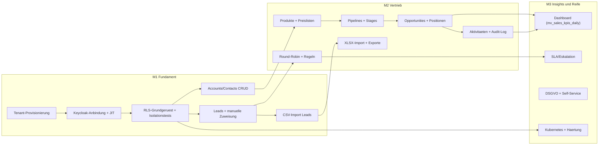

# Roadmap und Umsetzungsplan

| Status | Stand | Verantwortlich |
|---|---|---|
| Entwurf | 2026-07-16 | Lead Architecture |

## Zweck

Dieses Dokument beschreibt den Umsetzungsplan fuer OpenCRM: das iterative Vorgehen, drei Meilensteine mit Zielen, Inhalten und Definition of Done, die Abhaengigkeiten und den kritischen Pfad, den Team- und Skill-Bedarf sowie die wesentlichen Umsetzungsrisiken. Es dient dem Umsetzungsteam als verbindlicher Rahmen fuer Planung und Priorisierung und den Stakeholdern als Erwartungsanker fuer Lieferzeitpunkte.

## Inhaltsverzeichnis

1. [Vorgehen](#vorgehen)
2. [Meilensteinuebersicht](#meilensteinuebersicht)
3. [Meilenstein M1 "Fundament"](#meilenstein-m1-fundament)
4. [Meilenstein M2 "Vertrieb"](#meilenstein-m2-vertrieb)
5. [Meilenstein M3 "Insights und Reife"](#meilenstein-m3-insights-und-reife)
6. [Abhaengigkeiten und kritischer Pfad](#abhaengigkeiten-und-kritischer-pfad)
7. [Team- und Skill-Bedarf](#team--und-skill-bedarf)
8. [Risiken](#risiken)
9. [Spaetere Ausbaustufen](#spaetere-ausbaustufen)
10. [Offene Punkte](#offene-punkte)

## Vorgehen

Die Umsetzung erfolgt iterativ in vertikalen Schnitten: Jedes Inkrement liefert ein fachlich nutzbares Feature vollstaendig durch alle Schichten (Datenmodell mit Flyway-Migration, RLS-Policy, Modul-Service, REST-Endpunkt mit OpenAPI-Beschreibung, Frontend-View, Tests). Horizontale Zwischenstaende ("Backend fertig, Frontend spaeter") sind nicht vorgesehen, weil sie Integrationsrisiken ans Phasenende verschieben.

Leitplanken:

- **Auslieferbarer Zustand am Phasenende.** Jeder Meilenstein endet mit einem Stand, der auf einer Umgebung deploybar und durch Pilotnutzer bedienbar ist. Der Haupt-Branch ist jederzeit releasefaehig (Trunk-based Development, Feature-Flags fuer unfertige Funktionen).
- **Architektur-Baseline zuerst.** Mandantentrennung (RLS) und Authentifizierung (Keycloak) sind Querschnittsfundament und werden vor jedem fachlichen Feature fertiggestellt und getestet. Nachtraegliches Einziehen von RLS in bestehende Tabellen ist ein vermeidbares Sicherheitsrisiko.
- **Modulschnitt von Anfang an.** Der Spring-Modulith-Schnitt (tenant, identity, crmcore, lead, sales, activity, importexport, reporting, shared) wird ab dem ersten Commit durchgesetzt und in der CI-Pipeline per Modulith-Verifikationstest geprueft (siehe [02-systemarchitektur.md](02-systemarchitektur.md)).
- **Qualitaet als Teil des Schnitts.** Isolationstests (Tenant A darf Daten von Tenant B unter keinen Umstaenden lesen oder schreiben) laufen als eigene Testklasse in jeder CI-Ausfuehrung; neue mandantenbezogene Tabellen ohne RLS-Policy lassen den Build fehlschlagen.
- **Sprintrhythmus.** Zwei-Wochen-Iterationen mit Review auf einer aktuellen Deployment-Umgebung; Meilensteine buendeln jeweils mehrere Iterationen.

Die A-Verweise in den Meilensteinen beziehen sich auf die Auftraggeber-Anforderungen in [01-vision-und-anforderungen.md](01-vision-und-anforderungen.md) (Abschnitt "Auftraggeber-Anforderungen und Abdeckung"): A1 PostgreSQL-Backend, A2 Multimandantenfaehigkeit, A3 Produktkatalog, A4 Keycloak-Authentifizierung, A5 Import/Export, A6 Verkaeufer-Dashboard, A7 Lead-Zuweisung. Die dortige Tabelle mappt A1-A7 auf die detaillierten funktionalen Anforderungen FR-01 bis FR-40.

### Steuerung und Fortschrittsmessung

- **Meilenstein-Abnahme** erfolgt ausschliesslich gegen die jeweilige Definition of Done; teilerfuellte Punkte verschieben die Abnahme, nicht die Kriterien. Abnehmende sind Product Owner und Lead Architecture gemeinsam.
- **Fortschritt** wird an ausgelieferten vertikalen Schnitten gemessen (deploybar, getestet, dokumentiert), nicht an begonnenen Aufgaben. Ein Schnitt zaehlt erst mit gruener CI inklusive Isolationstests.
- **Nachkalibrierung:** Nach den ersten vier Wochen von M1 wird die gemessene Liefergeschwindigkeit mit der Planung abgeglichen; Abweichungen ueber 20 % fuehren zu einer Scope- oder Termin-Anpassung, die in diesem Dokument nachgezogen wird.
- **Technische Schulden** werden je Iteration explizit erfasst; pro Meilenstein ist ein Budget von rund 15 % der Kapazitaet fuer Abbau und Refactoring reserviert, damit der auslieferbare Zustand nicht erodiert.

## Meilensteinuebersicht

Alle Dauerangaben sind **Indikationen** fuer ein Team von 3-4 Entwicklern (siehe [Team- und Skill-Bedarf](#team--und-skill-bedarf)), keine Zusagen. Sie werden nach M1 anhand der gemessenen Liefergeschwindigkeit nachkalibriert.

| Meilenstein | Fokus | Dauer (Indikation) | Ergebnis |
|---|---|---|---|
| M1 "Fundament" | Mandanten, Auth, RLS, CRM-Basis, Leads manuell, CSV-Import | ca. 8 Wochen | Intern nutzbares CRM fuer Pilot-Mandanten |
| M2 "Vertrieb" | Produkte, Pipelines, Opportunities, automatische Zuweisung, Import/Export komplett | ca. 8 Wochen | Vollstaendiger Vertriebsprozess, beta-faehig |
| M3 "Insights und Reife" | Dashboard, SLA, DSGVO, Self-Service, Kubernetes-Betrieb | ca. 6 Wochen | Produktionsreifes Release 1.0 |

## Meilenstein M1 "Fundament"

### Ziele

Die Plattform steht: Mandanten koennen angelegt werden, Nutzer melden sich ueber Keycloak an, die Mandantentrennung ist technisch erzwungen und nachweislich getestet. Darauf laeuft ein minimaler, aber vollstaendiger CRM-Kern: Accounts, Contacts und Leads mit manueller Zuweisung sowie CSV-Import fuer Leads. Am Ende von M1 kann ein Pilot-Mandant produktnah arbeiten.

### Inhalte

| Inhalt | Beschreibung | A-Bezug |
|---|---|---|
| Tenant-Provisionierung | Tabelle `tenants`, Anlage durch platform-admin, Status-Lebenszyklus ACTIVE/SUSPENDED/OFFBOARDING, Default-Waehrung je Tenant (siehe [04-multi-tenancy.md](04-multi-tenancy.md)) | A2 |
| Keycloak-Anbindung | Realm `opencrm`, Keycloak Organizations je Mandant, Protocol Mapper fuer `tenant_id` und `org_slug`, Clients `opencrm-web` (PKCE) und `opencrm-api` (client_credentials), JWT-Validierung im Backend, JIT-Provisionierung in `users` inkl. Rollen-Sync bei jedem Login (siehe [05-authentifizierung-keycloak.md](05-authentifizierung-keycloak.md)) | A4 |
| RLS-Grundgeruest | Rollen `opencrm_app`/`opencrm_migrator`, `SET LOCAL app.current_tenant` pro Transaktion, Policies auf allen mandantenbezogenen Tabellen, automatisierte Isolationstests in der CI (siehe [04-multi-tenancy.md](04-multi-tenancy.md)) | A1, A2 |
| Accounts/Contacts CRUD | Tabellen `accounts`, `contacts`, Listen mit Cursor-Pagination, Detail, Anlage, Bearbeitung, Soft Delete (siehe [03-datenmodell.md](03-datenmodell.md)) | - |
| Leads mit manueller Zuweisung | Tabellen `leads`, `lead_assignments`; Statusmodell NEW bis CONVERTED; manuelle Zuweisung durch sales-manager/tenant-admin mit Historieneintrag und Statuswechsel NEW -> ASSIGNED (siehe [06-lead-management.md](06-lead-management.md)) | A7 |
| CSV-Import fuer Leads | Spring Batch, `import_jobs`/`import_job_errors`, Datei-Upload nach MinIO, Spalten-Mapping, DRY_RUN/EXECUTE, Fehlerbericht (siehe [08-import-export.md](08-import-export.md)) | A5 |
| Basis-API | `/api/v1`, OpenAPI 3.1, RFC-9457-Fehlerformat, Cursor-Pagination, Filter- und Sortierkonventionen (siehe [10-api-design.md](10-api-design.md)) | - |
| Frontend-Grundstock | React-SPA mit Login-Flow, Navigation, Listen-/Detail-Views fuer Accounts, Contacts, Leads; i18n de/en | - |
| Dev-Umgebung und CI | Docker Compose (PostgreSQL 5432, Keycloak 8081, Backend 8080, Frontend 5173, MinIO 9000), GitHub-Actions-Pipeline mit Build, Tests, Modulith-Verifikation, Image-Build (siehe [11-deployment-und-betrieb.md](11-deployment-und-betrieb.md)) | - |

### Definition of Done (M1)

- Ein platform-admin legt einen Mandanten samt Keycloak Organization an; ein neuer Nutzer meldet sich an und wird per JIT in `users` provisioniert.
- Isolationstests belegen: kein Zugriff auf Fremdmandanten-Daten ueber API oder direkte Query unter `opencrm_app`; die Tests laufen in jeder CI-Ausfuehrung.
- Accounts, Contacts und Leads sind ueber API und Frontend anleg-, aender-, such- und (soft-)loeschbar; Berechtigungen der Rollen tenant-admin, sales-manager, sales-rep, read-only greifen.
- Ein CSV-Import mit 10.000 Lead-Zeilen laeuft als DRY_RUN und EXECUTE durch; Fehlzeilen landen nachvollziehbar in `import_job_errors`.
- `docker compose up` liefert eine vollstaendige lokale Umgebung; die CI-Pipeline ist gruen und baut versionierte Docker-Images.
- OpenAPI-Spezifikation fuer alle gebauten Endpunkte liegt vor; strukturierte JSON-Logs und Basis-Metriken (Micrometer) sind aktiv.

### Dauer

Ca. 8 Wochen (Indikation, 3-4 Entwickler). Enthaelt bewusst Puffer fuer den einmaligen Aufwand von Projekt-Setup, RLS-Testinfrastruktur und Keycloak-Konfiguration.

## Meilenstein M2 "Vertrieb"

### Ziele

Der vollstaendige Vertriebsprozess ist abgebildet: vom Lead ueber die automatische Zuweisung bis zur Opportunity mit Produktpositionen und Abschluss. Import und Export decken alle Kernentitaeten ab. Aktivitaeten und Audit-Log machen die Vertriebsarbeit nachvollziehbar. Am Ende von M2 ist das System beta-faehig fuer echte Vertriebsteams.

### Inhalte

| Inhalt | Beschreibung | A-Bezug |
|---|---|---|
| Produkte und Preislisten | `products` (SKU eindeutig je Tenant), `price_lists`/`price_list_items`, Aktiv-Kennzeichen, Waehrung und Steuersatz (siehe [07-produkte-und-vertriebsprozess.md](07-produkte-und-vertriebsprozess.md)) | A3 |
| Pipelines und Stages | `pipelines`/`pipeline_stages` mit Sortierung, Wahrscheinlichkeit, Won-/Lost-Kennzeichen; Default-Pipeline je Tenant | A3 |
| Opportunities mit Positionen | `opportunities`/`opportunity_items`, denormalisierte Summe `amount`, Statusmodell OPEN/WON/LOST, Lead-Konvertierung (Account, Contact, Opportunity) | A3, A7 |
| Round-Robin-Zuweisung | Persistenter Zeiger je Team, Ueberspringen inaktiver/abwesender Nutzer, Locking via `SELECT FOR UPDATE` (siehe [06-lead-management.md](06-lead-management.md)) | A7 |
| Regelbasierte Zuweisung | `assignment_rules` mit Prioritaet und First-Match, Ziel USER (DIRECT) oder TEAM (ROUND_ROBIN), Fallback auf Default-Team | A7 |
| XLSX-Import | Erweiterung der Import-Pipeline um XLSX und die Entitaetstypen ACCOUNT, CONTACT, PRODUCT; gespeicherte Mapping-Vorlagen (`import_mappings`); Duplikatstrategien SKIP/UPDATE/CREATE | A5 |
| Exporte | `export_jobs` fuer CSV/XLSX/JSON mit Filter, Ablage in MinIO, signierte Download-URLs mit Ablaufdatum | A5 |
| Aktivitaeten | `activities` (CALL/EMAIL/MEETING/NOTE/TASK) mit Verknuepfung zu Lead, Account, Contact, Opportunity; Faelligkeiten und Erledigt-Status | A6 (Datenbasis) |
| Audit-Log | `audit_log` fuer CREATE/UPDATE/DELETE/ASSIGN/IMPORT/EXPORT/LOGIN mit Diff, Einsicht fuer tenant-admin | A2 |
| Custom Fields | `custom_field_definitions` plus `custom`-jsonb auf Leads; Validierung nach Feldtyp | - |

### Definition of Done (M2)

- Ein Lead durchlaeuft den kompletten Prozess: Import -> regelbasierte Zuweisung -> Qualifizierung -> Konvertierung -> Opportunity mit Positionen -> WON; alle Schritte sind im Audit-Log und in `lead_assignments` nachvollziehbar.
- Round-Robin verteilt unter Last (parallel eintreffende Leads) korrekt und ohne Doppelvergabe; Nachweis per nebenlaeufigem Integrationstest.
- `opportunities.amount` ist nach jeder Positionsaenderung konsistent zur Summe der Positionen (automatisierter Test).
- Import und Export funktionieren fuer LEAD, ACCOUNT, CONTACT, PRODUCT in den definierten Formaten; ein Export von 100.000 Zeilen laeuft asynchron durch und ist ueber eine signierte URL abrufbar.
- Frontend deckt Produktkatalog, Pipeline-Board (Kanban je Stage), Opportunity-Bearbeitung und Aktivitaetenliste ab.
- Alle neuen Tabellen haben RLS-Policies; Isolationstests sind entsprechend erweitert.

### Dauer

Ca. 8 Wochen (Indikation, 3-4 Entwickler).

## Meilenstein M3 "Insights und Reife"

### Ziele

Das Produkt wird auswertbar, rechtskonform und betreibbar: Das Verkaeufer-Dashboard liefert alle definierten KPIs, DSGVO-Prozesse sind umgesetzt, Mandanten verwalten sich weitgehend selbst, und das System laeuft gehaertet auf Kubernetes in Staging und Produktion. Ergebnis ist Release 1.0.

### Inhalte

| Inhalt | Beschreibung | A-Bezug |
|---|---|---|
| Dashboard komplett | Alle KPIs aus [09-dashboard-und-reporting.md](09-dashboard-und-reporting.md): Umsatz, Pipeline-Wert, gewichteter Forecast, Win-Rate, Lead-Conversion, Sales-Cycle, Aktivitaetsvolumen, Reaktionszeit, Leaderboard; `mv_sales_kpis_daily` mit `REFRESH MATERIALIZED VIEW CONCURRENTLY` alle 15 Minuten plus Echtzeit-Queries fuer den laufenden Tag; Sichtbarkeitsregeln je Rolle; Recharts-Frontend mit Filtern (Zeitraum, Team, Verkaeufer, Produkt/Kategorie, Pipeline) | A6 |
| SLA und Eskalation | Konfigurierbare Reaktionsfristen auf Lead-Zuweisungen; Eskalation (Benachrichtigung, optionale Neuzuweisung) bei Ueberschreitung (siehe [06-lead-management.md](06-lead-management.md)) | A7 |
| Duplikaterkennung | Dublettenpruefung fuer Leads/Contacts beim Import und bei manueller Anlage (E-Mail exakt, Name/Firma unscharf); Review-Liste statt automatischem Merge | A5 |
| DSGVO-Auskunft und Loeschung | Auskunftsexport je betroffener Person, Loesch-/Anonymisierungsprozess ueber Soft Delete hinaus, Beruecksichtigung von `gdpr_consent_at` | A5 |
| Mandanten-Self-Service | tenant-admin verwaltet Nutzer(-rollen), Teams, Pipelines, Custom Fields, Zuweisungsregeln und Tenant-Einstellungen ohne Betreiber-Eingriff | A2 |
| Staging/Prod auf Kubernetes | Helm-Charts, getrennte Umgebungen, CD aus GitHub Actions, Secrets-Handling, Backup/Restore-Konzept umgesetzt und geprobt (siehe [11-deployment-und-betrieb.md](11-deployment-und-betrieb.md)) | - |
| Haertung | Lasttest (Richtwert: 50 Tenants, 1 Mio. Leads, 200.000 Opportunities), Query-/Index-Tuning, Rate Limiting, Security-Review inkl. RLS-Penetrationstest, Alerting in Grafana, Runbooks | A1, A2 |

### Definition of Done (M3)

- Alle Dashboard-KPIs entsprechen den verbindlichen Definitionen und sind gegen manuell verifizierte Referenzdaten getestet; der Refresh von `mv_sales_kpis_daily` haelt das 15-Minuten-Intervall auch beim groessten Testmandanten ein.
- Sichtbarkeitsregeln nachweislich korrekt: sales-rep sieht nur eigene Kennzahlen plus anonymisierten Team-Durchschnitt, sales-manager sein Team, tenant-admin und read-only den ganzen Mandanten.
- DSGVO-Auskunft und -Loeschung sind fuer eine Testperson end-to-end durchgefuehrt und dokumentiert.
- Staging und Produktion laufen auf Kubernetes; ein Release wird ohne manuelle Eingriffe aus GitHub Actions deployt; Restore aus Backup ist erfolgreich geprobt.
- Lasttest bestanden: p95-Latenz lesender Listen-Endpunkte unter 300 ms (NFR-01), p95-Latenz der Dashboard-Endpunkte unter 500 ms (NFR-02), jeweils beim Referenz-Testmandanten (siehe [01-vision-und-anforderungen.md](01-vision-und-anforderungen.md)).
- Security-Review ohne offene Findings der Kategorien kritisch/hoch; Alerting und Runbooks fuer die wichtigsten Betriebsszenarien vorhanden.

### Dauer

Ca. 6 Wochen (Indikation, 3-4 Entwickler).

## Abhaengigkeiten und kritischer Pfad

Kritischer Pfad (fett zu planen, keine Parallelisierung moeglich):

1. **RLS und Auth zuerst.** Tenant-Provisionierung -> Keycloak-Anbindung -> RLS-Grundgeruest. Jede fachliche Tabelle und jeder Endpunkt haengt daran; Verzoegerungen hier verschieben alles Nachfolgende.
2. **Leads vor automatischer Zuweisung.** Manuelle Zuweisung inkl. `lead_assignments`-Historie (M1) ist Voraussetzung fuer Round-Robin und Regeln (M2), die dieselben Persistenz- und Statuspfade nutzen.
3. **Dashboard braucht Opportunities.** `mv_sales_kpis_daily` aggregiert Opportunities, Aktivitaeten und Zuweisungshistorie; das Dashboard (M3) kann erst nach stabilem M2-Datenmodell sinnvoll gebaut und mit realistischen Daten getestet werden.
4. **Import-Pipeline als wiederverwendbarer Strang.** Die Spring-Batch-Infrastruktur aus dem CSV-Lead-Import (M1) traegt XLSX, weitere Entitaeten und Exporte (M2) - sie ist frueh sauber zu bauen statt spaeter zu verallgemeinern.

Parallelisierbar sind innerhalb der Meilensteine insbesondere: Frontend-Views gegen bereits spezifizierte API-Endpunkte (OpenAPI-first), Produkte/Preislisten neben Zuweisungsautomatik (M2), DSGVO-Prozesse neben Kubernetes-Setup (M3).

## Team- und Skill-Bedarf

Indikation fuer die Kernbesetzung (3-4 Entwickler plus Rollen, die teilweise in Personalunion abgedeckt werden):

| Rolle | Umfang | Benoetigte Skills | Schwerpunkt |
|---|---|---|---|
| Backend-Entwickler (2) | Vollzeit | Java 21, Spring Boot 3.3, Spring Data JPA/Hibernate, Spring Batch, Spring Security/OAuth2, Flyway, Maven | Alle Meilensteine |
| Fullstack-/Frontend-Entwickler (1-2) | Vollzeit | React 18, TypeScript, Vite, TanStack Query, Recharts, react-i18next; REST-Integration | Ab M1, Dashboard-Schwerpunkt in M3 |
| PostgreSQL-Expertise | Anteilig (einer der Backend-Entwickler) | RLS, Indexdesign, Materialized Views, Query-Tuning, jsonb | M1 (RLS), M3 (Performance) |
| Keycloak-/IAM-Expertise | Anteilig, punktuell extern zukaufbar | Keycloak 26, Organizations, Protocol Mapper, OIDC/PKCE | M1 intensiv, danach Wartung |
| DevOps/Platform | Anteilig, ab M3 verstaerkt | Docker, Kubernetes, Helm, GitHub Actions, Prometheus/Grafana, OpenTelemetry | M1 (Compose/CI), M3 (Prod) |
| Lead Architecture / Tech Lead | Anteilig | Modulith-Schnitt, API-Design, Review der Querschnittsthemen | Durchgaengig |
| Product Owner / Fachlichkeit | Anteilig | CRM-Domaene, Priorisierung, Abnahme der Definition of Done | Durchgaengig |

Kritische Engpaesse: PostgreSQL-RLS- und Keycloak-Organizations-Erfahrung sind selten in einer Person vorhanden; fuer M1 ist ein zeitlich begrenzter externer Review (RLS-Design, Keycloak-Realm-Konfiguration) eingeplant.

## Risiken

| Risiko | Eintrittswahrscheinlichkeit | Auswirkung | Gegenmassnahme |
|---|---|---|---|
| RLS-Fehlkonfiguration (Tabelle ohne Policy, Session-Variable nicht gesetzt, BYPASSRLS-Rolle) | mittel | sehr hoch: Datenleck zwischen Mandanten, Vertrauens- und Rechtsfolgen | Isolationstests als CI-Pflicht; Architektur-Test, der jede mandantenbezogene Tabelle auf aktivierte RLS-Policy prueft; kein Feature-Merge ohne gruene Isolationstests; externer RLS-Review in M1; Penetrationstest in M3 |
| Keycloak-Organizations-Komplexitaet (junges Feature, Verhalten bei Organization-Zuordnung, Token-Mapping, Upgrade-Pfade) | mittel | hoch: Verzoegerung von M1, Auth-Fehler blockieren alle Features | Frueher technischer Durchstich in Woche 1-2 von M1 (Login, Claims, JIT end-to-end); Keycloak-Konfiguration als versionierter Realm-Export im Repo; Fallback-Konzept: Mandantenzuordnung ueber Realm-Attribute statt Organizations, Entscheidung dazu in [05-authentifizierung-keycloak.md](05-authentifizierung-keycloak.md) |
| Datenqualitaet beim Import (heterogene Quelldateien, Encodings, Dubletten, fehlerhafte Pflichtfelder) | hoch | mittel: Support-Aufwand, frustrierte Pilotnutzer, verfaelschte KPIs | DRY_RUN als Standard-Empfehlung im UI; zeilengenaue Fehlerberichte (`import_job_errors`); Duplikatstrategien SKIP/UPDATE/CREATE; Duplikaterkennung in M3; Testkorpus realer anonymisierter Kundendateien ab M1 |
| Dashboard-Performance bei grossen Tenants (KPI-Aggregation ueber Millionen Zeilen) | mittel | mittel: langsame Dashboards, verfehlte 15-Minuten-Refresh-Zusage | `mv_sales_kpis_daily` mit UNIQUE Index und CONCURRENTLY-Refresh von Beginn an; Lasttest mit Referenzmandant in M3; Indexstrategie in [03-datenmodell.md](03-datenmodell.md); Eskalationsoption: inkrementelle Aggregattabellen statt Voll-Refresh (Ausbaustufe) |
| Scope Creep (zusaetzliche Feature-Wuensche der Pilot-Mandanten waehrend M1/M2) | hoch | mittel: Meilenstein-Verzug, verwaesserter Fokus | Verbindlicher Scope je Meilenstein in diesem Dokument; neue Wuensche ausschliesslich ueber priorisiertes Backlog fuer [Ausbaustufen](#spaetere-ausbaustufen); Change-Entscheidung nur durch Product Owner und Lead Architecture gemeinsam; Custom Fields als Ventil fuer mandantenspezifische Datenwuensche |

## Spaetere Ausbaustufen

Bewusst nicht Teil von M1-M3; grobe Reihenfolge nach erwartetem Nutzen, endgueltige Priorisierung nach Release 1.0 anhand von Pilot-Feedback:

1. **Webhooks:** Ausgehende Ereignisse (z. B. Lead erstellt, Opportunity gewonnen) an Mandanten-Endpunkte; erfordert Retry-Mechanik und perspektivisch die in [02-systemarchitektur.md](02-systemarchitektur.md) vorgesehene Erweiterung um asynchrone Infrastruktur.
2. **E-Mail-Postfach-Integration:** Zuordnung ein- und ausgehender E-Mails zu Contacts/Leads/Opportunities (IMAP/Graph), automatische Aktivitaetserfassung.
3. **Report-Builder:** Mandantenkonfigurierbare Auswertungen jenseits der festen Dashboard-KPIs, aufbauend auf dem reporting-Modul.
4. **Mobile Nutzung:** Zunaechst konsequent responsives SPA-Layout, danach Evaluation einer PWA fuer Offline-Aktivitaetserfassung.
5. **KI-gestuetztes Lead-Scoring:** Ersetzt bzw. ergaenzt das regelbasierte `score`-Feld; benoetigt ausreichend historische Conversion-Daten aus dem Betrieb.
6. **Rechnungs-Integration:** Uebergabe gewonnener Opportunities an Fakturierungs-/ERP-Systeme (z. B. per Export-Schnittstelle oder API-Anbindung).

## Offene Punkte

1. Startdatum und tatsaechliche Teamverfuegbarkeit sind nicht fixiert; die Dauer-Indikationen (8+8+6 Wochen) muessen nach Staffing-Entscheidung in einen konkreten Kalenderplan uebersetzt werden.
2. Anzahl und Auswahl der Pilot-Mandanten fuer M1/M2 (intern vs. befreundete Kunden) sind offen; davon haengt ab, wie frueh reale Importdateien fuer den Datenqualitaets-Testkorpus verfuegbar sind.
3. Umfang des externen Security-/RLS-Reviews (nur Design-Review in M1 oder zusaetzlich vollstaendiger Penetrationstest in M3 durch Dritte) ist zu budgetieren.
4. Ob Staging bereits waehrend M2 auf Kubernetes laeuft (frueheres Betriebs-Feedback, aber DevOps-Aufwand vorgezogen) oder erst in M3 aufgebaut wird, ist zu entscheiden.
5. Die Abgrenzung der DSGVO-Loeschung (harte Loeschung vs. Anonymisierung bei referenzierten Entitaeten, Aufbewahrungsfristen je Tenant) benoetigt eine fachlich-juristische Klaerung vor M3.
